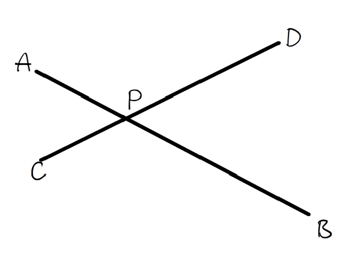

# 2022ACM选拔赛热身赛题解

<p align="right" style="color:#faa755;font-size:18px;font-weight:900">----by&nbsp;lr580</p>

> 以下所有题解仅提供一种或多种正确解法。并不必然代表下面提供的解法是最优解，且并不必然代表其他的解法不可行。因此，如果有别的思路，也欢迎各位大佬在 SCNUOJ 讨论区分享你的解法。若题解有误，欢迎指正~ ｡ﾟ･ (⁄ ⁄>⁄ ︿ ⁄<⁄ ⁄) ･ﾟ｡ 


## End Portal

题意翻译：给定空间坐标系不重的四点 $A,B,C,D$ ，求在投影面 $XOZ$ 直线 $AB,CD$ 交点 $P$ 


考点：[计算几何](https://oi-wiki.org/geometry/2d/)基础模板题

一种思路是直接求直线方程，然后联立求交点，这需要特判斜率不存在（题解不给出该解法，可自行尝试）。为了避免特判，可以使用[向量](https://oi-wiki.org/math/vector/)叉乘来求交点。

设线段 $AB,CD$ 交于点 $P$ ，如下图所示：



所求是点 $P$ ，可以取一已知点 $C$ (当然拿 $A,B,D$ 也行，类似的)，转化为求 $\vec{CP}$ 。已知坐标原点 $O$ ，那么由于 $\vec{OC}+\vec{ CP}=\vec{OP}$ ，而 $P$ 实质就是 $\vec{OP}$ ，所以求出未知量 $\vec{CP}$ 即可解出。由于 $\vec{CD}$ 已知，且 $C,P,D$ 共线，不妨设 $\vec{CP}=x\vec{CD}$ 。

由于 $\vec{AP}//\vec{AB}$ ，所以 $\vec{AP}\times \vec{AB}=0$ ，即：
$$
\begin{align}
\vec{AP}\times \vec{AB}&=0\\
(\vec{AC}+\vec{CP})\times\vec{AB}&=0\\
(\vec{AC}+x\vec{CD})\times \vec{AB}&=0\\
\vec{AC}\times\vec{AB}+x\vec CD\times\vec{AB}&=0\\
x\vec{CD}\times\vec{AB}&=-(\vec{AC}\times\vec{AB})\\
x(\vec{CD}\times\vec{AB})&=-(\vec{AC}\times\vec{AB})\\
x&=-\dfrac{\vec{AC}\times\vec{AB}}{\vec{CD}\times\vec{AB}}\\
x&=\dfrac{\vec{CA}\times\vec{AB}}{\vec{CD}\times\vec{AB}}
\end{align}
$$
所以 $\vec{OP}=\vec{OC}+x\vec{CD}=\vec{OC}+\dfrac{\vec{CA}\times\vec{AB}}{\vec{CD}\times\vec{AB}}\cdot\vec OD$

> 证明方法不唯一，根据证明方法不同得出来的式子形式上也多种多样。这里采取了一种相对简便的方法证明。其他证明方法感兴趣自行参考搜索引擎。
>
> 如您对证明步骤有疑惑，请参考向量叉乘下述部分基本性质：
>
> 二维平面向量 $\vec a,\vec b$ 叉乘得到一个向量 $\vec c$，其方向垂直这两向量形成的平面，如果 $\vec b$ 满足 $\vec a$ 经由 $180°$ 内的逆时针旋转可以与其平行，那么 $\vec c$ 的竖坐标是正的；如果是 $180°$ 内的顺时针，那么是负的。可以用右手定则表示：当右手的四指从 $\vec a$ 以不超过 $180°$ 的转角转向 $\vec b$ 时，竖起的大拇指指向是 $\vec a\times \vec b$ 的方向(向上正，向下负)。
>
> 即在三维上说：$\vec a=(x_1,y_1,0),\vec b=(x_2,y_2,0),\vec a\times \vec b=(0,0,x_1y_2-x_2y_1)$ 
>
> 根据这个坐标的表达式，易知 $\vec a\times \vec b=-\vec b\times \vec a$ ，即不满足交换律。
>
> 根据这个坐标的表达式，也易知 $(\lambda \vec a)\times \vec b=\vec a \times(\lambda\vec b)=\lambda (\vec a\times \vec b)$ ，满足对实数的结合律。
>
> 根据这个坐标的表达式，还易知 $(\vec a+\vec b)\times\vec c=\vec a\times\vec c+\vec b\times \vec c$ ，满足分配律。

（以上公式证明步骤节选自 2022 香农先修班第 14 次课-计算几何课件）

可以写出代码如下：

```c++
#include <bits/stdc++.h>
using namespace std;
typedef double db;
#define cp const point &
struct point
{
    db x, y;
    void sc() { scanf("%lf%*lf%lf", &x, &y); }
    point(db a = 0, db b = 0) : x(a), y(b) {}
    point operator+(cp p) const { return point(x + p.x, y + p.y); }
    point operator-(cp p) const { return point(x - p.x, y - p.y); }
    point operator*(db p) const { return point(x * p, y * p); }
} a, b, c, d, p;
db cross(cp a, cp b)
{
    return a.x * b.y - a.y * b.x;
}
point intersect(cp a, cp b, cp c, cp d)
{
    return c + (d - c) * (cross(a - c, b - a) / cross(d - c, b - a));
}
signed main()
{
    a.sc(), b.sc(), c.sc(), d.sc();
    p = intersect(a, b, c, d);
    printf("%lf %lf", p.x, p.y);
    return 0;
}
```


## Making Colors

题意翻译：对三个实数组成的三元组 $(R,G,B)$ ，有如下三种变换：

1. $(R,G,B)\gets (R+\dfrac13G+\dfrac23B,\dfrac23G,\dfrac13B)$
2. $(R,G,B)\gets (\dfrac13R,G+\dfrac13B+\dfrac23R,\dfrac23B)$
3. $(R,G,B)\gets (\dfrac23R,\dfrac13G,B+\dfrac13R+\dfrac23G)$

给定长为 $n$ 的变换序列 $s$ 和 $m$ 次变换操作，对每个操作询问将 $(1,1,1)$ 依次执行 $s_l,s_{l+1},\cdots,s_r$ 后得到的值对 $10^9+7$ 取模。$n,m\le10^5$。


考点：[ST 表](https://oi-wiki.org/ds/sparse-table/) + [倍增](https://oi-wiki.org/basic/binary-lifting/) + [矩阵加速递推](https://oi-wiki.org/math/matrix/#_9) + [快速幂](https://oi-wiki.org/math/quick-pow/)

由于 $s_i\neq s_is_js'_j$，其中 $s'_j$ 是 $s_j$ 的逆运算。所以本题不能使用前缀和算法直接求 $s_{1,\cdots r}s'_{1,\cdots ,l-1}$ 。而如果对询问排序并按 $l$ 分组暴力执行，复杂度也是 $O(n^2)$ 的，会超时。

发现三元组是一个一行三列矩阵(向量)，考虑使用矩阵表示上述变换。设变换前向量为 $A$ ，变换后为 $A'$ ，系数矩阵为三阶矩阵 $P$ ，不妨设：
$$
\mathbf{A'=AP}
$$
以变换 $1$ 为例，即：
$$
\pmatrix{R+\dfrac13G+\dfrac23B&\dfrac23G&\dfrac13B}
=
\pmatrix{R&G&B}
\pmatrix{
p_{11}&p_{12}&p_{13}\\
p_{21}&p_{22}&p_{23}\\
p_{31}&p_{32}&p_{33}\\
}
$$
得：
$$
\begin{cases}
1R+\dfrac13G+\dfrac23B=p_{11}R+p_{21}G+p_{31}B\\
0R+\dfrac23G+0B=p_{12}R+p_{22}G+p_{32}B\\
0R+0G+\dfrac13B=p_{13}R+p_{23}G+p_{33}B
\end{cases}
$$
用待定系数法，求出变换 $1$ 的 $P_1$ 为：
$$
\mathbf{P_1}=\pmatrix{
1&0&0\\
\dfrac13&\dfrac23&0\\
\dfrac23&0&\dfrac13\\
}
$$
同理，可以求出变换 $2$ 和变换 $3$ 的矩阵：
$$
\mathbf{P_2}=\pmatrix{
\dfrac13&\dfrac23&0\\
0&1&0\\
0&\dfrac13&\dfrac23\\
},\quad
\mathbf{P_3}=\pmatrix{
\dfrac23&0&\dfrac13\\
0&\dfrac13&\dfrac23\\
0&0&1\\
}
$$
那么，对每次询问，即求：
$$
\pmatrix{1&1&1}\mathbf{P_{s_l}P_{s_{l+1}}\cdots P_{s_r}}\mod(10^9+7)
$$
这就是一个典型的静态区间查询问题，可以用 ST 表实现(也可以用别的方法，欢迎尝试)。

记 $S_{i,j}$ 表示从下标 $i$ 开始的接连 $2^{j}$ 个矩阵的乘积。初始值为 $S_{i,0}=P_{s_i}$ 。那么根据矩阵乘法，有：
$$
\mathbf {S_{i,j}=S_{i,j-1}S_{i+2^{j-1},j-1}}
$$
$j$ 从 $0$ 开始，最高到 $j=\lceil\log_2 n\rceil= 17$ 层，第 $j$ 层有 $\dfrac{n}{2^j}$ 个有效矩阵。空间复杂度为：
$$
\sum_{j=0}^{\log_2 n}\dfrac n{2^j}=n\log_2n\sum_{j=0}^{\log_2 n}\dfrac1{2^j}=n\log_2n(2-\dfrac1{2^{\log_2n}})=O(n\log n)
$$
每个矩阵有 $3^2$ 个系数，假设都是 long long，计算得最大约占 $123\ MB$ ，在题目限制内。时间复杂度需要加上矩阵乘法的复杂度，因为矩阵是三阶的，所以复杂度为 $O(3^3n\log n)$ 。

接下来对每个询问 $l,r$ ，设长度为 $p=r-l+1$ ，因为矩阵乘法不是可重复贡献问题，所以不能直接重叠来算。需要把 $p$ 拆分为若干个 $2^i$ 的形式，然后从低到高(或从高到低)逐个去乘，例如拆分出存在 $2^x$ ，那么从当前 $l$ 乘上 $\mathbf S_{l,x}$ 并赋值 $l\gets l+2^x$ ，然后继续乘下一个幂。这个过程里， $p$ 最多被拆成 $\lceil\log_2n\rceil$ 个幂(即二进制表示法)，所以每次询问最多执行 $1+\log_2n$ 次矩阵乘法($1$ 次是向量乘)，故询问总复杂度为 $O(3^3m\log n)$ 。总时间复杂度为 $O(3^3(n+m)\log n)$ 。

题目需要对 $10^9+7$ (质数)取模，根据取模公式和[逆元](https://oi-wiki.org/math/number-theory/inverse/)含义，由费马小定理可知 $\dfrac xy\bmod(10^9+7)=x\times y^{10^9+5}\bmod(10^9+7)$ ，其中 $y$ 的幂使用快速幂进行计算，可以预处理出 $3$ 的逆元，复杂度 $O(\log(10^9+7))$ 。

参考代码：

```c++
#include <bits/stdc++.h>
using namespace std;
#define sc(x) scanf("%lld", &x)
typedef long long ll;
#define mn 100010
#define mlg 18
ll n, m, s[mn], mod = 1e9 + 7, i3;
ll qpow(ll a, ll b = mod - 2)
{
    ll r = 1;
    for (; b; b >>= 1)
    {
        if (b & 1)
        {
            r = r * a % mod;
        }
        a = a * a % mod;
    }
    return r;
}
struct matrix
{
    ll n, m, a[4][4];
    matrix(ll x = 3, ll y = 3) : n(x), m(y) { memset(a, 0, sizeof a); }
} st[mn][mlg], bas[4];
matrix operator*(const matrix &x, const matrix &y)
{
    matrix r(x.n, y.m);
    for (ll i = 1; i <= x.n; ++i)
    {
        for (ll j = 1; j <= y.m; ++j)
        {
            for (ll k = 1; k <= x.m; ++k)
            {
                r.a[i][j] = (r.a[i][j] + x.a[i][k] * y.a[k][j]) % mod;
            }
        }
    }
    return r;
}
signed main()
{
    i3 = qpow(3);
    bas[1].a[1][1] = 1, bas[1].a[2][1] = i3, bas[1].a[3][1] = 2 * i3 % mod;
    bas[1].a[2][2] = 2 * i3 % mod, bas[1].a[3][3] = i3;
    bas[2].a[2][2] = 1, bas[2].a[3][2] = i3, bas[2].a[1][2] = 2 * i3 % mod;
    bas[2].a[3][3] = 2 * i3 % mod, bas[2].a[1][1] = i3;
    bas[3].a[3][3] = 1, bas[3].a[1][3] = i3, bas[3].a[2][3] = 2 * i3 % mod;
    bas[3].a[1][1] = 2 * i3 % mod, bas[3].a[2][2] = i3;
    sc(n), sc(m);
    for (ll i = 1, v; i <= n; ++i)
    {
        sc(v);
        memcpy(st[i][0].a, bas[v].a, sizeof bas[v].a);
    }
    for (ll j = 1; j < mlg; ++j)
    {
        for (ll i = 1; i + (1 << j) - 1 <= n; ++i)
        {
            st[i][j] = st[i][j - 1] * st[i + (1 << (j - 1))][j - 1];
        }
    }
    while (m--)
    {
        ll l, r, p;
        sc(l), sc(r), p = r - l + 1;
        matrix u, ans(1, 3);
        u.a[1][1] = u.a[2][2] = u.a[3][3] = 1;
        ans.a[1][1] = ans.a[1][2] = ans.a[1][3] = 1;
        for (ll j = mlg - 1; j >= 0; --j)
        {
            if ((p >> j) & 1)
            {
                u = u * st[l][j];
                l += (1 << j);
            }
        }
        ans = ans * u;
        printf("%lld %lld %lld\n", ans.a[1][1], ans.a[1][2], ans.a[1][3]);
    }
    return 0;
}
```


## Omen

题意翻译：给定二维平面不重的 $n$ 个坐标点，将其分为 $k$ 组，定义组间距离是两组间最近点对的距离，求一种分组方案组间距离的最小值最大，求出最大值和一个分组方案。$2\le k\le n\le10^3$。


考点：[Kruskal 最小生成树](https://oi-wiki.org/graph/mst/)模板题

这是一道很经典的模板题。将原题抽象为一个 $n$ 点的完全图，每条边的边权是两点间距离(的平方)。一开始把每个点看成是单独一组，即最开始有 $n$ 组。将边按边权从小到大排序，然后枚举边，如果当前边的两端点不在同一组，就用并查集把它们合为一组。不断执行此操作，直到当前组数 $=k$ 时，就得到了分组方案。这时再继续去找下一条两端点不在同一组的边，这条边的边权值就是所求的最大值。

之后用并查集统计并输出方案即可，所有在同一个并查集根的都是同一组。

边数约为 $O(n^2)$ 条，故时间复杂度为排序复杂度 $O(n^2\log n^2)=O(2n^2\log n)$ ，使用路径压缩的并查集，总复杂度为 $O(n^2\log n+n^2\alpha(n))$ ，其中 $\alpha(n)$ 为[阿克曼函数](https://oi-wiki.org/ds/dsu-complexity/)，是并查集均摊复杂度，可以认为是一个很小的常数。

也可以用二分答案+并查集来做，整体思路是类似的，可自行尝试。

参考代码：

```c++
#include <bits/stdc++.h>
using namespace std;
#define sc(x) scanf("%lld", &x)
typedef long long ll;
#define mn 1010
ll n, k, m, x[mn], y[mn], fa[mn], lf, p2, vn, bin[mn];
tuple<ll, ll, ll> e[mn * mn];
vector<ll> v[mn];
signed main()
{
    sc(n), sc(k), lf = n;
    for (ll i = 1; i <= n; ++i)
    {
        fa[i] = i;
        sc(x[i]), sc(y[i]);
    }
    for (ll i = 1; i <= n; ++i)
    {
        for (ll j = i + 1; j <= n; ++j)
        {
            e[++m] = {(x[i] - x[j]) * (x[i] - x[j]) + (y[i] - y[j]) * (y[i] - y[j]), i, j};
        }
    }
    sort(e + 1, e + 1 + m);
    auto findf = [&](ll x)
    {while(x!=fa[x]){x=fa[x]=fa[fa[x]];}return x; };
    for (ll i = 1, u, v, w; i <= m; ++i)
    {
        tie(w, u, v) = e[i];
        ll fu = findf(u), fv = findf(v);
        if (lf == k && fu != fv)
        {
            p2 = w;
            break;
        }
        if (fu != fv)
        {
            fa[fv] = fu;
            --lf;
        }
    }
    printf("%lld\n", p2);
    for (ll i = 1, f; i <= n; ++i)
    {
        f = findf(fa[i]);
        if (!bin[f])
        {
            vn = min(vn + 1, k);
            bin[f] = vn;
        }
        v[bin[f]].emplace_back(i);
    }
    for (ll i = 1; i <= k; ++i)
    {
        ll s = v[i].size();
        printf("%lld ", s);
        for (auto j : v[i])
        {
            printf("%lld ", j);
        }
        printf("\n");
    }
    return 0;
}
```


