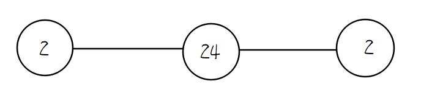
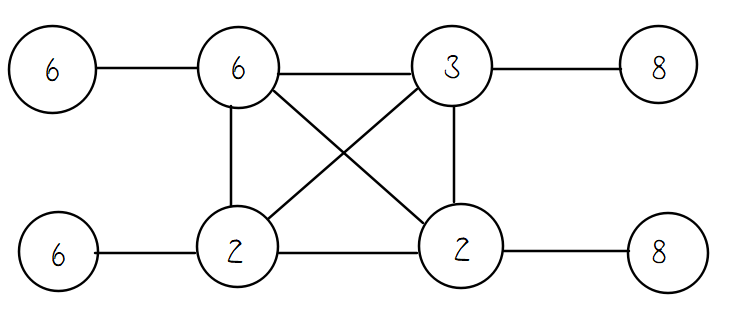

## Frontier Tripper

> Frontier tripper, Tianjiang, has created the universe, which consists of countless worlds, one of which is called the Blue Planet. Unfortunately, the first-created world's logic is defective and thus has caused some fatal errors. After millions of years, the errors gathered together and formed the Abyss.
>
> However, after creating the universe, the Creator Tianjiang has lost most of his power. So he was unable to fix these errors temporarily. To get the power again, He's now going on a long trip to the frontier of the universe.
>
> The destination of the trip is a party for creators of all universes. They holds regular competitions, which is named International Casually Playing Competition, or famous as ICPC. The top 210 competitors would gained strong power. Competitors are firstly ranked by the number of games they played successfully, if same, then they'd be ranked by the total used time. In the last 46th ICPC on April 17, Tianjiang was knocked out because he was 26 seconds behind and only played 2 games. He got the time used time of 4:44:37 while the 210th competitor got 4:44:11.
>
> Since he failed last time lacking of math thinking. He'd like train himself with lots of math problems. And here's one easy math problem:

For an integer $n$ , define $\varphi(n)$ as the number of positive integers from $[1,n]$ that co-prime with $n$ , and define $\sigma(n)$ as the sum of all the positive divisors of $n$ . 

Given $n,k$ , you need to calculate $\sum_{i=1}^n\varphi(i^k)\cdot\sigma(i^k)$ modulus $10^9+7$ .

Input two integers $n,k(1\le n,k\le10^6)$ .

Output one integer $(\sum_{i=1}^n\varphi(i^k)\cdot\sigma(i^k))\bmod(10^9+7)$ .

```c++
6 1
```

```c++
74
```

```c++
6 2
```

```c++
2053
```

```c++
580 581
```

```c++
652051863
```

For example, if $n=6$ , then $\varphi(6)=2$ because two numbers $1,5$ are co-prime with $6$ , and $\sigma(6)=12$ because all the positive divisors are $1,2,3,6$ and $1+2+3+6=12$ .


## Abyss Cycle

> The Abyss is alive, it evolves itself and generates new errors every 2000 years, which is called the Abyss Cycle. 

There're $n$ possible updates of new errors in an Abyss Cycle, and only one of the updates will win out. To find out the winning update, first the Abyss Cycle would mark all the updates. If at one moment only $1$ update is marked, then it win out. Otherwise, the Abyss Cycle would perform the procedure below until one update wins out: all the marked updates would randomly choose an integer at range $[1,m]$ with the same possibilities. Let $x$ denotes the minimal chosen number of all the updates, then all the updates with the chosen number equals to $x$ remain marked, and other updates become unmarked. 

Please calculate the expected times to perform the procedure. If it expects to perform $\dfrac xy$ times, you should output the value of $\dfrac xy\bmod (10^9+7)$ , where $10^9+7$ is a prime.

Input a single line with two integers $n,m(1\le n\le10^3,2\le m\le10^3)$ .

Output a single line with one integer denotes $\dfrac xy\bmod(10^9+7)$ .

```c++
1 6
```

```c++
0
```

```c++
2 2
```

```c++
2
```

```c++
3 2
```

```c++
333333338
```

In the first example, at the beginning there's only $1$ update, so it needn't perform the procedure and the expect times is $0$ , and $\dfrac01\bmod(10^9+7)=0$ .

In the second example, all the possible random-chosen numbers of $2$ updates are $(1,1),(1,2),(2,1),(2,2)$ , among which $(1,2),(2,1)$ can find out the one win out, the others cannot and need to perform the procedure again. So that every time, the possibility of perform again is reduce by half, if we calculate the limitation of the geometric sequence, we get:
$$
\lim_{n\to\infty}(1+\dfrac12+\dfrac14+\cdots+\dfrac1{2^n})=\lim_{n\to\infty}(2-\dfrac1{2^n})=2
$$
so the expect times is $2$ and $\dfrac21\bmod(10^9+7)=2$ .

In the third example, we can calculate the accurate expect times is $\dfrac73$ , and $\dfrac73\bmod(10^9+7)=333333338$ .


## In Another Time

> "In another time,
>
> I would be your friend.
>
> We would run in the silly room,
>
> and then play until the end.
>
> In another time,
>
> I would not get banned.
>
> So I don't have to say to you,
>
> about that I am an error." 
>
> —— Yunyan's diary 580 years ago

> Yunyan is a bug product from the deepest layer of the Abyss in one Abyss Cycle. He wants to control the universe and replace Tianjiang. He found that the Blue Planet enjoys the greatest sources of magic power. So he utilized the errors in the Abyss to revamp a portal leading to the Blue Planet. But his own power wasn't strong at first, so he needed to take advantage of other people.
>
> In Yunyan's first attempt, he found Hefeng by chance and invited she to the Blue Planet. It was at that time that Yunyan, a pure bug, has formed the emotions. He was deeply touched by the kindness of Hefeng and they became best friends. Yunyan once had a happy time. But every day is not Sunday, Tianjiang came back from the frontier trip and fixed the errors. Soon Yunyan's power was depleted. In the last moment before his death, he used the Abyss Chronosphere and returned to the previous time.
>
> Then in the next attempts, he decided to fight against Tianjiang but all failed. After countless times of retry and time transporting, something unpredictable  happened——when Yunyan returned to the previous time again, he shockly found that the Abyss Chronosphere is missing. Having no choice, Yunyan decided to take the final attempt. 
>
> Before Yunyan started his plans, he wrote his last diary, or testament on the Abyss Log that would not be changed eternally even if Yunyan go back to the past.
>
> The diary is protected by an digital lock. The lock has $m$ switches, and an puzzle number $x$ . Here're the details:

Given constants $x$ ( $x$ is an odd number), $m$ and $m$ unknown numbers $a_0,a_1,\cdots ,a_{m-1}$ satisfying $\forall i\in[0,m-1],a_i=\pm 1$ . The equation goes below:
$$
x=a_0\cdot2^0+a_1\cdot 2^1+a_2\cdot 2^2+\cdots+a_{m-1}\cdot2^{m-1}
$$
You need to figure out all the unknown numbers $a_0,a_1,\cdots,a_{m-1}$ . It can be proven that if the solution exists, it has and only has one solution.

Input two integers $x,m(-10^9+1\le x\le10^9-1,|x|\bmod2=1,1\le m\le30)$ .

If the solution exists, output $m$ integers, the i-th integer is $a_{i-1}(a_{i-1}=-1$ or $a_{i-1}=1)$ . If the solution is not exist, output `0` .

```c++
5 3
```

```c++
-1 1 1
```


```c++
-9 3
```

```c++
0
```


```c++
1437581 28
```

```c++
-1 1 1 -1 -1 -1 1 1 1 1 1 -1 1 1 1 1 -1 1 -1 1 -1 -1 -1 -1 -1 -1 -1 1
```


In the first example, the only solution is $5=(-1)\cdot2^0+1\cdot2^1+1\cdot 2^2$ 

In the second example, there's no solution.


## Chronosphere Hacker

> Once Hefeng peeped Yunyan's Abyss Log, and thus gained the ability of keeping constant memory. Since then even if Yunyan went back tens of thousands of times, she could always feel it. Different from Yunyan's great intension to overturn Tianjiang's world, Hefeng prefers a peace way such as negotiation. Yunyan refused Hefeng's suggestions, but she didn't want Yunyan to suffer such endless torment, so she had no choice but hacked the Chronosphere in order to give Yunyan a relief from the infinite time loop. After her hack, the Chronosphere would disappeared immediately after being used. Thereby when Yunyan used the Chronosphere once more, he found it lost. At the same time, backing to the past as well, Hefeng started her saving plans furtively.

The Chronosphere's inner structure is a matrix $(a_{ij})_{n\times m}$ with $n$ rows and $m$ columns. Each element $a_{i,j}$ is an integer related to time and space. Define $mex(s)$ as the minimal non-negative integer that hasn't appear in set $s$ . Specially, $mex(\varnothing)=0$ . Then $\forall 1\le i\le n$ , let $b_i=mex(a_i)$ where $a_i$ is a matrix row i.e. $a_i=(a_{i,1},a_{i,2},\cdots, a_{i,m})$ . And define the energy of the Chronosphere as $mex(b)=mex(b_1,b_2,\cdots, b_n)$ .

To make the hack success, Hefeng needs to delete some rows from the matrix's head and tail while not changing the energy of the Chronosphere.  And the less rows left, the better. In other word, let origin energy as $e_0=mex(b)$ , and you can delete the first $x$ rows and the last $y$ rows, such that $0\le x,y,x+y\le n$ . If $x=0$ or $y=0$ it means you choose not to delete the head or tail. After the delete, let new energy $e_1=mex(b_x,b_{x+1},\cdots, b_{n-y})$ , you should find the minimal $n-(x+y)$ satisfying $e_1=e_0$ .

Input the first line with two integers $n,m(1\le n,m,n\times m\le10^6)$ .

Then input $n$ lines, each line contains $m$ integers. The i-th line's j-th integer is $a_{i,j}(0\le a_{i,j}\le10^9)$ .

Output a single line with one integer, denoting the minimal number of rows left.

```c++
4 3
1 2 3
0 2 3
0 1 3
0 1 2
```

```c++
4
```


```c++
6 2
1 2
2 1
0 2
0 1
0 1
0 2
```

```c++
3
```


```c++
7 2
1 2
0 2
0 2
0 2
0 1
0 1
1 2
```

```c++
4
```


In the first example, $b=(0,1,2,3),e_0=4$ , no matter how to delete is invalid, so it cannot delete and the minimal number of rows left are $4$ rows.

In the second example, $b=(0,0,1,2,2,1),e_0=3$ ,  the best deletion is delete the first $1$ row and the last $2$ rows, then $b'=(0,1,2)$,  so the minimal number of rows left are $3$ rows.

In the third example, $b=(0,1,1,1,2,2,0),e_0=3$ ,  the best deletion is delete the first $3$ row, then $b'=(1,2,2,0)$,  so the minimal number of rows left are $4$ rows.

Note that you may left $0$ row (that is delete all the rows) if $e_0=0$ .


## Hefeng's Plan

> To convince Tianjiang not to remove the Abyss errors, Hefeng would like to better the world using the Abyss errors. She secretly left a blueprint of Chronosphere to her childhood friend Miming, and sent messages about the Abyss AI and the portal to her other friends like Guodong before she went to the Blue Planet with Yunyan again.
>
> After that, since it's the last chance for Yunyan, he's too anxious to care much about Hefeng. So Hefeng toke on her own trip. Hefeng hoped to explore the possibilities of the Abyss power. So when Guodong arrived, they cooperated and made a great success in making games such as ONU and the Land of the Kernel. The game is so popular that even Yunyan had experienced it (of course with the purpose of finding better ways to use magic and fight with Tianjiang).
>
> As expected, Miming successfully created another Chronosphere and used it. Both Hefeng and Yunyan kept their memory. First Hefeng escaped so that Yunyan couldn't take her to the portal. Then Yunyan failed to arrived the portal before Miming's team opened it. Knowing that Guodong would came later and knew how potential he was from the past memory, he decided to wait until Guodong's arrival and make use of Guodong. At the same time, Hefeng was trying to speed up the Abyss Cycle, since when it happens, the Abyss' power, including Yunyan's power, would be temporarily weaken. After Yunyan met Guodong and they went into the portal, Hefeng left a note in the Abyss and followed them into the portal later.
>
> Passing through the portal again needs to use the magic flow skillfully.

The Blue Planet's magic flow has $n$ key point indexed from $1$ to $n$ , the $i$ key point need $a_i$ kinds of different magic elements to fix, and specially, every two adjacent key points should not have any same kind of magic elements. That is to say, for every $i\in[1,n]$ , let $b_i$ denotes the set of magic elements given to the $i$ key point, obviously the length of $b_i$ is $a_i$ . And for $i\in[1,n)$ ,  $b_i\cap b_{i+1}=\varnothing$ .

There're some pieces of sub-flow needs to fix, for every key point from $l$ to $r$ , you need to use total $k$ kinds of magic elements to allocate all the $b_i,i\in [l,r]$ , such that no adjacent key points in the sub-flow have any same element. You need to find the minimal $k$ to satisfy the requirement.

However, the magic flow is dynamic, so that $a_i$ changes with time. And there are $m$ operations in total, for every operation, either the $a_i$ changes forever, or you should calculate the $k$ with given $l,r$ .

The first line contains two integers $n,m(1\le n,m\le10^5)$ .

The second line contains $n$ integer, the i-th integer is $a_i(1\le a_i\le10^9)$ .

Then follow $m$ lines, each line has $3$ integers $c_j,l_j,r_j(1\le c_j\le2)$

- if $c_j=1$ , then change $a_{l_j}$ to $r_j$ forever. $(1\le l_j\le n,1\le r_j\le10^9)$ 
- if $c_j=2$ , then query the minimal $k$ of the sub-flow in $[l_j,r_j](1\le l_j\le r_j\le n)$ 

For every query, output one line with one integer denotes the minimal $k$ .

```c++
3 4
2 3 2
2 3 3
1 3 3
2 1 2
2 1 3
```

```c++
2
5
6
```

For the first query in flow piece $[3,3]$ ,  $a_3=2$ , one possible scheme is to allocate $b_3=(1,2)$ , and $k=2$ .

For the second query in flow piece $[1,2],a_1=2,a_2=3$ , one possible scheme is to allocate $b_1=(1,2),b_2=(3,4,5)$ and $k=5$ .

For the third query in flow piece $[1,3],a_1=2,a_2=3,a_3=3$ , one possible scheme is to allocate $b_1=(1,2),b_2=(3,4,5),b_3=(6,1,2)$ and $k=6$ .


## The End of the Blue Planet's Duel

> In this time, Yunyan made full preparations and launched a global magic, making all the creatures asleep, so that he could loot magic power from everyone. But to his surprise, the Abyss AI——now named as Xingyue was here and it brought Miming to fight against him. 
>
> Even though with the help of Xingyue, Miming is in bad situation. At this point, the Abyss Cycle started ahead of schedule, so Yunyan's power quickly shrinks. Miming seizes the opportunity and defeats him. After stopping the global magic, everyone is awake again. 
>
> To compensate for the loss of people caused by global magic, Yunyan'd play a string game with Miming. If Miming wins, Yunyan'd give everyone $1437$ money. If Yunyan wins, he'd only give everyone $580$ money.

There has a string $S$ consists of lowercase letters only. The length of $S$ is $n$ . We use $S_i$ to stands for the i-th letter of the string. And $S_{l,r}$ stands for the substring of $S_l, S_{l+1}, \cdots, S_r$ . Specially, if $l > r$ then $S_{l,r}$ is an empty string. Define the prefix function $\pi(i)$ as the max integer $j\in[0,i)$ satisfying $S_{1,j}=S_{i-j+1,i}$ . For example, if `S=ababac` , then $\pi(1)=\pi(2)=0,\pi(3)=1,\pi(4)=2,\pi(5)=3,\pi(6)=0$ .

Two players Yunyan, Miming have a game on the string $S$ and Yunyan goes first. At first, for every index $i\in[1,n]$ ,if $\pi(i)\neq0$ then it's unlocked, otherwise it's locked. Each turn, the player can choose an unlocked index $i$ and then lock all the index $j\in(i-\pi(i),i]$ . The player who cannot choose any index fails the game, and the other player wins. If both players play with optimal strategies, please find out who wins the game.

Input the first line with one integer $n(1\le n\le10^6)$ .

Input the second line with one string $S$ consisting of $n$ lowercase letters.

If Yunyan wins, output `580` . If Miming wins, output `1437` .

```c++
6
ababac
```

```c++
580
```


```c++
11
ababakababa
```

```c++
580
```

```c++
9
ababakaba
```

```c++
1437
```

In the first example, Yunyan can choose $i=5$ and lock $3,4,5$ . Then Miming has no choice.

In the second example, if Yunyan first choose $i=8$ and lock $7,8$ . Then it can be proved that no matter how Miming choose, Miming will always lose.

In the third example, it can be proved that no matter how Yunyan choose, Yunyan will always lose.


## Living in Peace with Errors

> Hefeng wakes up and tolds everything to her friends. With their efforts, Hefeng finally persuades Yunyan to choose a peace way. They keep constructing the Blue Planet, making it even more prosperous and developed. 
>
> Later, Tianjiang comes back and notices the note left by Hefeng. With curiosity, he goes to the Blue Planet. He is greatly thrilled at the miracles they made. It's a world combines technology with magic perfectly which is better than any other worlds created by Tianjiang. Everything here is living in peace.  So Tianjiang decides not to remove the Abyss and appoints Yunyan as the administrator of the Blue Planet, hoping to observe greater achievements they could make.
>
> Construction completed, new construction options... Having a brand new life, Yunyan is now burying himself constructing the Blue Planet energetically.

Yunyan can construct some buildings on the Blue Planet, and each building can have some(or none) relationships with other buildings. Each building has a positive integer value $p$ , and if a building has $d$ relationships with other buildings, then it has $p^d$ contributions. The total contributions $t$ is the sum of  contributions of all the buildings.

Given total contributions $t$, you can assign value $p$ for each building, and construct $n$ buildings with at most $5800$ relationships in total. Please construct a scheme to make the total contributions equal to $t$ and output this scheme. If none of schemes is available, please output $-1$.


A single line with an integer $t(1\le t\le10^{9})$ .

If there exists scheme to get total contributions of $t$ :

Output an integer $n(1\le n\le580)$ in the first line denoting the number of buildings you construct.

Output $n$ integer in the second line, the $i$-th integer $p_i(2\le p_i\le58)$ denotes the important value of the $i-$th building.

Then output $n$ lines, each line includes $n$ integers. The $i$-th line's $j$-th integer is $c_{ij}$ . If $c_{ij}=1$ , it denotes that the $i$-th building has relationship with the $j$-th building. If $c_{ij}=0$ , they have no relationship. You should guarantee that $\forall1\le i,j\le n, c_{ij}=c_{ji}$ , $c_{ii}=0$ and $\sum_{i=1}^n\sum_{j=1}^ic_{ij}\le 5800, 0\le c_{ij}\le 1$. 

If multiple schemes are available, output any of them.

If there is not exist any schemes to get total contributions of $t$ , output `-1` in an single line.

```c++
580
```

```c++
3
2 24 2
0 1 0
1 0 1
0 1 0
```

```c++
1437
```

```c++
8
6 6 3 8 6 2 2 8
0 1 0 0 0 0 0 0
1 0 1 0 0 1 1 0
0 1 0 1 0 1 1 0
0 0 1 0 0 0 0 0
0 0 0 0 0 1 0 0
0 1 1 0 1 0 1 0
0 1 1 0 0 1 0 1
0 0 0 0 0 0 1 0
```


In the first example, one possible scheme is like this, $t=2^1+24^2+2^1=580$:



In the second example, one possible scheme is like this, 

$t=6^1+6^4+3^4+8^1+6^1+2^4+2^4+8^1=1437$ :




## Happy Ending

> It's a beautiful day outside. Birds are singing, flowers are blooming... On days like these, kids like you...should take a fantastic trip to the Blue Planet.
>
> Here, Baicha would share nice white tea with you, Sangze would take your girl suit photos with Jinle and Guodong would PS it elaborately. Miming would teach you useful gameplay tips, and then Xingyue would become your teammate and explore the magic-made games like ONU and the Land of the Kernel with you. If tired, Hefeng would tell you the tales happened in these hundreds of years and Yunyan would heal you with the Abyss power. While Tianjiang would watching you on the sly.
>
> Enjoy yourself in the Blue Planet!

There're $n$ activities indexed from $1$ to $n$ (inclusive) on the Blue Planet. And there're $m$ restrictions, each restriction $(u,v)$ denotes that activity $v$ can be be held only after $u$ has been held. Holding the activity $i$ needs $a_i$ hours. You can hold only one activity each time. You only hope to finish holding the activity $n$ within no more than $t$ hours in total. Suppose there're $r$ schemes can satisfy your hope, you should calculate $r\bmod(10^9+7)$ .

Input the first line with three integers $n,m,t(2\le n\le10^4,1\le m\le3\times 10^4,1\le t\le10^3)$ .

Input the second lines with $n$ integers, the i-th integer denotes $a_i(1\le a_i\le10^3)$ .

Then input $m$ lines, each line contains two integers $u,v(1\le u, v\le n,u\neq v)$ .

It's guaranteed that every activity can be held, i.e. there's no restriction cycles in the given data.

Output one line with one integer $r\bmod(10^9+7)$ .

```c++
4 5 10
2 2 3 5
1 2
1 3
2 3
2 4
3 4
```

```c++
2
```


```c++
4 5 8
2 2 3 5
1 2
1 3
2 3
2 4
3 4
```

```c++
0
```


```c++
4 4 8
2 2 8 5
2 4
2 1
1 4
3 4
```

```c++
1
```


In the first example, two schemes are holding $(1,2,4),(1,3,4)$ in order.

In the second example, none of schemes are available.

In the third example, the only scheme is holding $(2,4)$ in order.

