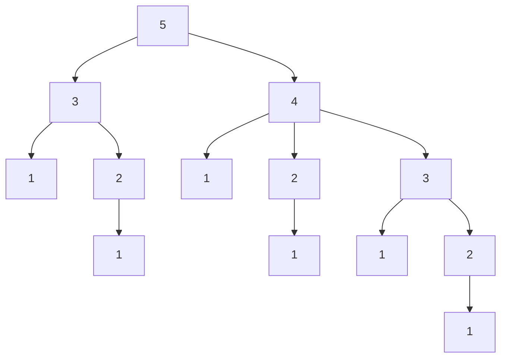

# 2021 AK 杯线下赛题解

<p align="right" style="color:chocolate;font-size:18px;font-weight:900">----by&nbsp;lr580</p>

> 以下所有题解仅提供一种或多种易于初学者理解的正确解法。并不必然代表下面提供的解法是最优解，且并不必然代表其他的解法不可行。因此，如果有别的思路，也欢迎在 SCNUOJ 讨论区分享你的解法~ ヾ(ｏ･ω･)ﾉ


## 果冻与天空之后

直接输入、分类讨论判断并输出即可。

> 常见错误：
>
> - 条件写反
> - 用C语言编译万能头文件
> - 条件判断(if-elseif-else)写漏了

##### C参考程序

```c
#include <stdio.h>
int x;
int main()
{
    scanf("%d", &x);
    if (x < 2020)
    {
        printf("0");
    }
    else
    {
        printf("infinity");
    }
    return 0;
}
```

##### Python参考程序

```python
x = int(input())
if x < 2020:
    print('0')
else:
    print('infinity')
```


## 白茶与线程博弈

一种解法是直接进行数学运算得出最终结论，具体步骤如下：

设干扰线程删除了 $t$ 次时， 还剩下线程数 $m'$ 为：
$$
m'=m-7at-30b(t-1)
$$
设干扰线程最多删除 $t'$ 次，满足不等式：
$$
m-7at'-30b(t'-1)\ge 0
$$
记下取整表示为 $\lfloor x\rfloor$ ，如 $\lfloor 1.9\rfloor=1,\lfloor 2.0\rfloor=2$ 。解得：
$$
t'=\lfloor\dfrac{m+30b}{7a+30b}\rfloor \le  \dfrac{m+30b}{7a+30b}
$$
那么前 $t'-1$ 次追踪线程都能追踪到 $30b$ 个踪迹； 第 $t'$ 次能追踪到 $m-7at-30b(t'-1)$ 个踪迹，故总追踪数 $f$ 为：
$$
f=30b(t'-1)+m-7at'-30b(t'-1)=m-7at'
$$

$$
f=m-7a\lfloor\dfrac{m+30b}{7a+30b}\rfloor
$$

特别注意 $t'$ 为 $0$ 时，上式不成立，需要特判。这是因为 $t'=0$ 时上述式子的意义会变成干扰线程还没删除前追踪线程就追踪了，不符合题意。如果算到 $t'=0$ ，即：
$$
\dfrac{m+30b}{7a+30b} < 0\Rightarrow m+30b < 7a+30b \Rightarrow m < 7a
$$
说明第一次干扰就删完了，自然追踪不到，所以应该是输出 `what a pity` 。

当然本题也可以直接用循环来解。用循环时需要特别注意跳出循环的条件。具体细节参见代码及注释。

> 常见错误：
>
> - 大于等于(不少于) $\dfrac m2$ 写成 大于 $\dfrac m2$
> - 忽略了 $7$ 和 $30$ ，误认为线程只有一个
> - 使用浮点数多次加减法可能会造成精度误差
> - 累加变量没有初始化为 $0$

##### C参考程序(解方程法)

```c
#include <stdio.h>
int m, a, b, t, f;
int main()
{
    scanf("%d%d%d", &m, &a, &b);
    t = (m + 30 * b) / (9 * a + 30 * b);
    f = m - 7 * a * t;
    if (t && f >= m / 2)
    {
        printf("I catch you, baicha");
    }
    else
    {
        printf("what a pity");
    }
    return 0;
}
```

##### C参考程序(循环法)

```c
#include <stdio.h>
int m, a, b, finds, half, newfind; //finds全局变量初始值编译器自动设为0
int main()
{
    scanf("%d%d%d", &m, &a, &b);
    half = m / 2;
    while (m)
    {
        m -= 7 * a; //干扰程序先删除
        if (m <= 0) //若删完了
        {
            break;
        }
        newfind = 30 * b; //假设追踪程序能找30b个
        if (newfind > m) //看看剩下的够不够30b个
        {
            newfind = m; //不够的话剩下的m个都追完了
        }
        m -= newfind; //追踪过的不会被删除
        finds += newfind;
    }
    if (finds >= half) //不可以finds>=m/2，因break后m不是输入的m了
    {
        printf("I catch you, baicha");
    }
    else
    {
        printf("what a pity");
    }
    return 0;
}
```

##### Python参考程序(解方程法)

```python
m, a, b = [int(i) for i in input().strip().split()]
t = int((m+30*b)/(7*a+30*b))
f = m-7*a*t
print('I catch you, baicha' if t and f >= m//2 else 'what a pity')
```

##### Python参考程序(循环法)

```python
m, a, b = [int(i) for i in input().strip().split()]
half = m//2
finds = 0
while m:
    m -= 7*a
    if m <= 0:
        break
    newfind = min(m, 30*b)
    m -= newfind
    finds += newfind
print('I catch you, baicha' if finds >= half else 'what a pity')
```


## 果冻与阶梯区域

注意到区域的对称性，所以在非第一象限的点可以通过取与 $x,y$ 坐标轴对称的点来等效判断，在代码实现上，即直接对 $x,y$ 取绝对值即可。取绝对值 C语言 可以使用  `math` 库的 `fabs` 函数 ( C++ 也可以使用 `abs` 函数)，该函数传入 `double` 返回 `double` 。当然也可以自己手写。

作直线 $x=y$ ，可以发现第一象限在直线下方的点 (即满足 $x > y$ 的点)，区域编号 $D$ 为 $y$ 的上取整，即 $D=\lceil y\rceil$ 。而在直线上方的点 ( $x < y$ )，区域编号为 $x$ 的上取整，即 $D = \lceil x \rceil$ 。上取整 C/C++ 可以使用可以使用 `math` 库的 `ceil` 函数，同样该函数传入 `double` 返回 `double` 。同样当然也可以自己手写。由于下取整即强制类型转换，可以用下取整实现上取整，由于本题只精确到小数点后一位，故可以直接写为：
$$
\lceil a\rceil=\lfloor a+0.91\rfloor
$$

> 注：加数范围为 $[0.9,0.999\cdots]$ 均可。但由于 `float` 或 `double` 精度位数有限，我们不建议设置过多的小数位。当然更好的做法是直接写成：
> $$
> \lceil a\rceil=\lfloor a\rfloor +1
> $$

本题使用 `double` 或 `float` 过题。但我们更推荐使用 `double` 。

> 常见错误：
>
> - 误认为区域只有图上给的 $5$ 个

##### C参考代码(math库函数)

```c
#include <stdio.h>
#include <math.h>
int main()
{
    double x, y;
    scanf("%lf%lf", &x, &y);
    x = fabs(x);
    y = fabs(y);
    printf("%.0lf\n", x < y ? ceil(x) : ceil(y));
}
```

##### C参考代码(手写数学运算)

```c
#include <stdio.h>
#include <math.h>
int main()
{
    double x, y;
    scanf("%lf%lf", &x, &y);
    if (x < 0)
    {
        x = -x;
    }
    if (y < 0)
    {
        y = -y;
    }
    int xi = x + 0.91, yi = y + 0.91;
    printf("%d\n", x < y ? xi : yi); //这里就不要用%lf了
}
```

##### Python参考代码

```python
from math import ceil
x, y = [float(i) for i in input().strip().split()]
print(min(ceil(abs(x)), ceil(abs(y))))
```


## 白茶与三元方程

直接使用循环嵌套枚举所有可能的 $(x,y,z)$ 组合，然后发现 $x^3+y^3+z^3=k$ 时输出并直接退出程序或跳出多重循环即可。退出程序 C/C++ 可以使用 `return 0;` ， Python 可以使用 `exit(0)` 。

注意判断时跳过 $x=0,y=0,z=0$ 其一成立的情况。注意无解时要输出 `no solution` 。

一个小优化时，可以在枚举时控制 $x\le y\le z$ ，这样可以减少枚举次数，因为 $(x,y,z)$ 有 $6$ 种排列，只需要取其一即可。这个优化可以明显加快 Python 的程序运行速度。当然即使不加以优化也能过题。

> 常见错误：
>
> - 没有判 $x,y,z=0$ 的情况
> - 没有判负数
> - 没有初始化用于跳出多重循环的布尔值变量
> - 正数负数分开枚举，所以错过了答案既有正也有负的情况
> - 边界出错，没判 $-50$ 和 $50$

> 本题的强化版 `三元方程 II` 已放到公共题库，感兴趣者可前去挑战。

##### C参考程序

```c
#include <stdio.h>
int k;
int main()
{
    scanf("%d", &k);
    for (int x = -50; x <= 50; ++x)
    {
        for (int y = x; y <= 50; ++y)
        {
            for (int z = y; z <= 50; ++z)
            {
                if (x && y && z && x * x * x + y * y * y + z * z * z == k)
                {
                    printf("%d %d %d\n", x, y, z);
                    return 0; //直接退出程序即可，可以不多次break跳出全部循环
                }
            }
        }
    }
    printf("no solution");
    return 0;
}
```

##### Python参考程序

```python
k = int(input())
for a in range(-50, 51):
    for b in range(a, 51):
        for c in range(b, 51):
            if a and b and c and a**3+b**3+c**3 == k:
                print('%d %d %d' % (a, b, c))
                exit(0)
print('no solution')
```


## 果冻与字串得分

对 C/C++ 一种不使用字符串的思路是：由于本题输入未给定字符串的长度，故这种思路事先不知道循环次数。可以一直读入字符，直到遇到 `EOF` 结束。记录当前是第几个字符，根据奇偶性分别执行加减，最后除以长度即可。特别注意最后的除法不能做成整数除法，需要做浮点数除法。每个字符的得分即它的 ASCII 码减 `'a'` 的 ASCII 码再加一即可。

> 由于调试时 `EOF` 的输入在多数环境要先输入回车再 ctrl+z 再回车，会读入回车可能影响得分计算，调试程序时也可以加上输入了换行就 `break` 的判断。(当然判题时不会有回车) (会 freopen 的话也可以这样调试)
>

使用字符串的思路则直接读入一个字符串，然后用 `string.h` 的 `strlen` 函数统计长度，然后跑循环即可。

本题使用 `double` 或 `float` 过题。但我们更推荐使用 `double` 。

> 常见错误：
>
> - 用 EOF 法用换行符来判 break 导致死循环
> - 用了整数除法(然后把计算结果用浮点数来存……)
> - 数组开小了(如少打了个0) 

##### C参考程序(EOF解法)

```c
#include <stdio.h>
char c;
int p, n;
int main()
{
    while (EOF != scanf("%c", &c))
    {
        ++n;
        if (n % 2 == 1)
        {
            p += c - 'a' + 1;
        }
        else
        {
            p -= c - 'a' + 1;
        }
    }
    printf("%.4lf", 1.0 * p / n); //乘1.0是避免做整数除法
    return 0;
}
```

##### C参考程序(字符串解法)

```c
#include <stdio.h>
#include <string.h>
char c[100010]; //数组可以稍开大一点
int p, n;
int main()
{
    scanf("%s", c); //字符串输入不需要&符号
    n = strlen(c);
    for (int i = 0; i < n; ++i)
    {
        if (i % 2 == 0) //序号=下标+1，所以奇偶相反
        {
            p += c[i] - 'a' + 1;
        }
        else
        {
            p -= c[i] - 'a' + 1;
        }
    }
    printf("%.3lf", 1.0 * p / n); //乘1.0是避免做整数除法
    return 0;
}
```

##### Python参考程序

```python
s = input()
p = 0
for i in range(len(s)):
    if i % 2 == 0:  # 下标和编号奇偶相反
        p += (ord(s[i])-ord('a')+1)
    else:
        p -= (ord(s[i])-ord('a')+1)
print(p/len(s))
```


## 白茶与排名并列

本题开始难度将会变得有些许棘手  (=´ω｀=)

注意到输入已经按分数降序给出，所以无需事先排序。

为方便起见，设所有数组从 $1$ 开始使用下标。一种实现方法如下：遍历排名表，如果当前人得分与上一个人一样，那么排名直接与上一个人一样；否则，当前学生的排名一定等于当前下标。这点可以由题面直接得知。

在输出中，要求首先输出最后一名的排名，再依次输出所有排名小于等于 $r$ 的排名表。这就要求必须存储所有输入，而不能一边输入一边输出排名表。因此 C/C++ 对字符串还需要使用到二维数组。输出时注意不要越界。

> 常见错误：
>
> - 对只有一人或全部人同分时判断不正确
> - 数组开小了
>
> 还是有很多代码没有看到题目输入按照降序给出，对输入进行了排序

##### C参考程序

```c
#include <stdio.h>
#define maxn 10010
int n, r, m[maxn], k[maxn];
char x[maxn][11]; //第二维开大一点，存'\0'
int main()
{
    scanf("%d%d", &n, &r);
    for (int i = 1; i <= n; ++i)
    {
        scanf("%d%s", &m[i], x[i]); //x[i]不需要&运算符
    }
    m[0] = -1; //设置一个特殊值，保证首次遍历i=1时,m[i]与m[i-1]不会相等
    for (int i = 1; i <= n; ++i)
    {
        if (m[i] != m[i - 1])
        {
            k[i] = i;
        }
        else
        {
            k[i] = k[i - 1];
        }
    }
    printf("%d\n", k[n]);                     //最后一名排名
    for (int i = 1; i <= n && k[i] <= r; ++i) //k[i]<=r的排名表
    {
        printf("%d %s\n", k[i], x[i]);
    }
    return 0;
}
```

##### Python参考程序

```python
n, r = [int(i) for i in input().strip().split()]
m, x = [-1], ['']  # 第一个下标不用
for i in range(n):
    mi, xi = [i for i in input().strip().split()]  # 注意输入处理有变
    m.append(int(mi))
    x.append(xi)
k = [-1]
for i in range(1, n+1):
    if m[i] != m[i-1]:
        k.append(i)
    else:
        k.append(k[i-1])
print(k[n])
for i in range(1, n+1):
    if k[i] > r:
        break
    print(k[i], x[i])
```


## 果冻与卡牌游戏

- 三名玩家，每人 $7$ 张包含颜色和数字两种属性的牌；
- 轮到自己时都会出从左往右第一张与参照牌同色或同数字的牌；
- 打出去的牌会变成新的参照牌；
- 连续两人无法出牌则第三人出手中最左边的牌；
- 求胜利者。

一些关键点如下：

- 只有前面两个人没出牌或牌的任一属性与参照牌相同才可出这张牌
- 出了牌后必须更新参照牌的属性
- 出了牌后还需要判断玩家手中还有没有牌
- 要判断玩家本轮是否没有出牌

在实现上，大致思路为：对每张牌记录颜色、数字。对每个玩家用一个数组存牌，有三个玩家，所以至少开二维数组。如果出牌时直接对数组进行删除元素操作，对 C/C++ 可能比较麻烦( C++ `std::vector` 等除外)。对 C/C++ ，可以增设一个布尔值变量代表这张牌是否被删除，删除时将其置为真；遍历时跳过所有布尔值为真的牌即可。

在判断颜色相等时， C 的字符串比较不大方便 (具体而言 C 可以使用 `string` 库的 `strcmp` ， C++ 可以使用 `std::string` 数据结构)，注意到颜色首字母分别是 `r` , `g`,  `b`,  `y` ，是互不相同的，所以其实对每个颜色只需要存储首字母即可唯一区分，比较时也是直接比较这个字符即可。

对整个游戏流程控制，可以按照三个玩家顺序一直循环，直到一方牌数为 $0$ ，需要设一个变量代表目前已经有多少个玩家跳过了出牌，由此控制连续两人无法出牌第三人出手中最左边的牌。

具体实现细节参见代码及注释。(在实现上，由于 C/C++ 与 Python 的特点不同，下面两个参考程序的思路有所差别)

##### C参考程序

```c
#include <stdio.h>
char name[3][10] = {"bobby", "lr580", "dayuanx"}, color[10];
int t, cnt, win, now, ps[3][7], tops, removed[3][7], out[3], thrown;
char pc[3][7], topc;
int main()
{
    scanf("%d", &t);
    while (t--)
    {
        cnt = 0;  //当前连续有多少个玩家没出牌了，初始为0
        win = -1; //胜利玩家下标，初始-1(无) (0 bobby; 1 lr580; 2 dayuanx)
        scanf("%s%d", color, &tops);
        topc = color[0]; //取颜色首字母即可区分
        for (int i = 0; i < 3; ++i)
        {
            out[i] = 0; //出牌数量初始化为0
            for (int j = 0; j < 7; ++j)
            {
                scanf("%s%d", color, &ps[i][j]);
                pc[i][j] = color[0];
                removed[i][j] = 0; //一开始还没打出，初始化为0
            }
        }
        now = 0;          //bobby先手
        while (win == -1) //还没有玩家胜出
        {
            thrown = 0; //本回合是否有出牌
            for (int i = 0; i < 7; ++i)
            {
                if (removed[now][i]) //这张牌出过了
                {
                    continue;
                }
                if (cnt == 2 || pc[now][i] == topc || ps[now][i] == tops)
                {                      //已有2人没牌了或颜色相同或数字相同
                    topc = pc[now][i]; //牌顶更新
                    tops = ps[now][i];
                    removed[now][i] = 1;
                    thrown = 1;
                    break;
                }
            }
            if (thrown == 1)
            {
                out[now] += 1; //自己出的牌数+1
                cnt = 0; //出牌了，没出牌人数置0
            }
            else
            {
                cnt += 1;      //否则没出牌的人数加1
            }
            if (out[now] == 7) //出完了就赢了
            {
                win = now;
                break;
            }
            now = (now + 1) % 3; //下一个玩家
        }
        printf("%s\n", name[win]);
    }
    return 0;
}
```

##### Python参考程序

```python
def get():  # 对一行输入的处理
    a, b = input().strip().split(' ')
    return [a, int(b)]  # 每张牌表示为二元数组：颜色、数字


name = ['bobby', 'lr580', 'dayuanx']
for _ in range(int(input())):
    top = get()  # 弃牌堆最上面的牌
    p = [[], [], []]  # 三个玩家的牌堆
    for i in range(3):
        for j in range(7):
            p[i].append(get())
    cnt = 0  # 已经连续有多少个人未出牌，初始化为0
    win = -1  # 胜利玩家的下标(0 bobby; 1 lr580; 2 dayuanx)
    now = 0  # 当前回合出牌的玩家
    while win == -1:
        throw = -1  # 当前玩家打出的牌，-1代表没打出牌
        if cnt != 2:
            for i in range(len(p[now])):
                if p[now][i][0] == top[0] or p[now][i][1] == top[1]:
                    cnt = 0  # 有人出牌，cnt清零
                    throw = i  # 出的牌
                    top = p[now][i]  # 更新弃牌堆顶部
                    break
            if throw == -1:  # 没打出牌，连续多一个为未出牌
                cnt += 1
        else:  # 任意出牌，那么出下标为0的牌
            cnt = 0
            throw = 0
            top = p[now][0]
        if throw != -1:  # 把这张牌从玩家手里删了
            p[now].pop(throw)
        if not len(p[now]):  # 出完了
            win = now
            break
        now = (now+1) % 3  # 下一个玩家
    print(name[win])
```


## 白茶与千层之塔

一种思路是可以考虑使用深度优先搜索算法(DFS)，对当前楼层 $x$ ，递归搜索楼层 $x-1$ , $x-2$ ，且 $x\bmod 3=1$ 时还要搜索 $x-3$ 。递归搜索到下一次时，以当前递归搜索的新楼层为 $x$ 重复上述操作。当搜索到 $x=b$ 即 $x=1$ 时搜索结束，让方案数自增。以 $x=5$ 为例，递归树如下所示：



有六条个 $1$ (终点)出现，所以答案是 $6$ 。

时间复杂度的大小取决于一共需要递归搜索走多少个方案。根据题目给出答案不会超过 $20000$ ，有 $10$ 次询问，故时间复杂度为 $O(2\times10^5)$ 。

另一种思路是使用动态规划算法(DP)，该思路也是 `果冻与千层之塔` 的解法。将会在下一题 `果冻与千层之塔` 给出这一思路的具体解法。该解法在本题时间复杂度为 $\Omicron(a) = \Omicron(20)$ 。

> 还有一种思路是可以考虑广度优先搜索算法(BFS)，搜索的转移与 DFS 是相似的。BFS 需要使用队列，实现起来也比 DFS 复杂。在这里不给出该解法的代码，有兴趣者可自行尝试。

##### C参考程序(DFS)

```c
#include <stdio.h>
int t, a, b, s;
void dfs(int x) //当前在第k层
{
    if (x == b) //到达了目标地
    {
        s++; //方案数+1
        return;
    }
    if (x - 1 >= 1) //能走才走x-1
    {
        dfs(x - 1);
    }
    if (x - 2 >= 1)
    {
        dfs(x - 2);
    }
    if (x % 3 == 1 && x - 3 >= 1)
    {
        dfs(x - 3);
    }
}
int main()
{
    scanf("%d", &t);
    while (t--)
    {
        scanf("%d%d", &a, &b);
        s = 0; //初始化方案数
        dfs(a);
        printf("%d\n", s);
    }
    return 0;
}
```

##### C参考程序(DP)

```c
#include <stdio.h> //具体解析见 果冻与千层之塔 题解
int t, a, b, dp[22];
int main()
{
    dp[1] = 1;
    for (int i = 2; i <= 20; ++i)
    {
        dp[i] += i - 1 >= 1 ? dp[i - 1] : 0;
        dp[i] += i - 2 >= 1 ? dp[i - 2] : 0;
        dp[i] += i % 3 == 1 && i - 3 >= 1 ? dp[i - 3] : 0;
    }
    for (scanf("%d", &t); t; --t)
    {
        scanf("%d%d", &a, &b);
        printf("%d\n", dp[a]);
    }
    return 0;
}
```

##### Python参考程序(DFS)

```python
def dfs(x):
    if x == b:
        global s  # 调用全局变量要使用关键字global
        s += 1
    if x-1 >= 1:  # 如果可以走到x-1层
        dfs(x-1)  # 去x-1层继续递归
    if x-2 >= 1:
        dfs(x-2)
    if x % 3 == 1 and x-3 >= 1:
        dfs(x-3)


for t in range(int(input())):
    a, b = [int(i) for i in input().strip().split()]
    s = 0
    dfs(a)
    print(s)
```

##### Python参考程序(DP)

```python
dp = [0, 1]  # 具体解析见 果冻与千层之塔 题解
for i in range(2, 21):
    dp.append(0)
    dp[i] += dp[i-1] if i-1 >= 1 else 0
    dp[i] += dp[i-2] if i-2 >= 1 else 0
    dp[i] += dp[i-3] if i % 3 == 1 and i-3 >= 1 else 0
for t in range(int(input())):
    a, b = [int(i) for i in input().strip().split()]
    print(dp[a])
```


## 果冻与千层之塔

从本题开始进入比赛的高难部分 (o´ω`o)ﾉ

以 $b=1$ 为例， $a=2$ 时的方案是：
$$
2\to 1
$$
$a=3$ 时的方案是：
$$
3\to2\to1;\quad3\to1
$$
$a=4$ 时的方案是：
$$
4\to3\to2\to1;\quad4\to3\to1;\quad4\to2\to1;\quad4\to1
$$
$a=5$ 时的方案是：
$$
5\to4\to3\to2\to1;\quad 5\to4\to3\to1;\quad5\to4\to2\to1;
$$

$$
5\to4\to1;\quad5\to3\to2\to1;\quad5\to3\to1;
$$

以 $a=5$ 为例，观察可以发现， 所有 $5\to 4$ 开头的方案其后的部分与 $a=4$ 的方案完全一致，且数目相等。所有 $5\to 3$ 开头的方案也是后续部分与 $a=3$ 的方案一致，且数目相等。也就是说 $a=5$ 的方案数可以如下计算：① 若 $a=5$ 可以走到 $a=4$ ，加上 $a=4$ 的方案数； ② 若 $a=5$ 可以走到 $a=3$ ，加上 $a=3$ 的方案数； ③若 $a=5$ 可以走到 $a=2$ ，加上 $a=2$ 的方案数 (当然由于 $5\bmod 3\neq 1$ ，所以不可以)。假设 $a=1$ 时唯一方案是自己走到自己，方案数为 $1$ 。进一步发现，对 $a=4,3,2$ 类推，发现也是可以如此计算的。更一般地对任意 $a,b$ 都有这样的计算成立。

这种计算之所以成立，是可以用加法原理和乘法原理来证明的。证明如下：

设从楼层 $x$ **往下走** $\mathbf y$ **层**的方案数为 $dp_{x,y}$ 。设从楼层 $x$ **直接往下走** $\mathbf y$ **层**的方案数为 $f_{x,y}$ 。根据题意，对 $x\in Z, x > 3$ ， 有：
$$
f_{x,1}=1,\ f_{x,2}=1,\ f_{x,3}=
\begin{cases}
1,x\bmod 3=1\\0,x\bmod3\neq1
\end{cases}
$$
根据加法原理和乘法原理，从 $x$ 往下走 $y$ 层的方案数等于先从 $x$ **直接**往下走 $1$ 层走到 $x-1$ ，再从 $x-1$ 往下走 $y-1$ 层的方案数，加上先从 $x$ **直接**往下走 $2$ 层走到 $x-2$ ，再从 $x-2$ 往下走 $y-2$ 层的方案数，再加上先从 $x$ **直接**往下走 $3$ 层走到 $x-3$ ，再从 $x-3$ 往下走 $y-3$ 层的方案数，即：
$$
dp_{x,y}=f_{x,1}dp_{x-1,y-1}+f_{x,2}dp_{x-2,y-2}+f_{x,3}dp_{x-3,y-3}
$$
代入 $f_{x,1}, f_{x,2}, f_{x,3}$ ，得：
$$
dp_{x,y}=\begin{cases}
1\times dp_{x-1,y-1}+1\times dp_{x-2,y-2}+1\times dp_{x-3,y-3},x\bmod 3=1\\
1\times dp_{x-1,y-1}+1\times dp_{x-2,y-2}+0\times dp_{x-3,y-3},x\bmod 3\neq1
\end{cases}
$$
即得递推公式：
$$
dp_{x,y}=\begin{cases}
dp_{x-1,y-1}+dp_{x-2,y-2}+dp_{x-3,y-3},&x\bmod 3=1\\
dp_{x-1,y-1}+dp_{x-2,y-2},&x\bmod 3\neq1
\end{cases}
$$
上式证明了该计算方法的正确性。

根据这个公式，只需要计算出初始值(手算然后直接一个个赋值) $x\in Z^+, 0\le y\le 2$ 时的所有方案数，就可以使用上面的递推公式求出任意 $a,b$ 下的方案数。根据题意，不难手算得出，对 $x\in Z^+$，都有：
$$
dp_{x,0}=1,dp_{x,1}=1,dp_{x,2}=2
$$

> 也可以设 $x\le 0$ 时， $dp_{x,y} = 0$ ，然后用上面的递推公式递推得之。

那么，题目所求的是从楼层 $a$ 下到楼层 $b$ 的方案数。即从楼层 $a$ 下 $a-b$ 层的方案数。即题目所求为 $dp_{a,a-b}$ 。

然而，如果直接计算，计算一次的时间复杂度为 $O(a-b)$ ，计算 $t$ 次的复杂度为 $O(t(a-b))=5\times 10^{10}$ ，远超出了时间限制。并且，递推过程需要存储数组，若不使用压缩数组，需要空间复杂度为 $O(ab)$ ，所以下面考虑进行优化。

根据题意，可以发现一个事实：$dp_{x,y} = dp_{x+3,y}$ 对一切 $x\ge 3$ 恒成立。严谨的表述即：对模 $3$ 余 $k$ 的所有数构成的等价类集合 $[x]_k=\{k,k+3,k+6,\cdots\}$ ，对 $\forall p,q\in[x]_k$ ，有 $dp_{p,y}=dp_{q,y}$ 。

这是因为对 $[x]_k$ 的所有元素，对同一个 $y$ ，使用递推公式时递推的次数相同、递推的每一步表达式本质相同，所以得到的结果必然是相同的。

因此，事实上对 $x\in Z$ ，对同一个 $y$ ，只有三种结果，即有 $dp_{x,y}=dp_{x\bmod 3,y}$ 。

设二维数组 $dp_{i,j}$ ，含义与上文一致，即： $dp_{i,j}$ 表示 $\forall x\in[x]_i$ ，从第 $x$ 层往下走 $j$ 层的方案数。

根据上述结论，可以把 $dp$ 的第一维 $x$ 压缩成只有三个元素。那么 $dp$ 的所有可能性即 $0\le x\le 2, 1\le y\le10^6$ ，共约 $3\times10^6$ 个元素，`int` 占 $4$ 字节，具体需要内存占用约为 $3\cdot10^6\cdot4\ byte$ $\approx8.58\ MB$ 。将 $dp$ 二维数组每个元素完全计算出来的时间复杂度也为 $O(3(a-b))=3\times10^6$ 。

由于所有可能性未超过空间限制，所以可以通过初始值和递推方程在询问之前预处理计算出所有可能性，然后每次询问只需要直接输出二维数组对应元素即可。总时间复杂度为 $O(3(a-b)+t)=O(a-b)$ ，可以通过。

> 之所以不直接设 $dp_{x,y}$ 代表从楼层 $x$ 走到楼层 $y$ 是因为 $1\le b < a\le10^9$ ，一个维度开到 $10^9$ 会严重超出内存限制，需要 $3\times10^9$ 个元素，是不现实的。

注意到 $x-1,x-2,x-3$ 可能会造成下标越界，所以应当分别改成：
$$
x-1\Rightarrow(3+x-1)\bmod3=(x+2)\bmod 3
$$

$$
x-2\Rightarrow(3+x-2)\bmod3=(x+1)\bmod 3
$$

$$
x-3\Rightarrow(3+x-3)\bmod3=x
$$

即改成：
$$
dp_{x,y}=\begin{cases}
dp_{(x+2)\bmod 3,y-1}+dp_{(x+1)\bmod 3,y-2}+dp_{x,y-3},&x\bmod 3=1\\
dp_{(x+2)\bmod 3,y-1}+dp_{(x+1)\bmod 3,y-2},&x\bmod 3\neq1
\end{cases}
$$
根据题意，本题需要输出答案对 $10^9+7$ 取余的结果。题目给定了两个公式，使用该公式替换 $dp$ 运算里的常规加法，即可避免溢出问题。设 $p=10^9+7$ ，即改成：
$$
dp_{x,y}=\begin{cases}
((dp_{(x+2)\bmod 3,y-1}+dp_{(x+1)\bmod 3,y-2})\bmod p+dp_{x,y-3})\bmod p,&x\bmod 3=1\\
(dp_{(x+2)\bmod 3,y-1}+dp_{(x+1)\bmod 3,y-2})\bmod p,&x\bmod 3\neq1
\end{cases}
$$

> 之所以不需要写成如下形式：
> $$
> dp_{x,y}=\begin{cases}
> ((dp_{(x+2)\bmod 3,y-1}\bmod p+dp_{(x+1)\bmod 3,y-2}\bmod p)\bmod p+dp_{x,y-3}\bmod p)\bmod p,&x\bmod 3=1\\
> (dp_{(x+2)\bmod 3,y-1}\bmod p+dp_{(x+1)\bmod 3,y-2}\bmod p)\bmod p,&x\bmod 3\neq1
> \end{cases}
> $$
> 是因为使用了取模公式之后，可以保证每个计算出来的 $dp_{i,j}$ 都满足 $dp_{i,j} < p$ ，自然有 $dp_{i,j}\bmod p=p$ ，所以可以简化掉。
>
> 对 C/C++ ，用 int 时，不能写成 $(dp_{(x+2)\bmod 3,y-1}+dp_{(x+1)\bmod 3,y-2}+dp_{x,y-3})\bmod p$ ，这是因为 $dp_{i,j} < p = 10^9 + 7$ ，那么加起来最大约为 $3\times 10^9$ ，而 int 的最大值约为 $2\times 10^9$ ，会爆 int 。用 long long 则没有这个问题，可以这么写。当然也可以先 int 强转 long long 再运算。
>
> 补充一句：取模公式的减法和除法比较复杂，不能直接类推加法和乘法。具体可自行百度。

那么到此，这道题~~冗长的~~解答过程便结束了。具体实现细节参见代码和注释：

> 本题的强化版 `千层塔 III` 已放到公共题库。感兴趣者可去挑战。

##### C参考程序

```c
#include <stdio.h>
int t, a, b, dp[3][1000002], mod = 1e9 + 7;
int main()
{
    for (int i = 0; i < 3; ++i) //初始值
    {
        dp[i][0] = dp[i][1] = 1, dp[i][2] = 2;
    }
    for (int j = 3; j <= 1000000; ++j) //要先第二维再第一维，注意顺序
    {
        for (int i = 0; i < 3; ++i)
        {
            if (i % 3 == 1)
            {
                dp[i][j] = ((dp[(i + 2) % 3][j - 1] + dp[(i + 1) % 3][j - 2]) % mod + dp[i][j - 3]) % mod;
            }
            else
            {
                dp[i][j] = (dp[(i + 2) % 3][j - 1] + dp[(i + 1) % 3][j - 2]) % mod;
            }
        }
    }
    scanf("%d", &t);
    while (t--)
    {
        scanf("%d%d", &a, &b);
        printf("%d\n", dp[a % 3][a - b]);
    }
    return 0;
}
```

##### Python参考程序

```python
dp = [[1, 1, 2], [1, 1, 2], [1, 1, 2]]  # 初始值
mod = int(1e9)+7  # 模数注意要整数，1e9是float
for i in range(3, 1000001):
    for j in range(3):
        dp[j].append(0)
        if j % 3 == 1: 
            dp[j][i] = (dp[(j+2) % 3][i-1]+dp[(j+1) % 3][i-2]+dp[j][i-3]) % mod
        else:
            dp[j][i] = (dp[(j+2) % 3][i-1]+dp[(j+1) % 3][i-2]) % mod
for _ in range(int(input())):
    a, b = [int(i) for i in input().strip().split(' ')]
    print(dp[a % 3][a-b])
```


## 白茶与数位之积

### 思路分析

> 解题具体思路比较长，所以按点分成了若干大段，以大写数字一二三 $\cdots$ 标出。 ~~不要嫌长不看嘛qwq，洛谷一些题还有更长的题解呢~~

#### 一

为降低题目难度，本题的用例 $4$ 给出了解题突破口。用例 $4$ 所求 $x=0$ ，可以发现 $f(k)$ 的任意一个数位为 $0$ 时， $f(k)=0$ ，若 $k\in[l,r]$ ，则 $\prod_{i=l}^r f(i) =0$ 。也就是说，如果想要凑出 $x=0$ ，令 $l=0$ ， $r$ 任取即可，如输出 `0 0` 即可。以下仅讨论 $x\neq 0$ 的情况。

如果 $x\neq 0$ ，那么需要保证 $[l,r]$ 里每个数都不能出现 $0$ ，即每个数位只能取 $[1,9]$ 的一个，这个结论应用到个位，即有：
$$
1\le l\bmod 10\le 9,1\le r\bmod 10\le 9
$$
由于 $l\le r$ ，且 $[l,r]$ 不能出现数位 $0$ ，那么当 $x\neq 0$ 时，可以推导出两个重要结论： 

1. $[l,r]$ 区间的数除个位外全部相等

   反证法证明：如果不相等的话，一定会在区间内产生进位，进而产生数位 $0$ ，与每个数都不能出现 $0$ 相矛盾。

2. 区间跨度 $0\le r-l \le 8$ 

   由 $1\le l\bmod 10, r\bmod 10\le 9, l\le r$ 可知：
   $$
   0\le r\bmod 10-l\bmod 10\le8
   $$
   由结论 $1$ 可知，个位外全部相等，于是 $0\le r-l\le 8$ 。

#### 二

如果 $x$ 能够表示为若干个数位的连乘积，即具体而言， $x$ 能表示成：
$$
x=1^a\cdot2^b\cdot3^c\cdot4^d\cdot5^e\cdot6^f\cdot7^g\cdot8^h\cdot9^i
$$
由于 $1^a=1,4=2^2,6=2\cdot3,8=2^3,9=3^2$，所以可以简化为：
$$
x=2^{b+2d+f+3h}\cdot3^{c+f+2i}\cdot5^e\cdot7^g
$$
即表示为唯一分解定理形式：
$$
x=2^u\cdot3^v\cdot5^z\cdot7^w
$$
> 如果不进行简化，分解不唯一，很难判断，如 $2^4=2^3\cdot4=2^2\cdot 8=4\cdot 8=4^2=\cdots$

通过质因数分解，对于输入的 $x$ ，一定可以将 $x$ 表示成若干个质数的乘积。即：
$$
x=p_1^{a_1}\cdot p_2^{a_2}\dots p_n^{a_n}
$$
> 篇幅有限，这里不具体介绍质因数分解的具体算法，可自行上网查阅。对 $n$ 质因数分解的时间复杂度是 $O(\log_2 n)$ ，简写为 $O(\log n)$ 。

如果这些质数 $p_i$ 中有 $2,3,5,7$ 之外的数，由于数位的连乘积不可能凑出这样的数，所以 $x$ 将无法由任何 $\prod_{i=l}^rf(i)$ 表示。例如， $x=11$ 是任何 $\prod_{i=l}^rf(i)$ 都凑不出来的。

由等量代换，即若能够找到 $\prod_{i=l}^rf(i)=2^u\cdot3^v\cdot5^z\cdot7^w$  时，符合题目条件；否则无解。

#### 三

为简单起见，现在只考虑 $l,r$ 都是非零个位数的情况(即 $y=1$ 的情况)。可以开两层循环枚举 $l,r$ ，然后对 $[l,r]$ 的整数质因数分解，统计 $\prod_{i=l}^rf(i)=2^u\cdot3^v\cdot5^z\cdot7^w$ 的 $u,v,z,w$ 。如果与 $x=2^u\cdot3^v\cdot5^z\cdot7^w$ 分解出来的 $u,v,z,w$ 完全一样，由等量代换，则有 $x=\prod_{i=l}^rf(i)$，那么就是能够找到这样的有序对。时间复杂度是 $O(9^2)$ 。

然而，在位数 $y>1$ 时，对 $[l,r]$ 上  $y>1$ 的所有位数都未知，如果仍然暴力枚举每一位，时间复杂度将是 $O(9^{y-1}\cdot9^2)=O(9^{y+1})$ ，发现对 $0\le y\le18$ 会严重超时。所以对 $y>1$ 的位数，应该用更高效的方法确定。

在此之前，我们首先处理一下个位数。

设 $x=2^{c_2}\cdot3^{c_3}\cdot5^{c_5}\cdot7^{c_7}$ ， $l,r$ 的个位数为 $l',r'$ ，即 $l'=l\bmod 10,r'=r\bmod 10$。，由个位数枚举后得到 $\prod_{i=l'}^{r'}i=2^{c_2'}\cdot3^{c_3'}\cdot5^{c_5'}\cdot7^{c_7'}$。

如果任一 $c_i' > c_i$  成立，则代表枚举多出了一些因数，同样会导致无解。严谨表述为：记整除符号 $x|y$ 表示 $x$ 整除 $y$ ，例如有 $2|8$ 。相应有不整除符号 $x\not| \ \ y$ 。若 $\prod_{i=l'}^{r}i\not |\ \ x$ ，则无解。

#### 四

在经由枚举确定了个位数之后，剩下还需要凑的指数为 $c''_i=c_i-c_i'$ 个 $i$ 。除去个位后还剩 $y-1$ 个位，区间内整数数目为 $r-l+1$ 。根据上文可知，个位外全部相等。所以剩下 $y-1$ 位每个位都可以凑出 $r'-l'+1$ 个相同的数位，贡献出 $r'-l'+1$ 的倍数(或 $0$ )个 $2,3,5$ 或 $7$ 。那么如果 $r'-l'+1$ 不是剩下要凑的指数的因数，也会无解。严谨表述为：$(r'-l'+1)\not |\ \ c''_i$ 导致无解。

若满足 $(r'-l'+1)|\ \ c''_i$ 接下来，为方便起见，可以让指数 $c''_i$ 除以 $r'-l'+1$ 得 $d_i=\dfrac{c''_i}{r'-l'+1}$ 。剩下的问题转化为： 可以用 $y_0\le y-1$ 个位，每个位 $i$ 可以任取 $[1,9]$ 的其一数位 $f_i$，使得数位乘积  $\prod_{i=0}^{y_0}f_i=2^{d_2}\cdot3^{d_3}\cdot5^{d_5}\cdot7^{d_7}$ 。

特别注意如果选数字 $1$ ，它不会对 $d_i$ 产生任何贡献。所以可以认为不会选用 $1$ 。那么问题转化为：可以用 $y_0\le y-1$ 个位，每个位 $i$ 可以任取 $[2,9]$ 的其一数位 $f_i$，使得数位乘积  $\prod_{i=0}^{y_0}f_i=2^{d_2}\cdot3^{d_3}\cdot5^{d_5}\cdot7^{d_7}$ 。 

为了能够取到，首先可以明确的是， 就要凑够 $d_5$ 个 $5$ 和 $d_7$ 个 $7$ ，数位 $5$ 和 $7$ 的取法是唯一的。如果 $d_5+d_7 > y-1$ 就会凑不够而无解。否则在 $f_i$ 里选 $d_5$ 个 $5$ 和 $d_7$ 个 $7$ ，在剩下 $y'=y-1-d_5-d_7$ 个位里，需要凑够 $d_2$ 个 $2$ 和 $d_3$ 个 $3$ 。

但是 $2$ 和 $3$ 的凑法就不唯一了，具体有： $2\Rightarrow2^1\cdot3^0,3\Rightarrow2^0\cdot3^1,6\Rightarrow2^1\cdot3^1,8\Rightarrow2^3\cdot3^0,9\Rightarrow2^0\cdot3^2$ 

$2,3$ 的凑法比较复杂，下面来详细讨论。

#### 五

只有 $6$ 会导致分解出 $2,3$ 各有一个，比较麻烦，其他剩下的数字都是分解出只有 $2$ 或 $3$。我们先假设不取 $6$ ，那么在 $y'$ 位里，要凑够 $d_2$ 个 $2$ ，只会用到 $2,4$ 和  $8$ 。设会用到 $s_2$ 个 $2$  ，$s_4$ 个 $4$  和 $s_8$ 个 $8$ ，那么 $d_2=s_2+2s_4+3s_8$ ，为了尽可能节省空间(因为多出空间可以用 $1$ 补足，而少了空间就无解了)，容易想到，应该贪心地取 $8$ ，直到取完后 $d_4\le2$ ，再用 $s_4$ 补上。即 $s_3=\lfloor \dfrac{d_2}{3}\rfloor$ , $s_4=\lfloor \dfrac{d_2-3s_8}2\rfloor$ ，如果还有剩下，那么用 $s_2$ 补， $s_2=d_2-3s_8-2s_4$ (事实上只有三种情况： $s_4=0,s_2=0$ ; $s_4=0,s_2=1$ ; $s_4=1,s_2=0$ )。若求出 $s_2+s_4+s_8 > y'$ ，则贪心策略凑不出，其他所有选取策略也都无法凑出，无解。

> 篇幅已经很长很长了，这里就不给出严格证明贪心算法正确性的步骤了。用反证法易证，感兴趣者可自行尝试。

同理，要凑够 $d_3$ 个 $3$ ，在上面的基础上，贪心地选取，则用到 $s_9=\lfloor\dfrac{d_3}2\rfloor$ 个 $9$ 和 $s_3=d_3-2s_9$ 个 $3$ 。若 $s_3+s_9 > y'-s_2-s_4-s_8$ ，无解。

> 先凑 $2$ 再凑 $3$ 或反过来都可以，不影响最终答案的正确性。

现在，我们考虑选取 $s_6$ 个 $6$ 。由于 $x\le10^{18}$ ，最坏情况是分解出 $\log_610^{18}\approx 23.1$ 个 $6$ 即约 $23$ 个 $2$ 和 $23$ 个 $3$ 。所以 $s_6$ 最大取到 $23$ ，时间复杂度是 $O(\log_6x)\approx23$。那么可以考虑枚举 $s_6$ 的数量，那么之后只需要 $d'_2=d_2-s_6$ 个 $2$ 和 $d'_3=d_3-s_6$ 个 $3$ ，再对 $d'_2,d'_3$ 应用上文提到的贪心策略唯一地算出在给定 $s_6$ 下 $s_2,s_3,s_4,s_8,s_9$ 的数量。

综上所述，只需要枚举 $s_6$ ，便可以唯一确定其余所有 $s_i$ 。

自此，本题解题完毕。

> 第五大步也可以不使用贪心算法求解，使用 DP 也能够解出答案。篇幅有限，这里不给出具体过程，感兴趣者可自行尝试。

总时间复杂度为 $\Omicron(t\cdot9^2\cdot(\log x+ \log_6x))=\Omicron(81t\log x) \approx 1.8\times10^6$ 

具体实现细节参见代码和注释。

### 参考程序

##### C参考程序

```c
#include <stdio.h>
#include <string.h>

long long x, y, a[10], p[] = {2, 3, 5, 7};

int check(int l, int r, int *c0)
{
    int c[11] = {};
    memcpy(c, c0, sizeof c);     //复制作副本，不在原来基础上直接改
    for (int i = l; i <= r; i++) //对个位数区间每个个位质因数分解
    {
        int t = i;
        for (int j = 0; j < 4; ++j)
        {
            while (t % p[j] == 0)
            {
                t /= p[j];
                c[p[j]]--; //消耗了c[j]
            }
        }
    }
    for (int i = 0; i < 4; ++i) //如果某个质数指数小于0或(r-l+1)不是质数指数的因数
    {
        if (c[p[i]] < 0 || c[p[i]] % (r - l + 1) != 0)
        {
            return 0;
        }
        c[p[i]] /= r - l + 1;
    }

    memset(a, 0, sizeof(a)); //剩下y-1位里用了a[i]个i；初始化为0
    for (int lim = c[2] > c[3] ? c[3] : c[2]; a[6] <= lim; a[6]++)
    {                             //枚举6
        a[8] = (c[2] - a[6]) / 3; //贪心计算3
        a[4] = (c[2] - a[8] * 3 - a[6]) / 2;
        a[2] = c[2] - a[8] * 3 - a[6] - a[4] * 2;
        a[9] = (c[3] - a[6]) / 2; //贪心计算2
        a[3] = c[3] - a[9] * 2 - a[6];
        a[5] = c[5];
        a[7] = c[7];
        int len = a[2] + a[3] + a[4] + a[5] + a[6] + a[7] + a[8] + a[9];
        if (len <= y - 1) //如果需要的加起来够y-1位(非个位位长)
        {
            for (int i = 1; i <= 2; i++) //i=1是l;i=2是r
            {
                for (int j = 2; j <= 9; j++)
                {
                    for (int k = 0; k < a[j]; k++) //用了多少个j
                    {                              //就输出多少次j
                        printf("%d", j);
                    }
                }
                printf("%d\n", i % 2 ? l : r); //个位数左右端点
            }
            return 1;
        }
    }
    return 0;
}

void solve()
{
    scanf("%lld%lld", &x, &y);
    if (x == 0)
    {
        printf("0 0\n");
        return;
    }
    int c[11] = {};
    for (int i = 0; i < 4; ++i) //质因数分解；遍历2,3,5,7
    {
        while (x % p[i] == 0)
        {
            x /= p[i];
            c[p[i]]++; //x分解为c[i]个i
        }
    }
    if (x != 1)
    {
        printf("-1\n");
        return;
    }
    for (int l = 1; l <= 9; l++)
    {
        for (int r = l; r <= 9; r++)
        {
            if (check(l, r, c)) //如果个位数区间[l,r]有解
            {
                return;
            }
        }
    }
    printf("-1\n");
}

int main()
{
    int t;
    scanf("%d", &t);
    while (t--)
    {
        solve();
    }
}
```

##### C++参考程序

```c++
#include <bits/stdc++.h>
using namespace std;
using umap = unordered_map<int, int>; //简写，类似define

long long x, y, a[10];
bool check(int l, int r, umap c) //传值不影响原umap c
{
    for (int i = l; i <= r; i++) //对个位数区间每个个位质因数分解
    {
        int t = i;
        for (auto &j : {2, 3, 5, 7})
        {
            while (t % j == 0)
            {
                t /= j;
                c[j]--; //消耗了c[j]
            }
        }
    }
    for (auto &i : c) //如果某个质数指数小于0或(r-l+1)不是质数指数的因数
    {
        if (i.second < 0 || i.second % (r - l + 1) != 0)
        {
            return false;
        }
        i.second /= r - l + 1;
    }

    memset(a, 0, sizeof(a)); //剩下y-1位里用了a[i]个i；初始化为0
    for (; a[6] <= min(c[2], c[3]); a[6]++) //枚举6
    {
        a[8] = (c[2] - a[6]) / 3; //贪心计算3
        a[4] = (c[2] - a[8] * 3 - a[6]) / 2;
        a[2] = c[2] - a[8] * 3 - a[6] - a[4] * 2;
        a[9] = (c[3] - a[6]) / 2; //贪心计算2
        a[3] = c[3] - a[9] * 2 - a[6];
        a[5] = c[5];
        a[7] = c[7];
        int len = a[2] + a[3] + a[4] + a[5] + a[6] + a[7] + a[8] + a[9];
        if (len <= y - 1) //如果需要的加起来够y-1位(非个位位长)
        {
            for (int i = 1; i <= 2; i++) //i=1是l;i=2是r
            {
                for (int j = 2; j <= 9; j++)
                {
                    for (int k = 0; k < a[j]; k++) //用了多少个j
                    {                              //就输出多少次j
                        cout << j;
                    }
                }
                cout << (i % 2 ? l : r) << '\n'; //个位数左右端点
            }
            return true;
        }
    }
    return false;
}

void solve()
{
    cin >> x >> y;
    if (x == 0)
    {
        cout << 0 << ' ' << 0 << '\n';
        return;
    }

    umap c;
    for (auto &i : {2, 3, 5, 7}) //质因数分解
    {
        while (x % i == 0)
        {
            x /= i;
            c[i]++; //x分解为c[i]个i
        }
    }

    if (x != 1)
    {
        cout << -1 << '\n';
        return;
    }

    for (int l = 1; l <= 9; l++)
    {
        for (int r = l; r <= 9; r++)
        {
            if (check(l, r, c)) //如果个位数区间[l,r]有解
            {
                return;
            }
        }
    }
    cout << -1 << '\n';
}
int main()
{
    int t;
    cin >> t;
    while (t--)
    {
        solve();
    }
}
```

##### Python参考代码

```python
def factor(x):  # 质因数分解，返回分解结果数组b，b[i]代表因数i的指数为b[i]
    b = [0 for i in range(12)]
    i = 2
    while i <= x:
        while x % i == 0:
            x //= i
            b[i] += 1
        i += 1
        if i > 9:  # 如果存在大于9的质因数，直接判定为无解，返回空列表
            return []
    return b


def generate(sele, a, b):  # 对个位数区间[a,b]和选择的数sele生成答案
    t = ''
    for i in range(10):  # 选择的数升序摆好
        t += chr(48+i)*sele[i]
    # 如果摆好后超出了y位，返回无解；否则返回摆好的(l,r)
    return (t+chr(48+a), t+chr(48+b)) if 1+sum(sele) <= y else tuple()


def check(a, b):
    td = s[:]  # 复制，而不是指针赋值，因为下一次枚举还要用

    for i in range(a, b+1):
        for j in bas:
            td[j] -= d[i][j]
            if td[j] < 0:  # 如果个位数 x就不够用了，无解
                return tuple()
    rng = b-a+1  # 区间内整数的数目
    left = y-1  # 还剩下多少个数位
    sele = [0 for i in range(12)]  # 在剩下的数位里选了sele[i]个i
    for i in bas[2:]:  # 对(5,7)判断
        if td[i] % rng != 0:  # 如果rng不是td[i]的因数，无解
            return tuple()
        sele[i] += td[i]//rng  # 记录选择的数
        left -= sele[i]

    suc, od2, od3 = False, td[2], td[3]  # 假设无解suc=False，作td[2],td[3]副本
    for d6 in range(0, left+1):  # 枚举选多少个6
        sele[6] = d6
        td[2] = od2 - d6*rng  # 还需要多少个2
        td[3] = od3 - d6*rng

        if td[2] < 0 or td[3] < 0:  # 选6选多了，那么更多的时候自然更不可以
            break

        sele[9] = td[3]//(2*rng) #贪心处理3
        td[3] -= sele[9]*2*rng
        if td[3] % rng != 0:
            continue
        sele[3] = td[3]//rng

        sele[8] = td[2]//(3*rng) #贪心处理2
        td[2] -= sele[8]*3*rng
        sele[4] = td[2]//(2*rng)
        td[2] -= sele[4]*2*rng
        if td[2] % rng != 0:
            continue
        sele[2] = td[2]//rng
        res = generate(sele, a, b) #生成答案
        if res:
            return res
    if not suc:
        return tuple()


d, bas = [factor(i) for i in range(12)], (2, 3, 5, 7)
# d是[1,11]内各数字的质因数分解结果；bas是四个质数组成的元组
t = int(input())
for i in range(t):
    x, y = [int(i) for i in input().strip().split()]
    s = factor(x)  # x的质因数分解结果
    if x == 0:
        print('0 0')
    elif not s:  # 返回了空列表，有大于9的质因数，无解
        print(-1)
    else:
        suc = False  # 假设无解
        for a in range(1, 10):  # 枚举个位数左边界a
            for b in range(a, 10):  # 枚举个位数右边界b
                res = check(a, b)  # 对个位数区间[a,b]检测是否有解
                if res:
                    suc = True
                    print('%s %s' % (res[0], res[1]))
                    break
            if suc:
                break
        if not suc:
            print(-1)
```


