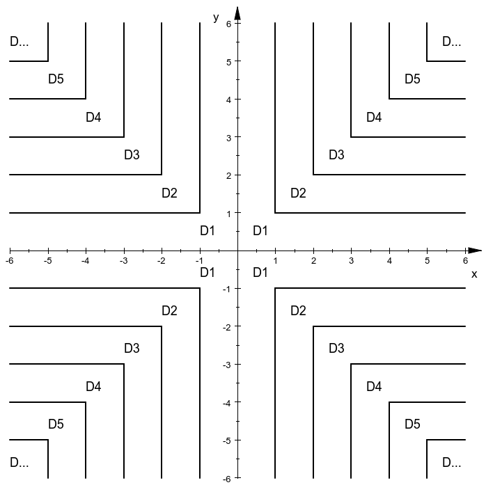
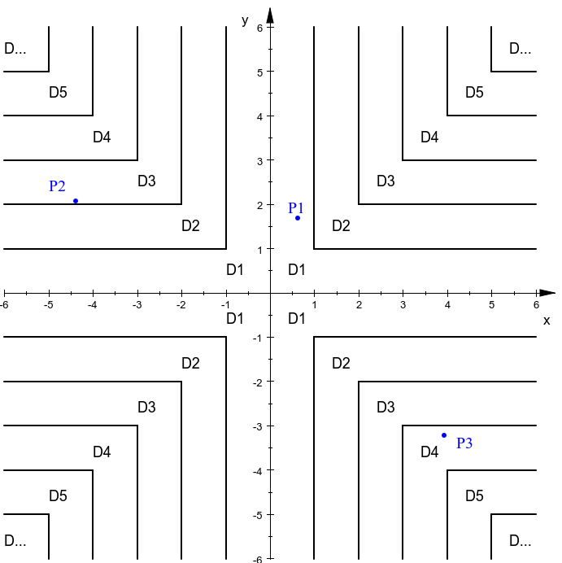

## 果冻与天空之后

> 果冻悄悄拷贝了桑泽送给锦乐的一鸣女装照，把其 P 成了锦乐的女装照，并扬言要公之于众。他们对果冻没辙，只好请来白茶当救兵。白茶黑进了果冻的电脑，发现登录系统问题为：请问在第 $x$ 年一鸣的女装次数是多少？白茶破解出 $x < 2020 $ 时答案为 `0` ，否则为 `infinity`。

这是一道签到题，欢迎参加 AK 杯。

给定一个整数 $x$，若 $x<2020$，输出 `0`，否则输出 `infinity`。

输入只有一行，包含一个整数 $x \ (2000\leq x\leq 2100)$。

请根据题目输出 `0` 或 `infinity`，输出多余的内容将返回答案错误。

```
2008
```

```
0
```


```
2077
```

```
infinity
```


```
2020
```

```
infinity
```


## 白茶与线程博弈

> 果冻发现入侵后，马上关掉了网络，并开始反查入侵者。果冻运行了 $\textit{30}$  个追踪线程执行工作。而白茶事先留下了  $\textit{7}$  个干扰线程。白茶留下了一些踪迹，尽管  $\textit{7}$  对  $\textit{30}$ ，但白茶认为优势在我。若最后果冻找到了不少于一半的踪迹，果冻就能查出入侵者是谁。

有 $m$ 个踪迹，$7$ 个干扰线程和 $30$ 个追踪线程。每隔 $1$ 秒， 每个干扰线程会删掉 $a$ 个未被追踪线程找到过的踪迹。紧接着每个追踪线程会在剩下的踪迹里找到 $b$ 个踪迹。试问最后追踪线程能否找到不少于 $\dfrac m2$ 个踪迹。

输入一行三个用空格间隔的整数 $m,a,b \ (1\le m,a,b\le10^5$ 且 $m$ 为偶数$)$ ，含义如上所述。

如果能找到不少于 $\dfrac m2$ 个踪迹，输出字符串 `I catch you, baicha`（请注意 `you` 后为半角逗号和**一个空格**，再接 `baicha`），否则请输出字符串 `what a pity`。

```
100 1 1
```

```
I catch you, baicha
```


```
100 4 1
```

```
what a pity
```

对样例 $1$ ，一共找到了 $79$ 个踪迹，不少于 $\dfrac{100}2=50$ ，能查出入侵者。

对样例 $2$ ，一共找到了 $44$ 个踪迹，少于 $\dfrac{100}2=50$ ，不能查出入侵者。 


## 果冻与阶梯区域

> 果冻查出了入侵者，并马上来到白茶所住的 I 栋宿舍楼门口。然而 I 栋的构造十分奇异。果冻获知了白茶宿舍的坐标和宿舍区域编号图，请你据此找到白茶宿舍所在区域编号。

在平面内给出无穷多个阶梯状区域，每个区域 $D$ 的编号分别为 $1,2,3,\dots$，如图所示：



给定一个平面点 $(x,y)$，求它所在的区域编号。

输入只有一行，包含两个用空格间隔的一位小数 $x,y \ (-100 < x,y <  100)$。

输入保证平面点不在任何区域边界上。

输出一个整数，代表区域编号。

请注意你的输出不应带有小数位，形如 $1.00$ 的答案将会被判定为错误。

```
0.6 1.7
```

```
1
```


```
-4.4 2.1
```

```
3
```


```
3.9 -3.2
```

```
4
```


$P_1 \ (0.6,1.7),P_2 \ (-4.4,2.1),P_3 \ (3.9,-3.2)$ 分别在如下图的区域中，所以分别在区域 $1,3,4$ 。




## 白茶与三元方程

> 白茶在入侵果冻的电脑时留了一个“摇篮系统”，当系统隔段时间未收到信号时就会执行 `rm -rf /` 。在果冻来到白茶宿舍之前，白茶制作了一个信号发送器，并发现校园网最好的坐标点 $(x,y,z)$ 满足 $x^3+y^3+z^3=k$ ，为了让信号能成功发送，白茶需要找到这样的坐标。

给定整数 $k$，试找到一组整数 $x,y,z$，满足：

$$
1 \leq |x|,|y|,|z| \leq 50\\
x^3+y^3+z^3=k
$$
输入仅一行，包含一个整数 $k \ (-10^9 \leq k \leq 10^9)$。

如果存在满足条件的 $x,y,z$，依次输出 $x,y,z$；否则输出 `no solution`。

如果存在多组满足条件的 $x,y,z$，只需输出任意一组即可。

数与数之间用空格或换行符间隔。

```
3
```

```
1 1 1
```


```
2
```

```
-6 -5 7
```


```
0
```

```
no solution
```


## 果冻与字串得分

> 果冻找到了白茶谈判。若果冻发布锦乐照片，白茶便会停止发送信号激活摇篮系统。威慑达成，于是他们和解，果冻销毁了所有照片，白茶解除了摇篮系统，他们重归于好并签订条约。果冻认为条约名字要足够高端，而高端与否取决于他们规定的字符串得分。

对于英文小写字母，规定每个字母的得分为它在字母表中的位置，即 `a` 的得分是 $1$，`b` 的得分是 $2$，`c` 的得分是 $3$，以此类推，`z` 的得分是 $26$。

给定只包含英文小写字母且长为 $n$ 的字符串 $a$，假设 $a$ 中的第 $i$ 个字母编号为 $i$，所有编号为奇数的字母（不去重）得分的和是 $s_1$，所有编号为偶数的字母（不去重）得分的和为 $s_2$，计算字符串得分 $(s_1-s_2)/n$ 的值。

请特别注意编号从 $1$ 开始。例如对于字符串 `socoding`，编号为奇数的字母有 `s`、`c`、`d`、`n`，对应的得分分别是 $19,3,4,14$；编号为偶数的字母有 `o`（字符串第二个字母）、`o`（字符串第四个字母）、`i`、`g`，对应的得分分别是 $15,15,9,7$，故 $s_1=40,s_2=46$，因为字符串长度 $n=8$，所以字符串得分为 $(40-46)/8=-0.750$。

输入只有一行，包含一个长度不大于 $10^5$ 的只含英文小写字母的非空字符串。

输出一个**小数**，表示字符串得分，我们建议你至少保留 $3$ 位小数。

假设你的答案是 $p$，标准答案是 $q$，我们保证所有满足 $|p-q| \leq 0.01$ 的答案都会被判定为正确。

```
abcdefg
```

```
0.571
```


```
socoding
```

```
-0.750
```


```
hahahacx
```

```
0.000
```

对于样例 $1$，$((1+3+5+7)-(2+4+6))/7 \approx 0.571$。

对于样例 $2$，$((19+3+4+14)-(15+15+9+7))/8 = -0.750$。

对于样例 $3$，$((8+8+8+3)-(1+1+1+24))/8=0.000$。


## 白茶与排名并列

> 为了庆祝这一天，白茶决定举行聚会。白茶将众人按亲密度排名，并选出排名前几的若干人发出邀请。然而白茶认为很多人亲密度都一样，所以出现了很多排名并列。

给定一个 $n$ 行的亲密度得分 - 姓名表，现打算对亲密度排名小于等于 $r$ 的人发出邀请。若亲密度越高排名越靠前，且亲密度相同者赋予相同的排名，试计算每个人的排名并确定邀请名单。亲密度得分 - 姓名表已经按照亲密度**降序排序**。

具体而言，用 $m_i$ 表示表格第 $i$ 行对应的得分，$k_i$ 表示该人的排名。保证在两名或以上人员的情况下 $m_i \geq m_{i+1}$ 对于整数 $1 \leq i \leq n-1$ 恒成立。若整数 $x,y$ 满足 $1 \leq x,y \leq n$ 且 $m_x=m_y$，则 $k_x=k_y$；若整数 $x$ 满足 $2 \leq x \leq n$ 且 $m_{x-1} > m_{x}$，则 $k_{x} = x$。$k_1=1$。一个人被列入邀请名单当且仅当 $k_i \leq r$。

举个例子，如果 $a,b,c$ 总分均为 $100$，$d,e$ 总分为 $99$，$f$ 总分为 $98$，$h$ 总分为 $66$，$i,j$ 总分为 $0$，那么从 $a$ 到 $j$ 的排名分别为 $1,1,1,4,4,6,7,8,8$。假设 $r\geqslant8$，那么他们都应该被列入邀请名单。

输入第一行包含两个用空格间隔的整数 $n,r\ (1\leq  n\leq 10^4,1 \leq r\leq n)$。

接下来 $n$ 行每行包含一个整数 $m_i \ (0 \leq m\leq 10^9)$ 和一个字符串 $x_i$，用空格间隔，分别表示第 $i$ 个人的得分和姓名。保证 $x$ 仅由 ASCII 码中的可显示字符组成且不包括空格、制表符、换行符，保证 $x$ 的长度满足 $1\leq |x| \leq 10$。

**数据已经按照亲密度得分降序排序。**

输出第一行包含一个整数，表示表格中最后一行（即第 $n$ 行）对应的人的得分排名。

接下来输出若干行，按照输入顺序输出排名小于等于 $r$ 的所有人，每行输出一个整数一个字符串，用空格间隔，分别表示该人的得分排名和姓名。

```
10 8
10000 iqom
100 slou
100 lous
100 ousl
99 uslo
99 soso
98 lulu
96 susu
0 uols
0 ssss
```

```
9
1 iqom
2 slou
2 lous
2 ousl
5 uslo
5 soso
7 lulu
8 susu
```


```
11 5
666 jin_le
233 sang_ze
233 public
222 final
166 String
166 title
165 xue_jie
100 bobby
70 lr580
70 dayuanx
10 phamton
```

```
11
1 jin_le
2 sang_ze
2 public
4 final
5 String
5 title
```


## 果冻与卡牌游戏

> 聚会上，白茶请来了 bobby, lr580 和 dayuanx 三人。果冻即兴改编了一款卡牌游戏，并请三人试玩。如果游戏具有潜力，果冻将打算将其做为二次元氪金卡牌手游割韭菜。

UNO 是一种桌游。玩家需在出剩最后 $1$ 张牌时喊出 UNO，故而得名。

三名玩家 bobby、lr580 和 dayuanx 正在玩一种**修改过的** UNO 游戏（因此即使你玩过 UNO 也请阅读下面的规则说明）。

在每轮游戏开始的时候，三名玩家各抽取七张牌，其他牌置于弃牌堆。每张牌包含两个属性（颜色和数字），所有牌都是普通牌，没有万能牌或功能牌。bobby 会根据弃牌堆最上面的一张牌出本轮游戏的第一张牌，游戏开始。

出牌按照固定的顺序进行，即按照 bobby $\to$ lr580 $\to$ dayuanx $\to$ bobby $\to$ lr580 $\to$ dayuanx $\to\cdots$ 的顺序出牌。每次出的牌都必须和弃牌堆最上面一张牌（也称为参照牌）的颜色或数字相同，每次只可以出 $1$ 张牌。出的牌会被放在弃牌堆的最上方，成为下一张参照牌。

假设参照牌为红 $3$，那你可以出红色的所有牌（颜色相同）和所有颜色的 $3$（数字相同）；假设参照牌为黄 $2$，那你可以出黄色的所有牌（颜色相同）和所有颜色的 $2$（数字相同）。

若玩家无牌可出就**直接跳过**（既不出牌也不去牌堆摸牌），让下家出牌。如果连续两人都无牌可出，那么接下来的玩家可不受限制地任意出 $1$ 张牌，游戏继续。若有玩家出完了手中所有的牌，游戏结束。最先出完所有牌的玩家获胜。

然而上面的比赛规则还是太复杂了，三名玩家都懒得思考最佳策略，他们都会按照同一种出牌策略出牌，即每次轮到自己时都总会选择手中从左往右顺序第一张满足出牌要求的牌打出去，只要有牌可出就必定会出牌。特别地，当因另两人无牌可出可以不受限制地出牌时会直接打出手中最左边的牌。

给定每个人的牌和游戏开始前弃牌堆最上面的那张牌，判断谁会取得游戏胜利。

输入包含多组测试用例。

第一行包含一个整数 $t \ (1 \leq t \leq 1000)$，表示你需要处理 $t$ 组测试用例。

对于每组测试用例，输入第 $1$ 行用于描述游戏开始前弃牌堆最上面那张牌的属性信息，第 $2-8$ 行依次描述的是 bobby 手中从左到右的七张牌，第 $9-15$ 行依次描述的是 lr580 手中从左到右的七张牌，第 $16-22$ 行依次描述的是 dayuanx 手中从左到右的七张牌。每行均包含用空格间隔的一个字符串 $s_i$（保证是 `red`、`green`、`blue`、`yellow` 中的其中一个）和一个整数 $n_i \ (1 \leq n_i \leq 50)$，分别表示颜色和数字。

由于牌堆由多副牌混合而成，数据**不保证**每组测试用例中的 $22$ 张牌两两不相同。

对于每个测试用例，在单独的一行输出一个字符串，为 `bobby`、`lr580`、`dayuanx` 中的其中一个，表示游戏的赢家。

```
3
blue 22
red 23
yellow 17
green 26
yellow 48
red 27
blue 26
blue 45
red 31
yellow 30
green 11
yellow 14
yellow 30
blue 37
yellow 2
yellow 20
yellow 44
green 24
yellow 21
green 2
red 28
green 15
yellow 39
green 30
red 47
green 23
green 42
red 20
blue 28
red 11
red 7
yellow 43
yellow 1
yellow 31
blue 42
red 2
blue 43
green 31
yellow 34
blue 2
yellow 44
green 44
blue 50
red 1
red 25
red 40
yellow 14
blue 35
red 19
red 19
blue 39
green 49
yellow 7
blue 24
blue 1
blue 35
yellow 46
yellow 44
blue 50
blue 20
red 28
yellow 37
red 27
blue 15
red 24
red 33
```

```
bobby
dayuanx
lr580
```


## 白茶与千层之塔

> 在聚会中，白茶听闻有一座千层之塔，塔内有 RTX 9090 Ti，强人工智能 AI 等一系列宝藏，率先到达塔底即可领取。于是白茶前去挑战。

**《白茶与千层之塔》和《果冻与千层之塔》仅存在少量差别，你可以使用《果冻与千层之塔》的代码通过《白茶与千层之塔》。**

在大断层，有一座无限高的塔，它的最低层是第 $1$ 层。

每一个层都设置有只允许下行的遗物电梯。具体而言，第 $k$ 层设置有一座直达第 $k-1$ 层的电梯（若 $k>1$）和一座直达第 $k-2$ 层的电梯（若 $k>2$）。特别地，如果 $k \bmod 3 = 1$，还额外设置有一座直达第 $k-3$ 层的电梯（若 $k>3$），此处 $\bmod$ 是取余运算。

假设你一开始位于第 $a$ 层，想要前往第 $1$ 层，你只允许乘坐前面所述的下行电梯，求前往的方案数。

输入包含多组测试用例。

第一行包含一个整数 $t \ (1 \leq t \leq 10)$，表示你需要处理 $t$ 组测试用例。

接下来 $t$ 行每行一组测试用例，各包含两个用空格间隔的整数 $a,b \ (2 \leq a \leq 20, b=1)$，$a$ 为开始所位于的楼层；$b$ 为目标楼层，在本题中为固定值。

对于每组测试用例，在单独的一行输出一个整数，表示答案。

在给定数据范围下，答案不会大于 $20000$。

```
2
4 1
20 1
```

```
4
18750
```

对于测试用例 $1$，四种方案如下：

- $4 \to 3 \to 2 \to 1$
- $4 \to 3 \to 1$
- $4 \to 2 \to 1$
- $4 \to 1$


## 果冻与千层之塔

> 果冻看到白茶满载而归，于是也跃跃欲试。然而，这一次的挑战难度更高，率先到达塔底者将获得一次穿越到任意异世界的机会。果冻毫不犹豫地前往挑战。

**《白茶与千层之塔》和《果冻与千层之塔》仅存在少量差别，你可以使用《果冻与千层之塔》的代码通过《白茶与千层之塔》。**

在来无回之都，有一座无限高的塔，它的最低层是第 $1$ 层。

每一个层都设置有只允许下行的特级遗物电梯。具体而言，第 $k$ 层设置有一座直达第 $k-1$ 层的电梯（若 $k>1$）和一座直达第 $k-2$ 层的电梯（若 $k>2$）。特别地，如果 $k \bmod 3 = 1$，还额外设置有一座直达第 $k-3$ 层的电梯（若 $k>3$），此处 $\bmod$ 是取余运算。

假设你一开始位于第 $a$ 层，想要前往第 $b$ 层，你只允许乘坐前面所述的下行电梯，求前往的方案数。

由于在给定数据范围下，答案可能远大于 $2^{64}$，你只需要输出答案对 $10^9+7$ 取余的结果。

以下的取余性质可能会对帮助你避免潜在的溢出问题有帮助，对于正整数 $x,y,p$，有：

$$
(x+y) \bmod p = ((x \bmod p) + (y \bmod p)) \bmod p \\
(x \times y) \bmod p = ((x \bmod p) \times (y \bmod p)) \bmod p
$$

评测环境一秒可以做约 $10^8$ 次运算，请充分优化你的代码避免运行超时。

输入包含多组测试用例。

第一行包含一个整数 $t \ (1 \leq t \leq 5 \times 10^4)$，表示你需要处理 $t$ 组测试用例。

接下来 $t$ 行每行一组测试用例，各包含两个用空格间隔的整数 $a,b \ (1 \leq b < a \leq 10^9, a-b \leq 10^6)$，含义如题目描述所示。

对于每组测试用例，在单独的一行输出一个整数，表示**答案对 $10^9+7$ 取余的结果**。

```
3
4 1
5 2
342865 342803
```

```
4
3
861946112
```

对于测试用例 $1$，四种方案如下：

- $4 \to 3 \to 2 \to 1$
- $4 \to 3 \to 1$
- $4 \to 2 \to 1$
- $4 \to 1$

对于测试用例 $2$，三种方案如下：

- $5 \to 4 \to 3 \to 2$
- $5 \to 4 \to 2$
- $5 \to 3 \to 2$

对于测试用例 $3$，记得输出的是答案对 $10^9+7$ 取余的结果。


## 白茶与数位之积

> 果冻挑战成功，去了异世界开发手游。临走前，他撕毁了条约，公开了私藏未销毁的锦乐照片。在发现照片公开的瞬间，白茶的 AI 立马监测到了，并打算在发布到网上之前将其拦截。拦截需要解出果冻加密用的自创数位积算法，破解具体如下：

对于非负整数 $k$，定义 $f(k)$ 为十进制下 $k$ 的所有数位的乘积，如：

$$
\begin{aligned}
f(27)&= 2 \times 7=14 \\\\
f(365)&= 3 \times 6 \times 5= 90
\end{aligned}
$$

现给定非负整数 $x,y$，试找到一个有序对 $(l,r)$，满足 $l,r$ 都是整数，且有：

$$
0\leq l \leq r \leq 10^y -1 \\\\
x=\prod_{i=l}^{r}{f(i)}=f(l) \times f(l+1) \times f(l+2) \times \cdots \times f(r-1) \times f(r)
$$
输入包含多组测试用例。

第一行包含一个整数 $t \ (1 \leq t \leq 2 \times 10^4)$，表示你需要处理 $t$ 组测试用例。

接下来 $t$ 行每行一组测试用例，各包含两个用空格间隔的整数 $x,y \ (0 \leq x \leq 10^{18},0 \leq y \leq 18)$，含义如题目描述所示。

对于每组测试用例，如果存在符合题目条件的有序对，输出两个整数 $l,r$，表示你找到的有序对，如果有多个符合题目条件的有序对，你只需要输出其中任意一个；如果不存在符合题目条件的有序对，输出 $-1$。

数与数之间用空格或换行符间隔。

```
4
120 5
97 12
1000000000 18
0 18
```

```
14 16
-1
252525252525252525 252525252525252525
0 0
```

对于测试用例 $1$，$\prod_{i=14}^{16}{f(i)}= 120$，且 $0 \leq 14 \leq 16 \leq 10^5 -1$，故 $(14,16)$ 符合题意。

对于测试用例 $2$，可以证明一定不存在符合条件的有序对，故输出 $-1$。

对于测试用例 $3$，注意有些符合条件的 $l,r$ 不一定能用整型变量储存。

测试用例 $1,3,4$ 的答案均不唯一。