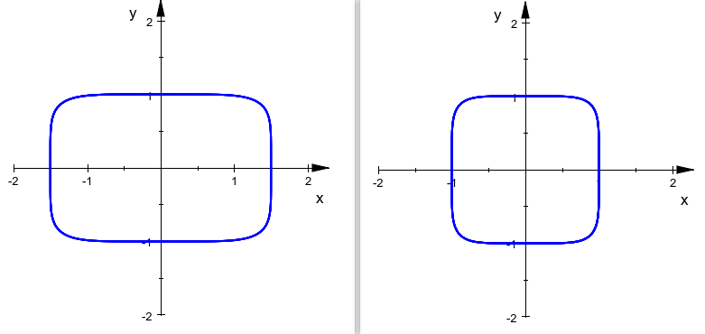
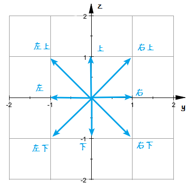

## 好朋友

jl 和 sz 是 $21$ 级新生。他们结识了两位同级好朋友 bc 和 gd。他们现在经常一块在校园各处活动。请你按照字典序以空格隔开在一行内输出他们四个的名字。

输入只有一行，是对通过本题无关的字符串，你不必读入。

请将下面的人名按照字典序排序，在**一行内**输出他们四个的名字，人名间用**一个空格**间隔。输出多余的内容将返回答案错误。

- `jl`
- `sz`
- `bc`
- `gd`

注：你只需要输出最终答案即可，不必在代码里体现具体的计算过程。

通俗而言，字典序可以理解为把一个字符串放到字典时它的先后顺序，例如 `a abandon able` 是符合字典序的。

具体而言，字典序是指按照 ASCII 码数值大小比较每个字符，直到某个字符小于同一位置的另一个字符为止（比较的一方长度不足时以 `\0` 补足）。例如，假定有四个字符串：

- `pen`
- `apple`
- `pineapple`
- `penpineappleapplepen`

按照字典序以空格隔开在一行内输出这四个字符串为：

```
apple pen penpineappleapplepen pineapple
```


## 超椭圆

sz 对数学着迷，他最近在研究超椭圆，并打算用超椭圆绘制一幅包含东方哲学、Alive、伟大的数学公式、生命的不停律动、少女的微笑、宇宙的律动、不同于人类生命体的萌生和退化的矢量图作品送给 jl。

已知超椭圆的方程为：
$$
|\frac xa|^n+|\frac yb|^n=1
$$
超椭圆的面积公式为：
$$
S=4ab\dfrac{\left(\Gamma(1+\frac1n)\right)^2}{\Gamma(1+\frac2n)}\\ \quad
,\Gamma(x)=\int_0^\infty t^{x-1}e^{-x}dt
$$
sz 认为 $n=5.8$ 时的超椭圆最为美观，下图是两个这样的超椭圆：



已知 $n=5.8$ 时，$\Gamma(1+\frac1n)\approx0.925970$,   $\Gamma(1+\frac2n)\approx0.891690$。

现给定 $a,b$，试计算 $n=5.8$ 时超椭圆的面积。

输入一行两个用空格间隔且小数位不超过 $3$ 位的小数 $a,b \ (0 < a,b < 10^3)$。

输出一个小数，表示由给定 $a,b$ 和 $n=5.8$ 确定的超椭圆的面积。

你的答案被认为是正确的当且仅当你的答案与标准答案的相对误差或绝对误差不超过 $10^{-2}$。我们建议你保留至少六位小数。

```
1.000 1.000
```

```
3.846271
```


```
5.801 2.333
```

```
52.054410
```

你收到来自 gd 的温馨提醒：你只需要用到面积公式的前半部分。


## 饮茶

jl 和 sz 总是在三点钟和七点钟饮茶。具体而言，他们会在 $15:00,19:00$ 饮茶。

现给定一个时间 $\text{hh:mm}$，请在这个时间后**最快**多久，他们会饮茶一次？

注：假设时间刚好是 $15:00$ 或 $19:00$，我们认为他们将立刻开始饮茶。

输入一行以空格分隔的两个整数 $\text{hh,mm} \ (0\le \text{hh} < 24,0\le \text{mm} < 60)$。

输出一行两个用空格分割的整数 $\text{hh',mm'}$，要求 $0\le \text{hh'} < 24,0\le \text{mm'} < 60$，代表从 $\text{hh:mm}$ 算起最快只需 $\text{hh'}$ 小时 $\text{mm'}$ 分钟他们就会饮茶一次。为简单起见，请**不要**补足时间的前导零，例如，若答案为 $12$ 小时 $3$ 分钟，你仅需要输出 `12 3` 即可。

```
2 33
```

```
12 27
```


```
23 58
```

```
15 2
```


```
19 0
```

```
0 0
```


## 密码强度

gd 凭借着对 jl 的了解，成功哐哐哐地猜出了 jl 和 sz 共用的洛谷账号密码为 `SnowGolemBaiFu`。所以 jl 和 sz 他们打算修改密码。他们认为一个密码的强弱等级可以如下评定：

- 强度 $1$：是纯数字或纯英文字母（大小写均可，下同）或纯特殊字符（定义特殊字符为 ASCII 内除数字和大小写英文字母外的可显示字符）。
- 强度 $2$：含数字、英文字母、特殊字符的其中两种。
- 强度 $3$：含数字、英文字母、特殊字符。

首先输入一个整数 $n \ (6\le n\le16)$，代表密码的长度。

接下来一行输入一个不含空格的长为 $n$ 的字符串 $s$，代表密码，可以包含除空格外的一切 ASCII 可显示字符。

输出一行一个整数，代表密码 $s$ 的强度。

```
14
SnowGolemBaiFu
```

```
1
```


```
7
1437>_<
```

```
2
```


```
13
f(x)=2f(f(x))
```

```
3
```


## 卡片

jl 喜爱艺术和 AI，他从视野天朝爬取了大量样本，训练了一个 AI，并让 AI 用 GAN 算法画了很多张精美的卡片。他想要在 sz 今年和明年的生日时将卡片送给 sz 。 

jl 将卡片分成了两种，他认为一种卡片的精美程度是 $1$，另一种的精美程度是 $3$ 。现在 jl 手中有 $a$ 张精美程度为 $1$ 的卡片和 $b$ 张精美程度为 $3$ 的卡片，请问 jl 能否将这些卡片分成两堆，使得第一堆所有卡片精美程度之和恰好与第二堆的相等？这样他就能准备两份他认为完全等值的生日礼物了。

请注意每张卡片都必须放入其中的一堆中，每张卡片只能属于其中的一堆。

两个用空格间隔的整数 $a,b \ (0 \leq a,b \leq 10^9,a+b > 1)$，含义如题目描述所示。

如果可以输出字符串 `YES`，否则输出字符串 `NO`。

```
2 1
```

```
NO
```


```
3 1
```

```
YES
```


```
3 9
```

```
YES
```


## 体温数据

jl 和 sz 是班里的生委，他们与其他班委共 $6$ 人带着工牌一起去查寝收集全班同学 $14$ 天的体温数据，并作初步统计分析。规定数据单位为摄氏度。如果在 $14$ 天的任何一天里出现了低于 $36.2$ 或高于 $40.0$ 的数据，他们认为这是有误的数据。否则，如果在 $14$ 天的任何一天里出现了高于 $37.2$ 的数据，他们认为这是危险的数据。如果数据既不是有误的也不是危险的，他们会计算这 $14$ 天的平均体温。

输入包含多组测试用例。

输入第一行一个整数 $t \ (1\le t\le10^5)$，表示你需要处理 $t$ 组测试用例。

接下来输入 $t$ 行，每行一组测试用例，包含 $14$ 个用空格隔开的一位小数 $x \ (30.0\le x\le45.0)$，代表某位同学 $14$ 天的体温数据。

对于每个同学的体温数据，如果这是有误的数据，在一行内输出 `error`；如果这是危险的数据，在一行内输出 `danger`；否则，在一行内输出一个小数代表这 $14$ 天的平均体温。你的答案被认为是正确的当且仅当与标准答案的相对误差不小于 $0.01$。

```
3
36.2 36.3 36.4 36.5 36.6 36.7 36.8 36.9 37.0 37.1 37.2 37.1 37.0 36.9
36.2 36.3 36.4 36.5 36.6 36.7 36.8 36.9 37.0 37.1 37.2 37.3 37.4 37.5
36.2 36.3 36.4 36.5 36.6 36.7 36.8 36.9 37.0 37.1 37.2 37.3 37.4 44.4
```

```
36.764286
danger
error
```


## 选菜

bc 和 gd 打算请 jl 和 sz 在吃饭大学饭堂喝喝水吃吃饭，肯定有事。于是 jl 和 sz 上完计概课后马上去饭堂打饭。现在有 $n$ 种菜品可供选择，编号从 $1$ 到 $n$ 。由于 jl 和 sz 品味不同，他们认为每道菜的美味值可能是不一样的。jl 认为第 $i$ 道菜的美味值是 $a_i$，sz 认为第 $i$ 道菜的美味值是 $b_i$。

然而，他们想要点同一种菜。为了让这道菜尽可能满足他们两个人，他们将会选择 $a_ib_i$ 最高的菜，如果有多道菜的 $a_ib_i$ 值相同，他们会选择这其中 $|a_i-b_i|$ 最小的菜。如果 $|a_i-b_i|$ 仍然相同，他们将选择这其中编号最小的菜。

然而，由于他们来的太晚了，最美味的菜已售罄（也就是说所有满足 $a_ib_i$ 最大的菜均售罄了）。所以他们只能从剩下的菜里挑选。

首先输入一行一个整数 $n \ (1\le n\le10^3)$。

接下来一行输入 $n$ 个用空格隔开的整数，第 $i$ 个整数代表 $a_i  \ (0\le a_i\le10^9)$。

接下来一行输入 $n$ 个用空格隔开的整数，第 $i$ 个整数代表 $b_i \ (0\le b_i\le10^9)$。

如果所有菜均售罄，输出一个字符串 `sold out`。

否则输出一行两个用空格隔开的整数，分别代表他们选择的菜的编号 $k$ 和 $a_kb_k$。

```
7
20 24 0 8 58 9 2
29 3 999 9 10 8 7
```

```
4 72
```


```
3
10 4 100
10 25 1
```

```
sold out
```


## 升级

jl 和 sz 正在玩一款名为众学生之门的游戏，在游戏里，初始等级是 $1$，最高无上限。从第 $i$ 级升到第 $i+1$ 级需要 $i$ 点经验，初始经验为 $0$。例如，从第 $3$ 级升到第 $4$ 级需要 $3$ 点经验。他们想知道，在第 $1$ 级获得了 $n$ 点经验后，可以升到多少级？例如，从第 $1$ 级获得了 $7$ 点经验后，可以升到第 $4$ 级（还余下 $1$ 点经验，不足以继续升级）。

输入包含多组测试用例。

输入第一行包含一个整数 $t \ (1\le t\le10^5)$，表示你需要处理 $t$ 组测试用例。

接下来 $t$ 行每行一组测试用例，各包含一个整数 $n \ (0\le n\le10^{16})$，代表在第 $1$ 级获得了 $n$ 点经验。

对于每个 $n$，输出一行一个整数代表可以升到多少级。

```
5
1
6
9
10
12345679
```

```
2
4
4
5
4969
```


## 修复建筑

jl 和 sz 等四人一行人一同在校园闲逛，突然他们看到了一个 cos 兔女郎的学生在发传单。他们拿到传单，上面写着：

> 嗨你好，很荣幸在这里向您介绍一下我们部门：松花部。这是一个关于人类高质量部门招聘人类高质量新生的一个传单……(此处略去大段文本)为了证明您是高质量的新生，请您解答以下问题，证明您的实力：

问题如下：

现在有 $n$ 栋损坏的公共建筑，编号从 $1$ 到 $n$ ，第 $i$ 栋建筑的损坏值为 $a_i$，每经过 $1$ 天，损坏的第$i$栋建筑会带来 $a_i$ 点经济损失。第$i$栋完全修复所需天数为 $b_i$，每修复一天可以降低 $\dfrac{a_i}{b_i}$ 的损坏值，但修复的当天该建筑造成的损失与当天修复前损坏值一致。你只有一支施工队，所以每天只能修复一栋建筑，每天可以修复不同的建筑，不要求对一栋建筑持续修复直至完全修复。请使用最优的修复方案，使得总经济损失最小，并求最小的经济损失。

输入一行一个整数 $n \ (1 \leq n\leq 10^3)$。

接下来输入一行 $n$ 个整数，第 $i$ 个整数代表 $a_i \ (1 \leq a_i \leq 10^7, \sum_{i = 1}^{n} a_i \leq 10^7)$。

接下来输入一行 $n$ 个整数，第 $i$ 个整数代表 $b_i \ (1 \leq b_i \leq 10^7,\sum_{i=1}^n b_i \leq 10^7)$。

输出一行一个实数，代表最小的经济损失值。

你的答案被视为是正确的当且仅当你的答案与标准答案的相对误差不超过 $0.01$。

```
4
2 4 6 2
2 1 3 1
```

```
45.000
```

一种最优修复方案为：第一天修复第二栋建筑，当天经济损失为 $2+4+6+2=14$。接下来连续两天均修复第三栋建筑，这两天经济损失依次为 $2+6+2,2+4+2$，总共为 $18$。接下来一天可以修复第四栋建筑，当天损失为 $2+2+2=6$。接下来一天可以继续修复第三栋建筑，当天损失 $2+2=4$，最后两天可以修复第一栋建筑，损失依次为 $2,1$，共 $3$。所以答案为 $14+18+6+4+2+1=45$。


## 天空即为极限

*Some birds are not meant to be caged, their feathers are just too bright. jl 很向往空中的飞鸟，于是，sz 找到了鞘翅送给 jl ，让他能够在高空翱翔。*

假设天空是一个宽高无限的二维欧几里得平面，$y$ 轴方向从左往右递增，$z$ 轴方向从下往上递增， jl 当前的飞行方向有八个(左上、左、左下、下、右下、右、右上、上)。每秒初会朝着当前方向移动 $1$ 次。方向为上、下、左、右其一时，移动的直线位移是 $1$ 格；否则，移动的直线位移是 $\sqrt{1+1}=\sqrt2$ 格。如图所示：



不幸的是，jl 飞行时正处于夜晚。天空中随机生成了若干敌对生物幻翼。定义平面两点 $(y_1,z_1),(y_2,z_2)$ 的***距离***为 $|y_1-y_2|+|z_1-z_2|$ 。若幻翼当前与 jl 的***距离***小于等于 $64$ 格，那么在 jl 移动后瞬间，幻翼会在上述八方向中选择一个方向移动，使得移动后在所有的选择里与 jl 的***距离***最小，可通俗理解为朝着 jl 的坐标跟踪移动。移动位移大小同上。特别地，如果此时幻翼恰好与 jl 在同一格，幻翼不会移动。

- jl 的初始生命值为 $20$，攻击力恒为 $7$。 幻翼的初始生命值为 $20$，攻击力恒为 $3$。
- jl 可能随时改变飞行方向。若 jl 在某一秒初更改飞行方向，那么从这一秒初开始(包括这一秒)， jl 移动方向会发生变化。
- 方向确定后 jl 和幻翼相继移动（两者的移动方向未必相同），若 jl 与 任意一只幻翼处于同一格，他们会相互攻击一次，攻击伤害值为攻击方的攻击力大小，且不会超过被攻击方的当前生命值，双方生命值的减少量等同于对方的攻击伤害值。
- 假设 jl 与多只幻翼处在同一格，因为鞘翅的玄妙，这一秒内 jl 只受到一次攻击，而多只幻翼将各受到一次 jl 的攻击。这秒的所有攻击结束后，将自动进入下一秒。值得注意的是，幻翼受到攻击之后的 $1$ 秒钟不会移动，而 jl 受到攻击后下一秒仍会继续飞行。
- 若任一方的生命值不为正数，则视为死亡。幻翼死亡后不会继续攻击、移动；若 jl 死亡则会失去宝贵的鞘翅。

约定左上、左、左下、下、右下、右、右上、上 八个方向分别记作 $1,2,3,4,5,6,7,8$。

记初始时间为第 $1$ 秒初，jl 会飞行 $t$ 秒，在第 $t$ 秒末时，如果 jl 仍存活，他会让 sz 马上用指令将他传送回家，并获得一张一鸣的女装照作为奖励。

输入包含多组测试用例。

第一行包含一个整数 $T \ (1 \leq T \leq 10)$，表示你需要处理 $T$ 组测试用例。

对于每个测试，首先输入一行一个五个整数 $t(1\le t\le10^3),p(0\le p\le t-1),d_0(1\le d_0\le 8)$，$y_0,z_0(-10^5\le y_0,z_0\le10^5)$ ，$t$ 代表 jl 飞行的总时长，$p$ 代表 jl 调整飞行方向的次数， $d_0$ 代表 jl 的初始飞行方向。$y_0,z_0$ 代表 jl 的初始坐标。

接下来输入 $p$ 行，每行两个整数 $m, d(2\le m\le t, 1\le d\le8)$，代表 jl 在第 $m$ 秒初移动前更改的飞行方向为 $d$。保证 $m$ 严格单调递增。

接下来输入一行一个整数 $n(1\le n\le10^3)$，代表幻翼的个数。

接下来输入 $n$ 行，每行两个整数 $y,z(-10^5\le y,z\le10^5)$，代表一个幻翼的初始坐标。

对于每个测试，如果 jl 没能活过 $t$ 秒，在一行内输出`lose`，并输出一个整数 $t'$ 代表 jl 死亡时的秒数。若 jl 活过了 $t$ 秒，在一行内输出`survive`，并输出一个整数 $a$ 代表 jl 对幻翼造成的总伤害数值。

```
4
6 2 2 0 0
4 6
6 2
1
-1 0
1000 4 6 0 0
6 8
7 4
8 5
9 3
4
1 0
4 0
7 0
10 0
9 4 6 0 0
6 8
7 4
8 5
9 2
4
1 0
4 0
7 0
10 0
95 0 6 -64 0
1
64 0
```

```
survive 20
survive 56
lose 9
survive 0
```

对第一个测试，在第 $1$ 秒，jl 与幻翼战斗；在第 $4$ 秒， jl 与幻翼战斗；在第 $6$ 秒， jl 与幻翼战斗。前两次战斗造成 $7$ 点伤害，但最后一次战斗时幻翼只有 $6$ 点生命值，所以只造成了 $6$ 点伤害。所以总伤害为 $20$ 。

对第二个测试，在第 $1$ 秒， jl 与第一只幻翼战斗；在第 $2$ 秒， jl 与第二只幻翼战斗；在第 $4$ 秒， jl 与第三只幻翼战斗；在第 $5$ 秒， jl 与第四只幻翼战斗；在第 $6$ 秒，jl 同时与前三只幻翼战斗；在第 $7$ 秒， jl 与第四只幻翼战斗，之后再无战斗。有 $6$ 秒发生过战斗，jl 一共扣除 $18$ 点血，一共攻击 $8$ 次，且伤害均为 $7$，所以总伤害为 $56$。

对第三个测试，前 $8$ 秒与第二个测试完全相同，在第 $9$ 秒，jl 同时与四只幻翼战斗并死亡。

对第四个测试，前 $63$ 秒幻翼与 jl 距离大于 $64$，幻翼不移动。从第 $64$ 秒开始幻翼朝 jl 方向移动。在第 $95$ 秒， jl 和幻翼坐标分别是 $(31,0),(33,0)$。自始至终他们未相遇，故总伤害为 $0$。