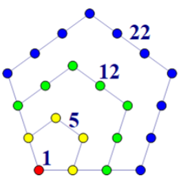

# 想念Serein

*一天 Serein 在想签到题，于是跑去问了 A1m 和 Tension*

Serein：你们对签到题有什么想法吗？

A1m：直接输出 `A1m Miss Using`

Tension：直接输出 `Tension Miss Niannian`

Serein：我呢？


Serein 想到没人想念自己很伤心，于是他想起来了还有你们，所以请输出 `I Miss Serein` ，重要的事情强调三遍，所以输出 `I Miss Serein` 三遍即可，用换行符分隔

无输入。

请输出相应的内容。

# Serein的排序

*收到了很多人的想念后的 Serein 很开心，决定不刁难你们，你只需要解决一个简单的排序问题即可。*

给定三个绝对值不相等的整数 $x,y,z$，请你将它们按照绝对值大小升序排序并输出。

输入一行三个整数 $x,y,z(-10^5\le x,y,z\le10^5,|x|\neq |y|\neq |z|)$。

输出一行三个整数，代表你的答案。

```
1 3 -2
```

```
1 -2 3
```

# 五边形数

*Ustinian 特别喜欢五边形，这天她跑去问 Serein 知不知道五边形数的准确定义。Serein 翻阅网上资料终于明白了五边形数的定义。*

将无限多个点按照下图方式摆放，形成无限多个正五边形(下图仅展示四个)：



定义第 $i$ 个五边形数是图中第 $i$ 小的五边形边上和内部所包含的点数(特别规定最小的五边形是一个点)。例如，图中，前四个五边形数分别是 $1,5,12,22$。以第三个五边形为例，它包含的点是红色、黄色和绿色的点，统计得共 $12$ 个。

给定 $n$，输出第 $n$ 个五边形数是多少。

输入一行一个整数 $n(1\le n\le10^4)$。

输出一行一个整数，代表答案。

```
1
```

```
1
```


```
3
```

```
12
```


```
580
```

```
504310
```


# 排列的排名

*Serein 这天在研究全排列问题，对于 $n$ 个数有 $n!$ 个全排列，但古灵精怪的 Ustinian 问 Serein 能不能对这些排列排个名次。*

于是 Serein 定义长为 $n$ 的排列是一个有 $n$ 元素的序列，且 $[1,n]$ 内每个整数出现一次且仅一次，例如 $[1,3,2],[2,1,3]$ 是两个长为 $3$ 的排列。每个排列在所有同长排列里字典序排第几位，就是该排列的排名。 例如对于 $n=3$ 时，按字典序列出所有的排列 $[1,2,3],[1,3,2],[2,1,3],[2,3,1],[3,1,2],[3,2,1]$，则 $[2,3,1]$ 的排名为 $4$。

求一个给定排列的排名，可以用康托展开，具体步骤如下：

1. 设初始排名为 $1$。
2. 对排列 $p$ 的第 $i$ 个元素 $p_i$ ，找到有多少个整数 $x$ 满足 $x\in[1,p_i]$，且 $x$ 未在 $p_1,p_2,\cdots, p_i$ 出现过，设共有 $c_i$ 个数字满足条件，则对排名增加 $c_i\times (n-i)!$。

给定一个排列 $p$，请你求出它的排名。

输入一行一个整数 $n(1\le n\le12)$。

接下来输入一行 $i$ 个整数，第 $i$ 个整数为 $p_i(1\le p_i\le n)$。保证 $p$ 是排列。

输出一行一个整数，代表 $p$ 的排名。

```c++
5
2 5 3 4 1
```

```c++
46
```


```c++
5
1 2 3 4 5
```

```c++
1
```


```c++
3
3 2 1
```

```c++
6
```

对于样例1，对 $i=1$，只有 $x=1$ 满足，则 $c_1=1$，故增加 $1\times 4!$；对 $i=2$，有 $x=1,3,4$ 满足，则 $c_2=3$，故增加 $3\times 3!$；对 $i=3$，有 $x=1$ 满足，则 $c_3=1$，故增加 $1\times2!$；对 $i=4$，也有 $x=1$ 满足，则 $c_4=1$，增加 $1\times 1!$；对 $i=5$，没有满足的，即 $c_5=0$，增加 $0\times0!$。故排名为 $1+4!+3\times 3!+2!+1!=46$。

# 鸿门宴

 *国王邀请果冻参加宴会，果冻却早已深知这是一场鸿门宴……*

果冻非常聪明，在这个国度有很高的声望，这引起了同样很聪明的白茶嫉妒，于是白茶决定通过一场鸿门宴除掉果冻。在宴会上，白茶想要刁难果冻，于是提出和果冻进行一场游戏:

让国王写下一个序列 $a$ ，长度为 $n$ ，且满足$1$ $\leq$ $a_1$ $<$ $a_2$ $<$ $a_3$ $<$ $\ldots$ $<$ $a_n$。

两人轮流对序列进行操作，果冻先手。每人每次选择一个 $a_i$ 并让其减一，要求不破坏 $1$ $\leq$ $a_1$ $<$ $a_2$ $<$ $a_3$ $<$ $\ldots$ $<$ $a_n$ 的性质，无法操作者则输。由于果冻和白茶都极其聪明，所以他们每次都会选择最佳策略。

此时，正在一旁扫地的你其实才是这个国度最聪明的人，而这一切都是你布下的一个局，于是你看了一眼序列 $a$ ，便知道了最后的赢家。

第一行一个正整数 $n$。($1 \leq n \leq 10^3$)  。

第二行 $n$ 个正整数，描述序列 $a$ 。满足$1 \leq a_1 < a_2 < a_3 < \ldots < a_n \leq 10^4$。

输出只有一行一个字符串。若果冻胜利，则输出 `guodong`；若白茶胜利，则输出 `baicha`。

```
4
1 2 4 5
```

```
baicha
```


```
3
1 2 3
```

```
baicha
```


```
5
1 2 4 6 9
```

```
guodong
```

对于样例 $1$，果冻先进行操作，显然，果冻只能选择 $a_3$ 使其减 $1$，序列变为 $[1,2,3,5]$；然后轮到白茶操作，白茶只能选择 $a_4$ 使其减 $1$，序列变为 $[1,2,3,4]$；然后轮到果冻操作，果冻选择任何一个数减 $1$ 都会破坏 $1$ $\leq$ $a_1$ $<$ $a_2$ $<$ $a_3$ $<$ $\ldots$ $<$ $a_n$ 的性质，故果冻无法操作，白茶胜利。

对于样例 $2$，果冻先进行操作，果冻选择任何一个数减 $1$ 都会破坏 $1$ $\leq$ $a_1$ $<$ $a_2$ $<$ $a_3$ $<$ $\ldots$ $<$ $a_n$ 的性质，故果冻无法操作，白茶胜利。

# 数学王子Serein

*为了消遣时光，Serein去找了道数学智力题来做，题目如下：*

> *把 $1988$ 表示成 $28$ 个连续偶数的和，那么其中最大的那个偶数是多少？*

*这对于数学王子Serein来说太简单了，经过演算，他得到答案为 $98$ 。*

---

Serein不满足于解决某一特定的问题，于是他将问题推广，得到了一个新的问题：

**对于给定的正整数 $s$ ， $s$ 是否能被表示为 $n$ 个连续正偶数的和？**

他认为这个问题还是太简单了，于是将这个问题留给了你。

对于给定的正整数 $s$ ，如果它能被表示为 $n$ 个连续正偶数的和，则输出其中最大的一个正偶数。

若不能，则输出 `-1` 。

输入两个整数 $s$ 和 $n$ 。($1\leq n \leq s \leq 1 \times 10^{12}$)

如果 $s$ 能由 $n$ 个连续正偶数和表示，输出其中最大的偶数，否则输出 `-1` 。

```
1988 28
```

```
98
```


```
1987 28
```

```
-1
```

对 C/C++ 选手请注意，int 的最大值约为 $ 2 \times10^9 $，请使用合理的数据类型

# 只因你太美

lr580 是一位喜欢唱、跳、code、蓝桥的练习时长两周半的 C 语言练习生，他对拼音 `ji` 和 `zhi yin` 极为敏感，一旦发现有人说话时读了 `ji` 或 `zhi yin` 的拼音(只有单独完整出现的才算，例如 `jiao` 不算 `ji`，`zhi ying` 也不算 `zhi yin`)，就会马上察觉并复读，复读时他会将原文所有 `ji` 替换为 `zhi yin`，以及所有 `zhi yin` 替换成 `ji`。例如对 `zhi yin ni tai mei` 会被复读为 `ji ni tai mei`。如果一句话没有出现过任何 `ji` 或 `zhi yin`，那么他将不会复读这句话。

一段话由若干句话组成。他认为一段话的美丽值是这段话里，拼音词 `ji` 出现次数的平方加上拼音词 `zhi yin` 的出现次数的平方。具体而言，设出现了 $x$ 个 `ji` 和 $y$ 个 `zhi yin`，美丽值是 $x^2+y^2$。

给定一段话，请将其按照上述规则复读，并输出美丽值。

输入一行一个整数 $n(1\le n\le10^2)$，代表总共有几句话。

接下来输入一行 $n$ 个整数，第 $i$ 个整数 $a_i(1\le a_i\le10^2)$ 代表第 $i$ 句话有几个词。

接下来输入 $n$ 行，每行输入 $a_i$ 个字符串，第 $j$ 个字符串 $s_{i,j}$ 代表第 $i$ 句话的第 $j$ 个词，保证 $s_{i,j}$ 仅包含小写字母，且长度 $|s_{i,j}|$ 满足 $1\le |s_{i,j}|\le 20$。

输出第一行一个实数，代表美丽值。

接下来输出一行一个整数 $m$，代表有多少句话被复读。

接下来在 $m$ 行内输出复读的这段话。

```
4
9 10 4 16
xiao hei zi lu chu ji jiao le ba
xiao hei zhi lu chu zhi yin jiao le ba
zhi shi hai bao
ji dong che jia shi zheng ke mu san fa dong ji xi huo shui jiao
```

```
10
3
xiao hei zi lu chu zhi yin jiao le ba
xiao hei zhi lu chu ji jiao le ba
zhi yin dong che jia shi zheng ke mu san fa dong zhi yin xi huo shui jiao
```


```
1
7
ni gan ma hai hai ai yo
```

```
0
0
```


```
54
12 15 14 8 9 9 11 11 10 16 7 9 7 9 13 8 8 10 8 12 15 11 9 11 16 9 9 10 10 15 15 9 16 7 9 8 9 13 8 8 10 8 12 15 11 22 10 17 12 15 11 9 11 16
zhi yin ni tai mei baby zhi yin ni tai mei baby
zhi yin ni shi zai shi tai mei baby zhi yin ni tai mei baby
ying mian zou lai de ni rang wo ru ci chun chun yu dong
zhe zhong gan jiao wo cong wei you
cause i got a crush on you who you
ni shi wo de wo shi ni de shui
zai duo yi yan kan yi yan jiu hui bao zha
zai jin yi dian kao jin dian kuai bei rong hua
xiang yao ba ni zhan wei ji you baby bae
bu guan zou dao na li dou hui xiang qi de ren shi ni you you
wo ying gai na ni zen yang
uh suo you ren dou zai kan zhe ni
wo de xin zong shi bu an
oh wo xian zai yi bing ru gao huang
eh eh nan dao zhen de yin wei ni er feng kuang ma
wo ben lai bu shi zhe zhong ren
yin ni bian cheng qi guai de ren
di yi ci ya bian cheng zhe yang de wo
bu guan wo zen me qu fou ren
zhi yin ni tai mei baby zhi yin ni tai mei baby
zhi yin ni shi zai shi tai mei baby zhi yin ni tai mei baby
oh eh oh xian zai que ren di gao su wo
oh eh oh ni dao di shu yu shui
oh eh oh xian zai que ren di gao su wo
oh eh oh ni dao di shu yu shui jiu shi xian zai gao su wo
gen zhe zhe jie zou huan huan make wave
tian mi de nai you its your birthday cake
nan ren men de game call me ni lian ren
bie bei qi pian yu kuai de i wanna play
wo de nao hai mei fen mei miao zhi wei ni yi ren chen zui
zui mi ren rang wo shen hun dian dao shi ni shen shang xiang shui
oh right baby im fall in love with you
wo de yi qie ni dou na zou zhi yao you ni jiu yi zu gou
wo dao di ying gai zen yang
uh wo xin li yi zhi hen bu an
qi ta nan ren men de shi xian
oh quan dou zhi kan xiang ni de lian
eh eh nan dao zhen de yin wei ni er feng kuang ma
wo ben lai bu shi zhe zhong ren
yin ni bian cheng qi guai de ren
di yi ci ya bian cheng zhe yang de wo
bu guan wo zen me qu fou ren
zhi yin ni tai mei baby zhi yin ni tai mei baby
zhi yin ni shi zai shi tai mei baby zhi yin ni tai mei baby
wo yuan yi ba wo de quan bu dou gei ni
wo mei tian zai meng li dou meng jian ni hai you wo bi zhe yan jing ye neng kan dao ni
xian zai kai shi wo zhi zhun ni kan wo
i dont wanna wake up in dream wo zhi xiang kan ni zhe shi zhen xin hua
zhi yin ni tai mei baby zhi yin ni tai mei baby
zhi yin ni shi zai shi tai mei baby zhi yin ni tai mei baby
oh eh oh xian zai que ren de gao su wo
oh eh oh ni dao di shu yu shui
oh eh oh xian zai que ren de gao su wo
oh eh oh ni dao di shu yu shui jiu shi xian zai gao su wo
```

```
257
9
ji ni tai mei baby ji ni tai mei baby
ji ni shi zai shi tai mei baby ji ni tai mei baby
xiang yao ba ni zhan wei zhi yin you baby bae
ji ni tai mei baby ji ni tai mei baby
ji ni shi zai shi tai mei baby ji ni tai mei baby
ji ni tai mei baby ji ni tai mei baby
ji ni shi zai shi tai mei baby ji ni tai mei baby
ji ni tai mei baby ji ni tai mei baby
ji ni shi zai shi tai mei baby ji ni tai mei baby
```

对样例一：出现了 `ji` 共 $3$ 次，`zhi yin` 共 $1$ 次，美丽值为 $3^2+1^2=10$。

对样例三，出现了 `ji` 共 $1$ 次，`zhi yin` 共 $16$ 次，美丽值为 $1^2+16^2=257$。

注意不带空格的单个词 `zhiyin` 不认为是 `zhi yin`；此外，上一句话末尾的 `zhi` 与下一句话开头的 `yin` 组合起来也不认为是 `zhi yin`。


# Serein的概率论

*在丘丘幼儿园大班的概率论课上，Serein 学到了位运算和概率。他认为自己已经熟练地掌握了这两个知识点，于是他找到了 Ustinian 来出题考考自己。*

Ustinian 给了 Serein $n$ 个长度为 $m$ 且只包含 $0$ 和 $1$ 的数字串，Ustinian 会对这些数字串操作 $q$ 次。每次 Ustinian 会选择两个数字串 $s_i$ 和 $s_j$，并选择两个位置 $l,r$，对于所有的 $x \in [l,r]$，将 $s_j[x]$ 替换为 $s_j[x] \& s_i[x]$，$s_j[x]$ 为第 $j$ 个数字串的第 $x$ 位，其中 $ \& $ 为位运算中的与运算。但是对于第 $i$ 次操作，只有 $p_i/100$ 的概率成功。

Ustinian 想让 Serein 计算出 $q$ 次操作后，$n$ 个数字串按位与运算后得到的数字串中 $1$ 的个数的期望。Serein 并不能解决这道问题，但是他不想丢面子，于是他想请聪明的你帮他计算出这道题的答案。

第一行两个整数 $n,m（2 \leq n \leq 100,1 \leq m \leq 1000）$，代表数字串的个数和长度。

接下来 $n$ 行每行一个长度为 $m$ 且只包含 $0$ 和 $1$ 的数字串。

第 $n + 2$ 行包含一个整数 $q（1 \leq q \leq 2 \times 10^3）$，代表操作次数。

接下来 $q$ 行，每行五个整数 $i,j,l,r,p（1 \leq i,j \leq n,1 \leq l \leq r \leq m,0 \leq p \leq 100）$，代表操作两个数字 串的编号，操作的位置范围以及成功概率。保证 $i \neq j$。

输出一个数，代表所求期望。如果答案为小数，我们建议你至少保留$3$位小数。

假设你的答案是$p$，标准答案是$q$，我们保证所有满足$∣p−q∣\leq 0.01$ 的答案都会被判定为正确。

```
3 3 
100 
110 
111 
1 
1 2 1 2 0
```

```
1
```

由于 $p = 0，p/100 = 0$，仅有的一次操作不会成功，所以操作后的数字串始终与原数字串相同。原数字串按位与运算的结果为 $100$，仅有一个 $1$，所以答案为$1$。

作为提醒，与运算的运算规则是 $0 \& 0 = 0, 0 \& 1 = 0, 1 \& 0 = 0, 1 \& 1 = 1$。

# Ustinian的围骰

*骰宝赌博中，所开出三粒骰仔的点数都是相同，大小通杀：指开围骰，除了买中围骰外其余所有投注都杀。而 Serein 对围骰很感兴趣，连忙跟 Ustinian 分享了这个，了解了围骰规则后，她提出了另一种玩法。*

**注意题目描述的规则可能与一般的围骰游戏有所区别，请以题目为准。**

围骰游戏有 $n$ 个人参与，每人有 $5$ 枚 $6$ 面骰子。
初始时，每个人随机打乱自己的骰子（摇骰子）。
特别的，围骰之神会在暗中保证：对于每个人的 $5$ 枚打乱后的骰子，不会出现 $5$ 枚骰子的点数从小到大排序后为 $(2,3,4,5,6)$ 的情况。之后每个人仅知道自己的骰子点数。

+ 若当前规则为“斋”，对点数 $x(1\le x\le 6)$，一个玩家的点数 $x$ 的总数目 $num_x$ 为自己的点数为 $x$ 的骰子数目；
+ 若当前规则为“飞”，对点数 $x(1\le x\le 6)$，一个玩家的点数 $x$ 的总数目 $num_x$ 为自己的点数为 $x$ 或 $1$ 的骰子数目。
+ 特别地，若自己的 $5$ 枚骰子点数一样(在“飞”规则下，即只出现 $x$ 和 $1$ 两种)，则 $num_x$ 额外加一。

例如，斋时，$num_2(1,1,2,2,2)=3,num_2(2,2,2,2,2)=6$ ；飞时， $num_2(1,2,3,4,5)=2,num_2(1,1,2,2,2)=6,num_2(1,1,1,1,1)=6$ 。

定义全场的 $x$ 的数目 $tot_x$ 为各玩家的 $num_x$ 之和。

玩家围成一圈并顺时针叫数，断言在斋或飞下，当前 $tot_x$ 至少是多少。他的下一个玩家如果质疑该断言，则开骰，公开所有人的骰子并统计，若断言正确，下一个玩家负；否则胜。若不质疑，则继续断言。

现给定玩家数 $n$，上一个玩家断言的规则、$x$ 、总数 $tot_x$，以及当前自己的骰子情况，请你计算有多大的概率上一个玩家的断言是正确的。

输入一行一个整数 $t(1\le t\le10^3)$，代表询问数。

接下来输入一行四个整数 $n,r,x,tot_x(2\le n\le5,1\le r\le 2,1\le x\le 6,0\le tot_x\le 6n)$。若 $r=1$ 代表斋，否则代表飞。

接下来输入一行五个整数，第 $i$ 个整数 $a_i(1\le a_i\le6)$ 代表你持有的第 $i$ 个骰子的点数。保证从小到大排序后 $a\neq(2,3,4,5,6)$。

对于每个询问，以 `a/b` 格式输出一行两个整数 $a,b$，代表断言正确的概率 $\dfrac ab$，你需要输出最简分数形式。

```
5
2 1 2 6
2 2 2 2 2
3 2 2 6
1 2 1 2 1
2 1 4 4
2 3 3 3 3
3 1 4 10
2 3 3 3 3
5 2 3 9
1 2 3 4 4
```

```
1/1
1/1
13/3828
17/19538112
148076978096/279593130267
```

对第一、第二个询问，由于自己的 $num_2=6$，则不管其他人的点数如何，都必然总数不少于 $6$。

对第三个询问，自己 $num_4=0$，对方 $num_4=4$ 的所有情况 $(4,4,4,4,d),d\neq 4$，共有 $5\times5=25$ 种；$num_4=5$ 不存在，$num_4=6$ 只有一种情况。总方案数为 $6^5-5!=7656$，$\gcd(7656,25+1)=2$，故答案为 $\dfrac{13}{3828}$。

对第四个询问，当且仅当一个玩家 $num_4=6$(只有一种情况)且另一个玩家 $num_4=4$ 时能够凑够 $10$，情况数为 $2\times25\times1=50$ 种；且不可能凑到 $11$，凑到 $12$ 只有两个玩家都 $num_4=6$，仅有一种情况。总方案数为 $7656^2$。$\gcd(50+1,7656^2)=3$，答案为 $\dfrac{17}{7656^2\div 3}$。

# 疲惫的Serein

Serein 回到家身心疲惫，但是还要完成 Ustinian 所布置的作业题，已知 $n$ 个数字两两相加可以得到  $\dfrac{n(n-1)}{2}$ 个数字，但是 Ustinian 为了折磨 Serein ，只给 Serein 这相加得到的  $\dfrac{n(n-1)}{2}$ 个数字，他需要以此来还原出这 $n$ 个数，绞尽脑汁的 Serein 向你求助，你能帮助他吗？

第一行先输入一个正整数 $n$ $(3 \leq n \leq 80)$

接下来一行输入  $\dfrac{n(n-1)}{2}$ 个数字 $a_i$ $(2 \leq a_i \leq 1 \times 10^9)$ ，保证 $a_{i-1} \leq a_i$ 对所有 $2 \leq i \leq  \dfrac{n(n-1)}{2}$ 恒成立

题目数据保证：如果有解，仅有唯一解

如果题目有解，升序输出原来的 $n$ 个数，否则输出 `-1` ;

数与数之间用空格间隔。

```
3
2 3 4
```

```
-1
```


```
4
4 5 7 10 12 13
```

```
1 3 4 9
```

