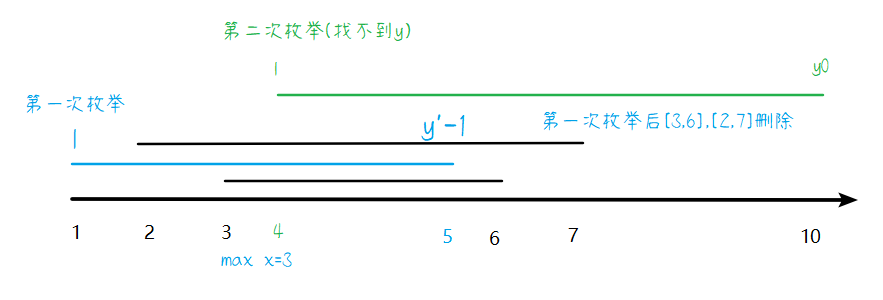
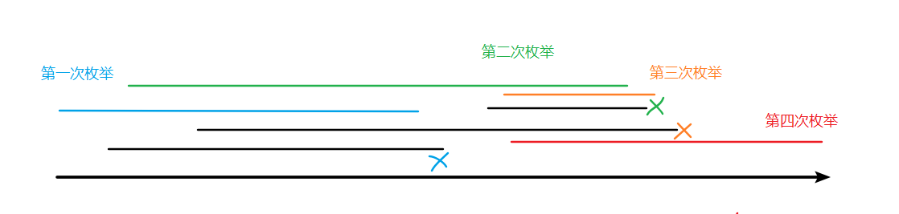

# SCNUCPC2023线下赛-题解

> 以下所有题解仅提供一种或多种正确解法。并不必然代表下面提供的解法是最优解，且并不必然代表其他的解法不可行。因此，如果有别的思路，也欢迎各位大佬分享你的解法。若题解有误，欢迎指正~ ｡ﾟ･ (⁄ ⁄>⁄ ︿ ⁄<⁄ ⁄) ･ﾟ｡ 

## A.上白泽慧音的二路归桥

不妨将无根树转化为以 $1$ 为根的有根树，然后统计每个子树所包含的节点数 $siz$，可以通过 DFS 实现。

那么，对每个点 $u$，设其第一个子节点为 $v_1$，选定的路径可以以 $v_1$ 子树的某点为起点，方案数为 $siz_{v_1}$，子树外的所有 $n-siz_{v_1}$ 个点都可以做终点，故共有 $siz_{v_1}(n-siz_{v_1})$ 个方案。

接下来，考虑其第二个子节点 $v_2$，以 $v_2$ 子树某点为起点，方案数为 $siz_{v_2}$，然后以除了该子树，以及 $v_1$ 子树外的所有点为终点(否则会重复计数)，有 $n-siz_{v_1}-siz_{v_2}$ 个这样的点。 故共有 $siz_{v_2}(n-siz_{v_1}-siz_{v_2})$ 个点。

不断往下考虑，设共有 $k$ 个子节点，对第 $v_i$ 个子节点，方案数为：$siz_{v_j}(n-\sum_{i=1}^jsiz_{v_i})$。故 $u$ 的所有 $k$ 个子节点的方案数为 $\sum_{j=1}^ksiz_{v_j}(n-\sum_{i=1}^jsiz_{v_i})$。使用前缀和优化内层 $\sum_{i=1}^j$，可以 $O(k)$ 算出每个节点。根据握手定理，$\sum k=n$，故复杂度为 $O(n)$。

上述统计还是不完备的，我们还需要加上以 $u$ 自己为起点，非 $u$ 子树内的共 $n-siz_u$  个点为终点的方案，共 $1\times (n-siz_u)$ 个方案。即对点 $u$，总方案数为
$$
n-siz_u+\sum_{j=1}^ksiz_{v_j}(n-\sum_{i=1}^jsiz_{v_i})
$$

```c++
#include <bits/stdc++.h>
using namespace std;
using ll = long long;
const ll mn = 2e5 + 10, mod = 998244353;
ll n, siz[mn], ans[mn];
vector<ll> g[mn];
void dfs1(ll u)
{
    siz[u] = 1;
    for (auto v : g[u])
    {
        if (siz[v] == 0)
        {
            dfs1(v);
            siz[u] += siz[v];
        }
    }
}
void dfs2(ll u, ll fa)
{
    ll m = n, s = 0;
    for (auto v : g[u])
    {
        if (v != fa)
        {
            m -= siz[v];
            s += siz[v] * m;
            dfs2(v, u);
        }
    }
    ans[u] = s + n - siz[u];
}
signed main()
{
    ios::sync_with_stdio(false), cin.tie(0);
    cin >> n;
    for (ll i = 1, u, v; i < n; ++i)
    {
        cin >> u >> v;
        g[u].push_back(v);
        g[v].push_back(u);
    }
    dfs1(1);
    dfs2(1, 0);
    for (ll i = 1; i <= n; ++i)
    {
        cout << ans[i] % mod << " ";
    }
    return 0;
}
```

## B.人里孩童的疑惑-easy

先预处理出每个后缀字符串出现的频次，然后对每个前缀查询，只需查找对应字符串的频次即可。

可以使用字符串哈希，使用 map 存每个哈希值的出现次数。然后同理用字符串哈希求出前缀的哈希，查 map 即可。

> AC自动机做法：考虑前后缀关系，某个串的后缀要匹配某一个前缀，那么其实就是AC自动机里某个串的尾结点的fail指针指向的字符串，且该字符串的fail链上的结点所代表的前缀都可以匹配那个尾结点所代表的字符串后缀，所以考虑对AC自动机建fail树，统计某个前缀代表的结点的fail树上的叶子节点数量即可，复杂度可以做到 $O(n)$
>

```c++
#include <bits/stdc++.h>
using namespace std;
using ll = long long;
using ull = unsigned ll;
const ll mn = 1e5 + 5, p = 31;
ll n, q;
ull pw[mn * 2];
vector<ull> h[mn];
map<ull, ll> b;
ull has(ll i, ll l, ll r)
{
    return h[i][r] - h[i][l - 1] * pw[r - l + 1];
}
ll len[mn];
signed main()
{
    ios::sync_with_stdio(false), cin.tie(0);
    pw[0] = 1;
    for (ll i = 1; i < mn * 2; ++i)
    {
        pw[i] = pw[i - 1] * p;
    }
    cin >> n;
    for (ll i = 1; i <= n; ++i)
    {
        string s;
        cin >> s;
        len[i] = s.size();
        h[i].resize(s.size() + 1, 0);
        for (ll j = 0, je = s.size(); j < je; ++j)
        {
            h[i][j + 1] = h[i][j] * p + (s[j] - 'a' + 1);
        }
        for (ll j = 1, je = s.size(); j <= je; ++j)
        {
            ++b[has(i, j, je)];
        }
    }
    cin >> q;
    ll ans = 0;
    for (ll x, y; q--;)
    {
        cin >> x >> y;
        ans += b[has(x, 1, y)];
    }
    cout << ans;
    return 0;
}
```

## C.人里孩童的疑惑-hard

在看题解之前，请大家先看一副对联

> 上联：AC自动机fail树dfs序建可持久化线段树
>
> 下联：后缀自动机next指针dag图上跑SG函数

没错，看到上联你可能就知道题目怎么做了

~~首先，如果你队里有**字符串手**+**数据结构手**，这道题还做不出来，那可以考虑把这俩踢了！~~

可以把该问题拆分成两个问题

+ 有多少串含有某个前缀（字符串）
+ 怎么统计这些串中长度至少为$x$的数量（数据结构）

首先看到题目里显而易见的**前缀后缀**，你会想到什么算法？

**KMP**？可是题目是多串

那很显然，**AC自动机**的用途可以匹配题目的描述

研究一下**AC自动机**的**fail指针**，你会发现，某个**结点A**的**fail指针**指向某个**前缀S**，且该**结点A**的后缀含有该**前缀S**

那指向该**结点A**的**fail指针**呢？可以发现，指向该**结点A**的**结点B**，他(**B**)的后缀含有根到该结点(**A**)的字符串，那么其(**B**)后缀也含有那某个**前缀S**

如：`abcd` -> `bcd`->`cd`

如此迭代下去，就是字符串数据结构上常见的**fail树**

所以第一个问题可以解决，有哪些串含有某个前缀，简单的说，就是该串对应结点的**fail树**上的所有结点到根构成的字符串

可以在树上的每个结点，存他们到根的距离（也就是结点到根构成的字符串的长度），以及他们的计数（有多少前缀串含有该串的数量）

所以问题为：在某个子树上统计结点权值大于等于某个数的结点的计数和

先看看这样一个问题：

给你一个数组，求$[l,r]$之间大于权值$x$的个数

这显然就是一个可持久化线段树的问题

所以，可以仿造该做法

在fail树上dfs序建可持久化线段树，这样，就可以求得该问题的解（注意合并并不是跟数组一样

> 对应了上联  **AC自动机fail树dfs序建可持久化线段树**

但实际上，简化一下做法，就是在树上进行**线段树合并**

代码如下：

```cpp
#include <bits/stdc++.h>

using namespace std;
using ll = long long;
using pii = pair<int, int>;
using db = double;

#define endl '\n'
#define pb push_back
#define lson l, mid, num << 1
#define rson mid + 1, r, num << 1 | 1

const int mod = 1e9 + 7;
const int maxn  = 4e5 + 10;

int root[maxn];
struct node {
	int l, r;
	int val;
}tree[maxn << 5];
int trcnt;

struct Automaton
{
    static const int SIGMA = 26;
    int nxt[maxn][SIGMA], siz[maxn], fa[maxn], cnt;
    int dq[maxn], l, r, n;
	int dep[maxn];
    void init() { memset(nxt[0], siz[0] = cnt = 0, sizeof nxt[0]); }
    inline int idx(char c) { return c - 'a'; }
	vector <int> e[maxn];
	map<int, int> mp[maxn];
    int insert(string s, int id)
    {
        int len = s.size(), u = 0, c;
        for(int i = 0; i < len; ++i)
        {
            c = idx(s[i]);
            if(!nxt[u][c])
            {
                ++cnt;
                memset(nxt[cnt], siz[cnt] = fa[cnt] = 0, sizeof nxt[cnt]);
                nxt[u][c] = cnt;
                dep[cnt] = dep[u] + 1;
            }
            u = nxt[u][c];
            mp[id][i + 1] = u;
        	siz[u]++;
        }
        return u;
    }
    void build()
    {
        l = 1, r = 0;
        int i, j;
        for(int i = 0; i < SIGMA; ++i)
            if(nxt[0][i])
            {
                fa[nxt[0][i]] = 0;
                dq[++r] = nxt[0][i];
            }
        while(l <= r)
        {
            int u = dq[l++];
            for(int i = 0; i < SIGMA; ++i)
                if(nxt[u][i])
                {
                    fa[nxt[u][i]] = nxt[fa[u]][i];
                    dq[++r] = nxt[u][i];
                }
                else
                {
                    nxt[u][i] = nxt[fa[u]][i];
                }
        }
        for (i = 1; i <= cnt; i++) {
        	e[fa[i]].pb(i);
        }
    }
	int creat(int rot, int l, int r, int id, int val) {
		if (!rot) rot = ++trcnt;
		tree[rot].val += val;
		if (l == r) {
			return rot;
		}
		int mid = (l + r) >> 1;
		if (mid >= id) {
			tree[rot].l = creat(tree[rot].l, l, mid, id, val);
		} else tree[rot].r = creat(tree[rot].r, mid + 1, r, id, val);
		return rot;
	}
	int merge(int lot, int rot, int l, int r) {
		if (!lot) return rot;
		if (!rot) return lot;
		int t = ++trcnt;
		if (l == r) {
			tree[t].val = tree[lot].val + tree[rot].val;
			return t;
		}
		int mid = l + r >> 1;
		tree[t].l = merge(tree[lot].l, tree[rot].l, l, mid);
		tree[t].r = merge(tree[lot].r, tree[rot].r, mid + 1, r);
		tree[t].val = tree[tree[t].l].val + tree[tree[t].r].val;
		return t;
	}
	void build_tree(int num) {
		root[num] = creat(root[num], 1, 100000, dep[num], siz[num]);
		for (auto i : e[num]) {
			build_tree(i);
			root[num] = merge(root[num], root[i], 1, 100000);
		}
	}
	int query(int rot, int l, int r, int len) {
		if (!rot) {
			return 0;
		}
		if (l >= len) {
			return tree[rot].val;
		}
		int mid = l + r >> 1, ans = 0;
		if (mid >= len) {
			ans += query(tree[rot].l, l, mid, len);
		}
		ans += query(tree[rot].r, mid + 1, r, len);
		return ans;
	}
	void ans(int x, int y, int z) {
		int id = mp[x][y];
		cout << query(root[id], 1, 100000, z) << endl;
	}
}aca;

string s[maxn];

void solve()
{
	aca.init();
	int n, i, j;
	cin >> n;
	aca.n = n;
	for (i = 1; i <= n; i++) {
		cin >> s[i];
		aca.insert(s[i], i);
	}
	aca.build();
	aca.build_tree(0);
	int q;
	cin >> q;
	int x, y, z;
	while (q--) {
		cin >> x >> y >> z;
		aca.ans(x, y, z);
	}
}

int main()
{
	ios::sync_with_stdio(false);
    cin.tie(0), cout.tie(0);
	
	int T = 1;
	// cin >> T;
	while (T--)
		solve();
}
```

## D.修缮博丽神社

因为可以任意切割，所以不需要管坑的形状和瓷砖的形状(即可以一个瓷砖填多个坑，也可以反过来)。对每个坑，只需要消耗对应面积大小的瓷砖即可。容易发现可以将所有坑看成一个大坑。问题转化为：给定总填补面积 $s=\sum_{i=1}^n a_i$，选择最少元素的子集 $b'\subseteq b$，使得 $\sum_{i=1}^nb'^2_i \ge s$。

容易证明，总是贪心地选择当前最大边长的瓷砖是最优选择方案。故排序后从大到小选择，直到不小于填补面积即可。

```c++
#include <bits/stdc++.h>
using namespace std;
using ll = long long;
const ll mn = 1e6 + 10;
ll n, m, p, sa, b[mn], ans;
signed main()
{
    ios::sync_with_stdio(false), cin.tie(0);
    cin >> n >> m >> p;
    for (ll i = 0, a; i < n; ++i)
    {
        cin >> a;
        sa += a;
    }
    for (ll i = 0; i < m; ++i)
    {
        cin >> b[i];
    }
    sort(b, b + m), reverse(b, b + m);
    for (ll i = 0; i < m; ++i)
    {
        if (sa > 0)
        {
            sa -= b[i] * b[i];
            ans += p;
        }
    }
    if (sa <= 0)
    {
        cout << ans << '\n';
    }
    else
    {
        cout << -1;
    }
    return 0;
}
```

## E.幽幽子的大进货

对每个地区 $u$，能通向它的的全体地区的数目是 $u$ 的因数数目，数量级是 $O(\log u)$ 的。

因此，对每个 $u$，只需要考虑 $O(\log u)$ 个通向它的地区 $v$。对每个单独的 $u$，原问题即为分组背包模板的简单变式，即：一共有 $|v|$ 组物品，第 $v'$ 组的 $k_v'$ 个物品的重量、价值分别为 $(1^2,1\cdot a_v),(2^2,2\cdot a_v),\cdots(k_v'^2,k\cdot a_{k_v'})$。不难发现由于背包总重 $b_u\le 300$，故最重的物品不超过 $b_u$，即 $i^2\le b_u$，即物品数最坏为 $O(\sqrt {b_u})$ 个，亦即有效的 $k_v$ 上限为 $O(\sqrt {b_u})$。因此，对每个 $u$ 进行分组背包的时间复杂度为 $O(\log u \cdot \sqrt {b_u}\cdot b_u)$。

遍历每个 $u$，故总复杂度为 $O(n\sqrt bb\log n)\approx 1.4\times 10^7$ 可以过题。空间复杂度为 $O(b)$。

```c++
#include <bits/stdc++.h>
using namespace std;
using ll = long long;
const ll mn = 3e2 + 3, inf = 1e18;
ll n, a[mn], k[mn], b[mn], dp[mn];
vector<ll> g[mn];
signed main()
{
    ios::sync_with_stdio(false), cin.tie(0);
    cin >> n;
    auto get = [&](ll *a)
    {
        for (ll i = 1; i <= n; ++i)
        {
            cin >> a[i];
        }
    };
    get(a), get(k), get(b);
    for (ll i = 1; i <= n; ++i)
    {
        for (ll j = i * 2; j <= n; j += i)
        {
            g[j].push_back(i);
        }
    }
    ll ans = 0;
    for (ll u = 2; u <= n; ++u)
    {
        fill_n(dp, b[u] + 1, -inf);
        dp[0] = 0;
        for (ll v : g[u]) // 每一组
        {
            vector<pair<ll, ll>> obj; // 该组每个物品重w,价值p
            for (ll i = 1; i * i <= b[u] && i <= k[v]; ++i)
            {
                obj.push_back({i * i, i * a[v]});
            }
            for (ll i = b[u]; i >= 0; --i) // 背包容量
            {
                for (auto [w, p] : obj)
                {
                    if (i >= w)
                    {
                        dp[i] = max(dp[i], dp[i - w] + p);
                    }
                }
            }
        }
        ll res = *max_element(dp, dp + b[u] + 1);
        ans = max(ans, res);
    }
    cout << ans;
    return 0;
}
```

## F.收费站

问题抽象为：对给定 DAG，要求删掉最少的边，使得点 $1$ 到点 $n$ 不连通，并输出一种删边方案。

不难发现这是典型的最小割问题，直接对原图以 $1$ 为源点、$n$ 为汇点建网络流，每条边的流量都是单位流量 $1$。根据最大流最小割定理，该图的最大流大小就是最小割的边数。因为流量都是 $1$，只需要很少的增广，可以证明，使用 Dinic 算法只需要最坏 $O(n\sqrt m)$ 的复杂度。

接下来考虑输出方案。对于残余网络，从源点开始遍历，DFS/BFS 走跑完最大流后还有流量的边，得到源点的可达边集 $S$，接着再取反集 $T=V-S$，所有连接 $u\to v,u\in S,v\in T$ 且无流量的残余网络边都可以删掉。

```c++
#include <bits/stdc++.h>
using namespace std;

const int N = 1e5 + 5, M = 2e5 + 5;
int n, m, s, t, tot = 1, lnk[N], ter[M], nxt[M], val[M], dep[N], cur[N];

void add(int u, int v, int w)
{
    ter[++tot] = v, nxt[tot] = lnk[u], lnk[u] = tot, val[tot] = w;
}

void addedge(int u, int v, int w) { add(u, v, w), add(v, u, 0); }

int bfs(int s, int t)
{
    memset(dep, 0, sizeof(dep));
    memcpy(cur, lnk, sizeof(lnk));
    std::queue<int> q;
    q.push(s), dep[s] = 1;
    while (!q.empty())
    {
        int u = q.front();
        q.pop();
        for (int i = lnk[u]; i; i = nxt[i])
        {
            int v = ter[i];
            if (val[i] && !dep[v])
                q.push(v), dep[v] = dep[u] + 1;
        }
    }
    return dep[t];
}

int dfs(int u, int t, int flow)
{
    if (u == t)
        return flow;
    int ans = 0;
    for (int &i = cur[u]; i && ans < flow; i = nxt[i])
    {
        int v = ter[i];
        if (val[i] && dep[v] == dep[u] + 1)
        {
            int x = dfs(v, t, std::min(val[i], flow - ans));
            if (x)
                val[i] -= x, val[i ^ 1] += x, ans += x;
        }
    }
    if (ans < flow)
        dep[u] = -1;
    return ans;
}

int dinic(int s, int t)
{
    int ans = 0;
    while (bfs(s, t))
    {
        int x;
        while ((x = dfs(s, t, 1 << 30)))
            ans += x;
    }
    return ans;
}

int vis[N];
void dfs(int u)
{
    vis[u] = 1;
    for (int i = lnk[u]; i; i = nxt[i])
    {
        int v = ter[i];
        if (!vis[v] && val[i])
            dfs(v);
    }
}

int main()
{
    scanf("%d%d", &n, &m);
    s = 1, t = n;
    while (m--)
    {
        int u, v, w = 1;
        scanf("%d%d", &u, &v);
        addedge(u, v, w);
    }
    printf("%d\n", dinic(s, t));
    dfs(s);
    for (int u = 1; u <= n; u++)
    {
        for (int i = lnk[u]; i; i = nxt[i])
        {
            int v = ter[i];
            if (vis[u] == 1 && vis[v] == 0 && val[i] == 0)
            {
                printf("%d %d\n", u, v);
            }
        }
    }
    return 0;
}
```

## G.人里的飞行轨迹

正向思考比较困难，不妨将问题转化为：给定 $a$，如何通过不断撤销飞行，将其还原成全 $0$ 矩阵 $c$。

对于当前尚未撤销的最后一次操作，它必然是完整的一行/一列。当我们撤销掉这一行/一列后，这一行/一列被最后一次操作前的所有飞行所染成的颜色是不确定的，即可以任取。不妨用一个通配符表示，即这个格子即可以是白也可以是黑，都不影响正确性。因为最后一次操作前的所有飞行无论染成了什么颜色，在最后一次飞行后都被覆盖了。

因此，我们可以不断找可能的“最后一次操作”，即某一行/一列的全是0或通配符，或者全是1或通配符(但不能仅仅是通配符，否则是无效飞行，因为会被未来完全覆盖)，然后将这样的一行/一列进行还原，将其全赋为通配符。不断进行上述操作，直到找不到“最后一次操作”为止。如果此时全部成了通配符，则代表有解，否则代表无解。使用栈在还原时记录操作。

如果一次飞行有效，它最终所染的方格至少有一个没有被覆盖掉。这是因为，如果某次飞行所染的所有方格都被覆盖了，则这次飞行可以等效忽略不计。所以只考虑有效飞行，即要作若干行/列，填满方格，最坏情况是飞行 $n+m-1$ 次。

因此，枚举最多 $n+m-1$ 次还原操作，然后对每次操作，暴力 $O(nm)$ 找可以还原的一行/一列，总复杂度为 $O(nm(n+m))$。

```c++
#include <bits/stdc++.h>
using namespace std;
using ll = long long;
using pll = pair<ll, ll>;
const ll mn = 1e2 + 5, any_ = 2;
const pll fail = {-1, -1};
ll n, m, a[mn][mn];
stack<pll> ans;
pll findPaintable() // O(2nm)
{
    for (ll v = 0; v <= 1; ++v) // 预处理
    {
        for (ll i = 1; i <= n; ++i)
        {
            ll rs = 0; // 第i行有几个v
            ll any_cnt = 0;
            for (ll j = 1; j <= m; ++j)
            {
                rs += (a[i][j] == v || a[i][j] == any_);
                any_cnt += a[i][j] == any_;
            }
            if (rs == m && any_cnt != m)
            {
                return {1 + v, i};
            }
        }
        for (ll j = 1; j <= m; ++j)
        {
            ll cs = 0; // 第j列有几个v
            ll any_cnt = 0;
            for (ll i = 1; i <= n; ++i)
            {
                cs += (a[i][j] == v || a[i][j] == any_);
                any_cnt += a[i][j] == any_;
            }
            if (cs == n && any_cnt != n)
            {
                return {3 + v, j};
            }
        }
    }
    return fail;
}
signed main()
{
    ios::sync_with_stdio(false), cin.tie(0);
    cin >> n >> m;
    for (ll i = 1; i <= n; ++i)
    {
        for (ll j = 1; j <= m; ++j)
        {
            cin >> a[i][j];
        }
    }
    for (ll h = 0; h < n + m; ++h) // 可证，最多不超过n+m-1次飞行
    {
        pll ope = findPaintable();
        if (ope == fail)
        {
            ll any_cnt = 0;
            for (ll i = 1; i <= n; ++i)
            {
                for (ll j = 1; j <= m; ++j)
                {
                    any_cnt += a[i][j] == any_;
                }
            }
            if (any_cnt != n * m) // 无解
            {
                break;
            } // 否则还原完毕
            cout << "I can fly!\n";
            cout << ans.size() << '\n';
            while (!ans.empty())
            {
                pll pr = ans.top();
                ans.pop();
                cout << pr.first << ' ' << pr.second << '\n';
            }
            return 0;
        }
        // 从a进行一次还原
        ll w = ope.first, x = ope.second;
        if (w <= 2)
        {
            for (ll j = 1; j <= m; ++j)
            {
                a[x][j] = any_;
            }
        }
        else
        {
            for (ll i = 1; i <= n; ++i)
            {
                a[i][x] = any_;
            }
        }
        ans.push(ope);
    }
    cout << "Sorry, I can't do that.";
    return 0;
}
```

## H.河童重工的防空系统

小模拟，按题意实现即可。

```c++
#include <bits/stdc++.h>
using namespace std;
using ll = long long;
const ll mn = 30;
ll n, m, a[mn][mn], b[mn][mn], x, y, s;
signed main()
{
    ios::sync_with_stdio(false), cin.tie(0);
    cin >> n >> m;
    for (ll i = 1; i <= n; ++i)
    {
        for (ll j = 1; j <= m; ++j)
        {
            cin >> a[i][j];
            if (a[i][j] == 3)
            {
                x = i, y = j;
            }
        }
    }
    for (ll i = 1; i <= n; ++i)
    {
        for (ll j = 1; j <= m; ++j)
        {
            if (a[i][j] == 1 && abs(i - x) + abs(j - y) <= 3 && !(i == x && j == y))
            {
                b[i][j] = true;
            }
        }
    }
    auto in = [&](ll i, ll j)
    {
        return i >= 1 && i <= n && j >= 1 && j <= m;
    };
    auto dye = [&](ll i, ll j)
    {
        if (in(i, j))
        {
            b[i][j] = false;
        }
    };
    if (a[x][y + 1] == 2)
    {
        dye(x - 1, y + 1), dye(x + 1, y + 1), dye(x - 1, y + 2), dye(x, y + 2), dye(x + 1, y + 2), dye(x, y + 3);
    }
    if (a[x][y - 1] == 2)
    {
        dye(x - 1, y - 1), dye(x + 1, y - 1), dye(x - 1, y - 2), dye(x, y - 2), dye(x + 1, y - 2), dye(x, y - 3);
    }
    if (a[x - 1][y] == 2)
    {
        dye(x - 1, y - 1), dye(x - 1, y + 1), dye(x - 2, y - 1), dye(x - 2, y), dye(x - 2, y + 1), dye(x - 3, y);
        
    }
    if (a[x + 1][y] == 2)
    {
        dye(x + 1, y - 1), dye(x + 1, y + 1), dye(x + 2, y - 1), dye(x + 2, y), dye(x + 2, y + 1), dye(x + 3, y);
    }
    ll dx[] = {-1, 1, 0, 0}, dy[] = {0, 0, -1, 1};
    for (ll i = 0; i < 4; ++i)
    {
        ll nx = x + dx[i] * 2, ny = y + dy[i] * 2;
        if (in(nx, ny) && a[nx][ny] == 2)
        {
            dye(x + dx[i] * 3, y + dy[i] * 3);
        }
    }
    for (ll i = 1; i <= n; ++i)
    {
        for (ll j = 1; j <= m; ++j)
        {
            s += b[i][j];
        }
    }
    cout << s;
    return 0;
}
```

## I.琪露诺的完美数学课堂

根据上下取整的公式：

> 设 $a,b,m\in Z^+$，有：$\lfloor\dfrac ab\rfloor=\lceil\dfrac{a+1}b\rceil-1$, $\lceil\dfrac ab\rceil=\lfloor\dfrac{a-1}b\rfloor+1$。
> $$
> \begin{align}
> ab\ge m\Leftrightarrow a\ge\lceil\dfrac mb\rceil \Leftrightarrow b\ge\lceil\dfrac ma\rceil\\
> ab > m\Leftrightarrow a > \lceil\dfrac mb\rceil \Leftrightarrow b > \lceil\dfrac ma\rceil\\
> ab\le m\Leftrightarrow a\le\lfloor\dfrac mb\rfloor \Leftrightarrow b\le\lfloor\dfrac ma\rfloor\\
> ab <  m\Leftrightarrow a < \lfloor\dfrac mb\rfloor\Leftrightarrow b < \lfloor\dfrac ma\rfloor
> \end{align}
> $$

对于上面的四个不等式转化公式，我们需要利用第一个，故先转化为上取整，有：
$$
\begin{align}
b&\ge\ \lfloor\dfrac ax\rfloor\\
b&\ge\ \lceil\dfrac{a+1}{x}\rceil-1\\
b+1&\ge\ \lceil\dfrac{a+1}{x}\rceil\\
x&\ge\ \lceil\dfrac{a+1}{b+1}\rceil\\
x&\ge\ \lfloor\dfrac{a}{b+1}\rfloor+1
\end{align}
$$
数论解法：

```c++
#include <bits/stdc++.h>
using namespace std;
using ll = long long;
ll a, b, t;
signed main()
{
    ios::sync_with_stdio(false), cin.tie(0);
    cin >> t;
    while (t--)
    {
        cin >> a >> b;
        cout << a / (b + 1) + 1  << '\n';
    }
    return 0;
}
```

也可以二分，或其他解法，可自行尝试。参考二分：

```c++
#include <bits/stdc++.h>
using namespace std;
using ll = long long;
ll a, b, t;
signed main()
{
    ios::sync_with_stdio(false), cin.tie(0);
    cin >> t;
    while (t--)
    {
        cin >> a >> b;
        ll lf = 1, rf = 1e18, x = 0;
        while (lf <= rf)
        {
            ll cf = (lf + rf) >> 1;
            if (a / cf <= b)
            {
                x = cf;
                rf = cf - 1;
            }
            else
            {
                lf = cf + 1;
            }
        }
        cout << x << '\n';
    }
    return 0;
}
```

## J.冬之四月

显然，$[l,r]$ 包含 $[x,y]$ 的充要条件是 $l\le x$ ①且 $ y\le r$ ②。则如果要不包含，最长的为 $[l,y-1]$ (不满足 ②)或 $[x+1,r]$ (不满足 ①)。

先将所有限制区间 $q_i=[x_i,y_i]$ 按 $y_i$ 升序排序。

使用滑动窗口，设当前挪动子区间的左端点为 $l$，初始为 $l=x_0$。不断执行下面步骤：

1. 找到当前最小的 $\ge l$ 的 $y'$，不向右穿过该 $[x_i,y']$ 的最长有效区间为 $[l,y'-1]$(不满足 ②)，更新答案。

   特别地，如果找不到任何 $y'$，说明对 $l$，没有任何 ② 限制，可以直接结束循环，并更新最后一个下标为 $[l, y_0]$。

2. 如果要向右穿过该 $y'$，那么所有同 $y_i=y'$ 的 $x_i$ 里，新的 $l$ 必须要大于最大的 $x_i$，即 $l\leftarrow \max(l,\max x_i+1)$。

3. 由于 $l$ 的变动，所有 $[x_i,y_i]$ 区间里若满足 $x_i < l$，则该区间永远不再会被包含(不满足 ①)，那么这些区间可以永久被排除，将它们删掉。

例如，对样例二，枚举的 $[l,y'-1]$ 依次为：



对其他情况样例(黑色表示限制区间)：



具体到实现上：

- 维护一个 set $a$，对每个限制区间，以 $y$ 升序为第一关键字，$x$ 降序为第二关键字。那么，**找当前最小的 $\ge l$ 的 $y'$ 这个操作**可以在 $a$ 上直接找第一个大于等于 $[0,l]$ 的区间(因为 $x$ 降序，所以比它大的最小整区间是 $[l,l+1]$，接着为 $[l-1,l+1],\cdots$)，这样能直接一步找到最大的 $\max x$。
- 再维护一个副本 set 或排序后的 deque $b$，也存每个限制区间，以 $x$ 升序为第一关键字(注意 set 如果自定义结构体，还要任意定义 $y$ 的排序关系，否则对多个插入 $[x,y_1],[x,y_2]$，会视为重复元素，后者把前者覆盖)。则对**删掉所有满足 $x_i < l$ 的区间这个操作**，可以不断遍历 $b$ 的首元素，如果满足 $x_i < l$，就同时把 $a,b$ 里对应的该区间都删掉。这样可以通过 $b$ 来间接维护 $a$。

注意上述步骤不能特判无解，我们需要另行判断。如果有区间 $[x,x]$，则该区间只包含一个整数，可知不满足 ① 是 $l > x$，不满足 ② 是 $r < x$，即在任意选取子区间的方案里，都必然不能包含该整数 $x$。故具体为：对 $a$，由于已经去重，统计 $a$ 里所有 $x=y$ 的只含一个整数的区间的个数 $m$，如果 $m=y_0-x_0+1$，证明 $[x_0,y_0]$ 里的每个整数不能包含，即无解。否则，必然有解。

证明如下：考虑最坏情况，即对 $[x_0,y_0]$，除了 $[x,x](x_0\le x\le y_0)$ 外的所有 $\sum_{i=1}^m (m-i+1)-1=\dfrac{m^2+m}{2}-1$个子区间 $[x_i,y_i]$ 都是限制条件，只有 $[x,x]$ 不是限制条件，必然存在至少一个解为子区间 $[x,x]$。由于包含需要同时满足 ①，②。而该解 $[x,x]$ 无论如何对其他子区间，显然都无法同时满足这两个条件，所以得证。即上述特判是正确的。

综上，由于使用基于红黑树的 set，每次 lower\_bound 和删除元素都是对数复杂度，故总复杂度为 $O(n\log n)$。

```c++
#include <bits/stdc++.h>
using namespace std;
using ll = long long;
struct node
{
    ll x, y;
    bool operator<(const node &o) const
    {
        return y != o.y ? y < o.y : x > o.x;
    }
    ll len() const { return y - x + 1; }
};
struct node2 // 也可以直接用std::pair
{
    ll x, y;
    bool operator<(const node2 &o) const
    { // 如果不定义第二关键字,同x会覆盖(视作重复)
        return x != o.x ? x < o.x : y < o.y;
    }
};
const ll mn = 1e5 + 10, inf = 1e9 + 10;
ll n, ans;
node p, q, lst;
set<node> a;  // sort by y asc, then x desc
set<node2> b; // sort by x asc (deque也行)
signed main()
{
    ios::sync_with_stdio(false), cin.tie(0);
    cin >> p.x >> p.y;
    cin >> n;
    for (ll i = 0; i < n; ++i)
    {
        cin >> q.x >> q.y;
        a.insert(q);
        b.insert({q.x, q.y});
    }
    ll invalid = 0;
    for (auto t : a)
    {
        if (t.len() == 1)
        {
            ++invalid;
        }
    }
    if (invalid == p.len())
    {
        cout << 0;
        return 0;
    }
    lst = *a.rbegin();
    while (a.size())
    {
        auto t = a.lower_bound({0, p.x});
        if (t == a.end())
        {
            break;
        }
        q = {p.x, t->y - 1};
        ans = max(ans, q.len());
        p.x = max(t->x + 1, p.x);
        while (b.size() && b.begin()->x < p.x)
        {
            a.erase({b.begin()->x, b.begin()->y});
            b.erase(b.begin());
        }
    }
    ans = max(ans, p.len());
    cout << ans << '\n';
    return 0;
}
```

## K.幸运数字大比拼

对每个雪堆，可以单独看成一个公平组合游戏(ICG)问题。我们先单独看只有一个雪堆的情况，求 SG 函数，对 $x$ 厘米的雪堆，其 SG 函数为：
$$
sg(x)=mex(sg(x-1),sg(x-4),sg(x-5),sg(x-9))
$$
逐个推导 SG 函数，对 $0\le x\le 8$，有：

| $sg(0)$  | $=mex(\varnothing)$ | $=0$     |
| -------- | ------------------- | -------- |
| $sg(1)$  | $=mex(0)$           | $=1$     |
| $sg(2)$  | $=mex(1)$           | $=0$     |
| $sg(3)$  | $=mex(0)$           | $=1$     |
| $sg(4)$  | $=mex(1,0)$         | $=2$     |
| $sg(5)$  | $=mex(2,1,0)$       | $=3$     |
| $sg(6)$  | $=mex(3,0,1)$       | $=2$     |
| $sg(7)$  | $=mex(2,1,0)$       | $=3$     |
| $\cdots$ | $\cdots$            | $\cdots$ |

不断计算，可以发现存在周期为 $8$ 的周期性，即 $0,1,0,1,2,3,2,3$ 为周期。则数学归纳可证，在已经计算出的值存在周期性的前提下，$sg(x-9)=sg(x-1)$，故：
$$
sg(x)=mex(sg(x-1),sg(x-4),sg(x-5))
$$
而 $sg(x-1),sg(x-4),sg(x-5)$ 分别具有周期性，因此可以归纳出 $sg(x)$ 也具有周期性。

因此，我们可以 $O(1)$ 求出单个雪堆的 SG 函数值，SG 函数值不为 0 则先手必胜。

之后根据 SG 定理，可知，若 $sg(x)\oplus sg(y)\oplus sg(z)$ 不为 $0$ 则先手必胜。故：

```c++
#include <bits/stdc++.h>
using namespace std;
using ll = long long;
ll x, y, z, sg[] = {0, 1, 0, 1, 2, 3, 2, 3};
signed main()
{
    cin >> x >> y >> z;
    cout << ((sg[x % 8] ^ sg[y % 8] ^ sg[z % 8]) != 0);
    return 0;
}
```

> 附：打 SG 函数的一个暴力参考
>
> ```c++
> #include <bits/stdc++.h>
> using namespace std;
> using ll = long long;
> const ll mn = 1e3 + 10;
> const ll mot[] = {1, 4, 5, 9};
> ll res[mn];
> ll sg(set<ll> s)
> {
>     for (ll i = 0;; ++i)
>     {
>         if (s.find(i) == s.end())
>         {
>             return i;
>         }
>     }
>     throw "pwp";
> }
> signed main()
> {
>     freopen("bfsg2.txt", "w", stdout);
>     for (ll i = 0; i <= 1000; ++i)
>     {
>         set<ll> s;
>         for (ll j = 0; i - mot[j] >= 0 && j < 4; ++j)
>         {
>             s.insert(res[i - mot[j]]);
>         }
>         res[i] = sg(s);
>         printf("%4lld %lld\n", i, res[i]);
>     }
>     return 0;
> }
> ```
