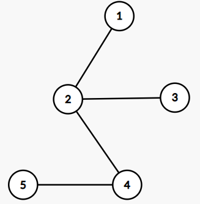
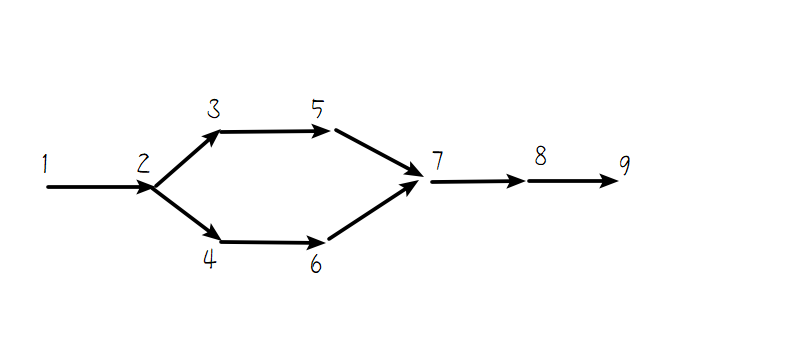
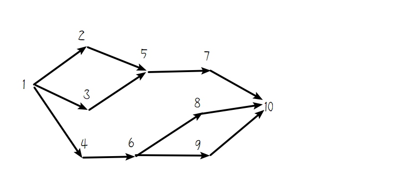
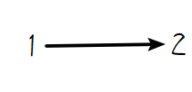
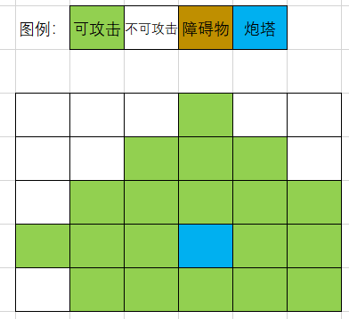
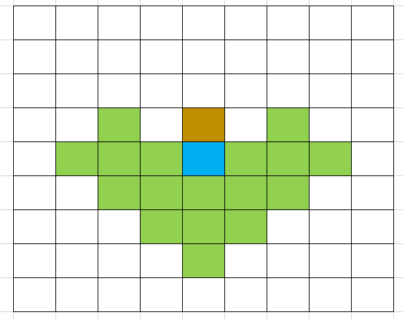
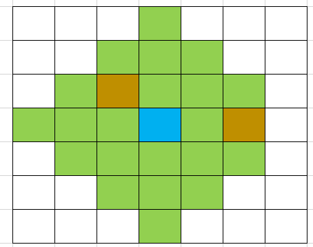

<div style="font-weight:900;font-size:26px" align="center">2023 华南师范大学算法与程序设计竞赛 正式赛</div>

| 序号 | 题目                 | 时间限制(秒) | 空间限制(MB) |
| ---- | -------------------- | ------------ | ------------ |
| A    | 上白泽慧音的二路归桥 | 1            | 256          |
| B    | 人里孩童的疑惑-easy  | 3            | 256          |
| C    | 人里孩童的疑惑-hard  | 2            | 1024         |
| D    | 修缮博丽神社         | 2            | 256          |
| E    | 幽幽子的大进货       | 1            | 256          |
| F    | 收费站               | 1            | 256          |
| G    | 人里的飞行轨迹       | 1            | 256          |
| H    | 河童重工的防空系统   | 1            | 256          |
| I    | 琪露诺的完美数学课堂 | 1            | 256          |
| J    | 冬之四月             | 1            | 256          |
| K    | 幸运数字大比拼       | 1            | 256          |

<div STYLE="page-break-after: always;"></div>

# A.上白泽慧音的二路归桥

> 与出题人一同穿越而来的还有林家龙的小林托尔与小林白渃。
>
> 上白泽慧音因为吃了三倍冰淇淋开了大招，使用了転世「一条戻り橋」，把所有人都放倒了。
>
> 在闭眼前托尔使用传送门将所有人传送到了安全的地方（托尔被史诗级削弱了（悲））
>
> 为了平衡幻想乡，上白泽慧音被赶来的绝凶の灵梦退治，技能也退化成了「二条戻り橋」。


给定 $n$ 个关键节点，编号从 $1$ 到 $n$。每条桥连接两个节点，上白泽慧音的 $n-1$ 条桥现在只能连成一棵树。并且路径只能经过不重的点。例如对从 $u_1$ 到 $u_k$ 的路径 $u_1- u_2- u_3-\cdots- u_k$，必须保证 $u_1,u_2,\cdots,u_k$ 不重。并且认为从 $u_1$ 到 $u_k$ 的路径与从 $u_k$ 到 $u_1$ 的路径是同一条路径。在上例，这条路径经过了 $u_1,u_2,\cdots,u_k$ 共 $k$ 个点。路径必须经过至少两个点。

对于每个点，请你求出共有多少条不同的路径经过了该点，答案对质数 $998244353$ 取模。

## 输入格式

输入一行一个整数 $n(1\le n\le 2\times 10^5)$，代表节点数。

接下来输入 $n-1$ 行，每行两个整数 $u,v(1\le u,v\le n,u\neq v)$，代表一条桥。

保证输入形成一棵树。

## 输出格式

输出一行 $n$ 个整数，若编号为 $i$ 的节点有 $s_i$ 条不同的路径经过了该点，第 $i$ 个整数输出 $s_i\bmod 998244353$

## 输入样例

```c++
5
1 2
2 3
2 4
4 5
```

```c++
2
1 2
```

```c++
1
```

## 输出样例

```c++
4 9 4 7 4
```

```c++
1 1
```

```c++
0
```

## 样例解释

对样例一，如图所示：



过节点 $1$ 的所有路径为：$1-2,1-2-3,1-2-4,1-2-4-5$，共 $4$ 条。

过节点 $2$ 的所有路径为：$1-2,1-2-3,1-2-4,1-2-4-5,$ $2-3,2-4,2-4-5,3-2-4,3-2-4-5$，共 $9$ 条。

<div STYLE="page-break-after: always;"></div>

# B.人里孩童的疑惑-easy

> 当出题人醒来的时候，发现自己在人里的一户人家里，家里有一个看起来像是13岁的孩童，自称是芙兰什么路来着。
>
> 她给了你一个字符串，想知道这个字符串的前后缀的性质，由于出题人刚醒，于是就请你帮帮出题人写一个程序计算罢。 ~~（来自托尔与白渃的鼓励）~~


给定 $n$ 个小写字母字符串，第 $i$ 个字符串为 $s_i$。

定义一个字符串长为 $k$ 的前缀是它的前 $k$ 个字符组成的子串，长为 $k$ 的后缀是它的后 $k$ 个字符组成的子串，例如对字符串 kobayashibairuo，长为 3 的前缀为 kob，长为 5 的后缀为 airuo。

有 $q$  个询问，每个查询给出两个整数 $x, y$，你需要求出对所有 $n$ 个字符串 $s_i(1\le i\le n)$ 的全体非空后缀里，有多少个后缀与 $s_x$ 的长为 $y$ 的前缀相等。

## 输入格式

输入一行整数 $n(1 \le n \le 10^5)$，代表字符串数量。

接下来输入 $n$ 行，第 $i$ 行输入字符串 $s_i(1\le |s_i|\le 2\times 10^5)$。

接下来输入一行一个整数 $q(1 \le q \le 10^6)$。

接下来输入 $q$ 行，第 $i$ 行包括两个整数 $x, y(1\le x\le n,1\le y\le |s_x|)$。 

保证所有字符串长度之和不超过 $2\times 10^5$，且所有字符串仅有小写字母组成。

## 输出格式

为了防止输出过多，请输出一行一个整数，代表每个询问的答案之和。

## 输入样例

```c
3
asdfgh
qwerasd
zxczxcas
1
1 3
```

```c++
4
icpc
ccpc
scnucpc
cpc
3
2 1
4 2
4 3
```

## 输出样例

```c
1
```

```c++
8
```

## 样例解释

对第一个样例，与 $s_1$ 长为 $3$ 的前缀相等的只有 $s_2$ 长为 $3$ 的后缀。

对第二个样例，对第一个询问 c，所有 $4$ 个长为 $1$ 的后缀都匹配；对第二个询问 cp，没有任何一个后缀匹配。对第三个询问 cpc，所有 $4$ 个长为 $3$ 的后缀都匹配；答案为 $4+0+4=8$。

<div STYLE="page-break-after: always;"></div>

# C.人里孩童的疑惑-hard

> 孩童听了你的解答，恍然大悟。但她想要举一反三，于是又给了你一道类似的题目要求你求解。如果你解不出来，她将会非常生气，谁也不知道会有什么下场……


给定 $n$ 个小写字母字符串，第 $i$ 个字符串为 $s_i$。

定义一个字符串长为 $k$ 的前缀是它的前 $k$ 个字符组成的子串，长为 $k$ 的后缀是它的后 $k$ 个字符组成的子串，例如对字符串 kobayashibairuo，长为 3 的前缀为 kob，长为 5 的后缀为 airuo，长为 5 的前缀的长为 3 的后缀为 bay。

有 $q$  个询问，每个查询给出三个整数 $x, y,z$，你需要求出对所有 $n$ 个字符串 $s_i(1\le i\le n)$ 的全体**长度至少为 $z$ 的**非空**前**缀里，有多少个**前缀的**后缀与 $s_x$ 的长为 $y$ 的前缀相等。

## 输入格式

输入一行整数 $n(1 \le n \le 5\times 10^4)$，代表字符串数量。

接下来输入 $n$ 行，第 $i$ 行输入字符串 $s_i(1\le |s_i|\le 10^5)$。

接下来输入一行一个整数 $q(1 \le q \le 2\times 10^5)$。

接下来输入 $q$ 行，第 $i$ 行包括两个整数 $x, y(1\le x\le n,1\le y\le |s_x|,1\le z\le 10^5)$。 

保证所有字符串长度之和不超过 $2\times 10^5$，且所有字符串仅有小写字母组成。

## 输出格式

输出 $q$ 行，每行一个整数，代表询问的答案。

## 输入样例

```c
3
asdfgh
qwerasd
zxczxcas
1
1 2 3
```

```c++
3
aaaaa
aaaa
aaa
1
1 1 1
```

## 输出样例

```c
2
```

```c++
12
```

## 样例解释

对第一个样例，与 $s_1$ 长为 $2$ 的前缀相等的只有 $s_3$ 长为 $8$ 的前缀的长为 $2$ 的后缀，与 $s_2$ 长为 $6$ 的前缀的长为 $2$ 的后缀。

对第二个样例，所有前缀的长为 $1$ 的后缀都与其相等，故 $3+4+5=12$。

<div STYLE="page-break-after: always;"></div>

# D.修缮博丽神社


由于博丽神社众(kong)人(wu)来(yi)朝(ren)，所以已经多年未修缮，灵梦可逮着你们使劲薅。具体而言，神社有 $n$ 个坑，第 $i$ 个坑的面积是 $a_i\ cm^2$。

众人表示来都来了，不差这点时间，托尔表示修补对她小菜一碟，但是这里无法使用生成物品的魔法。于是负责帮灵梦填补掉这些坑。

白渃听到后，决定给托尔提供 $m$ 个正方形瓷砖，第 $i$ 个瓷砖边长为 $b_i\ cm$，以便她去填补这些坑。

因为幻想乡的物价和淘宝一样，S, M, L, XL, XXL 都一个价，所以不管瓷砖尺寸多大，每块瓷砖都售价为 $p$ 元。

当一个坑的所有面积都覆盖了瓷砖时，该坑被填补完成。托尔可以将每块瓷砖切割成任意多块任意形状的瓷砖，切割不损失面积。

因为出题人在缴纳奉纳后没钱了，于是就负责计算能否填完全部的坑，如果能，还想知道最少花费多少钱。

## 输入格式

输入一行三个整数 $n,m,p(1\le n,m,p\le 10^6)$。

接下来输入一行 $n$ 个整数，第 $i$ 个整数为 $a_i(1\le a_i\le 10^9)$。

接下来输入一行 $m$ 个整数，第 $i$ 个整数为 $b_i(1\le b_i\le 10^9)$。

## 输出格式

输出一行一个整数。若能填完全部的坑，输出最少花费的金额。若不能填完全部的坑，输出 `-1`。

## 输入样例

```c++
1 1 600
2
2
```

## 输出样例

```c++
600
```

<div STYLE="page-break-after: always;"></div>

# E.幽幽子的大进货

> 当你们一行人终于修好神社准备走时，幽幽子正好过来和灵梦商谈进货事宜。
>
> 由于幽幽子食量极大，每天都会云游很多地方去吃东西，于是在幻想乡各地都有VIP Credit（富婆）
>
> 正好你们一行人被灵梦薅光了，幽幽子想让你们计算一下进货的最优路线来节省成本
> ~~节省下来的钱给穿越三人发工资.jpg~~


幻想乡有 $n$ 个地区，编号分别为 $1\cdots n$，当且仅当 $j$ 能整除 $i$ 时，地区 $i$ 有通往地区 $j$ 的单向的路。例如 $2$ 有通向 $4$ 的路，$4$ 没有通向 $2$ 的路，$3,5$ 之间都没有通向对方的路。

地区 $i$ 拥有幽幽子储备粮 $k_i$ 箱，每箱储备粮的价值为 $a_i$。地区 $i$ 有资金 $b_i$ 元，若地区 $j$ 可通向地区 $i$，则地区 $j$ 可以调配物资给地区 $i$(注意不能自己调配给自己)，若调配 $m$ 箱，则 $i$ 地区需要支付运费 $m^2$ 元。

现幽幽子会选定一个地区 $x$ 去炫饭。若被选中，则地区 $x$ 需要则该地区能够调用自己的所有 $b_x$ 元资金，调配来总价值尽可能大的物资。

你需要算出，每个地区在不考虑自己原有的物资的总价值情况下，能够调配到最大的物资总价值，并输出这个最大值。

## 输入格式

输入一行整数 ，代表地区数量 $n(1\le n\le 300)$。

接下来输入一行 $n$ 个整数，第 $i$ 个整数为 $a_i(1\le a_i\le 10^9)$。

接下来输入一行 $n$ 个整数，第 $i$ 个整数为 $k_i(1\le k_i\le 300)$。

接下来输入一行 $n$ 个整数，第 $i$ 个整数为 $b_i(1\le b_i\le 300)$。

## 输出格式

输出一行一个整数，代表可调配的最大的物资总价值。

## 输入样例

```c++
5
1 2 3 4 5
1 1 1 1 1
100 100 100 100 100
```

```c++
4
10 15 1 1
1 2 1 1
1 1 1 4
```

```c++
4
10 15 1 1
1 2 1 1
1 1 1 2
```

## 输出样例

```
3
```

```
30
```

```
25
```

## 样例解释

对样例一，选择地区 $4$，可以购买地区 $1,2$ 的物资各一箱，运费为 $1^2+1^2=2$，总价值为 $1+2=3$。

对样例二，选择地区 $4$，可以购买地区 $2$ 的物资两箱，运费为 $2^2=4$，总价值为 $2\times 15=30$。

对样例三，选择地区 $4$，可以购买地区 $1,2$ 的物资各一箱，运费为 $1^2+1^2=2$，总价值为 $10+15=25$。

<div STYLE="page-break-after: always;"></div>

# F.收费站

> 你们计算完后发现，幻想乡的基建甚至有高速公路，但是收费贵贵(Powered by 灵梦)。然而，高速公路尚未设立收费站，只有设立收费站后才能通行并调配食材。管理员幽幽子想把这个重要的任务交给你，如果耽误了幽幽子炫饭就会被幽幽子做成麻薯吃掉 ~~（穿越三人集体波奇酱附体）~~。


有 $n$ 个地区，编号从 $1$ 开始。有 $m$ 条单向通行的道路。道路 $u\to v$ 表示只能从地区 $u$ 通向地区 $v$。定义从地区 $x$ 通往地区 $y$ 的路径是若干条不重道路的有序序列，满足首条道路起点为 $x$，最后一条道路终点为 $y$，其他道路的起点都是上一条道路的终点。例如若存在道路 $1\to3,3\to2,2\to4$ 则 $1\to 3\to2\to4$ 是地区 $1$ 到地区 $4$ 的一条路径。

现在一些道路上设置了收费站，使得对每条从地区 $1$ 通往地区 $n$ 的路径，路径上都存在且仅存在一条道路设置了收费站。且希望设置尽可能少的收费站达成上述目标。问至少需要设置多少个收费站，分别设置在哪些道路上。

## 输入格式

输入一行两个整数 $n,m(2\le n\le10^5,1\le m\le10^5)$。

接下来输入 $m$ 行，每行两个整数 $u,v(1\le u,v\le n,u\neq v)$ 代表一条道路 $u\to v$。保证没有重边，不会成环，且存在至少一条从地区 $1$ 通往地区 $n$ 的路径，且保证对所有 $1 < x < n$，地区 $x$ 至少有一条路径为 $u\to x$ 和一条路径 $x\to v$。

## 输出格式

输出一行一个整数，代表最小收费站个数 $k$。

接下来输入 $k$ 行，每行两个整数 $u,v(1\le u,v\le n)$，代表在道路 $u\to v$ 设置收费站。你可以用任意顺序输出道路。

如果有多个设置收费站的方案，你只需要输出任意一个即可。

## 输入样例

```c++
9 9
1 2
2 3
2 4
3 5
4 6
5 7
6 7
7 8
8 9
```

```c++
10 12
1 2
1 3
1 4
2 5
3 5
4 6
5 7
6 8
6 9
7 10
8 10
9 10
```

```c++
2 1
1 2
```

## 输出样例

```c++
1
1 2
```

```c++
2
5 7
1 4
```

```c++
1
1 2
```

## 样例解释

对样例一，道路如图所示：



仅有两条 $1$ 到 $9$ 的路径即 $1\to2\to3\to5\to7\to8\to9,1\to2\to4\to6\to7\to8\to9$。因此，在 $1\to 2,7\to 8,8\to 9$ 三道路的其中一条设置收费站，均能满足目的。


对样例二，道路如图所示：



有四条 $1$ 到 $10$ 的道路。要设置最少的收费站，其中一个必须在 $5\to7,7\to 10$ 里选择，另一个在 $1\to4,4\to 6$ 里选择，共四种可行设置方案。


对样例三，道路如图所示：



唯一方案是在 $1\to 2$ 这条唯一道路设置收费站。

<div STYLE="page-break-after: always;"></div>

# G.人里的飞行轨迹

> 你们在下山后回到人里休息，出题人因为波奇酱附体直接呼呼大睡，于是白渃和托尔准备去天上飞一会从天上向下看人里的天地，托尔和白渃决定玩个游戏，在天上用飞行轨迹画画（人里的人:已经无所谓了）


把人里的天空划为 $n$ 行 $m$ 列，记第 $i$ 行第 $j$ 列的状态为 $c_{i,j}$。为方便起见，设有云为 $1$，没云为 $0$。由于游戏刚开始，所有格子都是没云的，即初始时：
$$
\forall 1\le i\le n,1\le j\le m,c_{i,j}=0
$$
白渃负责在天空中制造轨迹，托尔负责消除这些轨迹。他们总是沿着一行或一列进行飞行。具体而言，有四种行为：

1. 托尔在第 $x$ 行飞行，使得 $\forall 1\le j\le m, c_{x,j}=0$。
2. 白渃在第 $x$ 行飞行，使得 $\forall 1\le j\le m, c_{x,j}=1$。
3. 托尔在第 $x$ 列飞行，使得 $\forall 1\le i\le n, c_{i,x}=0$。
4. 白渃在第 $x$ 列飞行，使得 $\forall 1\le i\le n, c_{i,x}=1$。

注意每次飞行形成的新轨迹会覆盖之前的飞行形成的旧轨迹。

他们通过飞行轨迹进行作画，并想知道是否能通过若干次飞行作成特定的 $n$ 行 $m$ 列画作 $a$，如果能，还想知道如何飞行能得到这样的画作。

## 输入格式

输入一行两个整数 $n,m(1\le n,m\le 100)$，代表方格的行列数。

接下来输入 $n$ 行，每行 $m$ 个整数，第 $i$ 个整数代表 $a_{i,j}(0\le a_{i,j}\le 1)$。

## 输出格式

如果对初始全 $0$ 的 $c$，经由不超过 $nm\max(n,m)$ 次飞行可以得到 $a$，则第一行输出 `I can fly!`，否则，输出 `Sorry, I can't do that.`。

如果能得到 $c$，接下来输入一行一个整数 $t(0\le t\le nm\max(n,m))$，代表飞行总次数。并且接下来输出 $t$ 行，第 $i$ 行两个整数 $w_i,x_i(1\le w_i\le 4)$，代表第 $i$ 次飞行的行为类型，及飞行所在行/列。若 $w\le 2$，则 $1\le x_i\le n$；否则，$1\le x_i\le m$。

如果有多种飞行方案能得到 $a$，则输出任意一个方案即可。

## 输入样例

```c++
2 3
0 0 0
0 1 1
```

```c++
3 3
0 0 0
1 0 0
1 1 0
```

```c++
4 4
1 0 1 0
0 1 0 1
1 0 1 0
0 1 0 1
```

```c++
3 2
0 0
0 0
0 0
```

## 输出样例

```c++
I can fly!
2
2 2
3 1
```

```c++
I can fly!
5
4 2
1 1
2 1
4 1
1 1
```

```c+
Sorry, I can't do that.
```

```c++
I can fly!
0
```

## 样例解释

对样例一，一种可行的方案为：(箭头表示 $\xrightarrow{(w,x)}$)
$$
\pmatrix{0&0&0\\0&0&0}
\xrightarrow{(2,2)}
\pmatrix{0&0&0\\1&1&1}
\xrightarrow{(3,1)}
\pmatrix{0&0&0\\0&1&1}
$$
对样例二，一种可行的方案为：
$$
\pmatrix{0&0&0\\0&0&0\\0&0&0}
\xrightarrow{(4,2)}
\pmatrix{0&1&0\\0&1&0\\0&1&0}
\xrightarrow{(1,1)}
\pmatrix{0&0&0\\0&1&0\\0&1&0}
\xrightarrow{(2,1)}
\pmatrix{0&0&0\\0&0&0\\0&1&0}
\xrightarrow{(4,1)}
\pmatrix{1&0&0\\1&0&0\\1&1&0}
\xrightarrow{(1,1)}
\pmatrix{0&0&0\\1&0&0\\1&1&0}
$$
对样例三，可以证明，穷尽所有的飞行方案，都找不到一种方案能构造出 $a$。

对样例四，初始就有 $c=a$，故无需飞行即可得到。

<div STYLE="page-break-after: always;"></div>

# H.河童重工的防空系统

> 从灵梦口中得知（买到的情报）幻想乡有防空系统（Powered by 河童重工），于是白渃和托尔需要小心地飞行。
>
> 为了避免触发防空警报，他们需要计算防空炮的射程来进行规避。


有由 $m$ 列 $n$ 行的方格组成的防区，记第 $i$ **列**第 $j$ **行**的方格坐标是 $(i,j)$​，行从下往上，列从左往右。方格的内容 $a_{i,j}$ 可能如下：

1. $a_{i,j}=1$，代表空地。
2. $a_{i,j}=2$，代表障碍物。
3. $a_{i,j}=3$，代表炮塔。炮塔有且仅有一个。

定义两点 $(x_1,y_1),(x_2,y_2)$ 的曼哈顿距离是 $|x_1-x_2|+|y_1-y_2|$。炮塔的能够攻击的方格(射程)为所有与自己所在位置的曼哈顿距离小于等于 $3$ 的方格。自身所在方格和超出 $m$ 列 $n$ 行的坐标不在射程内。特别地，设炮塔所在方格 $(x,y)$，若在射程内有障碍物，则炮塔的攻击会受到遮挡。具体而言：

- 位于 $(x,y+1)$ 的障碍物会阻挡 $(x-1,y+1),(x,y+1),(x+1,y+1),(x-1,y+2),(x,y+2),(x+1,y+2),(x,y+3)$ 七格。
- 位于 $(x,y-1)$ 的障碍物会阻挡 $(x-1,y-1),(x,y-1),(x+1,y-1),(x-1,y-2),(x,y-2),(x+1,y-2),(x,y-3)$ 七格。
- 位于 $(x+1,y)$ 的障碍物会阻挡 $(x+1,y-1),(x+1,y),(x+1,y+1),(x+2,y-1),(x+2,y),(x+2,y+1),(x+3,y)$ 七格。
- 位于 $(x-1,y)$ 的障碍物会阻挡 $(x-1,y-1),(x-1,y),(x-1,y+1),(x-2,y-1),(x-2,y),(x-2,y+1),(x-3,y)$ 七格。
- 位于 $(x,y+2)$ 的障碍物会阻挡 $(x,y+2),(x,y+3)$ 两格。
- 位于 $(x,y-2)$ 的障碍物会阻挡 $(x,y-2),(x,y-3)$ 两格。
- 位于 $(x+2,y)$ 的障碍物会阻挡 $(x+2,y),(x+3,y)$ 两格。
- 位于 $(x-2,y)$ 的障碍物会阻挡 $(x-2,y),(x-3,y)$ 两格。
- 其他位于射程之内的障碍物只会阻挡障碍物所在本格。

给定方格的内容，请你求出炮塔的可攻击方格有多少格。

## 输入格式

输入一行两个整数 $n,m(1\le m,n\le 20)$。

接下来输入 $n$ 行，每行 $m$ 个整数，第 $j$ 行第 $i$ 个整数代表 $a_{i,j}(1\le a_{i,j}\le 3)$。保证有且仅有一个坐标满足 $a_{i,j}=3$。

## 输出格式

输出一行一个整数，代表可攻击方格数。

## 输入样例

```c++
5 6
1 1 1 1 1 1
1 1 1 1 1 1
1 1 1 1 1 1
1 1 1 3 1 1
1 1 1 1 1 1
```

```c++
9 9
1 1 1 1 1 1 1 1 1
1 1 1 1 1 1 1 1 1
1 1 1 1 1 1 1 1 1
1 1 1 1 2 1 1 1 1
1 1 1 1 3 1 1 1 1
1 1 1 1 1 1 1 1 1
1 1 1 1 1 1 1 1 1
1 1 1 1 1 1 1 1 1
1 1 1 1 1 1 1 1 1
```

```c++
7 7
1 1 1 1 1 1 1
1 1 1 1 1 1 1
1 1 2 1 1 1 1
1 1 1 3 1 2 1
1 1 1 1 1 1 1
1 1 1 1 1 1 1
1 1 1 1 1 1 1
```

## 输出样例

```c++
19
```

```c++
17
```

```c++
21
```

## 样例解释

对样例一，如图所示：



对样例二，如图所示：



对样例三，如图所示：



<div STYLE="page-break-after: always;"></div>

# I.琪露诺的完美数学课堂

> 在托尔与白渃在天上互发弹幕时，一只⑨找到了刚刚醒的出题人，⑨为了在出题人面前显摆一下自己的IQ，于是就给出题人除了一道⑨认为堪比证明哥德巴赫猜想的题目：A ÷ B 问题。
>
> (⑨：我超勇的)


对整数 $a,b$，求最小正整数 $x$，满足 $\lfloor\dfrac ax\rfloor\le b$。其中 $\lfloor v\rfloor$ 代表对 $v$ 下取整。

## 输入格式

输入一行一个整数 $t(1\le t\le 10^4)$，代表询问的个数。

接下来输入 $t$ 行，每行两个整数 $a,b(1\le a\le 10^9,0\le b\le 10^9)$。

## 输出格式

输出 $t$ 行，每输出一个整数，依次代表询问的答案。

## 输入样例

```c++
5
5 1
100 50
252 200
3 3
10 0
```

## 输出样例

```c++
3
2
2
1
11
```

<div STYLE="page-break-after: always;"></div>

# J.冬之四月

> 琪露诺发现自己想了半天的问题被你一瞬间解决了，顿感自己是个 baka。恼羞成怒的琪露诺发动了异变，让幻想乡变成了冰天雪地。这时从人里出现了一支队伍，愿意前往协助白渃等人退治琪露诺。


在幻想乡有路标为区间 $[a_0,b_0]$ 内整数的若干地点成一条直线排列。琪露诺放置了 $n$ 对冰晶，第 $i$ 对冰晶坐落在两个地点 $a_i,b_i$。一个地点可含零到任意多个冰晶。白渃可以选择 $[a_0,b_0]$ 内的子区间 $[a,b]$，并对区间内所有地点发起攻击。如果发动攻击的区间 $[a,b]$ 内同时包含任意一对冰晶 $a_i,b_i$，那么此次攻击会被琪露诺抵挡。换句话说，若 $\exists 1\le i\le n$ 使得 $a\le a_i\le b$ 且 $a\le b_i\le b$，则攻击无效。否则，攻击有效，总攻击力为该区间包含的地点数。请你求出可造成的最大不被抵挡的总攻击力。

## 输入格式

输入一行两个整数 $a_0,b_0(0\le a_0\le b_0\le 10^9)$。

接下来输入一行一个整数 $n(1\le n\le 10^5)$。

接下来输入 $n$ 行，第 $i$ 行两个整数 $a_i,b_i(a_0\le a_i\le b_i\le b_0)$。

## 输出格式

输出一行一个整数，代表你的答案。

## 输入样例

```c++
1 10
1
3 6
```

```c++
1 10
2
3 6
2 7
```

```c++
1 1
1
1 1
```

## 输出样例

```c++
7
```

```c++
7
```

```c++
0
```

## 样例解释

对 $[1,10]$ 的子区间，不同时包含 $3,6$ 的最长区间是 $[4,10]$。

不完全包含 $3,6$ 或 $2,7$ 的最长区间也是 $[4,10]$。

对样例三，无解，即得空区间，故输出 $0$。

<div STYLE="page-break-after: always;"></div>

# K.幸运数字大比拼

> 退治琪露诺的队伍由三小只组成，他们分别是：
>
> - 小熊。爱穿玩偶装的病娇腹黑的萝莉队长。
> - pwp。娇小可人的激萌兽耳正太人妻厨神。
> - 阿七。有如绪山真寻般好吃懒做的小咸鱼。
>
> 琪露诺逃进了新开的兽王园，从一面变成 EX 面，三人在那和琪露诺展开决战，双方决定拿出各自的幸运数字进行决战。琪露诺的幸运数字是 9，而出题人的幸运数字是1，是1吗？还有4，还有5，所以出题人的幸运数字是1、4、5。双方决定一起使用幸运数字来进行对决。三人组将从这里开始谱写自己的新篇章。


> PS: 图中的其他人可能是出题人和小林白诺罢(

有 $3$ 个雪堆， 分别高 $x,y,z$ 厘米。 

比赛双方轮流选择一个行动：将雪堆铲低 $1,4,5$ 或 $9$ 厘米。选择铲低的厘米数必须小于等于选择雪堆的高度，如该雪堆高 $4$ 厘米的话，就只能选择铲低 $1$ 厘米或 $4$ 厘米。

当一方行动后， $3$ 个雪堆都被铲平了，该方胜利。 

琪露诺是先手，双方均采取最优策略，请判断琪露诺是否必胜。~~如果不是必胜的话就以雪堆质量不好的名义重新找3个雪堆吧。~~

## 输入格式

输入一行三个整数 $x,y,z(1\le x,y,z\le 1000)$。

## 输出格式

输出一行一个整数，若琪露诺必胜，输出 $1$，否则输出 $0$。

## 输入样例

```c++
2 4 9
```

## 输出样例

```c++
1
```

## 样例解释

琪露诺必胜，故输出 1。一种必胜过程为：琪露诺对第二个雪堆削 1 厘米，退治队对第三个雪堆削 9 厘米，之后无论怎么操作都是琪露诺最后行动使得所有雪堆高度为 0。