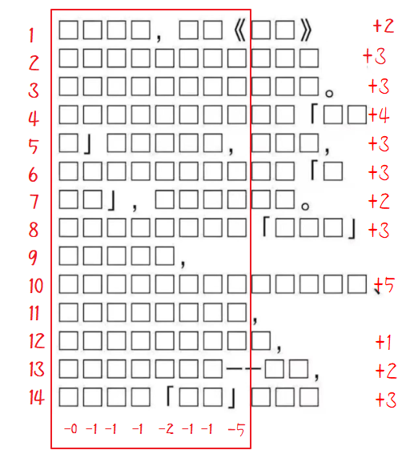
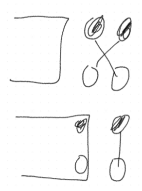

# SCNUCPC2023网络赛-题解

> 以下所有题解仅提供一种或多种正确解法。并不必然代表下面提供的解法是最优解，且并不必然代表其他的解法不可行。因此，如果有别的思路，也欢迎各位大佬分享你的解法。若题解有误，欢迎指正~ ｡ﾟ･ (⁄ ⁄>⁄ ︿ ⁄<⁄ ⁄) ･ﾟ｡ 

## 幻想乡里没有网络

可以直接手算：



```python
print(14*8-(1+1+1+2+1+1+5)+2+3+3+4+3+3+2+3+5+1+2+3) #134
```

也可以下载样例，然后亲自动手把标点符号删了，然后写代码统计：

```python
print(len('你说得对但是原神是由米哈游自主研发的一款全新开放世界冒险游戏游戏发生在一个被称作提瓦特的幻想世界在这里被神选中的人将被授予神之眼导引元素之力你将扮演一位名为旅行者的神秘角色在自由的旅行中邂逅性格各异能力独特的同伴们和他们一起击败强敌找回失散的亲人同时逐步发掘原神的真相')) #134
```

> ```python
> s = '你说得对，但是《原神》是由米哈游自主研发的一款全新开放世界冒险游戏。游戏发生在一个被称作“提瓦特”的幻想世界，在这里，被神选中的人将被授予“神之眼”，导引元素之力。你将扮演一位名为“旅行者”的神秘角色，在自由的旅行中邂逅性格各异、能力独特的同伴们，和他们一起击败强敌，找回失散的亲人——同时，逐步发掘“原神”的真相。'
> print(len(s)-s.count('，')-s.count('《')-s.count('》')-s.count('。')-s.count('“')-s.count('”')-s.count('—')-s.count('、')) #134
> ```

## 给灵梦修宽带(打黑工)

不妨先将黑点白点分别存储并排序。当排序后，每个白点与更近的黑点相连一定更优，黑点同理。

设 $dp_{i,j}$ 表示只考虑前 $i$ 个白点和前 $j$ 个黑点时的最小代价。则若没有点，不需要连，即 $dp_{0,0}=0$。其他情况初始设 $\infty$。

对第 $i$ 个点，初始设为无穷大即 $dp_{i,0}=\infty$，接下来，枚举所有第 $j$ 个黑点 ，让 $i$ 点分别尝试与它们相连。设第 $i$ 个白点坐标是 $w_i$，第 $j$ 个黑点坐标是 $b_j$，转移方程为：
$$
dp_{i,j}=|w_i-b_j|+\min(dp_{i-1,j-1},dp_{i,j-1},dp_{i-1,j})
$$
解释：若只有 $i$ 个白点和 $j$ 个黑点，那么在排序后，最后一个白跟最后一个黑相连一定是最优的。当新增点时，上一个白点 $i-1$ 和上一个黑点 $j-1$ 都可以选择是否跟新的点相连，即：

- 若选择 $dp_{i,j-1}$，也就是说第 $j-1$ 个点本来跟第 $i$ 个点相连
- 若选择 $dp_{i-1,j}$，也就是说第 $j$ 个点本来跟第 $i-1$ 个点相连
- 若选择 $dp_{i-1,j-1}$，也就是说第 $j-1$ 个点本来跟第 $i-1$ 个点相连

在这三种情况里，选择一种总代价最小的，合并到只有 $i$ 个白点和 $j$ 个黑点上。可以证明，再往前的连接，例如 $i,j-2$ 或 $i-2,j$ 或 $i-2,j-1$ 等等，一定不会比上面三种情况更优。

①交叉相连不如下面的直连更优。即总是选择 $|w_i-b_j|$ 的正确性如下图所示，显然下者更优：




②对递推式 $\min(dp_{i-1,j-1},dp_{i,j-1},dp_{i-1,j})$ 的证明。

当选定 $w_i,b_j$ 时，如果选择其他方案，如 $w_{i-2},b_j$ 相连，那么 $w_{i-1}$ 的任何方案都会形成如上图的交叉。同理，$w_i,b_{j-2}$ 会让 $b_{j-1}$ 的任意方案形成交叉。除了递推式的三个情况外的其他的 $w_{i-x},b_{j-y}(x >1$ 或 $y > 1)$ 同理也会交叉，可以由直连代替。

因为本题的空间限制，所以需要将 DP 用滚动数组优化。

```c++
#include <bits/stdc++.h>
using namespace std;
using ll = long long;
using pii = pair<int, int>;
using db = double;
#define pb push_back
const int mod = 1e9 + 7;
const int maxn  = 5e3 + 10;
ll dp[2][maxn];
void solve()
{
    int n, i, j;
    cin >> n;
    vector <int> node[2];
    vector <int> a(n + 1);
    for (i = 1; i <= n; i++) cin >> a[i];
    for (i = 1; i <= n; i++)
    {
        cin >> j;
        node[j].pb(a[i]);
    }
    node[0].pb(-1), node[1].pb(-1);
    sort(node[0].begin(), node[0].end());
    sort(node[1].begin(), node[1].end());

    n = node[0].size() - 1;
    int m = node[1].size() - 1;

    for (i = 0; i <= m; i++) dp[0][i] = dp[1][i] = 1e18;
    dp[0][0] = 0;
    for (i = 1; i <= n; i++)
    {
        dp[i & 1][0] = 1e18;
        for (j = 1; j <= m; j++)
        {
            dp[i & 1][j] = abs(node[0][i] - node[1][j]) + min({dp[i & 1][j - 1], dp[i & 1 ^ 1][j - 1], dp[i & 1 ^ 1][j]});
        }
    }
    cout << dp[n & 1][m];
}
int main()
{
    ios::sync_with_stdio(false);
    cin.tie(0), cout.tie(0);
    solve();
}
```

## 不会有人不懂二进制吧

可以发现，如果选择的 $n$ 的某位是 $1$ 但在 $y$ 是 $0$，那么肯定 $n|y$ 该位是 $1$，该位不满足 $n|y=y$。也就是说选择的 $n$ 的每个位，若 $y$ 该位是 $0$，则 $n$ 也一定是 $0$；否则，若 $y$ 该位为 $1$，则 $n$ 该位可以选 $1$ 或 $0$。

而对 $x$，要使 $n\&x=x$，如果某位为 $1$，则 $n$ 这位一定要选 $1$，否则如果某位为 $0$，则 $n$ 这位可选 $1$ 或 $0$。

因此，若 $x$ 某位为 $1$，而 $y$ 该位为 $0$，则由上文可知 $x$ 该位选 $1$ 则 $n|y=y$ 不成立，选 $0$ 则 $n\&x=x$，则 $n$ 不是好数。否则，即：

1. $x$ 某位为 $1$，$y$ 该位为 $1$，则 $n$ 该位能且仅能选 $1$。
2. $x$ 某位为 $0$，$y$ 该位为 $0$，则 $n$ 该位能且仅能选 $0$。
3. $x$ 某位为 $0$，$y$ 该位为 $1$，则 $n$ 该位选 $0,1$ 均可。

上面完备第讨论了每一位的情况，即得出有解充要条件为所有位不满足 $x$ 为 $1$ 而 $y$ 为 $0$。可以逐位判断，也可以直接位运算，可以发现，$x|y=y$ 即为有解的充要条件。(用 $x\&y=x$ 也行)

当有解时，对上述前两种情况，都是固定的，所有情况一的 $n$ 的位数组成 $x$。所有情况二的 $n$ 的位数组成 $0$。对剩下的位数，可以逐位判断，也可以直接用 $x\oplus y$(异或)，得出所有情况三的位组成的数。对所有这些位，可以选或不选，设 $x\oplus y$ 共有 $dif$ 个 $1$，每个位都可以选与不选，则根据乘法原理有 $2^{dif}$ 个选择，对每个选择，情况一的位都是唯一的，故和为 $2^{dif}x$。对情况二的位，零乘零为零。对情况三的位，在所有的 $2^{dif}$ 种情况里，有一半该位选 $0$，有一半选 $1$，选 $1$ 的每种情况都贡献一遍，加起来即为 $(x\oplus y)2^{di-1}$ 个贡献。

复杂度 $O(T)$。注意开 long long。

```c++
#include <bits/stdc++.h>
using namespace std;
using ll = long long;
signed main()
{
    ios::sync_with_stdio(false), cin.tie(0);
    ll T, x, y;
    cin >> T;
    while (T--)
    {
        cin >> x >> y;
        if ((x | y) != y)
        {
            cout << "0\n";
            continue;
        }
        ll dif = __builtin_popcountll(x ^ y);
        ll ans = x * (1LL << dif) + (x ^ y) * (1LL << (dif - 1));
        cout << ans << '\n';
    }
    return 0;
}
```

## 上白泽慧音の二年生课堂

解法一：相似+面向样例编程。

相似比平方等于面积比，将未知 $x$ 的图形与已知 $x=4$ 的样例利用相似可知：
$$
\dfrac{x^2}{4^2}=\dfrac{S}{1.251991}\Rightarrow S=\dfrac{x^2}{4^2}\cdot 1.251991
$$

```python
x = int(input())
print(x * x / 4 / 4 * 1.251991)
```

解法二：暴力几何运算。

```python
from math import *
x = int(input())
#角ADB是atan(AB/AD)度,所以角DFO=ADB,三角形DOF内DOF=180-AOF-DFO
ang = pi - 2 * atan(0.5) #角DOF
# 扇形DOF面积-三角形DOF的面积
s1 = pi * ang / (2 * pi) * x * x - 0.5 * x * x * sin(ang)
# CDE围成的曲边阴影=长为2x的正方形减半径x的圆的1/4
s2 = 1 / 4 * (4 * x * x - pi * x * x)
s3 = x * (2 * x) * 0.5 # 三角形BCD
print(s3 - s2 - s1)
```

## 灵梦の蜜汁富婆值

直接在第一个数字的后面插入一个 $0$，那么无论原本富婆值是什么，都会变成 $0$。

还有多种解法，很多数作为插入值都是必然有解的。

```python
print(0)
```

## 琪露诺の完美黄金回旋

阅读代码可知，假算法将坐标旋转了 1 弧度，然后在新的平面里计算。故如果我们要构造新平面的点 $(x,y)$，其对应在旧平面的坐标是旋转 $-1$ 弧度的。我们可以复用假代码里的坐标旋转公式进行操作。为了让坐标都是正数，我们再加上一个偏移量。

根据假代码可知，我们对每个点，只判断往后的五个点。所以考虑构造一个最近点对，使得中间隔开了五个点，恰好无法求出正确答案。

我们充分发扬人类智慧，根据数学直觉，不妨构造最近点对 $(0.75,0),(1.25,0)$，最近距离是 $0.5$。然后构造距离这两个点大于 $0.5$ 、且间距大于 $0.5$ 的五个中间点，不妨设为 $(1,1),(1,2),(1,3),(1,4),(1,5)$。加入这些点后，除了 $(0.75,0),(1.25,0)$ 的距离是 $0.5$，其他任意两点距离都大于 $0.5$。运行假代码可知，假代码未正确计算出答案。这样速度快得飞起，在 $O(1)$ 内都可以瞬间卡过。

> 不要妄图用随机输出过本题，假算法对随机数据表现良好。

```c++
#include <bits/stdc++.h>
using namespace std;
using ll = long long;
using db = double;
vector<pair<db, db>> v;
signed main()
{
    db z = sin(-1), w = cos(-1);
    auto rot = [&](db x, db y)
    {
        db x_ = x * w - y * z;
        db y_ = x * z + y * w;
        return make_pair(x_ + 100, y_ + 100);
    };
    v.push_back(rot(0.75, 0));
    v.push_back(rot(1.25, 0));
    v.push_back(rot(1, 1));
    v.push_back(rot(1, 2));
    v.push_back(rot(1, 3));
    v.push_back(rot(1, 4));
    v.push_back(rot(1, 5));
    printf("%d\n", v.size());
    for (auto pr : v)
    {
        printf("%lf %lf\n", pr.first, pr.second);
    }
    return 0;
}
```

## 这就是我的逃跑路线哒

将 $a$ 排序，去重得 $b$。枚举 $b$ 的每个元素 $v$，考虑枚举每个 $v$ 作 $a_j$，那么所有值域在 $[1,v]$ 的 $a_i$ 会变成 $v$，所有值域在 $[v+1,2v]$ 的 $a_i$ 会变成 $2v$，$\cdots$，所有值域在 $[kv+1,(k+1)v]$ 的 $a_i$ 会变成 $kv$。考虑枚举每个 $k$，则对 $v$，最大值是 $\max a_i=10^5=O(n)$，故枚举的复杂度是 $O(\dfrac nv)$。

最坏情况下，$v$ 互不相同，则取遍所有 $v\in [1,n]$，总枚举复杂度为 $O(\sum_{v=1}^n\dfrac nv)=O(n\sum_{v=1}^n\dfrac 1v)$。根据调和级数，有 $\sum_{i=1}^n\dfrac1i=O(\log n)$，故枚举总复杂度为 $O(n\log n)$。

对每个 $v$ 的共 $O(\dfrac nv)$ 次枚举 $k$，每个 $k$，可以二分在排序后的 $a$ 找到边界的 $kv+1,(k+1)v$ 所在的下标，二分复杂度为 $O(\log n)$。故总复杂度为 $O(n\log^2n)$。

也可以用前缀和继续优化，设 $cnt_v$ 表示有多少个 $a_i=v$，然后对 $cnt$ 求前缀和。每次查询即求 $cnt_{(k+1)v}-cnt_{kv}$。复杂度 $O(n\log n)$。

二分搜索参考代码：

```c++
#include <bits/stdc++.h>
using namespace std;
using ll = long long;
const ll mn = 1e5 + 10;
ll n, a[mn];
set<ll> b;
signed main()
{
    ios::sync_with_stdio(false), cin.tie(0);
    cin >> n;
    for (ll i = 0; i < n; ++i)
    {
        cin >> a[i];
        b.insert(a[i]);
    }
    sort(a, a + n);
    ll ans = a[n - 1] * n;
    for (auto v : b)
    {
        ll sum = 0;
        for (ll i = v; i <= a[n - 1] + v; i += v)
        {
            //[i-v,i)的左右边界是l,r-1,该范围全变成i
            ll l = upper_bound(a, a + n, i - v) - a;
            ll r = upper_bound(a, a + n, i) - a;
            sum += i * (r - l);
        }
        ans = min(ans, sum);
    }
    cout << ans;
    return 0;
}
```

前缀和参考代码：

```c++
#include <bits/stdc++.h>
using namespace std;
using ll = long long;
const ll mn = 2e5 + 10;
ll n, a[mn], cnt[mn];
set<ll> b;
signed main()
{
    ios::sync_with_stdio(false), cin.tie(0);
    cin >> n;
    for (ll i = 0; i < n; ++i)
    {
        cin >> a[i];
        cnt[a[i]]++;
        b.insert(a[i]);
    }
    for (ll i = 1; i < mn; ++i)
    {
        cnt[i] += cnt[i - 1];
    }
    sort(a, a + n);
    ll ans = a[n - 1] * n;
    for (auto v : b)
    {
        ll sum = 0;
        for (ll i = v; i <= a[n - 1] + v; i += v)
        {
            sum += i * (cnt[i] - cnt[i - v]);
        }
        ans = min(ans, sum);
    }
    cout << ans;
    return 0;
}
```

