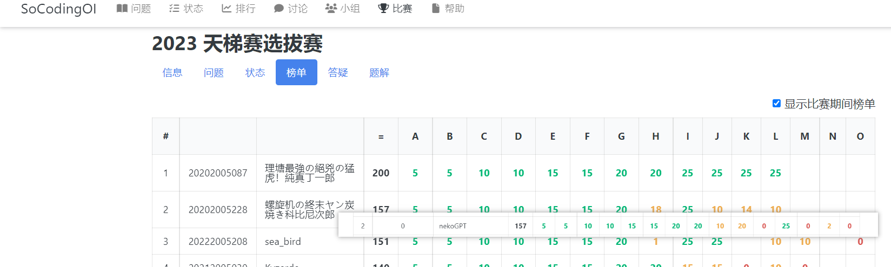
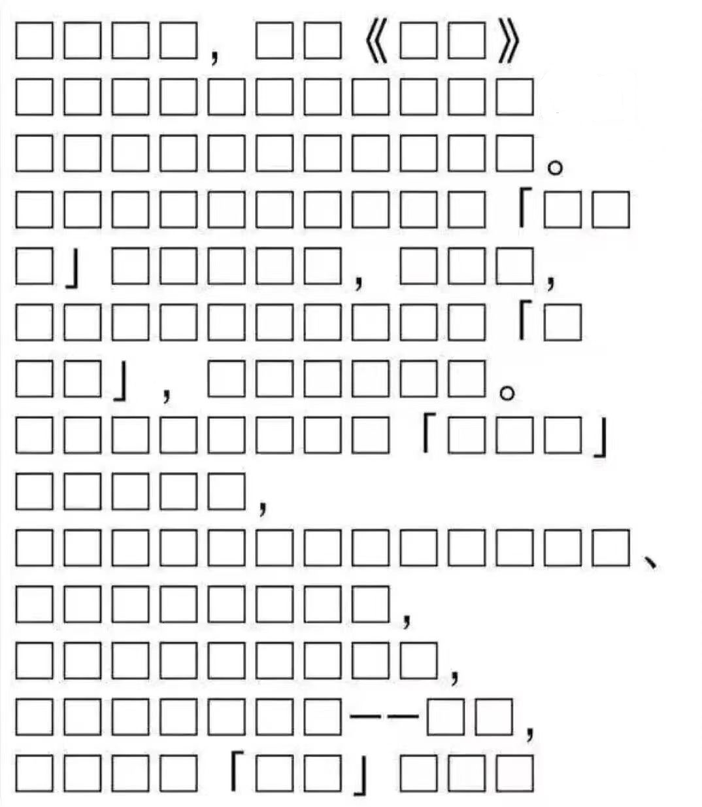
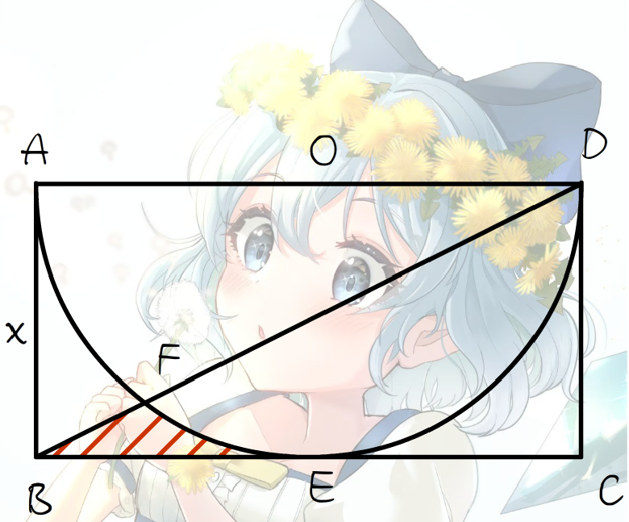
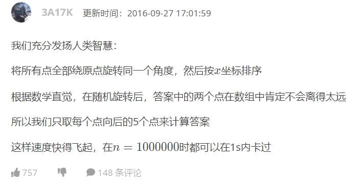

<div style="font-weight:900;font-size:26px" align="center">2023 华南师范大学算法与程序设计竞赛 网络赛</div>

- A.幻想乡里没有网络 

  时间限制 1秒  空间限制 256MB

- B.给灵梦修宽带(打黑工) 

  时间限制 1秒  空间限制 32MB

- C.不会有人不懂二进制吧

  时间限制 1秒  空间限制 256MB

- D.上白泽慧音の二年生课堂

  时间限制 1秒  空间限制 256MB

- E.灵梦の蜜汁富婆值

  时间限制 1秒  空间限制 256MB

- F.琪露诺の完美黄金回旋

  时间限制 1秒  空间限制 256MB

- G.这就是我的逃跑路线哒

  时间限制 1秒  空间限制 256MB

<div STYLE="page-break-after: always;"></div>

# A.幻想乡里没有网络

> 这是一道签到题，欢迎参加 SCNUCPC！

在今年软院天梯赛选拔赛的赛后，发现有人使用 GPT 进行作答测试，发现竟然能获得第二名的高分（出题人豹头痛哭↑↓↑↓↑↓）：



出题人害怕极了（波奇乱码抖动），由于这次选拔赛是线上赛，出题人十分担忧参赛选手均面向 GPT 编程。于是，出题人打算出一场 GPT 爆零的网络选拔赛。

出题人认为 GPT 无法读取图片，所以想出读图题当签到题。正当出题人发愁如何出签到题时，看到了一个这样的用户名：


你说得对，但是出题人偏要出原神，且出题人因为出题太累想找点甜头，然后喝杯奶茶被齁死了，刚刚转生到幻想乡没有网络，于是请你统计下面这张手绘原神图里的方框的个数并输出。



> 注：点击 samples 可以下载该图片对应的文字文本。

## 输入格式

本题无输入。

## 输出格式

一行一个整数，代表上图方框的个数。

<div STYLE="page-break-after: always;"></div>

# B.给灵梦修宽带(打黑工)

> 由于出题人刚到此地，于是想去拜访灵梦了解一下情况。
> 在交了10万門的奉纳后终于进到了博丽神社里，此时出题人才意识到幻想乡是有网的，灵梦正在修理114514根网线。
> 为了快点了解到这个世界的信息，出题人决定帮灵梦修网，不过这里的网络很贵，访问任何站点都要交钱。


在数轴上有 $n$ 个点，第 $i$ (编号从 $1$ 开始)个点的坐标是 $a_i$，其颜色为黑色或白色其一。你可以选择两个点 $u,v(1\le u < v\le n)$，将其连接，代价为 $|a_u-a_v|$。最终你需要让每个点直接连接至少一个与它不同颜色的点，请输出最小代价。

## 输入格式

输入一行一个整数 $n(2\le n\le5\times10^3)$。

接下来输入一行 $n$ 个整数，第 $i$ 个整数为 $a_i(0\le a_i\le10^5)$。

接下来输入一行 $n$ 个整数，第 $i$ 个整数为 $b_i(0\le b_i\le 1)$，若 $b_i=0$ 则该点为白色，否则为黑色。

输入保证有至少一个黑点和至少一个白点。

## 输出格式

输出一行一个整数，代表最小代价。

## 输入样例

```c
3
1 4 5
1 0 1
```

```c
7
1 2 3 6 8 9 5
1 0 1 0 1 0 1
```

```c
2
6 6
1 0
```

## 输出样例

```c
4
```

```c
4
```

```c
0
```

## 样例解释

对样例，连接 $(1,4),(4,5)$，总代价为 $|1-4|+|4-5|=4$。

注意假设连接了 $(a,b),(b,c)$，此时 $b$ 与 $a,c$ 直接连接，但不认为 $a,c$ 是直接连接的。

**请注意本题空间限制为 32MB。**

<div STYLE="page-break-after: always;"></div>

# C.不会有人不懂二进制吧

>既然要修网，那就修到底咯（品如脸）
>听灵梦说⑨之前来这里找过麻烦，把网络交换机的位运算程序乱改一通。
>为了修复交换机程序，出题人需要重新写好交换机的位运算模块。


给定两个正整数 $x, y$，一个数 $n$ 称为好数当且仅当其满足以下条件：

+ $n \& x =x$
+ $n|y = y$

其中 $\&$ 是按位与操作，$|$ 是按位或操作。求满足条件的好数的和。

## 输入格式

输入一行一个正整数 $T(1 \le T \le 10^5)$，代表测试样例数。

接下来输入 $T$ 行，每行两个正整数 $x,y(1 \le x, y \le 10^9)$。

## 输出格式

对每个测试样例，输出一行一个整数，代表你的答案。

## 输入样例

```c++
2
4 7
4 4
```

## 输出样例

```c++
22
4
```

<div STYLE="page-break-after: always;"></div>

# D.上白泽慧音の二年生课堂


> 修好网后，出题人和灵梦准备去慧音的教室去找⑨的麻烦，正碰到慧音在给⑨考试
> 因为幻想乡存在紫妈牌互联网，所以外部世界有个叫GPT什么的东西，幻想乡也是可以用滴！于是⑨偷偷使用了GPT进行作答，却发现一道题都答不对。原来，慧音实现把所有GPT能做对的备用试题都换掉了！于是⑨只好靠自己作答。
>
> 
>
> 


> 这是一道小学二年级知识——自适应辛普森积分的模板题。⑨在一瞬间就算出了答案，相信你也可以在一瞬间算出答案。

如图所示，有长方形 $ABCD$，其中 $AB=x,AD=2x$，在 $AD$ 中点为圆心作半圆与 $BC$ 交于点 $E$，连接 $BD$ 与圆交于点 $F$，求阴影部分 $BEF$ 的面积。



## 输入格式

输入一行一个整数 $x(1\le x\le10^3)$。

## 输出格式

输出一行一个实数，代表你的答案。你的答案与标准答案的相对误差或绝对误差小于 $10^{-3}$ 时被视作是正确的。

## 输入样例

```c++
4
```

## 输出样例

```c++
1.251991
```

<div STYLE="page-break-after: always;"></div>

# E.灵梦の蜜汁富婆值

> 刚考完试的⑨转头出门就被灵梦拎了起来，问了一个送命题
> 如果琪露诺答不出来的话，就要被绝凶の灵梦使用「完全退治」
> 为了保命，⑨不得不计算灵梦の富婆值


对于整数 $a$，规定其从左到右的各个数位分别为 $a_1,a_2,\cdots,a_n$，即：
$$
a=\overline{a_1a_2\cdots a_n}
$$

定义整数 $a$ 的富婆值 $p(a)$ 是它的每一位除以从它开始往左的位数加一的余数的乘积：

$$
\begin{aligned}
p(a)&=\prod_{i=1}^n(a_i \bmod (i+1)) \\
&= (a_1\bmod 2) \times (a_2 \bmod 3) \times \cdots \times (a_{n-1} \bmod n) \times (a_n \bmod (n+1))
\end{aligned}
$$

其中 $\bmod$ 为取余运算，即求两个数相除的余数，如 $7\bmod3=1$。

对于 $a=5719$，它的富婆值 $p(a)$ 是：

$$
\begin{aligned}
p(a)&=(5\bmod 2)\times (7\bmod 3) \times (1\bmod 4) \times (9\bmod 5) \\\\
&=1\times 1\times 1\times 4=4
\end{aligned}
$$

给定整数 $a$，试找到一个只包含阿拉伯数字且长度不超过 $1000$ 的字符串 $s$，使得存在一种插入方案，在 $a$ 的其中两个相邻数位之间插入 $s$ 后，新得到的整数 $a'$ 的富婆值 $p(a')$ 小于原有整数 $a$ 的富婆值 $p(a)$。

例如对于 $a=5719$，考虑字符串 `11`，仅考虑插入的位置共 $3$ 种方案，得到的数 $a'$ 分别是：

$$
511719,571119,571119
$$

这三个数的富婆值分别是 $4,2,2$，可以发现 `11` 是符合题意的。

## 输入格式

输入只有一行，包含一个整数 $a \ (12 \leq a \leq 9899999)$。

保证给定的输入满足 $p(a) \geq 2$。

## 输出格式

在一行内输出字符串 $s$。如果有多个符合条件，你只需要输出任意一个。

可以证明在给定条件下一定存在满足条件的字符串 $s$。

## 输入样例

```
5719
```

```
957
```

```
78787
```

## 输出样例

```c++
11
```

```c++
2
```

```c++
6
```

## 样例解释

对于样例 $1$，$a=5719$，富婆值是 $4$，可以插入 $11$ 变成 $571119$，富婆值为 $2$。

对于样例 $2$，$a=957$，富婆值是 $6$，可以插入 $2$ 变成 $9257$，富婆值为 $4$。

对于样例 $3$，$a=78787$，富婆值是 $18$，可以插入 $6$ 变成 $768787$，富婆值为 $4$。

<div STYLE="page-break-after: always;"></div>

# F.琪露诺の完美黄金回旋

>灵梦惊奇⑨居然算准了她和薛定谔的猫一样的富婆值（不亚于证明上帝不掷骰子）
>于是又给⑨出了一个小学二年生的题目，⑨发现这个题目和自己的一个招式很像
>于是⑨对题目使用了「完美的黄金回旋」！ ~~（对它使用炎拳罢（悲））~~


给定平面上 $n$ 个点，找出其中一对点的距离，使得在所有点对中，该距离最小。有一种知名的假算法如下：



一种假算法的实现代码为：(注意该代码没有随机旋转，而是固定旋转)

```c++
#include <cstdio>
#include <cmath>
#include <iostream>
#include <algorithm>
using namespace std;
const int N = 2e5 + 50;
#define D double
struct spot
{
	D a[4];
} p[N];
D x, y, x_, y_, z, w, ans;
int n;
bool mmp(const spot &u, const spot &v)
{
	return u.a[0] < v.a[0];
}
int main()
{
	scanf("%d", &n);
	z = sin(1), w = cos(1); //旋转1弧度≈57°
	for (int i = 1; i <= n; i++)
	{
		scanf("%lf%lf", &x, &y);
		x_ = x * w - y * z;
		y_ = x * z + y * w; //计算旋转后的坐标
		p[i].a[0] = x_;
		p[i].a[1] = y_;
		p[i].a[2] = x;
		p[i].a[3] = y; //存下来
	}
	sort(p + 1, p + n + 1, mmp); //排序
	ans = 2e9 + 0.01;			 //初始化答案
	for (int i = 1; i <= n; i++)
		for (int j = 1; i + j <= n && j <= 5; j++)
		{ //枚举
			x = p[i].a[2];
			y = p[i].a[3];
			x_ = p[i + j].a[2];
			y_ = p[i + j].a[3];
			z = sqrt((x - x_) * (x - x_) + (y - y_) * (y - y_)); //计算距离
			if (ans > z)
				ans = z; //更新答案
		}
	printf("%.12lf\n", ans); //输出
}
```

现在请你构造一组数据，使得上述代码无法正确解得答案。

## 输入格式

本题无输入。

## 输出格式

输出一行一个整数 $n(1\le n\le 10^5)$，代表点的数目。

接下来输入 $n$ 行，每行两个实数 $x_i,y_i(0\le x_i,y_i\le 10^9)$ 且小数点位数不超过六位。

你的答案被认为是正确的当且仅当你构造的点对使得上述伪代码输出的答案 $ans'$ 与标准答案 $ans$ 的相对或绝对误差 $\dfrac{|ans-ans'|}{\max(ans,1)}\ge 10^{-2}$。 

<div STYLE="page-break-after: always;"></div>

# G.这就是我的逃跑路线哒


>很不幸，就算⑨秒解了灵梦给他出的题，灵梦依然不打算放过⑨。
>于是⑨立即开始计算如何才能逃脱灵梦の魔爪。
>⑨发现如果将道路长度看成一个数组的话，只要通过某种规则运算，得出的结果就是最佳道路的编号。


给定一个大小为 $n$ 的数组 $a$，下标从 $1$ 开始。要求对该数组进行若干次操作，每次操作可以对数组一个元素值加 $1$，使得操作后的数组 $a'$ 的所有数的值都是原数组中某个值的倍数。即 $\exists 1\le j\le n,\forall 1\le i\le n,a_i'\bmod a_j=0$。求操作完成后的数组的和的最小值。

## 输入格式

输入一行一个正整数 $n(1 \le n \le 10^5)$

接下来输入一行 $n$ 个整数，第 $i$ 个整数为 $a_i(1\le a_i\le 10^5)$。

## 输出格式

输出一个整数，代表操作完的数组的和的最小值。

## 输入样例

```c\
3
2 3 4
```

## 输出样例

```c\
10
```

