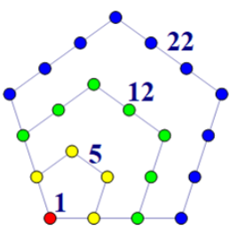
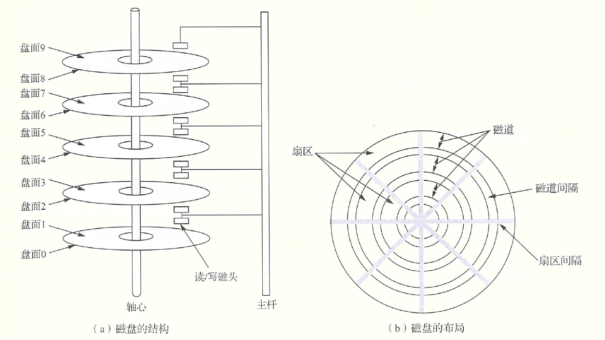
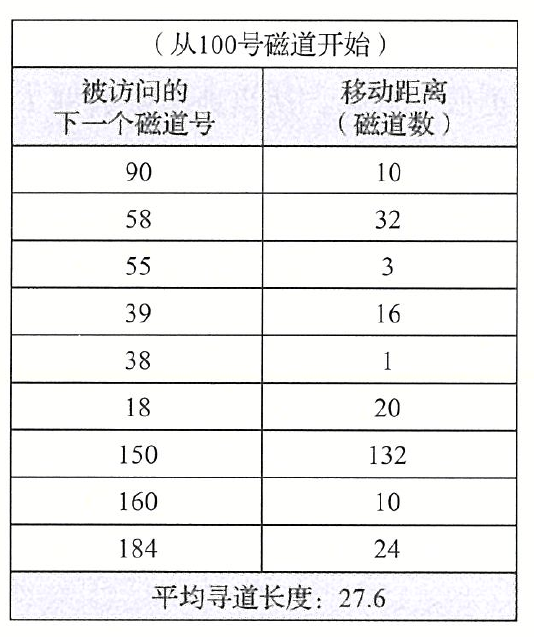
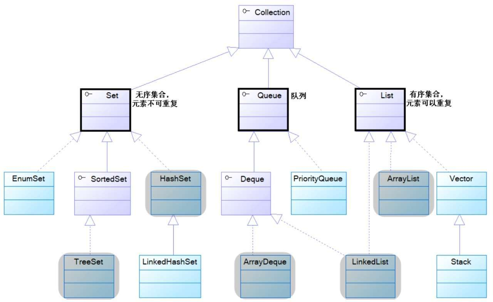
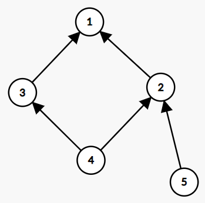

# 成分鉴定(5分)

一天，Serein 在水群时，看到了一份游戏生涯个人喜好表：


很快，一位群友毫不犹豫地全填了原神(`Genshin`)，其中，群友最喜欢的角色是甘雨(`Ganyu`)：


群友自豪地向他人展示，于是，Serein 请你帮群友输出这张表。

无输入。

输出四行，每行六个字符串，用空格隔开。字符串的值除了“最喜欢的角色”处为 `Ganyu` 外，其余都为  `Genshin`。**注意区分大小写。**

# 虚假营销(5分)

根据 IEC 命名标准，$1 KiB=1024B,1MiB=1024KiB,1GiB=1024MiB,1TiB=1024GiB\cdots$

根据国际单位制标准，$1KB=1000B,1MB=1000KB,1GB=1000MB,1TB=1000GB\cdots$

在大部分操作系统里，通常都默认 $KB,MB,GB,TB\cdots$ 采用 IEC 标准，即将其视为 $KiB,MiB,GiB,TiB\cdots$。

然而，对于硬件厂商而言，他们通常将 $KB,MB,GB,TB\cdots$ 采用国际单位制标准并进行营销。这就会导致厂商宣称的容量，实际在电脑上查看，发现并没有这么多。如图所示：


但是在电脑上查看，却并没有这么多：


给定一个按照国际单位制标准的容量大小 $m\ GB$，请你将它转换为 IEC 标准的 $GiB$。

输入一行一个整数 $m(1\le m\le 2\times 10^3)$。

输出一行一个实数 $m'$，代表你的答案。

你的答案被视为是正确的当且仅当你的答案 $m'$ 与标准答案 $m_0$ 的相对误差不超过 $1\%$，即 $|m'-m_0|\le 0.01m_0$。

我们建议你的输出保留至少六位小数。

```
1000
```

```
931.322575
```

# 排序算法(10分)


烧风发明了一种排序，名为“猪猪侠排序”。为了实现这种排序，烧风还创造了一门语言，名为 S 语言。


S 语言是一门支持高并发的分布式语言。使用 S 语言可以将待排序数组分发到若干主机组成的计算集群上，然后通过多线程地全功率运作主机，催眠上帝，产生神迹，使得整个宇宙发生闪烁，产生 3K 的宇宙背景辐射。这些辐射作用于主机的芯片，干扰每一个二进制位，并在某个量子时间内达成数组有序。

设数组共有 $n$ 个元素，每个元素都有 $k$ 个二进制位，故使得数组有序平均需要修改 $\dfrac{nk}2$ 个二进制位，记作平均代价。设强度为 $p$ 的射线能改变平均 $\sqrt p$ 个二进制位，烧风认为如果射线能改变的二进制位**大于或等于**平均代价，该算法就可实现。请你求出该算法是否能实现。

注：由于使用平均值进行计算，你不需要对计算中的小数进行取整操作，即认为诸如 $2.3$ 个二进制位是合理的。

输入一行三个整数 $n,k,p(1\le n\le 500,1\le k\le 64,1\le p\le 10^8)$。

输出一行一个字符串，若该算法能实现，输出 `zhe ci xiang bu chong dou bu xing la`(这次想不冲都不行啦)，否则，输出 `xiang xin zhu zhu xia ye cheng bu liao duo jiu le`(相信猪猪侠也撑不了多久了)。

```
10 32 100000
```

```
zhe ci xiang bu chong dou bu xing la
```


```
10 64 100000
```

```
xiang xin zhu zhu xia ye cheng bu liao duo jiu le
```


```
10 32 25600
```

```
zhe ci xiang bu chong dou bu xing la
```

对 $p=10^5$, $\sqrt p\approx 316.22$，$\dfrac{10\times 32}2=160,\dfrac{10\times 64}2=320$。$316.22 > 160$，故样例一可行。$316.22 < 320$，故样例二不可行。

对样例三，$\sqrt p=160$，恰好达到平均代价。

# 语言模型(10分)

AI 语言模型可以用于模拟场景，以下是一段与 ChatGPT 的对话：


假设 AI 在模拟场景判断语句时，会为每一个语句设置三个维度的得分，分别是“典”匹配度 $a$，“孝”匹配度 $b$，“急”匹配度 $c$，匹配度的取值范围是 $[0,1]$ 之间的实数。若满足下面两个条件的其中一个：① $a < 0.5$ 且 $b < 0.5$ 且 $c < 0.5$ 或② $a,b,c$ 里最大项有不止一个，就会输出“乐”；否则，$a,b,c$ 里哪个得分最高，就输出哪个。请你按照此规则判断每个句子该如何回答。

输入一行一个整数 $n(1\le n\le 10^3)$，代表句子的个数。

接下来输入 $n$ 行，每行三个两位实数 $a,b,c(0.00\le a,b,c\le 1.00)$，代表一句话的三维度匹配度。

输出 $n$ 行，对每一句话，按照上述规则，输出 `le`(乐)，`dian`(典)、`ji`(急)、`xiao`(孝)的其中一个。

```
5
0.11 0.45 0.15
0.66 0.83 0.83
0.66 0.83 0.66
0.90 0.42 0.12
0.13 0.51 0.77
```

```
le
le
xiao
dian
ji
```

# 兰道定理(15分)

> Serein 举办了一场院运会，参赛项目有 1 题, 2 题, 4 题, 8 题, 15 题竞速编程等。比赛结束了，他迫切想要统计选手的得分情况。

设一共有 $n$ 个选手参加了比赛。每次比赛都是两人对战，胜者加一分，败者不得分。现在将得分序列 $s$ **按升序**给出，也就是说序列的第 $i(i > 1)$ 个元素 $s_i$ 一定不小于它的上一个元素 $s_{i-1}$。

院运会一共进行了 $C_n^2$ 场比赛，即每两个人都对战过恰好一场。现在想要检验 $s$ 序列是否是合法的。根据兰道定理，如果 $s$ 能由两两对战得到，一定满足：
$$
\forall2\le k < n,\sum_{i=1}^ks_i\ge C_k^2\quad且\quad\sum_{i=1}^ns_i=C_n^2
$$
其中 $\sum_{i=1}^ns_i$ 是 $s$ 序列的前 $n$ 项和。即需要满足 $s$ 的每个前 $k$ 项和都不小于 $C_k^2$，且 $s$ 的前 $n$ 项和恰好为 $C_n^2$。

给定 $s$，请你判断 $s$ 是否是合法的。

输入一行一个整数 $n(2\le n\le10^3)$。

接下来输入一行 $i$ 个整数，第 $i$ 个整数为 $s_i(0\le s_i\le 10^6)$，且 $\forall 2\le i\le n,s_{i-1}\le s_i$。

输出一行一个字符串，若 $s$ 合法输出 `yes`，否则输出 `no`。

```
4
1 1 2 2
```

```
yes
```


```
4
0 0 0 6
```

```
no
```


```
4
1 1 1 2
```

```
no
```

# 求分拆数(15分)

*曾在上次AK杯之时，Serein便发现了五边形数的具体定义，但 Serein并不满足于此，从中进行深究，发现了可以根据五边形数定理快速计算分拆数。*

将正整数 $n$ 分解为若干个正整数之和，称为分拆。设 $p_n$ 代表正整数 $n$ 有多少种不同的分拆方案。例如 $p_0=p_1=1,p_2=2,p_3=3,p_4=5$，因为 $1=1;2=1+1=2;3=1+1+1=1+2=3;4=1+1+1+1=1+1+2=1+3=2+2=4$。

将无限多个点按照下图方式摆放，形成无限多个正五边形(下图仅展示四个)：



定义第 $i$ 个五边形数是图中第 $i$ 小的五边形边上和内部所包含的点数(特别规定最小的五边形是一个点)。例如，图中，前四个五边形数分别是 $1,5,12,22$。以第三个五边形为例，它包含的点是红色、黄色和绿色的点，统计得共 $12$ 个。

已知五边形数为 $b=1,5,12,22\cdots$，定义广义五边形数为 $a=1,2,5,7,12,15,22,26,\cdots$。即第 $2i-1$ 个广义五边形数为第 $i$ 个五边形数，且第 $2i$ 个广义五边形数总是比第 $2i-1$ 个广义五边形数多 $i$。根据五边形数定理，可以用如下公式快速计算分拆数：
$$
p_i=\sum_{j=1}^{a_j\le i}(-1)^{\lfloor\frac{j+1}{2}\rfloor+1}p_{i-a_{j}}
$$

特别地$, p_0=1$。其中 $\lfloor x\rfloor$ 为 $x$ 的下取整。即 $p_n=p_{n-1}+p_{n-2}-p_{n-5}-p_{n-7}+\cdots$。例如 $p_2=p_1+p_0=2,p_3=p_2+p_1=3,p_5=p_4+p_3-p_0=3+5-1=7,p_6=p_5+p_4-p_1=5+7-1=11,p_7=p_6+p_5-p_2-p_0=11+7-2-1=15$。

给定 $n$，请你计算并输出 $p_n$。

输入一行一个整数 $n(0\le n\le100)$。

输出一行一个整数，代表 $p_n$。保证给定范围内计算过程不会超出 C/C++ int 所能表示的范围。

```
0
```

```
1
```


```
4
```

```
5
```


```
66
```

```
2323520
```

# 磁盘寻道(20分)

磁盘是一种机电设备，包括一个或多个物理盘片，每个盘片有一到两个盘面，每个盘面有若干条磁道，每条磁道有不同的编号。当读/写数据时，磁头会从原本所在的磁道移动到所要读/写的磁道，进行读/写操作。如图所示：



文件存储在磁道上，进程需要读/写文件。为了减少对文件的访问时间，应采用一种较优的磁盘调度算法，使得各进程对磁盘的平均访问时间最小。访问磁盘用时的大部分是寻道时间，所以磁盘调度的目标是使平均寻道时间最短。

一种常用的磁盘调度算法是最短寻道时间优先(shortest seek time first, SSTF)调度算法。设给定要访问的所有磁道号序列 $a$，和初始磁头所在的磁道号 $b$。定义两个磁道号 $u,v$ 的距离是 $|u-v|$(也就是说只需把磁道看成是链，而不是环)，那么该算法每次会选择与当前磁头所在磁道距离最近的磁道进行调度。

例如，设 $b=100,a=(18,38,39,55,58,90,150,160,184)$，则调度序列如下表所示：



特别地，如果当前磁头左右两边都有距离相同的磁道待待访问，这里规定优先访问左边的磁道。

给定一个访问序列 $a$ 和初始磁头位置 $b$，请你求出调度该序列 $a$ 的移动距离序列。

输入一行两个整数 $n(1\le n\le 2\times 10^5),b(0\le b\le 10^9)$，其中 $n$ 代表序列 $a$ 的长度。

接下来输入一行 $n$ 个整数，第 $i$ 个整数代表 $a_i(0\le a_i\le 10^9)$。

**保证** $\mathbf a$ **升序**，即对 $i > 1$ 恒满足 $a_i \ge a_{i-1}$。

输出一行 $n$ 个整数，第 $i$ 个整数代表 $c_i$，即进行第 $i$ 次调度移动的距离(磁道数)。

```
9 100
18 38 39 55 58 90 150 160 184
```

```
10 32 3 16 1 20 132 10 24
```


```
6 3
1 1 2 3 4 5
```

```
0 1 1 0 3 1
```

# 地址变换(20分)

IPv6 地址采用冒号十六进制记法表示，由 $32$ 位长十六进制数构成，每 $4$ 位分为一组，每组之间用冒号分割。例如，一个 IPv6 地址可以是：`68E6:8C64:FFFF:FFFF:0000:1180:960A:FFFF`。

为了表述简单，我们会这样缩写IPv6地址：

1. 把每组数字前面连续的 0 省略。例如 `060A`, `0013`, `0000` 分别可以写为 `60A`, `13`, `0` 。
2. 零压缩，即若干组连续的 `0000` 可以用一对冒号取代。例如 `FF05:0:0:0:0:0:0:B3`  压缩为 `FF05::B3`。在任一地址中只能使用一次零压缩。

给定简写的 IPv6 地址，请你求出它的完整形式。

输入一行一个字符串，由英文半角冒号和十六进制位(英文字母大写)组成，代表简写 IPv6 地址。

输出一行一个字符串，由英文半角冒号和十六进制位(英文字母大写)组成，代表完整 IPv6 地址。

```
68E6:8C64:FFFF:FFFF:0:1180:960A:FFFF
```

```
68E6:8C64:FFFF:FFFF:0000:1180:960A:FFFF
```


```
FF05::B3
```

```
FF05:0000:0000:0000:0000:0000:0000:00B3
```


```
::1
```

```
0000:0000:0000:0000:0000:0000:0000:0001
```

保证输入的地址符合简写语法，即不会出现语法不合法地址(但不保证输入的地址在现实世界真实存在)。

# 网络容量(25分)

Serein 拥有一间自己的实验室，在这里有 $n$ 台主机，每个主机有一个编号 $a_i$(可以相同)。规定相连在一起的主机集合称为网络，且一个网络里的主机编号必须**互不相同**。特别地，一台主机也可称为网络。如果两台主机的编号间隔为 $1$，则这两台主机可以连在一起。如果有一台主机可以与若干台主机相连，则该主机**一定会**选择其中一个进行相连。按照上述规则，可以把主机划分到若干个网络里，使得**每台主机在且仅在一个网络内**。一个网络里的主机个数称为该网络的容量。对于所有主机相连方案，你需要找到一种方案，使得网络容量的最小值最小化，并输出最小容量。

第一行一个整数 $n$ $(1 \leq n \leq 10^5)$ 代表主机个数。

第二行输入 $n$ 个整数 $a_i(0 \leq a_i \leq 10^9)$，代表第 $i$  $(1 \leq i \leq n)$ 个主机编号为 $a_i $。

输出一个整数，代表在实验室中的最小网络容量。

```
6
1 2 1 2 1 2
```

```
2
```

# 模数定理(25分)

*在金属冶炼的时候虾虎队伍面对数论问题屡屡碰壁，于是身为其中一员的   Serein在 A1m的催促下苦练数论。但殊不知 Tension才是真正的数学王子，最终发现了模数定理，于是跟 Serein共同窥探此定理的玄妙。当然好的定理肯定要分享给你们，所以 Serien特地给出一道题，将其中的玄妙之处分享给你们。*

Serein 有一整数数组 $a$，由 $n$ 个正整数组成。给定正常数 $k$。现有 $q$ 次询问，每次询问给出正整数 $l,r$，求长为 $k+1$ 的区间 $[l,r]$ 中任意两个数的余数 $a_i \bmod a_j (l \leq i \leq r,l \leq j \leq r)$ 的最大值。

第一行输入两个整数 $n,k(2 \leq n \leq 2 \times 10^5,1 \leq k \leq n-1)$。

第二行输入 $n$ 个整数，第 $i$ 个整数为 $a_i(1 \leq a_i \leq 10^9)$。

第三行输入一个整数 $q(1 \leq q \leq 10^5)$ 代表询问次数。

接下来输入 $q$ 行，每行两个数 $l,r(1\le l < r\le n, r-l=k)$，代表一次询问。

对于每次询问，输出一行一个整数代表 $a_i \bmod a_j$  $(l \leq i \leq r,l \leq j \leq r)$ 的最大值。

```
3 1
1 3 2
2
1 2
2 3
```

```
1
2
```

# 陌上花开(25分)

*“陌上花开，可缓缓归矣。”*

*虾虎乃三人为之金属冶炼队伍，历数铁，为 lr580所嘲之，lr580以为其一人即可治虾虎，数人便约战，恰逢春景尚好，故此战名曰：陌上花开。*

在本次赛季共有 $n$ 场比赛，每场比赛虾虎都有三个变动的 rating  值（具体而言，第 $i$ 场比赛第 $j$ 个 rating 值为 $a_{ij}$ ），而 lr580 一人分饰三角，且每场比赛的三个 rating 值都是固定的，分别为 $b_1,b_2,b_3$。

lr580 只有在以下情况才视为打败了虾虎：对于任意一场比赛 $i$，都至少存在一个 rating 值不小于虾虎对应的 rating 值。（即 $\forall i \in [1,n], \exists j \in [1,3]$ ，满足 $b_j \ge a_{ij}$）

lr580 每提升一点 rating 值都需要花费精力，为了花费最少的精力，请你求出：在打败虾虎的条件下， $b_1+b_2+b_3$ 的最小值是多少。($ b_1,b_2,b_3$ 均为非负整数)

第一行输入一个整数 $n$, 表示本赛季的比赛场数。($1 \leq n \leq 10^3$)

接下来 $n$ 行，每行输入三个整数，第 $i$ 行第 $j$ 个整数表示 $a_{ij}$ 。($0 \leq a_{ij} \leq 10^9$)

输出一行整数，表示你的答案。

```
1
4 5 6
```

```
4
```


```
3
10 3 1
7 4 10
6 10 7
```

```
8
```

对于样例 $1$，$b_1=4,b_2=0,b_3=0$ ，即满足条件，故最小值为 $4$ 。

对于样例 $2$，$b_1=7,b_2=0,b_3=1$ ，即满足条件，故最小值为 $8$ 。

# 里氏代换(25分)

里氏代换原则是由 2008 年图灵奖得主 Barbara Liskov 和 Jeannette Wing 提出的面向对象设计原则，可通俗表述为：在软件中如果能使用基类对象，那么一定能够使用其子类对象。把基类都替换成它的子类，程序将不会产生任何错误和异常，反过来则不成立，如果一个软件实体使用的是一个子类的话，那么它不一定能够使用基类。

以 Java 标准库的集合类为例，下面的 UML 类图的箭头代表父子类(泛化)/接口(实现)关系，你可以通俗理解为子类指向父类。例如，Queue 是 Collection 的子类，Set 是 TreeSet 的父类。因此，所有能用 Collection 的地方一定能用 Queue，但能用 TreeSet 的地方不一定能用 Set。



为兼容各编程语言的差异性，你应当认为一个类可以有任意多个直接父类和任意多个直接子类。

对一个已知的类图，给定类图里的两个类 $u,v$，你需要判断 $u$ 是否是 $v$ 的子类。

输入一行两个整数 $n,m(2\le n\le 10^4,0\le m\le 2\times 10^5)$，代表类图里类的个数，以及实现关系数目。

接下来输入 $m$ 行，每行两个整数 $u,v(1\le u,v\le n,u\neq v)$，代表 $u$ 是 $v$ 的子类。

保证不存在环，即不存在这样的边 $a\to b,b\to c,\cdots,x\to a$。

**不保证**只有一个类没有父类，不保证类图弱连通。

接下来输入一行一个整数 $q(1\le q\le 10^5)$，代表一次询问。

接下来输入 $q$ 行，每行两个整数 $u,v(1\le u,v\le n,u\neq v)$，代表询问 $u$ 是否是 $v$ 的子类。

对每个询问，若 $u$ 是 $v$ 的子类，输出一行 `Yes`，否则输出一行 `No`。

```
5 5
2 1
3 1
4 2
4 3
5 2
4
1 4
4 1
5 2
5 3
```

```
No
Yes
Yes
No
```

对样例，如图所示：



# 归零行动(30分)

*"宇宙是一座黑暗森林，每个文明都是带枪的猎人。如果发现了别的生命，能做的只有一件事：开枪消灭..."*

在黑暗森林的宇宙里，分布着 $n$ 颗星星，每颗星星都有寿命 $a$ 和自己专属的孤独值 $b$ 。看着这些孤单的星星，归零者决定用法力把所有的星星连接在一起，但是归零者的魔法需要遵循下面的物理规律：

* 每次只能连接两颗星星，需要耗费的法力为两颗星星的孤独值差异。具体而言，连接两颗星星 $i,j$，消耗的法力为 $|b_i-b_j|$。
* 用法力相连的两颗星星，孤独值更大的星星，其寿命不可以小于另一颗星星。具体而言，如果有两颗星星 $i,j$ ，满足 $b_i>b_j$ 且 $a_i< a_j$ ，那么这两颗星星就**不可以**用法力直接连接。

最初，每颗星星之间都是不相连的。为了使每颗星星都联通，归零者创造了一颗归零星，归零星寿命为 $0$ ，孤独值为 $0$ 。这意味着任意一颗星星 $i$ 都可以和归零星相连，并消耗法力 $b_i$ 。

归零者想使这 $n$ 颗星星和归零星联通，请你求出消耗的法力最少是多少。如果 $i$ 和 $j$ 联通，$j$ 和 $k$ 联通，那么 $i$ 和 $k$ 也视为联通的，即便 $i$ 和 $k$ 没有用法力直接连接。

第一行输入一个整数 $n(1\leq n \leq 2\times10^5)$ ，表示星星的数量。

第二行输入 $n$ 个整数，第 $i$ 个代表 $a_i$ ($1 \le a_i \le 2 \times 10^5$)。

第三行输入 $n$ 个整数，第 $i$ 个代表 $b_i$ ($1 \le b_i \le 2 \times 10^5$，且数据保证 $b_i$ 互不相同)。

输出一个整数，代表你的答案。

```
3
9 8 7
1 2 3
```

```
6
```


```
5
2 6 5 3 5
1 2 3 5 4
```

```
9
```

# 一条归桥(30分)

> 知识渊博，最聪慧的兽人就是上白泽慧音。她提醒未来的灾难，指导正确方向的妖怪。她住在人类村落，开一间寺子屋。每天都在编纂历史。
>
> 历史由若干关键节点构成，节点间的联系错综复杂，且每条联系各自的必然程度，而且可能与自身发生联系(考虑轮回)。为了更好地改写历史，上白泽慧音需要洞悉所有的联系链上的必然程度。

给定可能带自环、重边的有向加权图。定义长为 $k$ 的路径是恰好包含 $k$ 条边的、**点和边都可重复**的路径。两条路径不同当且仅当至少有一个点或一条边不一样。

设有 $n$ 个点，编号从 $1$ 开始。长为 $k$ 的路径的点序列为 $v_0,v_1,\cdots, v_k$，边为 $(v_0,v_1),(v_1,v_2),\cdots,(v_{k-1},v_k)$。定义一条边 $(u,v)$ 的边权为 $w_{(u,v)}$，则这条路径的权为 $\sum_{k=1}^nw_{(v_{i-1},v_i)}$。

记所有起点为 $v_0=i$，终点为 $v_k=j$ 的长为 $k$ 的路径的权值和为 $r_{i,j,k}$，并记 $s_{i,j,k}=\sum_{l=1}^kr_{i,j,l}$。你需要求出所有的 $s_{i,j,k}$。答案可能很大，故对 $998244353$ 取模。

输入一行三个整数 $n,m,k(1\le n\le 50,0\le m\le 10^5,0\le k\le 10^9)$。$n,m$ 分别代表点数、边数。

接下来输入 $m$ 行，每行三个整数 $u,v,w(1\le u,v\le n,0\le w\le 10^9)$，代表一条有向边 $(u,v)$ 的权为 $w_{(u,v)}$。

输出 $n$ 行，每行 $n$ 个整数。第 $i$ 行第 $j$ 个整数代表 $s_{i,j,k}\bmod 998244353$。

```
3 6 1
1 1 1
2 2 1
3 3 1
1 2 2
1 3 3
2 3 1
```

```
1 2 3 
0 1 1
0 0 1
```


```
3 6 2
1 1 1
2 2 1
3 3 1
1 2 2
1 3 3
2 3 1
```

```
3 8 14
0 3 5
0 0 3
```


```
2 5 3
1 1 1
2 2 1
1 2 1
1 2 2
2 1 1
```

```
32 50 
21 32
```

# 黄金买卖(30分)

> 亘古以来，黄金就是理想的一般等价物，是用于储备和投资的特殊通货，同时又是首饰业、电子业、现代通讯、航天航空业等部门的重要材料。
>
> 2022年7月14日，黄金价格跌破了1700美元/盎司整数关口，而且呈继续下跌态势。炒黄金是一条有风险、但也有收益的投资路线。

黄金的价格会波动，一共有 $n$ 天可以买卖黄金，在第 $i$ 天的买入和卖出价格均为 $p_i$。由于某些限制，你只能持有最多一笔黄金。若你没有黄金，可以在任一天买入一笔黄金；否则，你可以在任一天卖出黄金。你最多只能卖出 $k$ 次，问你最多能挣多少差价？

输入一行两个整数 $n,k(1\le n\le 10^5,1\le k\le 10^5)$。

接下来输入一行 $n$ 个整数，第 $i$ 个整数代表 $p_i(1\le p_i\le 10^9)$。

输出一行一个整数，代表答案。

```
6 1
1 1 4 5 1 4
```

```
4
```


```
6 2
1 1 4 5 1 4
```

```
7
```


```
7 3
1 9 1 9 8 1 0
```

```
16
```

