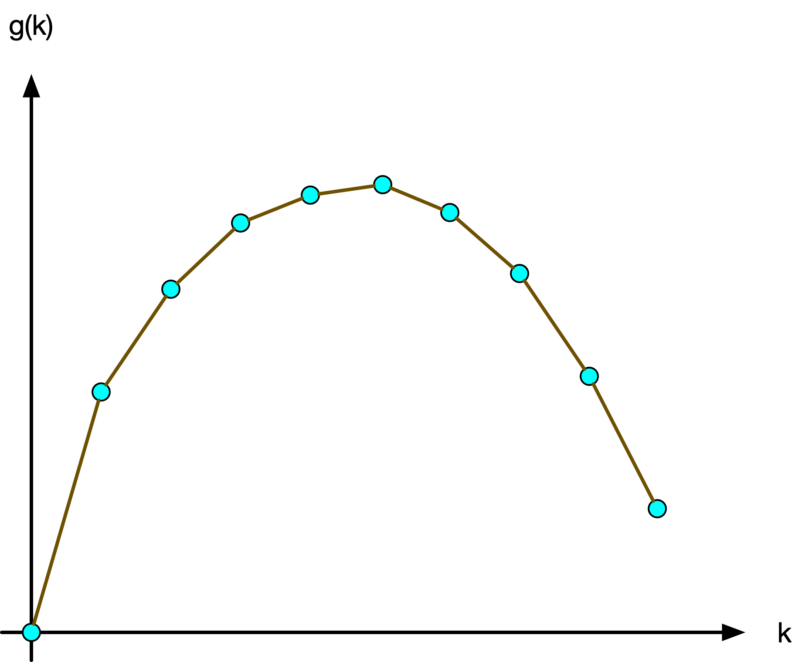
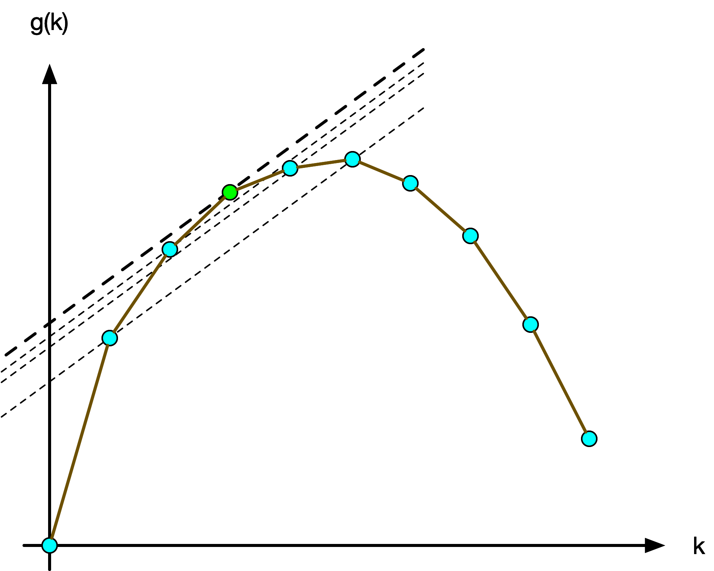
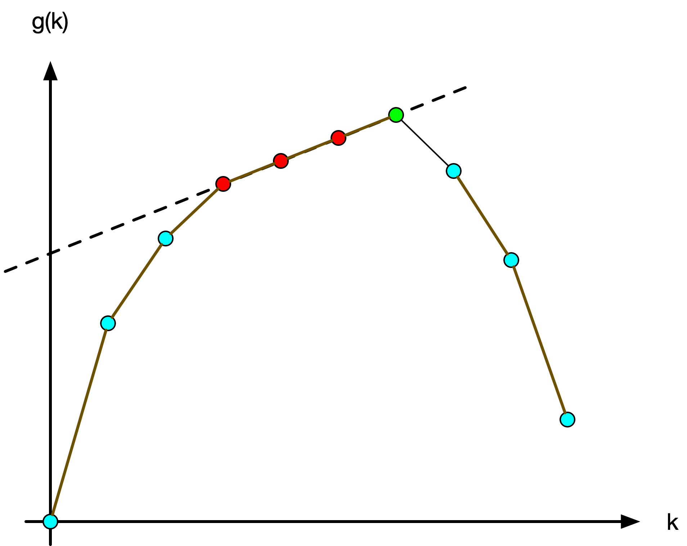

## 成分鉴定

可以使用 C++11 String Literal Delimiter 语法输出多行字符。

```c++
#include <bits/stdc++.h>
signed main()
{
    printf(R"(Genshin Genshin Genshin Genshin Genshin Genshin
Genshin Genshin Genshin Genshin Ganyu Genshin
Genshin Genshin Genshin Genshin Genshin Genshin
Genshin Genshin Genshin Genshin Genshin Genshin)");
    return 0;
}
```


## 虚假营销

注意要浮点数除法。如果一开始乘整数，小心炸 int。

```c++
#include <bits/stdc++.h>
using namespace std;
signed main()
{
    int m;
    cin >> m;
    printf("%.6f", m * 1e9 / 1024 / 1024 / 1024);
    return 0;
}

```


## 排序算法

一种避免精度误差的办法，对判断 $\sqrt p\ge \dfrac{nk}{2}$，两边同时平方得 $p\ge \dfrac{n^2k^2}4\Rightarrow 4p\ge n^2k^2$。

```c++
#include <bits/stdc++.h>
using namespace std;
int n, k, p;
signed main()
{
    ios::sync_with_stdio(false), cin.tie(0);
    cin >> n >> k >> p;
    if (4 * p >= n * n * k * k)
        cout << "zhe ci xiang bu chong dou bu xing la";
    else
        cout << "xiang xin zhu zhu xia ye cheng bu liao duo jiu le";
    return 0;
}
```


## 语言模型

可以定义 $m=\max(a,b,c)$，然后统计有多少个值等于 $m$，来避免排序。

```c++
#include <bits/stdc++.h>
using namespace std;
using ll = long long;
signed main()
{
    ios::sync_with_stdio(false), cin.tie(0);
    ll n;
    for (cin >> n; n--;)
    {
        double a, b, c;
        cin >> a >> b >> c;
        double m = max({a, b, c});
        if ((a < 0.5 && b < 0.5 && c < 0.5) || ((a == m) + (b == m) + (c == m)) >= 2)
        {
            cout << "le\n";
        }
        else if (a == m)
        {
            cout << "dian\n";
        }
        else if (b == m)
        {
            cout << "xiao\n";
        }
        else
        {
            cout << "ji\n";
        }
    }
    return 0;
}
```


## 兰道定理

小模拟题。可以用前缀和，不用也行。

```c++
#include <bits/stdc++.h>
using namespace std;
using ll = long long;
signed main()
{
    ios::sync_with_stdio(false), cin.tie(0);
    ll n, s = 0;
    cin >> n;
    for (ll i = 1, v; i <= n; ++i)
    {
        cin >> v;
        s += v;
        if (s < i * (i - 1) / 2)
        {
            cout << "no";
            return 0;
        }
    }
    cout << (s == n * (n - 1) / 2 ? "yes" : "no");
    return 0;
}
```


## 求分拆数

易得，五边形数的通项为 $a'_n=1+(2+1+1)+(3+2+2)+\cdots+(n+(n-1)+(n-1))=\sum_{i=1}^n(3i-2)=\dfrac{n(3n-1)}2$。

则广义五边形数为 $a=(a'_1,a'_1+1,a'_2,a'_2+2,\cdots, a'_n,a'_n+n)$。

然后直接套题给公式计算即可。

```c++
#include <bits/stdc++.h>
using namespace std;
using ll = long long;
const ll mn = 1e2 + 10;
ll a[mn], p[mn], n;
signed main()
{
    cin.tie(0)->ios::sync_with_stdio(false);
    cin >> n;
    p[0] = 1;
    for (ll i = 1; i <= n / 2 + 1; ++i)
    {
        a[2 * i - 1] = i * (3 * i - 1) / 2;
        a[2 * i] = i * (3 * i + 1) / 2;
    }
    for (ll i = 1; i <= n; ++i)
    {
        for (ll j = 1; a[j] <= i; ++j)
        {
            if (((j + 1) / 2 + 1) % 2 == 0)
            {
                p[i] += p[i - a[j]];
            }
            else
            {
                p[i] -= p[i - a[j]];
            }
        }
    }
    cout << p[n];
    return 0;
}
```


## 磁盘寻道

找到最大的 $l$ 和最小的 $r$，满足 $a_l\le b < a_r$。维护双指针 $l,r$，设下标从 $1$ 开始，当前未处理的调度下标为 $[1,l]\cup[r,n]$。初始时 $[1,l]\cup[r,n]=[1,n]$。然后每次只需要判断 $a_l,a_r$ 哪个离 $b$ 更近，就走哪个(同近走左)，走了之后移动一下指针。这样的复杂度是 $O(n)$ 的。

```c++
#include <bits/stdc++.h>
using namespace std;
using ll = long long;
const ll mn = 2e5 + 10;
ll n, a[mn], b, l, r; // 尚未处理:[1,l]U[r,n]
signed main()
{
    cin >> n >> b;
    r = n + 1;
    for (ll i = 1; i <= n; ++i)
    {
        cin >> a[i];
        if (a[i] <= b)
        {
            l = max(l, i);
        }
        else
        {
            r = min(r, i);
        }
    }
    auto dis = [&](ll i)
    { return abs(a[i] - b); };
    while (!(l == 0 && r > n))
    {
        if (l && dis(l) <= dis(r))
        {
            cout << dis(l) << ' ';
            b = a[l--];
        }
        else
        {
            cout << dis(r) << ' ';
            b = a[r++];
        }
    }
    return 0;
}
```


## 地址变换

字符串小模拟。按题意实现即可。

```c++
#include <bits/stdc++.h>
using namespace std;
#define sc(x) scanf("%lld", &x)
typedef long long ll;
vector<string> v;
string s;
signed main()
{
    cin >> s;
    while (true)
    {
        ll idx = s.find(":");
        if (idx == -1)
        {
            break;
        }
        v.push_back(s.substr(0, idx));
        s = s.substr(idx + 1);
    }
    v.push_back(s);
    for (int i = 0; i < v.size(); ++i)
    {
        bool abbr = false;
        if (i > 0 && i + 1 < v.size() && v[i].size() == 0)
        {
            abbr = true;
        }
        while (v[i].size() < 4)
        {
            v[i] = '0' + v[i];
        }
        if (abbr)
        {
            while (v.size() < 8)
            {
                v.insert(v.begin() + i, "0000");
            }
        }
    }
    for (ll i = 0; i < 8; ++i)
    {
        cout << v[i] << " :"[i < 7];
    }
    return 0;
}
```


## 里氏代换

对有向图，设 $f_{i,j}$ 表示 $i$ 是否可达 $j$，如果可达，则可以用 $i$ 里氏代换 $j$。则对每个询问 $u,v$，输出 $f_{v,u}$ 即可。

初始设 $f_{i,i}=1$。按照拓扑序进行 DP，对点 $u$ 及其所有前驱 $v$，有 $f_{u,k} = f_{u,k}|f_{v_1,k}|f_{v_2,k}|\cdots |f_{v_p,k}$。即所有子节点求交，用按位或即可。

这样的空间复杂度为 $O(n^2)$，时间复杂度为 $O(mn)$，因为共有 $m$ 条边，每条边对 $f_{u,k}$ 的所有 $k$ 进行并。

考虑进行优化。由于每个 $f$ 只占用一个位，考虑位域，使用 bitset，可将空间复杂度降为 $O(\dfrac{n^2}C)$，时间复杂度为 $O(\dfrac{nm}C)$，其中 $C$ 是操作系统位数，一般为 $64$。

```c++
#include <bits/stdc++.h>
using namespace std;
using ll = long long;
const ll mn = 1e4 + 5;
signed main()
{
    ios::sync_with_stdio(false), cin.tie(0);
    ll n, m, d[mn] = {}; // 入度
    vector<ll> g[mn];
    cin >> n >> m;
    for (ll u, v; m--;)
    {
        cin >> u >> v;
        g[u].push_back(v);
        ++d[v];
    }
    bitset<mn> f[mn]; // f[i][j]:i是否是j的父类
    queue<ll> q;
    for (ll i = 1; i <= n; ++i)
    {
        f[i][i] = true;
        if (!d[i])
        {
            q.push(i);
        }
    }
    while (!q.empty())
    {
        ll u = q.front();
        q.pop();
        for (auto v : g[u])
        {
            f[v] |= f[u];
            if (--d[v] == 0)
            {
                q.push(v);
            }
        }
    }
    ll Q;
    cin >> Q;
    for (ll u, v; Q--;)
    {
        cin >> u >> v;
        cout << (f[v][u] ? "Yes\n" : "No\n");
    }
    return 0;
}
```


## 一条归桥

先考虑一个稍微简单的问题：如何求 $\le k$ 的路径数 $s_{i,j,k}'=\sum_{l=1}^kr_{i,j,l}'$，而不是求路径和 $s_{i,j,k}$。

设邻接矩阵为 $A_{i,j}'=cnt_{i,j}$，其中 $cnt_{i,j}$ 是 $i\to j$ 有向边的总数。显然，$r_{i,j,1}'=A_{i,j}'$。

那么，根据 DP 的思想，利用加法原理和乘法原理，有：
$$
r'_{i,j,p}=\sum_{k=1}^n r'_{i,k,p-1}\cdot r'_{k,j,1}
$$
也就是枚举中间点 $k$，先从 $i$ 走 $p-1$ 步到 $k$，再从 $k$ 一步走到 $j$。

例如对 $n=3,p=3$，有 $r'_{1,2,3}=r'_{1,1,2}r'_{1,2,1}+r'_{1,2,2}r'_{2,2,1}+r'_{1,3,2}r'_{3,2,1}$。容易知道该式子的组合数学意义。

不难发现，上式恰好就是矩阵乘法的表达式。也就是说，有 $r'_{i,j,k}=A'^k_{i,j}$，其中 $A'^k_{i,j}=A'^{k-1}_{i,j}\times A_{i,j}'$。

现在从求 $r'_k$  即求 $A'^k$ 问题转化为求 $s'_k$ 即 $B'^k=A'+A'^2+A'^3+\cdots + A'^k$ 问题。

> 由于矩阵不满足等比数列求 $k$ 项和公式，**不能**直接像实数一样对 $x+x^2+x^3+\cdots + x^k$ 求 $\dfrac{x(x^k-1)}{x-1}$。这是因为，不能保证 $A-I$(其中 $I$ 是同型单位阵)总是可逆的。矩阵 $M$ 可逆的条件是行列式 $|M|$ 不为 $0$。考虑一个每点只有一个自环的图，显然 $A=I,|A-I|=0$。所以无法直接套用实数等比数列公式。 

所以考虑分治求解。问题转化为，已知 $n$ 阶方阵 $A$，求 $A+A^2+A^3+\cdots+A^k$。

令 $B_i=A+A^2+\cdots+A^i$，$n$ 阶单位阵为 $E$。若 $k$ 为偶数，上式可以转化为：
$$
B_k=(A+A^2+\cdots+A^{\frac k2})+A^{\frac k2}(A+A^2+\cdots+A^{\frac k2})=B_{\frac k2}+A^{\frac k2}B_{\frac k2}=(E+A^{\frac k2})B_{\frac k2}
$$
若 $k$ 为奇数，可以直接用上一个偶数，即 $B_k=B_{k-1}+A^k$。

其中，$A^i$ 可由矩阵快速幂计算，复杂度为 $O(n^3\log i)$。而 $B_k$ 的递推需要 $\log k$ 次，故总复杂度为 $O(n^3\log^2k)$。

到此为止，如果是求路径数，已经做完了。但是本题要求路径和，所以需要进一步修改。

> **不能**直接把边权和当成路径数直接套用上面的公式。考虑每个点只有一条边权为 $1$ 的自环图， 那么由于 $1\cdot 1=1$，会求出 $A'^k=A=I$，显然不符合事实。因为考虑 $k=2$，就有 $1+1=2$ 的路径，$s_{i,i,2}=3$ 才是正确的。

设初始条件是 $r_{i,j,1}=\sum w_{(i,j)}$，即所有 $i\to j$ 边权和。边数是 $r'_{i,j,k}$。正确的的组合数学 DP 公式为：
$$
r_{i,j,p}=\sum_{k=1}^n (r_{i,k,p-1}\cdot r'_{k,j,1}+r_{k,j,1}\cdot r'_{i,k,p-1})
$$
含义是：所有已经从 $i$ 走到 $k$ ，走 $p-1$ 步的方案里，每个方案可以分裂出 $r'_{k,j,1}$ 个子方案，每个子方案在原有的基础上都有 $r_{i,k,p-1}$ 的边权和。所有子方案里新加的权和是 $r_{k,j,1}\cdot r'_{i,k,p-1}$，具体而言这些子方案可以细分为 $r'_{i,k,p-1}$ 组，每组恰好包含 $k\to j$ 的所有边一次且仅一次，这些边的权和为 $r_{k,j,1}$。

> 举个例子，对 $n=2$ 的图，只有三条边，$w_{(1,2)}=1,w_{(1,2)}=2,w_{(2,1)}=4$。显然有：
> $$
> r_{i,j,1}=A=\pmatrix{0&3\\4&0},
> r_{i,j,1}'=A'=\pmatrix{0&2\\1&0}
> $$
> 则：
> $$
> \begin{align}
> r_{1,1,2}&=(r_{1,1,1}\cdot r'_{1,1,1}+r_{1,1,1}\cdot r'_{1,1,1})
> +(r_{1,2,1}\cdot r'_{2,1,1}+r_{2,1,1}\cdot r'_{1,2,1})\\
> &=(0\cdot 0+0\cdot 0)+(3\cdot 1+4\cdot 2)=11\\
> 
> r_{1,2,2}&=(r_{1,1,1}\cdot r'_{1,2,1}+r_{1,2,1}\cdot r'_{1,1,1})
> +(r_{1,2,1}\cdot r'_{2,2,1}+r_{2,2,1}\cdot r'_{1,2,1})\\
> &=(0\cdot 2+3\cdot0)+(3\cdot 0+0\cdot2)=0\\
> 
> r_{2,1,2}&=(r_{2,1,1}\cdot r'_{1,1,1}+r_{1,1,1}\cdot r'_{2,1,1})
> +(r_{2,2,1}\cdot r'_{2,1,1}+r_{2,1,1}\cdot r'_{2,2,1})\\
> &=(4\cdot 0+0\cdot 1)+(0\cdot 1+4\cdot 0)=0\\
> 
> r_{2,2,2}&=(r_{2,1,1}\cdot r'_{1,2,1}+r_{1,2,1}\cdot r'_{2,1,1})
> +(r_{2,2,1}\cdot r'_{2,2,1}+r_{2,2,1}\cdot r'_{2,2,1})\\
> &=(4\cdot 2+3\cdot1)+(0\cdot 0+0\cdot0)=11\\
> \end{align}
> $$
> 即 $r_{i,j,2}=\pmatrix{11&0\\0&11}$。
>
> 任意 $A'^k$ 仍然可以通过上文方法计算，即显然有 $r'_{i,j,2}=A'^2=A’\times A'=\pmatrix{2&0\\0&2}$。
>
> 同理，可以计算出 $r'_{i,j,3}=A'^3=\pmatrix{0&4\\2&0},r_{i,j,3}=\pmatrix{0&28\\19&0}$，可以不断往下递推，求出任意 $r_{i,j,k}$。

通过上述办法，虽然可以正确求出答案，但是每次递推的复杂度为 $O(n^3)$，要求出 $s_{i,j,k}=\sum_{l=1}^kr_{i,j,l}$ 需要 $O(n^3k)$，显然是不可接受的。下面考虑优化该递推。

上面的表达式跟矩阵乘法十分相似，唯一不同是 $a\cdot b$ 变成了 $a\cdot b+ c\cdot d$。

 设 $M^{p-1}=\pmatrix{a'&b'\\c'&d'},M=\pmatrix{a&b\\c&d}$，有：
$$
M^p=M^{p-1}\times M=\pmatrix{a'a+b'c&a'b+b'd\\c'a+d'c&c'b+d'd}
$$
不妨设二阶方阵 $F_{i,j}=\pmatrix{r'_{i,j,1}&r_{i,j,1}\\0&r'_{i,j,1}}$，$F^{p-1}_{i,j}=\pmatrix{r'_{i,j,p-1}&r_{i,j,p-1}\\0&r'_{i,j,p-1}}$，则有：
$$
F^p_{i,j}=F^{p-1}_{i,j}\times F_{i,j}=\pmatrix{
	r'_{i,j,p-1}r'_{i,j,1}&
	r_{i,j,p-1}r'_{i,j,1}+r_{i,j,1}r'_{i,j,p-1}\\
	0&r'_{i,j,p-1}r'_{i,j,1}
}
$$

> 如何想出要“设”这样的方阵的思路见下文。

该方阵的主对角线刚好满足上文 $r'_{i,j,p}$ 的计算公式，且第一行第二个元素刚好满足上文 $r_{i,j,p}$ 的计算公式。

我们用二阶方阵代替矩阵里的每一个元素，设 $F_{i,j}=\pmatrix{r'_{i,j,1}&r_{i,j,1}\\0&r'_{i,j,1}}$，构造分块(/嵌套)矩阵：
$$
A=\pmatrix{
	F_{1,1}&F_{1,2}&\cdots&F_{1,n}\\
	F_{2,1}&F_{2,2}&\cdots&F_{2,n}\\
	\vdots&\vdots&\ddots&\vdots\\
	F_{n,1}&F_{n,2}&\cdots&F_{n,n}
}
$$
则该矩阵的幂公式为 $A^p=A^{p-1}\times A^p$，逐步递推，根据数学归纳法，可得：
$$
\begin{align}
A^p_{i,j}&=\sum_{k=1}^nA_{i,k}^{p-1}\times F_{k,j}\\
%=\sum_{k=1}^nF_{i,k}^{p-1}\times F_{k,j}
&=\sum_{k=1}^n\pmatrix{
	r'_{i,k,p-1}r'_{k,j,1}&
	r_{i,k,p-1}r'_{k,j,1}+r_{k,j,1}r'_{i,k,p-1}\\
	0&r'_{i,k,1}r'_{k,j,p-1}
}\\
&=\pmatrix{
	\sum_{k=1}^nr'_{i,k,p-1}r'_{k,j,1}&
	\sum_{k=1}^nr_{i,k,p-1}r'_{k,j,1}+r_{k,j,1}r'_{i,k,p-1}\\
	0&\sum_{k=1}^nr'_{i,k,1}r'_{k,j,p-1}
}\\
&=\pmatrix{r'_{i,j,p}&r_{i,j,p}\\0&r'_{i,j,p}}
\end{align}
$$
根据线性代数知识，分块矩阵的计算可以视为一般矩阵的计算，即可将 $A$ 视大小为 $2n\times 2n$ 的矩阵：
$$
A^p=\pmatrix{
	r'_{1,1,p}&r_{1,1,p}&r'_{1,2,p}&r_{1,2,p}&\cdots&r'_{1,n,p}&r_{1,n,p}\\
	0&r'_{1,1,p}&0&r'_{1,2,p}&\cdots&0&r'_{1,n,p}\\
	r'_{2,1,p}&r_{2,1,p}&r'_{2,2,p}&r_{2,2,p}&\cdots&r'_{2,n,p}&r_{2,n,p}\\
	0&r'_{2,1,p}&0&r'_{2,2,p}&\cdots&0&r'_{2,n,p}\\
	\vdots&\vdots&\vdots&\vdots&\ddots&\vdots&\vdots\\
	r'_{n,1,p}&r_{n,1,p}&r'_{n,2,p}&r_{n,2,p}&\cdots&r'_{n,n,p}&r_{n,n,p}\\
	0&r'_{n,1,p}&0&r'_{n,2,p}&\cdots&0&r'_{n,n,p}\\
}
$$
则 $r_{i,j,k}=A^k_{2i,2j-1},s_{i,j,k}=B^k_{2i-1,2j}=A_{2i-1,2j}+A^2_{2i-1,2j}+\cdots+A^k_{2i-1,2j}$。故只需要求出 $B^k$，然后输出所有 $1\le i,j\le n, B^k_{2i-1,2j}$ 即可。

由于新方阵的大小为 $2n$，故本题总时间复杂度为 $O((2n)^3\log^2k)=O(8n^3\log^2k)\approx 9\times 10^8$。空间复杂度为 $O((2n)^2)=O(4n^2)$。

> 附：构造出二阶方阵 $F$ 的思路简述：令向量 $f^T=(r_1,r'_1)$ 维护二维信息(单点自环的个数 $r'$，自环边权和 $r$)，且 $f^{kT}$ 维护长为 $k$ 的自环路径数 $r_k$ 与自环边权和 $r'_k$。类比矩阵快速幂求斐波那契，考虑构造递推：
> $$
> f^k=\pmatrix{r_k\\r'_k}=\pmatrix{a_{11}&a_{12}\\a_{21}&a_{22}}\pmatrix{r_{k-1}\\r'_{k-1}}=Ff^{k-1}
> $$
> 即：
> $$
> \begin{cases}
> r_k=a_{11}r_{k-1}+a_{12}r'_{k-1}\\
> r'_k=a_{21}r_{k-1}+a_{22}r'_{k-1}
> \end{cases}
> $$
> 根据上文公式(那两个 DP)，可以得出，$r_k=r'_1r_{k-1}+r_1r'_{k-1}, r'_k=r'_1r'_{k-1}$。代入系数，得：
> $$
> a_{11}=r'_1,a_{12}=r_1,a_{21}=0,a_{22}=r'_1
> $$
> 即构造出 $F$ 为 $\pmatrix{r'&r\\0&r'}$。

参考代码：

```c++
#include <bits/stdc++.h>
using namespace std;
using ll = long long;
const ll mod = 998244353;
using arr = vector<vector<ll>>;
struct matrix
{
    ll n;
    arr a;
    matrix(ll nn) : n(nn)
    {
        a = arr(n, vector<ll>(n));
    }
    matrix(arr aa) : n(aa.size()), a(aa) {}
    friend matrix operator+(const matrix &x, const matrix &y)
    {
        matrix r = matrix(x.n);
        for (ll i = 0; i < x.n; ++i)
        {
            for (ll j = 0; j < x.n; ++j)
            {
                r.a[i][j] = (x.a[i][j] + y.a[i][j]) % mod;
            }
        }
        return r;
    }
    friend matrix operator*(const matrix &x, const matrix &y)
    {
        matrix r = matrix(x.n);
        for (ll i = 0; i < x.n; ++i)
        {
            for (ll j = 0; j < x.n; ++j)
            {
                for (ll k = 0; k < x.n; ++k)
                {
                    r.a[i][j] = (r.a[i][j] + x.a[i][k] * y.a[k][j]) % mod;
                }
            }
        }
        return r;
    }
    matrix static unit(ll k)
    { // 单位阵
        matrix r = matrix(k);
        for (ll i = 0; i < k; ++i)
        {
            r.a[i][i] = 1;
        }
        return r;
    }
    matrix pow(ll k)
    {
        matrix c = *this, r = unit(n);
        for (; k; k >>= 1)
        {
            if (k & 1)
            {
                r = r * c;
            }
            c = c * c;
        }
        return r;
    }
    matrix psum(ll k)
    {
        if (k == 0)
        {
            return matrix(n);
        }
        if (k == 1)
        {
            return *this;
        }
        if (k % 2 == 1)
        {
            return psum(k - 1) + pow(k);
        }
        return (unit(n) + this->pow(k / 2)) * psum(k / 2);
    }
};
using mat = matrix;
ll n, m, k;
signed main()
{
    ios::sync_with_stdio(false), cin.tie(0);
    cin >> n >> m >> k;
    mat e = mat(n * 2);
    for (ll u, v, w; m--;)
    {
        cin >> u >> v >> w;
        --u, --v;
        mat f = mat({{1, w}, {0, 1}});
        (e.a[u * 2][v * 2] += f.a[0][0]) %= mod;
        (e.a[u * 2][v * 2 + 1] += f.a[0][1]) %= mod;
        (e.a[u * 2 + 1][v * 2] += f.a[1][0]) %= mod;
        (e.a[u * 2 + 1][v * 2 + 1] += f.a[1][1]) %= mod;
    }
    e = e.psum(k);
    for (ll i = 0; i < n; ++i)
    {
        for (ll j = 0; j < n; ++j)
        {
            cout << e.a[2 * i][2 * j + 1] << ' ';
        }
        cout << '\n';
    }
    return 0;
}
```


## 黄金买卖

<u>若只有至多一次买卖，</u>等价于求 $\max _{1\le i < j\le n} p_j-p_i$。

对每个 $j$，其 $a_i$ 必定在最小值处取得。即维护前缀 min $m_i=\min_{1\le k\le i} p_i$，等价于求 $\max _{1\le i\le n} p_i-m_i$，可以 $O(n)$ 实现。有可能不进行买卖(一直降价)，所以最终结果与 $0$ 取 max。复杂度 $O(n)$。

<u>现在扩展到做两笔交易，</u>即求 $\max p_j-p_i+p_l-p_k, i < j < k < l$。

跟一笔交易一样，先处理 $i,j$，然后对 $(j,n]$ 部分，反过来，即逆序枚举 $k$，寻找最大的 $p_l$。根据两次枚举 $j,k$ 可以分别求出前缀 max 答案 $lans$ 和后缀答案 $rans$，故答案为：$ans=\max_{i=1}^{n-1}lans_i+rans_{i+1}$。复杂度 $O(n)$。

<u>现在再扩展到做 $k$ 笔交易，</u>设 $g_{i,j}$ 是对前 $j$ 天，已经买卖了前 $i-1$ 笔交易且买入了第 $i$ 笔交易下最低的总额，即 $\min a_{buy_k}+\sum_{k=1}^{i-1}a_{sell_k}-a_{buy_k},buy_k,sell_k\le j$

设 $f_{i,j}$ 是对前 $j$ 天，已经买卖了前 $i$ 笔的最高利润。即 $\max\sum_{k=1}^ia_{sell_k}-a_{buy_k},,buy_k,sell_k\le j$

递推方程为：
$$
f_{i,j}=\max(f_{i,j-1},p_j-g_{i,j-1})\\
g_{i,j}=\min(g_{i,j-1},p_j-f_{i-1,j-1})
$$
因为要差价最大化，所以每次卖出前，让买入最小。对于新的一笔交易，将之前的交易得到的所有差价抽象等价为负的价格，即假设已经赚到的最大差价是 $c$，那么新一次买黄金的价格设为 $p-c$，即抽象成了这次买入额外降价了 $c$。

将 $i$ 状态压缩，可以优化空间复杂度从 $O(nk)$ 到 $O(n)$。时间复杂度为 $O(nk)$。但是仍然无法过题。

<u>考虑进一步优化。</u>

我们使用一种称为 wqs二分(王钦石在2012国家集训队论文提出)的技巧，国外又称为 Alien Trick(由[IOI2016Aliens题目](https://ioinformatics.org/files/ioi2016problem6.pdf)得名)。

设恰好完成 $k$ 次买卖时，最大收益是 $g_k$。设增量(/导数)为 $g'_k=g_k-g_{k-1}$那么可以得到一个结论，增量 $g'_k$ 一定单调不降(不严格单调递增)。根据反证法已知，如果存在递减的方案，可以交换递减时的两次交易，使其变为不递减的。

当 $k$ 不断增大到最大 $n$($n$ 次交易即都当天买当天卖等价于 $0$ 次交易)时，$g_k$ 会降到 $0$，即 $g_0=g_n=0$，一阶导 $g'_k$ 单调递减，不难判断 $g$ 呈倒 U 型，如图所示：



我们的任务是求出 $g$ 数列(/离散函数)的最大值 $\max g$。用几何思路，考虑作直线与 $g$ 图像相切，设枚举了斜率为 $c(c > 0)$ 的直线，过所有点 $g_i(1\le i\le n)$ 作 $n$ 条直线，如图所示：(只画出了前五条)



由于 $c > 0$，所以 $y$ 截距最大的直线一定是相切的。设有斜率为 $c$ 过点 $(k,g_k)$ 的直线，不难计算得截距是 $b=g_k-kc$。回到要求的问题上，可以将截距抽象成进行了 $k$ 次买卖，净利润为 $g_k$，但每次卖出需要付手续费 $c$。

下面考虑给定 $c$ 时，如何快速求出最大的截距。抽象为已知手续费 $c$，且不限交易次数，求出最大的含手续费利润 $b$。

因为不限交易次数，考虑贪心，即只要能赚的钱不低于手续费就买卖一次。具体而言，维护最大利润 $sellp$，初始设为 $0$；持有一笔未卖出下的最大利润 $buyp$ 初始设为 $-p_1$。并维护取得这两个最值下的 $k$ 值为 $buycnt, sellcnt$。

如果发现在上一笔交易后 $sellp$ 状态下选择买入 $p_i$ 比之前维护的 $buyp$ 更优，就买入 $p_i$ 更新 $buyp$。如果发现在当前卖出 $buyp$ 得到的 $sellp$ 比之前维护的 $sellp$ 更优就卖出 $p_i$ 更新 $sellp$。(具体参见代码)

由此可以 $O(n)$ 计算出对固定的斜率 $c$ 得到的最大切线截距 $b=g_k-kc$ 及其 $k$ 值($sellcnt$)。那么设真的在 $k$ 取得 $\max g$，即 $sellp=b=g_k-kc\rightarrow g_k=sellp+kc$。 

考虑到可能会有相等的情况，如图所示：



而对答案 $\max g = b+gk$ 而言，$b$ 相等时要尽可能大的 $k$，所以在上述贪心时，在利润最大化的同时，应当再最大化交易次数。即只要不亏钱就买卖，而不是赚钱才买卖。

而这道题交易次数是有限的，也就是说如果找到的 $sellcnt$ 是大于题目所要求的 $k$，是不能取的。

对斜率范围 $(0,\infty)$ 而言，不难发现随着斜率的减少，取得切线的最大 $sellcnt$ 会越来越大，超过某个界限 $c'$ 后，总是会满足 $sellcnt > k$(即不符合题意)，在这之前则总是满足 $sellcnt \le k$，满足单调性。可以用这个条件来二分斜率 $c$，在 $g$ 未下降前，找到最大的 $sellcnt\le k$。比较显然的是，只要斜率 $c > 0$，随着斜率减小切线截距一定增大，故越小的斜率答案 $g$ 值一定最大。

注意到斜率一定不会超过增量的最大值即 $\max p$，故二分上界取 $\max p$ 即可。而作图易得，取得同一点相切的斜率是一个范围，这个范围的边界一定是与增量折线斜率相等的，而增量相差 $1$ 下标，分母为 $1$，故折线斜率为整数，即二分只需要在整数范围内即可，不需要到实数范围。同时也易知，最小的增量一定是 $1$，即二分左边界是 $1$。

特别地，如果题给的 $k$ 在 $g$ 单调递减时取得(即最高点 $k' < k,g_{k'} > g_k$)，也就是说不限次数地贪心得到的 $sellcnt < k$，那么此时也可以直接不限次数贪心求出 $\max g$，只要 $p_i > p_{i-1}$ 就可以前一天买今天卖。

时间复杂度是 $O(n\log \max p)$。

```c++
#include <bits/stdc++.h>
using namespace std;
using ll = long long;
signed main()
{
    ll k, n;
    cin >> n >> k;
    vector<ll> p(n);
    for (int i = 0; i < n; ++i)
    {
        cin >> p[i];
    }
    ll lf = 1, rf = *max_element(p.begin(), p.end());
    ll ans = -1;
    while (lf <= rf)
    {
        ll cf = (lf + rf) >> 1; // 斜率
        ll buycnt = 0, sellcnt = 0;
        ll buyp = -p[0], sellp = 0;
        for (int i = 1; i < n; ++i) // 贪心
        {
            if (sellp - p[i] >= buyp)
            {
                buyp = sellp - p[i];
                buycnt = sellcnt;
            }
            if (buyp + p[i] - cf >= sellp)
            {
                sellp = buyp + p[i] - cf;
                sellcnt = buycnt + 1;
            }
        }
        // cout << cf << ' ' << sellp << ' ' << sellcnt << '\n';
        if (sellcnt >= k)
        {
            ans = sellp + k * cf; // 注意不是+sellcnt,是+k
            lf = cf + 1;
        }
        else
        {
            rf = cf - 1;
        }
    }
    if (ans == -1)
    {
        ans = 0;
        for (int i = 1; i < n; ++i)
        {
            ans += max(p[i] - p[i - 1], 0LL);
        }
    }
    cout << ans;
    return 0;
}
/*
8 3
1 100 1 4 1 4 1 4
*/
```

> 对于上面第三个的图的情况，设 $k$ 在红点中间，二分一定能找到该斜率，这是因为最高点前取得的任意增量对应的折线斜率都能被二分出来。考虑注释给的用例。


