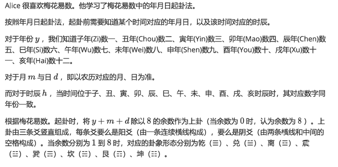
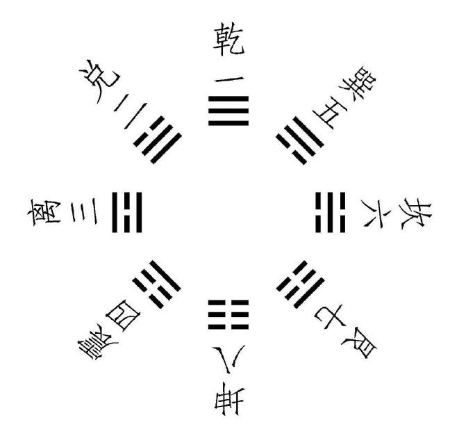
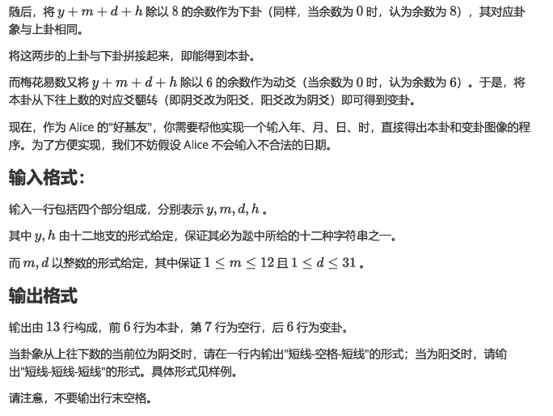
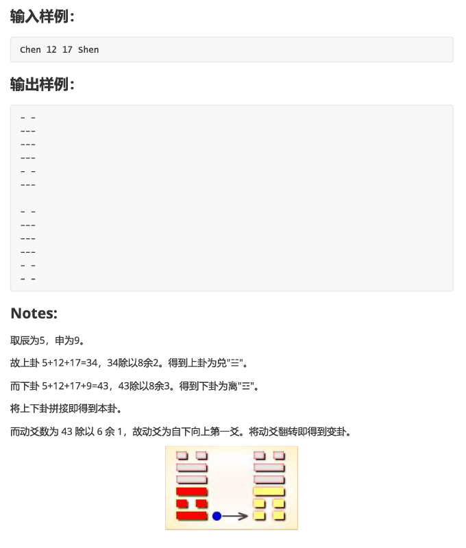
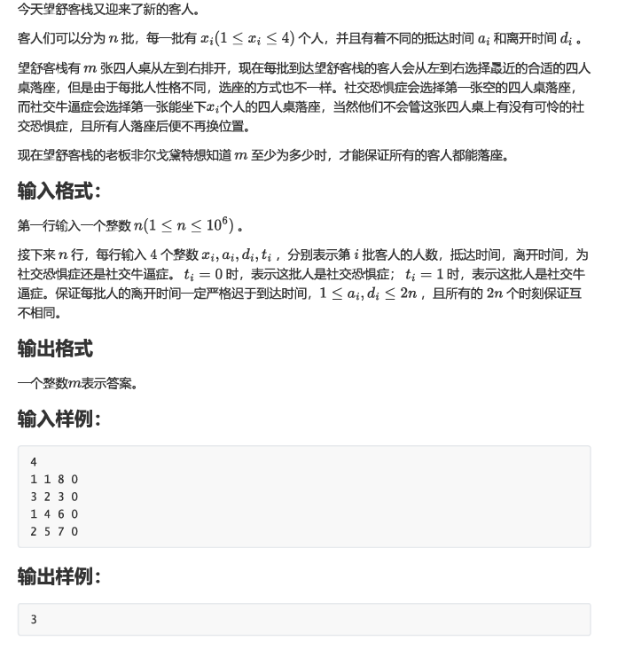

此题单为进阶的输入/输出专题练习，如果你能通过并理解这里的全部题目，那么几乎所有题目的输入/输出都不会难倒你 OwO

对于部分题目的 C/C++ 友情提示：(请自行判断每道题有多少条提示需要遵循)

1. 请开 long long，会爆 int。
2. 如开数组，请设为全局，否则会爆局部函数(单个函数内存允许约为 2MB)。
3. 使用较快的输入/输出方式如 scanf 或关闭同步流。


## I/O练习 1

对长为 $|s|$ 的数组 $s$，定义函数 $f(s,x)=\sum_{i=1}^{|s|}s_i^x$。

输入第一行一个整数 $x(1\le x\le5)$。

接下来输入一行 $n(1\le n\le10^5)$ 个整数 $a_i(0\le a_i\le580)$。

接下来输入一行 $m(1\le m\le10^5)$ 个整数 $b_i(0\le b_i\le580)$。

输出一行一个整数 $f(n,x)-f(m,x)$。

```c++
2
1 2 3
4 5
```

```c++
-27
```


## I/O练习 2

输入第一行一个整数 $t(1\le t\le10^5)$，代表询问个数。

接下来输入 $t$ 行，每行一个字符串，格式为下面几种之一($x,y$ 为整数且 $1\le x,y\le10^9$)

1. `calculate x plus y`
2. `calculate x minus y`
3. `calculate x multiplied by y`
4. `calculate the quotient of x over y`
5. `calculate the remainder of x divided by y`

每个询问输出一行一个整数，根据输入的不同，分别代表：

1. $x+y$
2. $x-y$
3. $x\times y$
4. $\lfloor\dfrac xy\rfloor$ (即除法求商)
5. $x\bmod y$ (即除法取余)

```
5
calculate 114514 plus 1919810
calculate 1919810 minus 114514
calculate 114514 multiplied by 1919810
calculate the quotient of 1919810 over 114514
calculate the remainder of 1919810 divided by 114514
```

```c++
2034324
1805296
219845122340
16
87586
```


## I/O练习 3

给定三维整型数组 $s[x][y][z]$，$x,y,z$ 三维长度分别是 $a,b,c$，下标从 $1$ 计数；

已知 $sgn(x)=\begin{cases}1&,x > 0\\-1&,x < 0\\ 0&,x=0\end{cases}$；

求$\sum_{i=1}^a\sum_{j=1}^b\sum_{k=1}^csgn(s[i][j][k]+s[a-i+1][b-j+1][c-k+1])$。

输入一行三个整数 $x,y,z(1\le x,y,z,x\cdot y\cdot z\le10^6)$。

接下来输入 $x$ 行，每行 $y\times z$ 个整数，且第 $y,2y,\cdots,zy$ 个整数后面带有分割符 `/`。分割符、整数间均以一个空格间隔。

保证输入 $s$ 满足 $-10^9\le s[x][y][z]\le10^9$。

输出一行一个整数代表答案。

```c++
4 2 3
1 1 4 / 5 1 4
1 9 1 / 9 8 10
1 4 37 / 5 8 0
2 3 3 / 6 6 6
```

```c++
24
```

```c++
4 3 2
-1 1 / 4 5 / 1 -4
1 9 / -1 9 / 8 10
1 4 / -37 5 / 8 0
2 -3 / 3 6 / 6 -6
```

```c++
8
```

对样例 $1$，显然所有结果均为正数，故答案为 $4\cdot2\cdot3=24$。


## I/O练习 4

给定三个参数 $m,x,y$ 和字符串 $s$。依次进行如下处理：

1. 若 x=`Y`，将 $s$ 的所有 `a` 字符替换为 `b`，所有 `b` 子串替换为 `a`(均区分大小写)，否则不替换；
2. 若 y=`Y`，将 $s$ 所有小写字母全部转换为大写字母，否则不转换；
3. 输出 $m$ 次处理后的字符串，一行输出一个。

输入若干个询问，每个询问有两行。保证总询问数不超过 $10$ 个。

第一行一个整数 $m(1\le m\le3)$ 和两个字符 $x,y$，其取值均为 `Y` 或 `N`。

第二行一个只由大小写英文字母、空格组成字符串 $s(1\le |s|\le 10^5)$。保证 $s$ 至少有一个英文字母。

请注意**不保证**输入的最后一个字符是 `\n`(即输入不一定含空行)。

对于每个询问，输出 $m$ 行处理后的字符串。

```c+
3 N N
aA cde bB i
1 Y N
aA cde bB ii
1 N Y
aA cde bB iii
2 Y Y
aA cde bB iv
```

```c+
aA cde bB i
aA cde bB i
aA cde bB i
bA cde aB ii
AA CDE BB III
BA CDE AB IV
BA CDE AB IV
```


## vector

给定一个初始长为 $n$ 的数列 $a$，下标从 $1$ 开始。共有 $m$ 次操作，类型如下：

1. 在下标 $i$ 处插入元素 $x$，原下标 $i$ 及往后的元素往后移动让位。
2. 删除下标 $i$ 的元素，$i$ 往后的元素往前移动补位。
3. 修改下标 $i$ 的元素值，将其改成 $x$。
4. 查询并输出下标 $i$ 的元素。

对于任意时刻，如果此时下标 $i$ 大于数列长度，忽略此次操作。

输入一行两个整数 $n,m(1\le n,m\le10^5)$。

接下来输入一行 $n$ 个整数，代表初始 $a_i(1\le a_i\le10^9)$。

接下来输入 $m$ 行，每行第一个整数为 $c(1\le c\le4)$，代表操作类型：

1. 若 $c=1$ 或 $c=3$，接下来再输入两个整数 $i,x$。
2. 若 $c=2$ 或 $c=4$，接下来再输入一个整数 $i$。

保证 $1\le i\le2\times10^5,1\le x\le10^9$。保证插入和删除操作总和不超过 $100$ 次。

对每个不被忽略的操作 $4$，输出一行一个整数，代表查询值。

```c++
3 12
10 20 30
1 4 114514
1 1 40
4 5
4 1
4 2
2 5
2 2
4 2
4 3
3 4 1919810
3 1 50
4 1
```

```c++
40
10
20
30
50
```


## priority_queue

定义二元组 $(x,y)$ 的大小关系为先按 $x$ 比较，若相同按 $y$ 比较。如 $(1,1)<(1,2)<(2,1)<(2,2)$。

给定一个二元组列表，维护 $m$ 次下列操作：

1. 插入一个二元组 $(x,y)$。
2. 若存在至少一个二元组 $(x,y)$，删除最小的 $(x,y)$；如果有多个最小的，任删一个；否则忽略此次操作。
3. 查询并输出最小的二元组。若列表为空，忽略此次操作。

输入一行一个整数 $m(1\le m\le10^5)$，代表操作次数。

接下来输入 $m$ 行，每行格式为下面三种之一：

1. 三个整数 $1,x,y$，代表操作 $1$。
2. 一个整数 $2$，代表操作 $2$。
3. 一个整数 $3$，代表操作 $3$。

保证 $1\le x,y\le10^9$。注意输入可能会使得列表存在重复元素。

对于每个操作 $3$，输出一行两个整数，依次代表 $x,y$。

```c+
9
3
1 1 2
1 1 1
3
2
3
2
3
2
```

```c++
1 1
1 2
```

建议分别使用 pair 和手写结构体两种解法实现。


## set

给定一个长为 $n$ 的数组 $a$，请将其去重并按升序输出去重后结果。

输入一行两个整数 $n(1\le n\le10^5)$。

接下来输入一行 $n$ 个整数，代表 $a_i(0\le a_i\le10^9)$。

首先输出一行一个整数，代表去重后数组 $a$ 的长度。 

接下来输出一行若干个整数，代表去重后升序排序的数组 $a$。

```c+
7
1 9 1 9 8 1 0
```

```C+
4
0 1 8 9
```

本题也可以使用数组排序的方法来做，建议也尝试一下。


## set2

给定 $n$ 条直线 $A_ix+B_iy+C_i=0$ 组成的集合 $S$，有 $m$ 次询问，每次输入直线 $l:Ax+By+C=0$，并询问：

1. 找到 $S$ 满足斜率等于 $l$ 的直线 $l':A'x+B'y+C'=0$，输出 $C'$；若不存在 $l'$，输出 `no`。
2. 找到 $S$ 满足斜率大于 $l$ 的直线里斜率最小的一条直线 $l':A'x+B'y+C'=0$，输出 $C'$；若不存在 $l'$，输出 `no`。
3. 找到 $S$ 满足斜率小于 $l$ 的直线里斜率最大的一条直线 $l':A'x+B'y+C'=0$，输出 $C'$；若不存在 $l'$，输出 `no`。

特别地，若斜率不存在，我们认为斜率最大。

输入一行两个整数 $n,m(1\le n,m\le10^5)$。

接下来输入 $n$ 行，每行三个整数 $A_i,B_i,C_i(-10^9\le A_i,B_i,C_i\le10^9,A_i > 0,A_i,B_i$ 不同时为零 $)$，代表第 $i$ 条直线。保证所有 $n$ 条直线斜率互异。

接下来输入 $m$ 行，每行三个整数 $A,B,C(-10^9\le A,B,C\le10^9, A > 0,AB$ 不同时为零 $)$，代表一条询问的直线 $l$。

对每条询问的直线 $l$，在一行内以空格隔开输出上述的三个值。

```c+
5 3
3 -3 1
2 -4 2
2 -1 3
1 0 4
0 1 5
1 -2 6
1 2 7
-5 0 8
```

```c++
2 1 5
no 5 no
4 no 3
```

注：本题的强化版为 `寄蒜几盒`，可在本 OJ 找到，感兴趣可自行挑战。


## map

给定 $n$ 个字符串 $S$，按照出现频率降序排列这些字符串输出。若频率相同，按字典序升序排序。

输入一行一个整数 $n(1\le n\le10^5)$。

接下来输入 $n$ 行，每行一个只由小写字母组成的字符串 $S_i(1\le |S_i|,\sum |S_i|\le10^6)$。

按序输出若干行，每行一个字符串和一个整数，代表该字符串出现频次。

```c+
21
pen
apple
applepen
pen
pineapple
pineapplepen
applepen
pineapple
penpineappleapplepen
penpineappleapplepen
dancetime
pen
pen
longpen
apple
pineapple
applepineapple
longpen
applepineapple
penpineappleapplepen
penpineappleapplepen
```

```c++
pen 4
penpineappleapplepen 4
pineapple 3
apple 2
applepen 2
applepineapple 2
longpen 2
dancetime 1
pineapplepen 1
```


## bitset

有 $n$ 个集合，编号从 $1$ 到 $n$。一开始第 $i(1\le i\le n)$ 个集合 $S_i$ 只有第 $i$ 号元素。接下来进行 $m$ 次操作，每次操作选定当前第 $u,v(1\le u,v\le n)$ 个集合 $S_u,S_v$，并更改这两个集合为 $S_u=S_v=S_u\cup S_v$。每次操作建立在上一次操作的基础上。问全部操作结束后有多少个集合拥有全部 $n$ 个元素，升序输出所有这些集合的编号。若没有一个集合满足，输出 `-1`。

输入一行两个整数 $n,m(2\le n\le5\times10^4,1\le m\le5\times10^4)$。

接下来输入 $m$ 行，每行两个整数 $u,v(1\le u,v\le n,u\neq v)$。

输出一行若干个整数，代表集合编号或 `-1`。

```c++
5 4
1 2
2 3
3 4
4 5
```

```c++
4 5
```

```c++
5 4
2 3
3 4
1 2
2 5
```

```c++
-1
```

如果觉得这道题太简单，可以做一下 [这道题](https://www.luogu.com.cn/problem/AT5696)。本题的出题思路节选自这道题的部分解答过程。


## 梅花易数









来源：2022 GDCPC 广东省大学生程序设计竞赛


## 星月学语

白茶发现每次与星月交互，它的回答都很不理想。为了让星月拥有更高的语言智能，白茶请教了这学期选修 NLP 的桑泽。桑泽给出了一系列训练方案，其中最基础的第一步是分词训练。具体而言，每一个输入的句子，星月都应当能划分出每个单词。为了检验成果，桑泽一口气说了许多句子，并提问每个句子里包含特定单词多少个。

特别注意，句子中包含的单词本身不能是另外一个单词的一部分，例如对下面句子：`he is hell, he is heaven, hehe!` ，查找单词 `he` ，因为 `he` 是 `hell` , `heaven` , `hehe` 的一部分，所以它们都不算入内，句子只包含两个 `he` 。

输入一行一个整数 $n(1\le n\le20)$ ，代表测试个数。

每个测试测试包含两行。第一行输入一个仅由小写英文字母、空格和标点符号 `,?!.'"-` 组成的长度不超过 $100$ 的非空字符串 $s$ ；第二行输入一个仅由小写英文字母组成的长度不超过 $100$ 非空字符串 $t$

对于每个测试，输出一行一个整数，代表 $s$ 中包含多少个单词 $t$

###### 输入样例1

```c++
3
nishuo zhinengbumen, zhinengbumen, yi, yijie yijie yijie huanle duoshaoge zuqiuxiehuizhuxi la?
yijie
yi, shu wan tai guo dui shu yue nan zai shu mian dian, jie xia lai mei ren ke shu le.
ying
ni dao gao su wo zen me jie shi?lian, lian dou bu yao le.
lian
```

###### 输出样例1

```c++
3
0
2
```

###### 输入样例2

```c++
2
tonight eight p.m., i am waiting you at sand city.
i
easy-play, rhythm-bright, one people ak kill whole area.
play
```

###### 输出样例2

```c++
1
1
```

###### 提示

你不必考虑英语或其他语言语法，例如你不应该认为 `has`, `having`, `had` 都是单词 `have` ，也不用认为 `i'm` 包含 `am` (但是在本题你应当认为 `i'm` 包含 `i` 和 `m`) 

对 C/C++ 选手， OJ 不可用 `gets` 函数，你可以用 `fgets`, `getline` 等函数代替


## 望舒客栈的每日委托



来源：2022 GDCPC 广东省大学生程序设计竞赛
