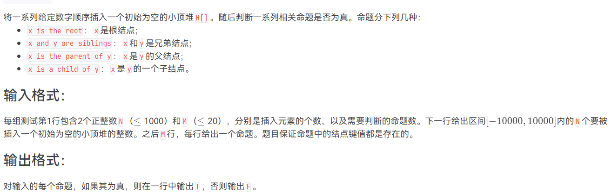
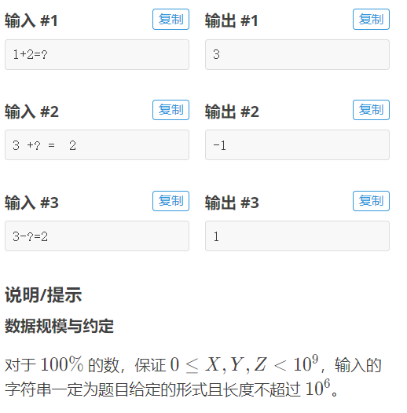
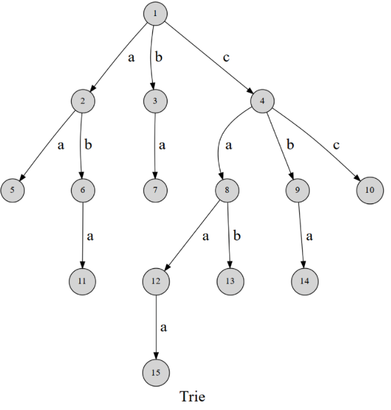

# 2022 香农先修班第十二次课

<div style="background-color:#cde6c7;color:#1d953f;font-size:26px;font-weight:900" align="center">字符串</div>


## 字符串基础

### 概念基础

字符集：可以比较大小的元素值的集合(例如 ASCII 集合是一个字符集)(算法题通常是 $26$ 个小写字母组成字符集)

字符：$s$ 字符集的元素

**字符串** $S$ ：简称**串**。$n$ 个字符组成的有限序列。字符串**长度** $|S|=n$ 。设 $s_i$ 是字符，$s_i$ 在串中出现的序号是该字符在串中的位置，则字符串可记作 $S=s_1s_2\cdots s_n$ 。字符串下标从 $1$ 开始算，第 $i$ 个字符(位置 $i$ )表示为 $S[i]$ (有的文献下标从 $0$ 算，表示为 $S[i-1]$ ，本文各处下标从 $1$ 开始算)。

**子序列** : $S$ 的子序列是从 $S$ 中将若干元素选出来，相对位置不变，形成的字符串，即 $S[p_1],S[p_2],\cdots, S[p_k],1\le p_1 < p_2 < \cdots < p_k\le |S|$ 

例如对字符串 `baicha` ，`bai` , `bc` ,  `baicha` (满串) , 空串是它的子序列， `cb` , `baj`不是子序列

**子串**：$S$ 的子串 $S[i..j] (i\le j)$ 表示 $S$ 串里 $S[i],S[i+1],\cdots ,S[j]$ 顺次形成的子串(即子串是连续字符组成的子序列)。若 $i > j$ 表示空串。对子串 $S[i..j]$， $S$ 称为它的**主串**。

例如对字符串 `baicha` ，`bai` , 满串 , 空串，`b` , 是它的子串，`bc` 不是子串

**前缀** : $S$ 的从串首开始到某位置 $i$ 的子串 $S[1..i]$ ，记作 $Prefix(S,i)$ 

**真前缀** 是除了 $S$ 本身的前缀

例如对字符串 `baicha` ，有六个前缀 `b`, `ba`, `bai`, `baic`, `baich`, `baicha`，五个真前缀(除去 `baicha`)

**后缀** : 从某位置 $i$ 到串尾的子串 $S[i..|S|]$ ，记作 $Suffix(S,i)$

**真后缀** 是除了 $S$ 本身的后缀

> 注：有的文献说空串也是前缀和后缀

例如对字符串 `baicha` ，有六个后缀 `a` , `ha` , `cha` , `icha` , `aicha` , `baicha`

**回文串**：满足 $\forall 1\le i\le |S|,S[i]=S[|S|-i+1]$ 的字符串

例如 `abcba` , `aaaa` , `a` , `烧风风烧` 是回文串， `abcbc` 不是回文串

**字典序**：对串 $X,Y$ ，定义 $X < Y$ 为下面两种情况之一：

1. $|X| < |Y|$ 且 $\forall 1\le i\le |X|,X[i]=Y[i]$
2. $\exist 1\le k\le \min(|X|,|Y|)$ , $\forall 1\le j < i, X[j]=Y[j]$ 且 $X[i] < Y[i]$

人话：记空字符 `\0` 值为 $0$ ，逐个位置比较两串各字符的数值大小，直到可以区分为止。

> 通俗理解就是字面含义：将它放到字典里的排序

例如：① `a` < `abandon` < `able` < `ably` < `ac` < `wa` ;② `0` < `AC` < `ac`

**匹配**：在主串 $S$ 寻找子串 $T$ 的过程， $T$ 称为**模式**。匹配又名模式匹配。匹配成功返回子串首字符在主串的位置，失败返回 $0$ 。


### 语法基础

> 自学 

通常而言， C 风格字符串更好写代码（相对地，效率偏低一些）。具体用哪种看情况而定(经验上，复杂模拟类的操作多用 `std::string` ，其余用 C 风格字符串)

#### C 风格字符串

常用函数：(除 `strstr, strtok` 为 $O(nm)$ ，复杂度均为 $O(n)$ )

- `cin.getline(char* s, int len)` 读整行
- `sscanf(char* s, 接上scanf的参数)`  以字符串 $s$ 为输入，按 `scanf` 规则读取变量值
- `sprintf(char* s, 接上printf的参数)` 按 `printf` 规则输出结果到字符串 `s`
- `strncmp(char* s1, char* s2, int n)` 比较 $n$ 位字符
- `strcat(char* s1, char* s2)` $s1=s1+s2$ 
- `strstr(char* s1, char* s2)` 在主串 $s1$ 进行模式匹配 ，返回首个匹配成功地址或 `NULL` 
- `strchr(char* s1, char s2)` 模式匹配
- `strchr(char* s1, char s2)` 模式匹配(从右开始)
- `strtok(char* s1, const char* sep)` 子串分割(用法见下方示例代码)

取子串：地址偏移运算 `s+pos1, s+pos2` (保存起来可以 `strncpy` 等方法)


#### std::string

字典序的实现：`set<string>` , `map<string, ?>` 

常用构造函数：

- `string(C风格字符串)`
- `string(int i, char c)` 构造 $i$ 个字符 c

常用方法：(复杂度都是暴力实现的复杂度)

- `+, =, ==, +=, <, <=, >, >=`  (\+, \+\= 是 $O(1)$ 的, 其他是 $O(n)$ 的)

- `size()` $O(1)$ 

- `c_str()` 转换为 C 风格字符串(后者转`std::string`用构造函数)

- `substr(int start[, int len])` 从下标 start 开始截长度len的子串

- `append(string s)` 或 `push_back(char c)` 末尾增加，等效于 `+=`  

- `find(char/string s, start=0)` 从 start 下标开始找第一个出现的子串，返回出现下标或 $-1$

  此外还有 `find_first_of` , `find_last_of` , `find_first_not_of` , `find_last_not_of` 

- `substr(int start[, int len])` 从 start 下标开始截长为 len 的子串(缺省则截到尾)

- `erase(int pos, int n)` 删除 pos 下标开始的 n 个字符

- `insert(int pos, string s)` 在 pos 位置插入字符串 s 

- `append(string s, int pos, int n)` 等于 `append(s.substr(pos,n))` 

- `back()` 取最后一个字符

常用函数：

- `reverse(首迭代器, 尾迭代器)` 反转传入的字符串
- `getline(cin, string)` 读整行(注意跟 `cin.getline` 区分)
- `to_string(any)` 其它数值类型转 `std::string` (注：char 会视为 int，不能传C风格字符串)
- `stoi` , `stol` , `stof` , `stod` ，字符串转 `int, long long, float, double`
- `lexicographical_compare(迭代器a首, 迭代器a尾, 迭代器b首, 迭代器b尾)` 字典序比较两容器(不一定是字符串)
- `replace(首迭代器, 尾迭代器, 待替换字符, 替换成的字符)` 批量替换
- `count(首迭代器, 尾迭代器, 字符)` 字符出现次数统计


#### std::stringstream

中文名：字符串流

常用于处理一行输入未知数量个数据，然后获取每个数据

构造函数：`stringstream 变量名(一个string)` 

从字符串流里面获取一个数据： `字符串流变量名 >> 变量` ， 类比：`cin >> 变量` 和 C风格的 `sscanf`

也可以将输入传入字符串流：`字符串流变量名 << 变量` ，类比： `cout << 变量` 和 C风格的 `sprintf` 


#### 示例代码

对比这两种字符串实现的代码复杂程度：

##### C风格字符串

```c++
#include <bits/stdc++.h>
using namespace std;
char s[] = "smile, sweet, sister, sadistic, suprice, space, sos", r[30], prefix[30], suffix[30];
set<string> t;
decltype(strchr(s, ' ')) pos, pre = s; //即char* pos
signed main()
{
    printf("%d\n", strlen(s));
    while ((pos = strchr(s, ','))) //所有逗号替换为空格模板
        s[pos - s] = ' ';
    s[strlen(s)] = ' ';              //增加行末空格方便处理
    while ((pos = strchr(pre, ' '))) //字符串分割模板
    {
        strncpy(r, pre, pos - pre);
        r[pos - pre] = '\0';
        if (pos != pre)
            t.insert(r); //传入char*参数会自动转为string
        pre = pos + 1;
    }
    printf("%s\n", (++t.begin())->c_str());
    for (auto i : t)
    {
        strcpy(r, i.c_str());
        bool isPali = true;
        for (int i = 0, j = strlen(r) - 1; i < j; ++i, --j) //回文串模板
        {
            if (r[i] != r[j])
            {
                isPali = false;
                break;
            }
        }
        if (isPali)
        {
            printf("%s ", r);
        }
    }
    printf("\n");
    for (auto i : t)
    {
        strcpy(r, i.c_str());
        for (int i = 1, n = strlen(r); i < n; ++i) //真前/后缀所以不取等
        {
            strncpy(prefix, r, i);
            strncpy(suffix, r + n - i, i);
            if (strncmp(prefix, suffix, i) == 0) //判前后缀相等模板
            {
                printf("%s ", r);
                break;
            }
        }
    }
    return 0;
}
```


##### strtok

上述代码用 `strtok` 简化：

```c++
signed main()
{
    printf("%d\n", strlen(s));
    // ...前面保持不变
    const char *sep = ", ";   //必须const
    char *u = strtok(s, sep); // strtok用法模板
    while (u)
    {
        t.insert(u);
        u = strtok(nullptr, sep);
    }
    // ...后面保持不变
    printf("%s\n", (++t.begin())->c_str());
    
}
```


##### string

```c++
#include <bits/stdc++.h>
using namespace std;
string s = "smile, sweet, sister, sadistic, suprice, space, sos";
set<string> t;
signed main()
{
    cout << s.size() << '\n';
    s += ' ';
    int pos = 0, prev = 0;
    replace(s.begin(), s.end(), ',', ' ');
    while ((pos = s.find(' ', prev)) != -1) //分割字符串模板
    {
        string sub = s.substr(prev, pos - prev);
        if (sub.size())
            t.insert(sub);
        prev = pos + 1;
    }
    cout << (*(++t.begin())) << '\n';
    for (auto i : t)
    {
        string j = i;
        reverse(j.begin(), j.end());
        if (j == i)
            cout << j << ' ';
    }
    cout << '\n';
    for (auto u : t)
        for (int i = 1; i < u.size(); ++i)
            if (u.substr(0, i) == u.substr(u.size() - i, i))
                cout << u << ' ';
    return 0;
}
```


##### stringstream

```c++
#include <bits/stdc++.h>
using namespace std;
signed main()
{
    //输入
    stringstream ss("1 3 5 7");
    int v, sum = 0;
    while (ss >> v)
        sum += v;
    cout << sum << '\n';

    //输出
    string s[] = {"abc", "def", "ghi", "jklmn"};
    stringstream ss2;
    ss2 << "QwQ"; //如果放构造函数里首次<<会把构造的初始内容覆盖掉
    for (auto i : s)
    {
        ss2 << ("," + i);
    }
    cout << ss2.str();
    return 0;
}
```


##### stringstream2

例题：(天梯赛真题 `L2-012 关于堆的判断`)



输入判断逻辑方法一：先读整数 $x$，若紧接着读到 `and` ，是命题 2 并马上读整数 $y$ ；否则，若读到第二个字符串是 `a` ，是命题 4 ，舍弃两字符串然后读 $y$ ；否则，若第三个字符串是 `root ` ，是命题 $1$ ，否则是命题 $3$ ，并舍弃四字符串后读 $y$ 

输入判断逻辑方法二：若字符串含 `root` 是命题 $1$ ，以此类推……找每个命题独一无二的单词作为判断依据，然后根据格式选择舍弃多少个无效字符

参考代码：(方法二)

```c++
#include <bits/stdc++.h>
using namespace std;
#define mn 1002
#define mm 22
typedef int ll;
ll h[mn], n, m, v;
map<ll, ll> idx;
string s, t;
char jud[] = "FT";
void hpdf(ll i)
{
    if (i <= 1)
        return;
    ll f = i >> 1;
    if (h[i] < h[f])
    {
        swap(h[i], h[f]);
        hpdf(f);
    }
}
signed main()
{
    scanf("%d%d", &n, &m);
    for (ll i = 1; i <= n; ++i)
    {
        scanf("%d", &v);
        h[i] = v;
        hpdf(i);
    }
    for (ll i = 1; i <= n; ++i)
        idx[h[i]] = i;
    cin.ignore();
    while (m--)
    {
        getline(cin, s);
        stringstream ss(s);
        ll a, b;
        ss >> a;
        if (s.find("root") != -1)
        {
            printf("%c\n", jud[a == h[1]]);
        }
        else if (s.find("siblings") != -1)
        {
            ss >> t >> b;
            printf("%c\n", jud[(idx[a] ^ idx[b]) == 1]);
        }
        else if (s.find("parent") != -1)
        {
            ss >> t >> t >> t >> t >> b;
            printf("%c\n", jud[(idx[b] >> 1) == idx[a]]);
        }
        else if (s.find("child") != -1)
        {
            ss >> t >> t >> t >> t >> b;
            printf("%c\n", jud[(idx[a] >> 1) == idx[b]]);
        }
    }
    return 0;
}

```


##### substr应用

> 一道阴间题 [原题](https://www.luogu.com.cn/problem/P1689)
>
> 
>
> 

特别注意可能会有这样的样例：` 1 1 45 1  4 + ?=  19191 80` ，即数字间也有空格

处理思路：先读行然后删掉输入的全部空格，得到无空格字符串 $s$ ，然后按 `=` 和 `+` 或 `-` 运算符分割 $s$ 成三部分 $X,Y,Z$ ，然后分别对其转化为整数或未知数。

然后判断哪个是未知数，设符号为 $sgn$ ，原式为 $X+sgn\cdot Y=Z$ ，然后求解即可

```c++
#include <bits/stdc++.h>
using namespace std;
typedef long long ll;
#define sc(x) scanf("%lld", &x)
string s0, s;
ll sgn = 1, i_eq, i_op, a, b, c;
void f(ll &x, string s)
{
    if (s == string("?")) // 即 if (s == "?")
    {
        x = -1;
    }
    else
    {
        x = stol(s);
    }
}
signed main()
{
    getline(cin, s0);
    for (auto i : s0)
    {
        if (!isspace(i))
        {
            s.push_back(i);
        }
    } //手动去除全部空格： 1  1  3 + 2 = ? => 113+2=?
    i_eq = s.find('=');
    f(c, s.substr(i_eq + 1));
    i_op = s.find('+');
    if (i_op == -1)
    {
        sgn = -1;
        i_op = s.find('-');
    }
    f(a, s.substr(0, i_op));
    f(b, s.substr(i_op + 1, i_eq - 1 - (i_op + 1) + 1));
    if (a == -1) // a+sgn*b=c => a=c-sgn*b
    {
        printf("%lld", c - sgn * b);
    }
    else if (b == -1) // a+sgn*b=c =>b=(c-a)/sgn
    {
        printf("%lld", (c - a) / sgn);
    }
    else // a+sgn*b=c => c=a+sgn*b
    {
        printf("%lld", a + sgn * b);
    }
    return 0;
} //输入: 1 1 45 1  4 + ?=  19191 80
```


## 字符串哈希

### 哈希函数

核心思维：用哈希函数 $f$ 将字符串映射为整数，比较整数是否相等，即等于比较字符串是否相等

常用的哈希函数：设素数 $p=131$ (或 $13331,2333$ 等，下面都设 $p=131$ )，对字符串 $S=s_1\cdots s_n$ ，设哈希函数 $h(S)$ 。对同一个字符串 $S$ ，为表达的方便起见，简写 $h(i)$ 表示 $h(S[1..i])$ 。递推定义：
$$
\begin{cases}
h(1)=s_1\\
h(i)=h(i-1)\times p+s_i\quad ,i > 1
\end{cases}
$$
> 注：最终的哈希函数表达式不是这个，最终表达式请看下文

由：
$$
h(x)=h(x-1)\times p+s_x=(h(x-2)\times p+s_{x-1})\times p+s_x=\cdots
$$
最终展开，不难发现，$s_i$ 乘了 $|S|-i$ 次 $p$ ，即表达式为：
$$
h(x)=\sum_{i=1}^{x}s_i\cdot p^{x-i}=s_1p^{x-1}+s_2p^{x-2}+\cdots +s_xp^0
$$
> 例如对字符串 `abc` ,  计算得：

$$
h('abc')=97\times 131^2+98\times 131+99=1677554
$$

> 也可以用递推表达式从 $h(1)$ 开始算到 $h(3)$ ，结果一样


推论：对子串 $S[l..r]$ ，有  $h(S[l..r])=h(S[1..r])-h(S[1..l-1])\times p^{r-l+1}$

> 证明：
> $$
> \begin{align}
> h(S[l..r])&=s_lp^{(r-l+1)-1}+s_{l+1}p^{(r-l+1)-2}+\cdots+s_rp^{0}\\
> &=s_lp^{r-l}+s_{l+1}p^{r-l-1}+\cdots+s_rp^{0}
> \end{align}
> $$
>
> $$
> h(l-1)=s_1p^{(l-1)-1}+\cdots +s_{l-1}p^{(l-1)-(l-1)}
> $$
>
> 由于 $p^{r-l+1}\times p^{(l-1)}=p^{r-l+1+(l-1)}=p^r$ ，所以：
> $$
> h(l-1)\cdot p^{r-l+1}=s_1 p^{r-1}+s_2p^{r-2}+\cdots+s_{l-1}p^{r-(l-1)}
> $$
> 而：
> $$
> h(r)=s_1 p^{r-1}+s_2p^{r-2}+\cdots+s_{l-1}p^{r-(l-1)}+s_lp^{r-l}+\cdots+s_rp^0
> $$
> $h(S[1..r])-h(S[1..l-1])\times p^{r-l+1}$ ，发现前面 $S[1..l-1]$ 都消掉了，得：
> $$
> \begin{align}
> h(S[1..r])-h(S[1..l-1])\times p^{r-l+1}&=s_lp^{r-l}+\cdots+s_rp^0\\
> &=h(S[l..r])
> \end{align}
> $$
> 证毕。
>

根据推论，若已知任意 $h(i),1\le i\le |S|$ ，则可以用 $O(1)$ 复杂度求出任意 $|S|$ 的子串的哈希函数。

可以用预处理的方法 $O(n)$ 计算出 $\forall 0\le i\le n,p^i$ (也可以用快速幂， $O(n\log n)$ )，然后用递推式 $O(n)$ 计算出 $\forall 1\le i\le n, h(i)$ 。

那么对主串 $S$ 里匹配串 $T$ 的问题，可以再用 $O(|T|)$ 复杂度计算 $h(T)$ ，然后计算所有 $S$ 的长为 $|T|$ 的子串的哈希值(有且仅有 $|S|-|T|+1$ 个，分别是 $S[1..|T|],S[2..|T|+1], \cdots, S[|S|-|T|+1..|S|]$ )，然后比较每个 $S$ 子串哈希值是否跟 $T$ 一样，如果是就说明匹配到了。

总时间复杂度为 $O(|S|+|T|)$ 。


理解哈希表达式：

我们知道，$10$ 进制数 $\overline{a_na_{n-1}\cdots a_0}$ 可以表示为 $a_0\times10^0+a_1\times 10^1+\cdots+a_n\times 10^n$ ，例如 $580=0\times 10^0+8\times10^1+5\times 10^2$ 。在上述表达式 $h(x)$ 中，我们实际上是把字符串看成了 $p$ 进制数，每个位的取值就是当前位的 ASCII 码。因为 ASCII 码值域是 $[0,127)$ ，所以可以选取不小于 $127$ 的任一素数。

在上面的式子里，其实是能够保证 $0\%$ 的哈希冲突，这可以类比哈希函数 $h'(x)=x$ ，但是因为 $p$ 进制数很大(在上面例子看到， $3$ 位就 $1.6\times 10^6$ 了)，如果一直这么算下去，很快就会爆 `long long` ，而如果使用高精度来存 $h(x)$ ，进行一次高精度运算的复杂度是 $O(n)$ 的(本质上是逐个十进制位模拟运算)，所以我们不能直接用上面的函数，而是考虑对其进行“截断”。为此，可以让其进行取模，如新的 $h(x)$ 定义为原本的 $h(x)\bmod M$ ，通常我们取 $M=2^{64}$ ，假设哈希值均匀分布，那么发生冲突的概率为 $\dfrac1{M}\approx 5.4\times 10^{-20}$ (事实上不是均匀分布的，所以真实冲突概率比这个大)。而为了让哈希值尽可能地均匀分布，所以取 $p$ 是素数(实践表明，素数的冲突率最低；严格证明感兴趣的话找 [oi-wiki](https://oi-wiki.org/string/hash/) )。

因此，最终的哈希函数为：
$$
\begin{cases}
h(1)=s_1\\
h(i)=(h(i-1)\times p+s_i)\bmod 2^{64}\quad ,i > 1
\end{cases}
$$


### 代码

实现技巧：

- 使用 `unsigned long long` ，它的溢出等效于自动对 $2^{64}$ 取模，所以不需要再额外使用取模操作

注意的细节：

- 特别注意计算 $h(S[1..r])-h(S[1..l-1])\times p^{r-l+1}$ 时，不要算错 $r,l-1$ 和 $r-l+1$ ，如果害怕化简算错可以不化简，直接先赋值变量 $l,r$ 再直接代入即可
- 预处理 $p^i$ 时，注意要从 $i\ge 1$ 开始递推，如果从 $i=0$ 开始递推 $p^i=p^{i-1}\times p$ ，那么会越界访问下标 `0-1` ，通常得到全 `0` 的结果，使得后续子串哈希值枚举调试发现越来越大，因为减法的减数为 `0` ，被减数不断增大

参考模板代码：(输出所有匹配位置)

```c++
#include <bits/stdc++.h>
using namespace std;
typedef long long ll;
typedef unsigned long long ull;
#define mn 2000010
char s[mn], t[mn];
ull p = 131, pw[mn], h[mn], ht, n, m, cnt;
signed main()
{
    pw[0] = 1;
    for (ll i = 1; i < mn; ++i)
    {
        pw[i] = pw[i - 1] * p;
    }
    scanf("%s%s", s, t);
    n = strlen(s), m = strlen(t);
    for (ull i = 0; i < n; ++i)
    {
        h[i + 1] = h[i] * p + s[i];
    }
    for (ull i = 0; i < m; ++i)
    {
        ht = ht * p + t[i];
    }
    for (ull lf = 1, rf = m; rf <= n; ++lf, ++rf)
    {
        if (h[rf] - h[lf - 1] * pw[rf - lf + 1] == ht)
        {
            printf("%lld ", lf), ++cnt;
        }
    }
    if (!cnt)
    {
        printf("-1"); // not found
    }
    return 0;
}
```

更多应用参见 `巩固提升题` 。


## KMP

### 概念引入

> 全称：Knuth-Morris-Pratt 算法，这是三个发明者的名字

> 算法引入：我们来看一个这样的匹配：主串 $S$ 为 `abababababc` ($5$ 个 `ab`) ，模式串 $T$ 为 `ababc` ，采用暴力逐字符对比的方式匹配时，有如下过程：
>
> ```c++
> abababababc
> ababc
> //step1: 在S的第五个位置,T的第五个位置失配(耗费O(5))
> 
> abababababc
>  ababc
> //step2: 在S的第六个位置,T的第一个位置失配(耗费O(1))
> 
> abababababc
>   ababc
> //step3: 在S的第七个位置,T的第五个位置失配(耗费O(5))
> 
> //...如此形成周期，直到最后匹配成功：
> abababababc
>       ababc
> //step7: 在S的第十一个位置,T的第五个位置成功(O(5))
> ```
>
> 我们发现执行效率很低 (事实上是 $O(|S|\times |T|)$) ，那么假设不使用字符串哈希，能不能用别的算法来优化呢？

### 前缀函数定义

> 事实上更好的过程应当是先数学推导最后看具体步骤和代码的，但是考虑到这么做对初学者理解难度过高，所以我们先看具体步骤和代码，最后再看数学推导这些步骤和代码为什么合理
>
> P.S. :如果你实在无法理解数学推导，那么最起码先把代码背下来(往后更难理解推导过程的算法会更多)

先来看看 KMP 算法的前置知识——前缀函数：

> `oi-wiki` 是以下标从 $0$ 开始的定义，为理解方便，这里是以下标 $1$ 开始的定义

定义长为 $n$ 的字符串 $S$ 的**前缀函数**  $\pi(i)$ 是子串 $S[1..i]$ 里最长相等的真前缀与真后缀的长度，如果没有相等的就定义为 $0$ 。数学定义是：
$$
\pi(i)=\max_{k\in[0,i]}(S[1..k]=S[i-k+1..i])\quad,1\le i\le n,k\in Z
$$

> 以 $S=$ `abababc` 为例，有：
>
> $\pi(1)=0$ ，因为 $S[1..1] = $`a` 没有任何真前缀或真后缀；用数学定义的话，$k$ 只能取 $0$ ，得到两个空串 $S[1..0],S[2..1]$ ，空串等于空串，所以函数值为 $0$
>
> $\pi(2)=0$ ，$S[1..2]=$`ab` 的唯一真前缀是 `a` ，真后缀是 `b` ，不等所以为 $0$ 
>
> $\pi(3)=1$ ， $k=1$ 时，有 $S[1..1]=S[3..3]$ ，其余 $k$ 前后缀不等
>
> $\pi(4)=2$ ， $k=2$ 时，有 $S[1..2]=S[3..4]$ ，其余 $k$ 前后缀不等
>
> $\pi(5)=3$ ， $k=1,3$ 时，分别有 `a`=`a` , `aba`=`aba` ，其余不等，取最大 $k$ 所以得 $3$ 
>
> $\pi(6)=4$ ， $k=2,4$ 时，分别有 `ab`=`ab`, `abab`=`abab` ，其余不等
>
> $\pi(7)=0$ ，找遍 $k$ ，即：`a`,`c`  ;  `ab`,`bc`  ;  `aba`,`abc` ...  `ababab`,`bababc` 没有相等的


### KMP匹配

定义完前缀函数后，可以描述 KMP 算法匹配过程伪代码如下：

```python
求出模式串 T 的每个前缀函数值 kmp
定义变量 j 是当前模式串 T 的前 j 个字符匹配成功 (初始j=0)
枚举主串 S 的每一个位置下标 i:
    while S[i] 不等于 T[j+1] 并且 j>0:
    #前j个成功了，继续看下一个 j+1 是否成功。如果没成功且j>0不向下越界
        j=kmp[j]
        #那么失配，找到不失配的最长位置是kmp[j](下文解释理由)
    如果 S[i] 等于 T[j+1]: # 匹配成功
        j++
    如果 j = |T| 成立:
        输出匹配成功，在 S 的位置为 i-|T|+1
        j=kmp[j] #手动失配以重新开始下次匹配
```

如果伪代码比较抽象，可以看真实代码：

```c++
j = 0;
for (int i = 1; i <= lenS; i++)
{
    while (S[i] != T[j + 1] && j > 0)
        j = kmp[j];
    if (S[i] == T[j + 1])
        j++;
    if (j == lenT)
    {
        printf("%d\n", i - lenT + 1);
        j = kmp[j];
    }
}
```

> 以主串 $S$ 为 `ababababc` ($4$ 个 `ab`) ，模式串 $T$ 为 `ababc` 作为例子：
>
> 计算得：$\pi=(0,0,1,2,0)$ 
>
> ```c++
> i=1 : while第一个条件不成立,第一个if成立,故j=1
> //ababababc
> //a
> 
> i=2 : while第一个条件不成立,第一个if成立,故j=2
> //ababababc
> //ab
>   
> i=3 : while第一个条件不成立,第一个if成立,故j=3
> //ababababc
> //aba
> 
> i=4 : while第一个条件不成立,第一个if成立,故j=4
> //ababababc
> //abab
> 
> i=5 : while成立,
> 	第一次while时,j=4,执行:j=kmp[4]=2
> //ababababc
> //  ab
> 
> 	j=2时while第一个条件不成立,退出while
> 	  第一个if成立,故j=3
> //ababababc
> //  aba
> 
> i=6 : while第一个条件不成立,第一个if成立,故j=4
> //ababababc
> //  abab
> 
> i=7 : while成立,
> 	第一次while时,j=4,执行:j=kmp[4]=2
> //ababababc
> //    ab
> 
> 	j=2时while第一个条件不成立,退出while
> 	  第一个if成立,故j=3
> //ababababc
> //    aba
> 
> i=8 : while第一个条件不成立,第一个if成立,故j=4
> //ababababc
> //    abab
> 
> i=9 : while第一个条件不成立,第一个if成立,故j=5
> 	j=lenT=5,输出i-lenT+1=5,代表S[5..9]=T
> //ababababc
> //    ababc
> ```
>
> 
>
> 再来看一个例子： $S=$ `abaabadcabaabbaba` , $T=$ `abaabad` 
>
> 计算得 $\pi=(0,0,1,1,2,\ \ \ 3,0)$ 
>
> *如果您不能正确心算出这两个例子的前缀函数，建议您先缓一缓重新往上看*
>
> ```c++
> i=[1,6] : 仅第一个if成立, 一直 j++, 最后 j=6
> //abaabadcabaabbaba
> //abaaba
> 
> i=7 : if成立 j++, 
> //abaabadcabaabbaba
> //abaabad
> 
> 	匹配成功输出 1 , j=kmp[7]=0
> //abaabadcabaabbaba
> //
> 
> i=8 : while第二个条件不成立, 不改变 j
> //abaabadcabaabbaba
> //
> 
> i=[9..13] : 仅第一个if成立, 一直 j++, 最后 j=5
> //abaabadcabaabbaba
> //        abaab
> 
> i=14 : 匹配不成功, 进入while,j=kmp[5]=2,
> //abaabadcabaabbaba
> //           ab
> 
> 	还是while不成立,j=kmp[2]=0
> //abaabadcabaabbaba
> //             
> 
> 	while之后没有if成立，保持 j 不变
> 
> i=[15..18] : 仅第一个if成立, 一直 j++, 最后 j=3
> //abaabadcabaabbaba
> //              aba
> 	由于 j 不为 |T| , 所以最后匹配失败
> ```
>
> 
>
> 最后看一个例子：$S=$ `abacabafabacabacababacabacabad` , $T=$ `abacabacabad` 
>
> 可以计算得 $\pi=(0,0,1,0,1,\ \ \ 2,3,4,5,6,\ \ \ 7,0)$
>
> 下面给出每次 `j=kmp[j]` 时发生的变化：
>
> ```c++
> ...
> 
> //abacabafabacabacababacabacabad
> //abacaba
> 
> 进入 while
> //abacabafabacabacababacabacabad
> //    aba
> 
> //abacabafabacabacababacabacabad
> //      a
> 退出 while
> 
> ...
> 
> //abacabafabacabacababacabacabad
> //        abacabacaba
> 
> 进入 while
> //abacabafabacabacababacabacabad
> //            abacaba
> 
> //abacabafabacabacababacabacabad
> //                aba
> 
> //abacabafabacabacababacabacabad
> //                  a
> 退出 while
>     
> ...
> 
> //abacabafabacabacababacabacabad
> //                  abacabacabad
> 匹配成功
> ```


数学证明：

> 为表达的简便起见，设 $n_s=|S|,n=|T|$

失配而执行 `j=kmp[j]` 时，有：$S[i-j+1..i+1]\neq T[1..j+1]$，

且有 $S[i-j+1..i]=T[1..j]$ ①

根据 ① 可知：$\forall 1\le k'\le j, S[i-j+1..k']=T[1..k']$ 

> 举例：因为 `ababa` = `ababa` ，所以 `a=a`,  `ab=ab`,  `aba` = `aba` ,  `abab=abab`

取 $k=kmp[j]$ ，有：$S[i-j+1..k]=T[1..k]$ ②

根据前缀函数的定义，此时 $T$ 长为 $k$ 的真后缀等于长为 $k$ 的真前缀，即： $T[n-k+1..k]=T[1..k]$ ③

根据等量代换( $\because A=B,C=B\therefore A=C$ )，有：$S[i-j+1..k]=T[n-k+1..k]$ ④

④ 就是上述代码中 `j=kmp[j]` 的数学依据，即将当前 $T$ 有前 $j$ 个字符匹配成功换为有前 $\pi(j)$ 个字符匹配成功的依据。其含义为：

将 $S[i-j+1..i]$ 与 $T[1..j]$ 匹配更换为 $S[i-j+1..\pi(j)]$ 与 $T[n-\pi(j)+1..j]=T[1..\pi(j)]$ 匹配

> 如下例子所示：
>
> ```c++
> //abacabafabacabacababacabacabad
> //abacaba
> ->
> //abacabafabacabacababacabacabad
> //    aba
> ```


至此为止， KMP 函数匹配算法的代码解析结束。

下面介绍如何快速求前缀函数

### 前缀函数求法

由于 $\pi(1)=0$ 恒成立($n=1$ 无真前缀，无真后缀)，所以从 $n=2$ 开始，令主串 $S=T$ ，将主串 $S$ 视作真后缀， $T$ 视作真前缀，进行与 KMP 匹配类似的过程：

```c++
// j : 当前真前缀等于真后缀的最大长度
// i : 当前求子串T[1..i]的真后缀, i是当前真前后缀的末尾位置
for (int i = 2; i <= lenT; i++)
{
    while (j > 0 && T[i] != T[j + 1])
        j = kmp[j];
    if (T[j + 1] == T[i])
        j++;
    kmp[i] = j;
}
```

> 举例：$T=$ `ababac` 
>
> ```c++
> i=2 : j=0,长为j+1的真前缀和真后缀不匹配，故 j=0
> //ababac
> // 
> 
> i=3 : j=0,长为j+1的真前缀和真后缀匹配, j++
> //ababac
> //  a
> 
> i=4 : j=1,长为j+1的真前缀和真后缀匹配, j++
> //ababac
> //  ab
> 
> i=5 : j=2,长为j+1的真前缀和真后缀匹配, j++
> //ababac
> //  aba
> 
> i=6 : j=3,长为j+1的真前缀和真后缀不匹配
> 	故令 j=kmp[3]=1
> //ababac
> //    a
> 
> 	仍然不匹配，令 j=kmp[1]=0
> //ababac
> //     
> ```
>
> 再看一个例子： $T=$ `abcbabcabc`
>
> ```c++
> i=2:
> //abcbabcabc
> // 
> 
> i=3:
> //abcbabcabc
> // 
> 
> i=4:
> //abcbabcabc
> //    a
> 
> i=5:
> //abcbabcabc
> //    ab
> 
> i=6:
> //abcbabcabc
> //    abc
> 
> i=7:
> //abcbabcabc
> //     bc
> 
> //abcbabcabc
> //      c
> 
> //abcbabcabc
> //       
> 
> i=8:
> //abcbabcabc
> //       a
> 
> i=9:
> //abcbabcabc
> //       ab
> 
> i=10:
> //abcbabcabc
> //       abc
> ```


下面证明上述代码的合理性。

**证明一：**

```c++
if (T[j + 1] == T[i])
    j++;
```

对于当前的 $i$ ，$j=\pi(i-1)$ 是子串 $T[1..i-1]$ 真前缀和真后缀相等的长度，如果第 $i$ 个字符与第 $j+1$ 个字符相等，那么：
$$
\begin{cases}
T[i-1-j+1..i-1]=T[1..j]\\
T[i]=T[j+1]
\end{cases}
\Rightarrow
T[i-1-j+1..i]=T[1..j+1]
$$

> 例如：
>
> ```c++
> i=4,j=1
> //ababac
> //  a
> ->
> //ababac
> //  ab
> ```


**证明二：**

```c++
while (j > 0 && T[i] != T[j + 1])
    j = kmp[j];
```

如果第 $i$ 个字符与第 $j+1$ 个字符不相等，就找到比 $j=\pi(i-1)$ 次短的相等子串位置再往下匹配，即 $\pi(\pi(i-1))$ 。如果还不相等那么再继续上述过程，直到相等或没有下一个次短的地方位置。

严谨地表述即，要证明：当 $T[i-1-j+1..i-1]=T[1..j]$ 时，若存在最大的 $k(1\le k< j)$ 使得 $T[i-1-k+1..i-1]=T[1..k]$ ，那么  $k$ 一定是 $k=\pi(j)=\pi(\pi(i-1))$ ，这根据前缀函数的定义即可得出，

因为其意义为 $T[1..j]$ 的真前缀与真后缀相等的最长长度是 $k$ ，即 $T[1..k]=T[j-k+1..j]$ ①

若两字符串 $A,B$ 有 $A=B$ ，那么其相同长度的后缀一定分别相等。例如若 `abca=abca` ，那么 `a=a` , `ca=ca` , `bca=bca` 。根据 ① 知 $T[j-k+1..j]$ 是 $T[1..j]$ 的后缀，且显然 $T[i-1-k+1..i-1]$ 是 $T[i-1-j+1..i-1]$ 的后缀，所以： $T[j-k+1..j]=T[i-1-k+1..i-1]$ ② 证毕。

> 例如：
>
> ```c++
> i=12,j=7
> //abacabacababa
> //    abacaba
> ->(j=kmp[j])
> //abacabacababa
> //        aba
> ->(j=kmp[j])
> //abacabacababa
> //          a
> ->(break while , j++)
> //abacabacababa
> //          ab
> ```


### 复杂度

结论： KMP 算法的时间复杂度是 $O(|S|+|T|)$ ，空间复杂度是 $O(|T|)$ 

空间复杂度显然可知。下面证明时间复杂度。

KMP 算法由计算前缀数组和进行匹配两部分组成。观察代码可知，它们本质上是同一个步骤(预处理就是模式串作主串来一次 KMP 匹配)。所以只需证明匹配的复杂度是 $O(|S|)$ 即可，即证下面代码的复杂度为 $O(|S|)$ ：

```c++
for (int i = 1, j = 0; i <= lenS; i++)
{
    while (S[i] != T[j + 1] && j > 0)
        j = kmp[j];
    if (S[i] == T[j + 1])
        j++;
    if (j == lenT)
        j = kmp[j];
}
```

记 $x$ 为当前模式串 $T$ 首位置与主串的位置 $x$ 进行匹配。例如：

> ```c++
> //abacabacababa
> //    abacaba
> ```
>
> 在这里， $x=5$ 。

初始值为 $x=1$ ，当且仅当 $x=|S|$ 时所有匹配结束。

每次执行上面第六行代码时，匹配 $T$ 的右端边长，左边不变，即 $x$ 不变。

每次执行上面第四行代码时，把 $T$ 左端缩减，右端不变，左端的变化量为 $j-\pi(j)$ 。即 $x$ 加上这个值。

因为 `while` 条件有 $j>0$ ，且一定有 $\pi(j) < j$ (因为无论真前缀还是真后缀都不长于这个串本身)，所以必然 $j-\pi(j) > 0$ ，也就是说每次执行第六行代码， $x$ 的增量至少为 $1$ 。

> 来看例子体会：
>
> ```c++
> //abacabacababa
> //    abacaba
> ->
> //abacabacababa
> //        aba
> 所以 x+=7-3
> ```

第八行代码与第六行代码同理，都会增加 $x$ 。也就是说是第六行和第八行代码加起来被执行的次数不会超过 $|S|$ 。

在最坏情况下，执行 $|S|$ 次 `j=kmp[j]` ，也就是说在整个 `for` 过程里， `while` 最多被执行 $|S|$ 次。外层循环也是 $|S|$ ，所以复杂度为 $O(|S|+|S|)=O(|S|)$

> 来看一个最坏情况：$S=$ `aaaaaaaa...a` , $T=$ `aaaa`
>
> ```c++
> i=5
> //aaaaaaaa...a
> //aaaa
> j=kmp[j]
> //aaaaaaaa...a
> // aaa
> ++j
> //aaaaaaaa...a
> //  aaa
> j=kmp[j]
> //aaaaaaaa...a
> //   aa
> ++j
> //aaaaaaaa...a
> //   aaa
> ...
> //aaaaa...aaaa
> //        aaaa
> ```
>
> 其他能卡到 $O(|S|+|S|)$ 的都是类似的，使得 `while` 尽可能多被执行


### 代码

注意要点：

- 不要写反 `while` 里的表达式( `!=` ) 和 `if` 的表达式( `==` )
- 注意预处理和匹配时 `i` 的起点不一样，且记得初始化 `j` 

```c++
#include <bits/stdc++.h>
using namespace std;
typedef long long ll;
#define mn 2000010
char s[mn], t[mn];
ll kmp[mn], ns, nt, cnt;
signed main()
{
    scanf("%s%s", s + 1, t + 1);
    ns = strlen(s + 1), nt = strlen(t + 1);
    for (ll i = 2, j = 0; i <= nt; ++i)
    {
        while (j > 0 && t[j + 1] != t[i])
        {
            j = kmp[j];
        }
        if (t[j + 1] == t[i])
        {
            ++j;
        }
        kmp[i] = j;
    }
    for (ll i = 1, j = 0; i <= ns; ++i)
    {
        while (j > 0 && t[j + 1] != s[i])
        {
            j = kmp[j];
        }
        if (t[j + 1] == s[i])
        {
            ++j;
        }
        if (j == nt)
        {
            ++cnt;
            printf("%lld ", i - j + 1);
            j = kmp[j];
        }
    }
    if (cnt == 0)
    {
        printf("-1");
    }
    return 0;
}
```

总结：KMP 算法的本质就是以线性复杂度求前缀函数的算法。根据前缀函数的性质，可以应用 KMP 算法到包括但不限于匹配等问题上。

更多应用参见 `巩固提升题` 。


## 字典树

### Trie

字典树的英文名是 Trie



字典树有根有向树。记根节点为 $1$ ，每条边是一个字符，从根节点开始的任一条路径代表一个子串，到叶子节点的路径就是完整字符串。一般来说，节点会存一个整数变量，意义即当前前缀能匹配到多少个字符串。如果每个输入字符串不重复，这个值就是叶子结点数。

> 例如：上图字典树有不重复的字符串 `aa`,  `aba`, `ba`, `caaa`, `cab`, `cba`, `cc` 。若字符串不重复，节点 $4$ 的值应当是 $4$ ，节点 $3$ 是 $1$ ，节点 $1$ 是 $7$ 。

建树过程：

```c++
当前节点 p = 根节点(1)
for (int i=1; i<=|S|; i++) {
	节点值 v[p]++
	if (p 没有值为 s[i] 的边)
		创建值为 s[i] 的边及其连向的新点
	p = p 的值为 s[i] 的边连向的点
}
```

存树方法多种多样(图论上建树的方法都能用，譬如链式前向星等，最常用的是如下的邻接表：

```c++
int cnt = 1; // 当前最大节点编号
int t[maxn][maxcs]; // t[i][j] 是编号为 i 的节点编号为 j 的边指向的节点编号
int w[maxn]; // 编号为 i 的点的点权是 w[i]
```

通常而言，边的编号从 $0$ 开始到 $25$ ，依次代表 `a` , `b` …… `z` 。点权不是必要的，如果某些题目不需要用到点权(即只需要判断有没有，不需要判断有多少之类的)，可以不开点权。

树上的全部图论算法都可以用于字典树，来求解相对应的不同问题。根据求解的问题不同，复杂度也不同。通常而言，建树的时间复杂度是 $O(\sum |S|)$ ，即总字符数，空间复杂度为 $O(C\sum |S|)$ ，$C$ 是字符集大小，如小写字母字符集大小为 $26$ 。每次询问的复杂度为最长字符串的长度 $O(\max|S|)$ 。

因为字典树是树，所以通常而言题目可能会跟图论知识结合起来。因此导致字典树虽然入门简单，但是要做对题目有一定的综合难度。

完整参考代码：

```c++
#include <bits/stdc++.h>
using namespace std;
typedef long long ll;
#define sc(x) scanf("%lld", &x)
#define mn 500010
#define cs 26 // charse length
char s[mn];
ll n, m, ns, cnt = 1, t[mn][cs], w[mn], ans, p;
signed main()
{
    for (sc(n); n--;)
    {
        scanf("%s", s + 1);
        ns = strlen(s + 1), p = 1;
        for (ll j = 1, si; j <= ns; ++j)
        {
            ++w[p];
            si = s[j] - 'a';
            if (t[p][si] == 0)
            {
                t[p][si] = ++cnt;
            }
            p = t[p][si];
        }
        if (p)
        {
            ++w[p];
        }
    }
    for (sc(m); m--;)
    {
        scanf("%s", s + 1);
        ns = strlen(s + 1), p = 1;
        for (ll j = 1, si; j <= ns; ++j)
        {
            si = s[j] - 'a';
            p = t[p][si];
        }
        printf("%lld\n", w[p]);
    }
    return 0;
}
```


### 01trie

> 自学

通常来说，如果题目给的不是字符串，而是若干数字，可以将这些数字转化为二进制形式字符串，然后就成了维护若干字符集为 $\{0,1\}$ 的字符串，使用 trie 来维护这些字符串，从而解出题目

常见需要处理的东西是异或和。异或和的一些重要性质：

- $0\oplus x=x$ 这意味着可以任意增添位 $0$ 
- $x\oplus x=0$ 这意味着任意偶数个相同位可以直接抵消


## manacher

### 回文串性质

该算法能解决的问题：给定字符串 $S$ ，找到一个最长的回文子串，求出其长度。

> 例如有字符串 $S=$ `abcdcbgbwa` ，最长的回文子串是 `bcdcb` 

为了处理方便，把字符串间隔插入特殊字符(非字符集内的字符，如对小写字母输入，可以是任意非小写字母如 `#` )

> 插入后，以上文 $S$ 为例，得到 $S=$ `#a#b#c#d#c#b#g#b#w#a#`

不难发现，设插入前最长回文串长度是 $m$ ，插入后的字符串的最长回文串会多出 $m+1$ 个 `#` ，所以插入后的长度 $m'=2m+1$ ，即 $m=\dfrac{m'-1}2=\lfloor\dfrac{m'}2\rfloor$ 。最短能找到的子串是回文串的长度是 $1$ (即单个字符自身)，插入前最长回文子串最坏情况也是长度为 $1$，插入后最坏情况是长度 $3$ 。

> 例如插入后，这个最长回文串是 `#b#c#d#c#b#` ，注意不是 `b#c#d#c#b` 。插入前，假设有字符串 `abcd` ，长为 $1$ 的随便一个子串都是最长回文子串。插入后是 `#a#b#c#d#` ，最长回文子串可以是 `#a#` ，长度为 $3$ (共 $4$ 个最长回文子串)。 

为什么插入后更方便？因为我们知道奇数长度回文串都有且仅有一个“中心”，例如 `bcdcb` 的 `d` ；但是偶数长度的中心不在某个位置上，如 `bccb` 。但是当插入后，无论奇偶，我们都能找到中心，这是因为原本长度为 $m$ 变成了长度为 $2m+1$ ，无论 $m$ 的奇偶如何，$2m$ 恒为偶数，故 $2m+1$ 恒为奇数，故恒有"中心"。

> 例如 `#b#c#d#c#b#` 的中心是 `d` ，长度是 $11$

对于长为 $m(m $ 是奇数 $, m > 1)$ 以位置 $c$ 为中心的回文串，其含中心的“两边”(下文简称两边)的长度(回文半径)为 $t=\dfrac{m+1}2$ ，左边与右边互为逆序串(即关于中心对称)。为表述方便，不严谨地记为 $S[c-t..c]\sim S[c..c+t]$ ，即 $\forall 0\le i\le t,S[c-i]=S[c+i]$ 

> 例如 `#b#c#d#c#b#` 回文半径为 $6$ ，两边分别为 `#b#c#d` ，`d#c#b#` 

对于一个回文串，若已知中心是 $c$ ，两边边长是 $t$ ，即 $S[c-t..c]\sim S[c..c+t]$ ，若已知 $S[c-t-1]=S[c+t+1]$ ，那么可以找到更长的回文串 $S[c-t-1..c]\sim S[c..c+t+1]$ ，边长为 $t+1$ 。

> 例如已知回文串 `b#c#d#c#b` ，且知道两边边界外还有相等的 `#` ，那么得到新的回文串 `#b#c#d#c#b#`

若已知回文串中心位置 $c$ 和回文串的一点 $i$ ，求其关于 $c$ 对称的另一点的坐标 $j$ ，可以用中点公式： $\dfrac{i+j}2=c\Rightarrow j=2c-i$ 。

> 例如对回文串 `b#c#d#c#b` ，中心为 $c=5$ ，已知一点 $i=3$ ，求得 $j=7$ ，即右边的 `c` 字符的位置。

回文串的以互相对称的两个位置为中心的最长回文串的回文半径相等。即记以位置 $i$ 为中心的最长回文串回文半径为 $p_i$ ，那么 $p_i=p_{2c-i}$ 。

> 例如 `#a#b#c#b#a#` ，以位置 $i=8$ 为中心的最长回文串的回文半径是 $2$ (这个回文串是 `#b#` )，那么 $c=6,2c-i=4$ ，对称过去也是 `#b#` ，半径也是 $2$ 。另一个例子例如 `#a#b#b#b#b#b#a#` ，以 $i=6$ 为中心，最长回文串是 `#b#b#b#` ，对称过去是 $c=8,2c-i=10$ ，也是 `#b#b#b` ，图示：
>
> ```c++
> // #a#b#c#b#a#
> //       #b#
> //   #b#
> 
> // #a#b#b#b#b#b#a#
> //   #b#b#b#
> //     #b#b#b#b#
> ```


### 算法解析

设在字符串 $S$ 里，以位置 $i$ 为中心的最长回文子串的回文半径为 $p[i]$ ，设当前已知右边界位置最大的回文串的中心位置和右边界位置分别为 $c$ ，$r$ ，那么代码如下：

```c++
#include <bits/stdc++.h>
using namespace std;
#define mn 22000010
char s[mn], ch;
int p[mn], n, ans, r, c;
signed main()
{
    s[0] = '#', s[++n] = '#';
    while (EOF != (ch = getchar()))
    {
        s[++n] = ch, s[++n] = '#';
    }
    for (int i = 1; i <= n; ++i)
    {
        if (i <= r)
        {
            p[i] = min(p[c * 2 - i], r - i + 1);
        }
        while (s[i + p[i]] == s[i - p[i]])
        {
            ++p[i];
        }
        if (i + p[i] > r)
        {
            r = p[i] + i - 1, c = i;
        }
        ans = max(ans, p[i]);
    }
    printf("%d", ans - 1);
    return 0;
}
```

代码解析：

第 17 到 20 行：如果发现当前的 $r$ 在当前遍历位置 $i$ 的右边，这表明 $i$ 在回文子串的右半部分 $S[c..r]$ (不在左半部分是因为左半部分时还未知这个 $c$ ，即在 $c$ 为中心， $r-c+1$ 为回文半径的回文子串里)，那么求出 $i$ 当前根据回文串性质可知最大的回文半径就可能是 $p_{2c-i}$ (因为以 $2c-i$ 为中心的最长回文子串可能超过了 $c$ 为中心的回文子串的范围)。如果不超过 $c$ 中心的最长回文子串范围的话，可以知道对称过去的位置 $2c-i$ 离左边界的距离跟 $i$ 离右边界的距离是相等的，都是 $r-i+1$ (即线段 $ABCB'A'$，因为 $AC=CA',CB'=BC$ ，所以 $AB=B'A'$)，知道以 $2c-i$ 为中心的最长回文半径 $p_{2c-i}$ ，如果它超过了 $AB$ ，就代表范围超过了 $c$ 中心回文串。如果没有超过  $c$ 中心回文串，那么对称过 $B'$ 为中心，其半径为 $p_i=p_{2c-i}$ 也不会超过 $A'$。如果超过了 $c$ 中心回文串，那么就取以 $2c-i$ 为中心的一个非最长的回文子串，可以贪心取到的最长长度是 $[i,r]$ 区间长，即 $r-i+1$ 。。请看下面例子分析：

```c++
//      o c i    r  (o=2c-i)
// #a#b#b#b#b#b#a#
//   #b#b#b#
//     #b#b#b#b#
//p[i]=p[c*2-i]

//        o     c     ir
// #a#a#a#a#a#b#c#b#a#a#d#
//     #a#a#a#
//                   #a#
//p[i]=r-i+1
```


第 21 到 29 行：贪心地拓展当前的回文串长度，有多长取到多长。取完之后，如果发现当前有更右的回文子串，那么更新 $r$ 和 $c$ 。例子分析：

```c++
//      i
// #b#a#a#a#a#a#a#
//      a
//     #a#
//    a#a#a
//   #a#a#a#
//      c  r
```


最后的答案是最长的回文半径减一。设回文半径是 $p$ ，那么回文长度是 $p'=2p-1$ ，根据上文结论，转换回插入前的长度就是：
$$
\dfrac{p'-1}2=\dfrac{2p-2}2=p-1
$$


复杂度分析：主要看的是内层 `while` 执行多少次。

一个不那么显然的结论：当 $r=n$ 时，永远不会执行进 `while` 。这是因为 $r=n$ 时，接下来计算的每一次 $i$ ，其通过 `if` 计算出来的 $p[i]$ 都不能再拓展了。计算出来的要么是 $p[i]$ (这表明 $p[i]$ 在 $c$ 中心回文子串内，根据定义知是最长的，不会再 `p[i]++` )，要么是 $r-i+1$ (这表明到达了 $S$ 最右边，也不会 `p[i]++` )。而只要执行过 `p[i]++` ，就一定会更新 $r$ ，且更新的次数等于 $r$ 偏移的长度。$r$ 从 $1$ 到 $n$ ，所以 `p[i]++` 的执行次数是 $O(n)$ 的。


实现细节：

- 之所以有 `s[0]='#'` ，是因为不要创造出 `while` 时出现 `s[n+1]=s[0]='\0'` 使得越界，答案不对。也就是说 `s[0]` 不是 `\0` 即可。
- 因为插入过 `#` ，所以数组记得开二倍长
- 如果 MLE ，请考虑不要使用 long long


> 找最长回文子串的其他解法：后缀数组、 $O(1)\ LCA$ ，巨佬可以自学(逃)


## 巩固提升题

字符串哈希：

- 随机生成的字符串岂不是随便搞都能过

- 字符串模糊匹配
- 最长公共子串

KMP：

- 最短周期
- 前缀出现次数
- 前缀出现次数2

字典树：

- Browser Games
- 最长异或路径

> 如果不能满足你们，还可以找点题单做，比如 [洛谷题单](https://www.luogu.com.cn/training/53971)

> 如果想查阅更多算法知识，欢迎查看我的 [个人学习笔记](https://github.com/lr580/notes) 和 (即将出炉的)[算法模板](https://github.com/lr580/algorithm_template)

