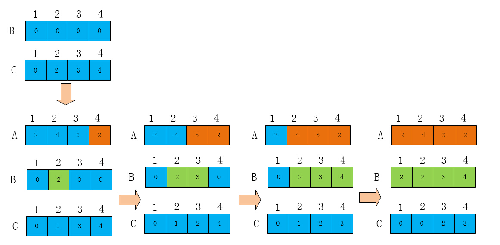
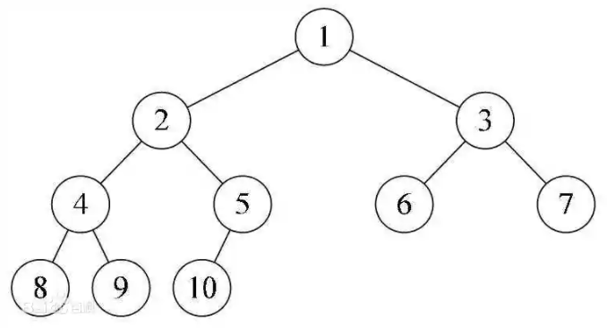
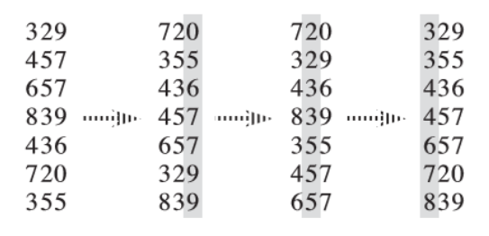
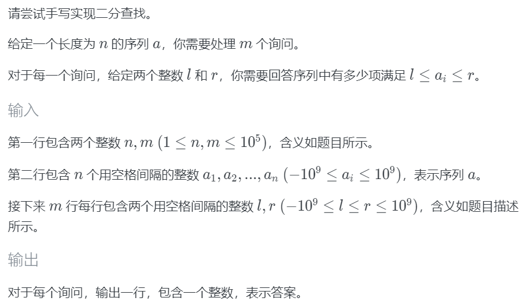
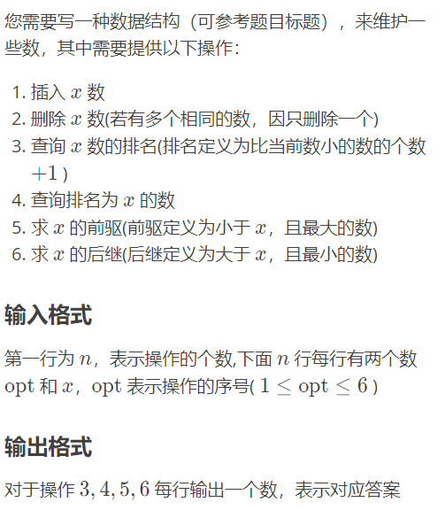
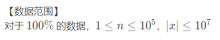
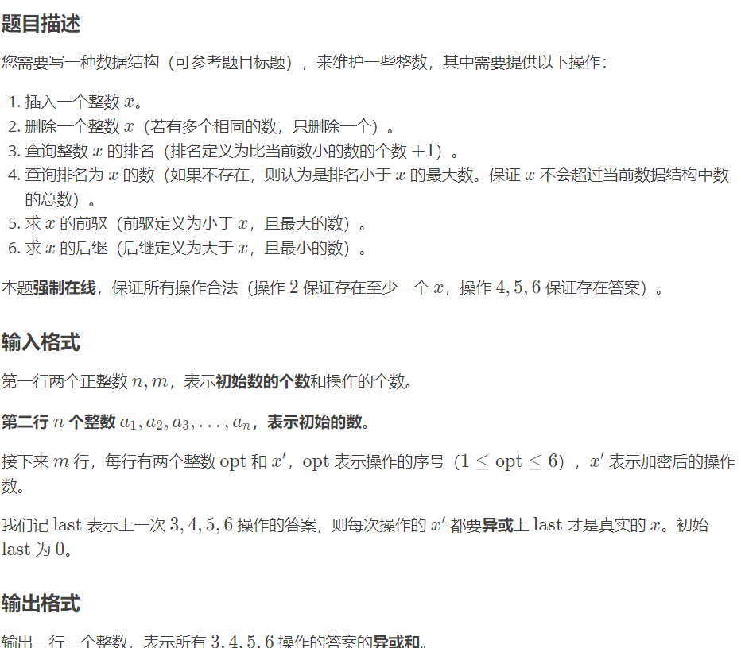
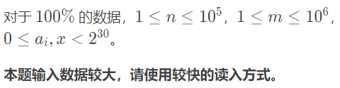

# 2021 香农先修班第三次课

<div style="background-color:lightblue;color:darkblue;font-size:26px;font-weight:900" align="center">排序算法</div>


## 排序理论

**排序算法** (Sorting algorithm) ，是一种将一组特定的数据按某种顺序进行排列的算法。

> 例如，下面的操作是排序：
>
> - 给定若干个实数，从小到大排列输出
> - 给定若干个字符串，按字典序排序输出
> - 给定若干个学生各科分数，先按总分，同分依次按每科分数高低排序直到可以区分为止 `OJ 1072 排名`


**稳定性** 指作为比较依据的值相同的多个元素的相对位置在排序前后是否不变。不变的是**稳定排序**，变的是**不稳定排序**。

> 例如，有五个二元数据 $(x,y)$ ： $(1,10),(2,5),(5,10),(4,12),(3,10)$ ，以 $y$ 为依据排序，若排序后有：
> $$
> (2,5),(1,10),(5,10),(3,10),(4,12)
> $$
> 则，这样的排序是稳定排序；若中间三个元素不是按这个顺序的，是不稳定排序。

常见的稳定和不稳定排序有：

- 稳定排序：冒泡排序、插入排序、计数排序、归并排序……
- 不稳定排序：选择排序、快速排序、堆排序……

> 判断排序是否是稳定排序的方法：若无不作为比较依据的值，设辅助标记(如下标)形成结构体(若有不作为比较依据的值就直接用就行了)，进行结构体排序；然后用任意稳定排序算法再排序一次，逐项比较这两种排序的结果，若完全一致就是稳定，不一致就是不稳定。复杂度为两次排序复杂度 $+$ 逐项比较复杂度。


有的排序需要额外开辟内存空间，有的不需要(即直接使用待排序数组空间)。记排序的空间复杂度是除原数组外所需的额外空间大小。

- **`in-place`** 规模是 $n$ 时，空间复杂度是与 $n$ 无关常数(是常函数)，又称原址操作。

  > 如 $\Omicron(1),\Omicron(m)$

  > 冒泡选择插入都是 `in-place`

- **`out-place`** 规模是 $n$ 时，空间复杂度是 $n$ 的函数。

  > 如 $\Omicron(n+k), \Omicron(n\log n)$


一个结论：基于比较然后换位置的排序(如冒泡插入选择)，时间复杂度的下限是 $\Omicron(n\log n)$


常见排序算法表：

| 方法 | 平均                 | 最坏                | 最好                | 空间               | 方式 | 稳定 |
| ---- | -------------------- | ------------------- | ------------------- | ------------------ | ---- | ---- |
| 冒泡 | $\Omicron(n^2)$      | $\Omicron(n^2)$     | $\Omicron(n)$       | $\Omicron(1)$      | in   | Y    |
| 选择 | $\Omicron(n^2)$      | $\Omicron(n^2)$     | $\Omicron(n^2)$     | $\Omicron(1)$      | in   | N    |
| 插入 | $\Omicron(n^2)$      | $\Omicron(n^2)$     | $\Omicron(n)$       | $\Omicron(1)$      | in   | Y    |
| 希尔 | $\Omicron(n^{1.25})$ | $\Omicron(n^2)$     | $\Omicron(n)$       | $\Omicron(1)$      | in   | N    |
| 归并 | $\Omicron(n\log n)$  | $\Omicron(n\log n)$ | $\Omicron(n\log n)$ | $\Omicron(n)$      | out  | Y    |
| 快速 | $\Omicron(n\log n)$  | $\Omicron(n^2)$     | $\Omicron(n\log n)$ | $\Omicron(\log n)$ | in   | N    |
| 堆   | $\Omicron(n\log n)$  | $\Omicron(n\log n)$ | $\Omicron(n\log n)$ | $\Omicron(1)$      | in   | N    |
| 计数 | $\Omicron(n+k)$      | $\Omicron(n+k)$     | $\Omicron(n+k)$     | $\Omicron(n+k)$    | out  | Y    |
| 桶   | $\Omicron(n+k)$      | $\Omicron(n^2)$     | $\Omicron(n)$       | $\Omicron(n+k)$    | out  | Y    |
| 基数 | $\Omicron(nk)$       | $\Omicron(nk)$      | $\Omicron(nk)$      | $\Omicron(n+k)$    | out  | Y    |

>  各经典排序动图过程演示可参考 [这里](https://www.cnblogs.com/onepixel/p/7674659.html)


**逆序对**：对数组 $a$ ，满足 $i < j, a_i > a_j$ 的两个数。逆序对数目(**逆序数**)能体现数组错乱程度。

一种求法：暴力枚举所有满足 $i < j$ 的两数之对逐个判定即可。时间复杂度为 $\Omicron(n^2)$

> 实际上常用的求法在下文

> 性质：冒泡排序的交换次数为逆序数。


## 常用排序

### 计数排序

Counting Sort

#### 常规写法

排序思路：

- 设数组 $c$ ， $c[i]$ 代表待排序数组 $a$ 里 $i$ 出现了多少次

  遍历 $a$ ，统计出现次数，即 `c[a[i]]++` 。

- 记 $a$ 当前下标为 $k$ 

  遍历 $c$ ，插入 $c[i]$ 个 $i$ 到数组 $a$ (即 $a$ 下标为 $[k,k+c[i]-1]$ 的范围均赋值为 $i$ )，更新 $k$


参考代码：(设值域是 $[1,k]$ 的整数)

```c++
for (int i = 1; i <= n; ++i)
{
    ++c[a[i]]; // c 初始值均 0; a 数组使用下标范围 [1,n] 存值
}
for (int i = 1; i <= k; ++i) // k 是 a 的最大值
{
    for (int j = 1; j <= c[i]; ++j)
    {
        a[++p] = i; // p 初始值为 0
    }
}
```

设待排序值的值域是离散的，值域长度为 $k$ ，则时间复杂度为 $\Omicron(n+k)$ ，空间复杂度为 $\Omicron(k)$ 。

> 这是因为 $\sum_{i=1}^kc_i=n$ ，所以 `a[++p]=i` 语句必然只能被执行 $n$ 次。

计数排序是非基于比较的排序，所以可以突破 $\Omicron(n\log n)$ 的下限。


#### 前缀和写法

排序思路：

- 设数组 $cnt$ ，$cnt[i]$ 最初表示 $i$ 出现了多少次，遍历 $a$ 累积 $cnt$

- 对 $cnt$ 原地求前缀和，使得 $cnt[i]$ 表示小于等于 $i$ 的数出现了多少次

  此时 $cnt[i]=\sum_{j=1}^ic[j]$ ，满足性质： $cnt[i]$ 表示最后一个 $i$ 排序后下标是 $cnt[i]$

- 新开数组 $b$ 表示排序后数组

  倒序遍历 $a$ ，根据性质，最后一个 $a[i]$ 出现在下标 $cnt[a[i]]$ ，所以这个下标的值是 $a[i]$ ；将它取走，那么 $cnt[a[i]]$ 自减，表示删掉当前最后一个 $a[i]$ 后，新的 $a[i]$ 的下标是自减后的 $cnt[a[i]]$

代码：

```c++
for (int i = 1; i <= n; ++i)
{
    ++cnt[a[i]];
}
for (int i = 1; i <= k; ++i)
{
    cnt[i] += cnt[i - 1];
}
for (int i = n; i >= 1; --i) //顺着i到n遍历也行
{
    b[cnt[a[i]]--] = a[i];
}
```


图解演示：




该写法，时间复杂度为 $\Omicron(n+k+n)=\Omicron(n+k)$ ，空间复杂度为 $\Omicron(n+k)$


> 另一种写法是顺着来，即 $cnt[i]$ 表示下一个 $i$ 排序后下标是多少，代码为：
>
> ```c++
> for (int i = 1; i <= n; ++i)
> {
>     ++cnt[a[i]];
> }
> for (int i = 1, s = 0; i <= k; ++i)
> {
>     s += cnt[i];
>     cnt[i] = s - cnt[i];
> }
> for (ll i = 1; i <= n; ++i) //倒着也行
> {
>     b[++cnt[a[i]]] = a[i];
> }
> ```


#### 离散化

> 标准定义：**离散化** (discretization) 是把无限空间中有限的个体映射到有限的空间中去。

一种离散化的实现：把绝对大小转化为相对大小。

当值域跨度很大，而真实不同的取值个数很少时，可以用离散化的方法把值域调整为取值个数。

> 如： $a=(1,10^3,10^9+0.1,10^3,1,10^3)$ ，离散化后得 $a_h=(1,2,3,2,1,2)$

离散化+计数排序的实现：借助 $map$ 。

定义 $h$ ，$h[i]$ 表示 $i$ 出现了多少次。


得到排序后原数组的实现代码：

```c++
for (ll i = 1; i <= n; ++i)
{
    h[a[i]]++; //h是map<ll, ll>
}
for (auto i : h)
{
    for (ll j = 0; j < i.second; ++j)
    {
        a[++ai] = i.first; //ai初始值为0
    }
}
```

考虑到 $map$ 自带的复杂度，时间复杂度为 $\Omicron(n\log n)$ 

> 也可以用 $unordered\_map$ ，下同。


得到排序后离散化数组的实现代码：

```c++
for (ll i = 1; i <= n; ++i)
{
    h[a[i]]++;
}
for (auto i : h)
{
    ++r; //r初始值为0
    for (ll j = 0; j < i.second; ++j)
    {
        a[++ai] = r;
    }
}
```

时间复杂度为 $\Omicron(n\log n)$ 


直接得到离散化数组的实现代码：

```c++
copy(a + 1, a + 1 + n, b + 1);
sort(b + 1, b + 1 + n); //任意排序
m = unique(b + 1, b + 1 + n) - (b + 1); //相对大小为i的值为b[i], m为相对最值
for (ll i = 1; i <= m; ++i)
{
    s[b[i]] = i; //s是map；代表b里v的下标为s[v]
}
for (ll i = 1; i <= n; ++i)
{
    printf("%lld ", s[a[i]]);
}
```

时间复杂度为排序复杂度 $+$ $\Omicron(n+m\log m+nlog m)$ 

> `copy, sort, unique` 都是常用的 STL 函数。(`copy` 即 `memcpy`)


#### 练习题

> 完成  `bny 学妹人物传记`、 `计数排序`、`计数排序2`


### 归并排序

merge sort

实现思路：

- 将数组划分为平衡的两个子数组 (即长度相差不大于 $1$ )
- 对两个子数组实施归并排序，使两个子数组分别有序
- 合并两个有序子数组为单个有序数组

使用**滑动窗口法**合并两个有序子数组：

- 左右子数组、新数组当前下标为起始值
- 若当前下标左数组元素小于等于右数组元素，把当前左数组元素放到新数组，左数组、新数组下标自增
- 否则，把当前右数组元素放到新数组，右数组、新数组下标自增
- 当一边子数组访问完毕后，将另一边子数组所有元素先后放到新数组后面即可

一种参考手写代码：(`洛谷 P1177`)

```c++
#include <bits/stdc++.h>
using namespace std;
#define mn 100010
typedef long long ll;
ll n, a[mn], b[mn];
void mergesort(ll lf, ll rf)
{
    if (lf < rf)
    {
        ll cf = (lf + rf) >> 1; //left-face; center-face; right-face
        mergesort(lf, cf);
        mergesort(cf + 1, rf);
        ll i = lf, j = cf + 1, je = rf, ie = cf, k = 0; //左[i,ie],右[j,je]
        while (i <= ie && j <= je)
        {
            if (a[i] <= a[j])
            {
                b[k++] = a[i++];
            }
            else
            {
                b[k++] = a[j++];
            }
        }
        while (i <= ie)
        {
            b[k++] = a[i++];
        }
        while (j <= je)
        {
            b[k++] = a[j++];
        }
        for (ll h = 0; h < k; ++h)
        {
            a[lf + h] = b[h];
        }
    }
}
signed main()
{
    scanf("%lld", &n);
    for (ll i = 1; i <= n; ++i)
    {
        scanf("%lld", &a[i]);
    }
    mergesort(1, n);
    for (ll i = 1; i <= n; ++i)
    {
        printf("%lld ", a[i]);
    }
    return 0;
}
```


时间复杂度分析：根据主定理有 $a=b=2,k=1$ ，$a=b^k$ ，所以 $\Omicron(n^klog_bn)=\Omicron(n\log n)$

空间复杂度： $\Omicron(n)$

性质：是稳定排序

用途：以 $\Omicron(n\log n)$ 求逆序对数目

- 滑动窗口合并时，若发现左数组元素大于右数组元素，说明形成逆序，由于左数组有序，即左数组接下来的元素必然也都大于该有数组元素。

  当前左下标到左结尾共有 $ie-i+1$ 个元素，它们都大于当前右元素，贡献这么多个逆序对

即：

```c++
while (i <= ie && j <= je)
{
    if (a[i] <= a[j])
    {
        b[k++] = a[i++];
    }
    else
    {
        ans += ie - i + 1;
        b[k++] = a[j++];
    }
}
```

> 逆序对也可以用线段树、树状数组求，大佬可以自行尝试


### 快速排序

Quick sort

快速排序抽象定义：

- 将数组划分为两个子数组，使得任意左子数组元素小于所有右子数组元素

- 对左右子数组依次执行快速排序，使得两个子数组分别有序

  由于上列性质，当两个子数组分别有序时，直接拼接起来就是有序的数组

对所有基于比较的排序，快速排序是理论上平均复杂度最优的排序。

实现思路：(以**三路快速排序**为例)

- 对长为 $n$ 的待排序数组 $a$ ，随机选择一个数组元素作基准值 $p$

- 所有小于基准值 ${p}$ 的元素移动到数组的前面

  所有大于基准值 ${p}$ 的元素移动到数组的后面

- 对所有小于基准值元素组成的子数组和所有大于基准值元素组成的子数组作为待排序数组，返回第一步

一种参考手写代码：(`洛谷 P1177`)

```c++
#include <bits/stdc++.h>
using namespace std;
#define mn 100010
typedef long long ll;
void quicksort(ll *a, ll n)
{
    if (n <= 1)
    {
        return;
    }
    ll lf = 0, rf = n, i = 0, p = a[rand() % n];
    while (i < rf)
    {
        if (a[i] < p)
        {
            swap(a[i++], a[lf++]);
        }
        else if (a[i] > p)
        {
            swap(a[i], a[--rf]);
        }
        else
        {
            ++i;
        }
    }
    quicksort(a, lf);
    quicksort(a + rf, n - rf);
}
ll n, a[mn];
signed main()
{

    scanf("%lld", &n);
    for (ll i = 1; i <= n; ++i)
    {
        scanf("%lld", &a[i]);
    }
    quicksort(a + 1, n);
    for (ll i = 1; i <= n; ++i)
    {
        printf("%lld ", a[i]);
    }
    return 0;
}
```

> 这个实现的空间复杂度是 $\Omicron(1)$ ；根据具体实现不同，空间复杂度会有不同

性质：不稳定排序，平均复杂度 $\Omicron(n\log n)$ ，最差复杂度 $\Omicron(n^2)$

> 复杂度分析：
>
> 1. 最容易分析的情况是每次左右都分到一半(相差不大于 $1$)，可以近似看成两边相等，此时，根据主定理，$a=b=2,k=1,a=b^k$ ，复杂度为 $\Omicron(n^k\log_bn)=\Omicron(n\log n)$
>
>    事实上，这种情况是最优情况
>
> 2. 最坏的情况是每次某一边都是空，那么每次长度只减少 $1$ ，需要递归 $\Omicron(n)$ 次，每次跑一层循环，复杂度为 $\Omicron(n^2)$
>
>    如果不使用随机基准，可以构造特殊数组使得每次基准都是最值；使用随机基准时，每次都取最值的概率约为 $\dfrac{2}{n!}\approx0$  (注：计算不严谨，实际概率表达式远比这个复杂)
>
> 3. 平均情况的严格证明相对复杂 (具体参见文章 [这里](https://cloud.socoding.cn/s/AqBsv) ，前置知识：高等数学下-调和级数，各种高中数列知识)
>
>    (p.s. 这已经是算法理论证明里相当易懂的证明步骤了，多数算法的证明远比这个复杂)
>
>    直观上判断，可以看出平均复杂度介于最优和最坏之间
>
> 4. 实践表明，绝大多数情况下平均约等于最优
>
>    (还记得一开始的那句话吗：`快速排序是理论上平均复杂度最优的排序`)


### 堆排序

> 选读

heapsort

从下标 $1$ 开始的数组可以转化为**完全二叉树**。



部分所用到的基本概念：

- 节点：即数组下标(节点下标)-该下标的数组值(结点值)的整体
- 根节点：下标为 $1$ 的节点
- 子节点：有零到两个，该节点往下直接相连的节点；按编号大小依次为左、右子节点
- 父节点：有零到一个(根节点没有)，直接往上相连的节点
- 子树：以某节点为根节点的树(这里是完全二叉树)；有左右子节点为根的左子树、右子树
- 边：两节点间的连线
- 深度：根节点为 $1$ ；其他节点是到根节点的最短距离(边数目)
- 树高：所有节点深度的最大值

从下标 $1$ 开始的完全二叉树性质：

- 当前节点编号为 $p$ ，则其父节点编号为 $\lfloor\dfrac p2\rfloor$ ，左子节点编号为 $2p$ ，右子节点编号为 $2p+1$
- 节点数为 $n$ ，则树高为 $\lfloor\log n\rfloor+1$ 

**大根堆**(最大堆)是所有结点值不小于其子节点值的完全二叉树。性质：

- 根节点必然是最大的
- 所有节点值不小于以该节点为根的子树的的所有节点值

节点上浮操作：

- 当前节点值小于大儿子值 (左右儿子的较大者) 时，与大儿子互换，继续上浮；否则停止上浮

一个节点最多上浮 $\log n$ 次，因为树高为 $\log n$ 。单次上浮复杂度为 $\Omicron(\log n)$

完全二叉树转大根堆：

- 从 $n$ 到 $1$  每个节点依次上浮，复杂度为 $\Omicron(n\log n)$

> 不能从 $1$ 到 $n$ 上浮

思路：

1. 从下标 $1$ 开始使用数组建完全二叉树
2. 将完全二叉树转化为大根堆
3. 取走删除堆顶(放到当前最后位置)，将最后一个节点作为新堆顶上浮，维护堆的性质，不断执行此操作直到堆空

一种参考手写代码：(`洛谷 P1177`)

```c++
#include <bits/stdc++.h>
using namespace std;
typedef long long ll;
#define mn 100010
ll a[mn], n;
void goup(ll bg, ll len)
{
    ll now = bg, nx = bg * 2; //假设左儿子是大儿子
    while (nx <= len)
    {
        if (nx + 1 <= len && a[nx + 1] > a[nx]) //找大儿子
        {
            nx++;
        }
        if (a[now] >= a[nx])
        {
            return;
        }
        swap(a[now], a[nx]);
        now = nx;    //继续操作
        nx = nx * 2; //假设左大
    }
}
void heapsort()
{
    for (ll i = n; i >= 1; --i)
    {
        goup(i, n);
    }
    for (ll i = n; i >= 1; --i)
    {
        swap(a[1], a[i]);
        goup(1, i - 1);
    }
}
signed main()
{
    scanf("%lld", &n);
    for (ll i = 1; i <= n; ++i)
    {
        scanf("%lld", &a[i]);
    }
    heapsort();
    for (ll i = 1; i <= n; ++i)
    {
        printf("%lld ", a[i]);
    }
    return 0;
}
```

复杂度分析：时间 $\Omicron(n\log n+n\log n)=\Omicron(n\log n)$ ，空间 $\Omicron(1)$

性质：不稳定排序


### std::sort

#### 复杂度

库 `algorithm` ；当然万能头即可。

实现方法：**内省排序** (intro sort)，是快速排序和堆排序、插入排序的结合。当递归深度超过 $\lfloor\log_2n\rfloor$ 时使用堆排序，当元素数量少于阈值(如 $16$) 时，用插入排序；否则使用快速排序。由于堆排序最差复杂度是 $\Omicron(n\log n)$ ，所以内省排序的最差复杂度是 $\Omicron(n\log n)$ 。

> 基本数据类型比较的复杂度是 $\Omicron(1)$ ，所以复杂度如上；若每次比较复杂度是 $f$ ，时间复杂度是 $\Omicron(fn\log n)$ 。

由于最大递归层数是 $\log n$ ，每层递归起码需要一个变量参数，所以空间复杂度起码是 $\Omicron(\log n)$ 

> 小数据时用插入排序，是因为插入排序在几乎有序时的复杂度约为 $\Omicron(n)$

> 具体原理参见 [这里](https://feihu.me/blog/2014/sgi-std-sort/)

> 对于大的、乱数列表一般相信是最快的已知排序


#### 使用方法

```c++
sort(头迭代器, 尾迭代器[, 比较依据函数]);
```

将会对迭代器范围 $[$ 头$,$ 尾 $)$ 进行排序，依据是比较函数或已定义的比较运算符。**默认升序排序**。

1. 对于数组，头迭代器是首个元素指针地址；尾迭代器是最后一个元素指针地址的下一个地址
2. 对于迭代器，通常使用 `.begin() , .end()` 代表上述两个含义
3. 对于结构体等没有定义大小关系运算符的数据类型，可以增加比较函数，或者重载运算符


> 例：
>
> 1. 给一维整型数组 $a$ 下标范围 $[0,n)$ 的元素升序排序
>
>    ```c++
>    sort(a, a + n);
>    ```
>
> 2. 给一维双精度浮点型数组 $a$ 下标范围 $[1,n]$ 的元素升序排序
>
>    ```c++
>    sort(a + 1, a + 1 + n)
>    ```
>
> 3. 给二维长整数数组 $b$ 第 $[1,n]$ 行每行下标范围 $[1,m]$ 的元素升序排序
>
>    ```c++
>    for (ll i = 1; i <= n; ++i)
>    {
>        sort(b[i] + 1, b[i] + 1 + m);
>    }
>    ```
>
> 4. 给一维整型向量 $v$ 所有元素升序排序
>
>    ```c++
>    sort(v.begin(), v.end());
>    ```
>
> 5. 给一维整型数组 $a$ 下标范围 $[1,n]$ 的元素逆序排序
>
>    ```c++
>    sort(a + 1, a + 1 + n);
>    reverse(a + 1, a + 1 + n);
>    ```
>
>    ```c++
>    sort(a + 1, a + 1 + n, [](const ll &x, const ll &y)
>         { return x > y; }); //重定义 x < y 关系
>    ```
>
>    ```c++
>    bool cmp(const ll &x, const ll &y) // ll x, ll y 也行，上同
>    {
>        return x > y; //不要写成 x-y因为负数也是true
>    }
>    //...
>    sort(a + 1, a + 1 + n, cmp);
>    ```
>
> 6. 给二元整数对 $(x,y)$ 向量升序 $d$ 排序，先按 $x$ 大小，$x$ 相同时按 $y$ 大小
>
>    ```c++
>    // vector<pair<ll, ll>> d = {{2, 2}, {1, 2}, {-1, -2}, {1, 1}, {2, 3}};
>    vector<pair<ll, ll>> d; //pair本身的比较运算符就是如此定义的
>    sort(d.begin(), d.end());
>    // for (auto i : d)
>    // {
>    //    printf("%lld %lld\n", i.first, i.second);
>    // }
>    ```
>
>    ```c++
>    struct node
>    {
>        ll x, y;
>        //bool operator<(node r) 但是不可以仅定义>不定义<
>        bool operator<(const node &r) const
>        {
>            if (x != r.x)
>            {
>                return x < r.x;
>            }
>            return y < r.y;
>        }
>    };
>    // vector<node> d = {{2, 2}, {1, 2}, {-1, -2}, {1, 1}, {2, 3}};
>    vector<node> d;
>    sort(d.begin(), d.end());
>    // for (auto i : d)
>    // {
>    //     printf("%lld %lld\n", i.x, i.y);
>    // }
>    ```
>
>    ```c++
>    struct node
>    {
>        ll x, y;
>    };
>    bool cmp(const node &l, const node &r)
>    { //即 l.x != r.x ? l.x < r.x : l.y < r.y;
>        if (l.x != r.x)
>        {
>            return l.x < r.x;
>        }
>        return l.y < r.y;
>    }
>    vector<node> d = {{2, 2}, {1, 2}, {-1, -2}, {1, 1}, {2, 3}};
>    signed main()
>    {
>        sort(d.begin(), d.end(), cmp);
>        for (auto i : d)
>        {
>            printf("%lld %lld\n", i.x, i.y);
>        }
>        return 0;
>    }
>    ```
>
>    ```c++
>    struct node
>    {
>        ll x, y;
>    };
>    vector<node> d = {{2, 2}, {1, 2}, {-1, -2}, {1, 1}, {2, 3}};
>    signed main()
>    {
>        sort(d.begin(), d.end(), [](const node &l, const node &r)
>             { return l.x != r.x ? l.x < r.x : l.y < r.y; });
>        for (auto i : d)
>        {
>            printf("%lld %lld\n", i.x, i.y);
>        }
>        return 0;
>    }
>    ```
>
> 7.  `OJ1072 排名`
>
>    ```c++
>    #include <bits/stdc++.h>
>    using namespace std;
>    typedef long long ll;
>    ll n, m;
>    struct student
>    {
>        string name;
>        ll sum;
>        vector<ll> subj;
>        bool operator<(student r)
>        {
>            return sum != r.sum ? sum > r.sum : subj > r.subj;
>        }
>    } s[1010];
>    signed main()
>    {
>        cin >> n >> m;
>        for (ll i = 0; i < n; ++i)
>        {
>            cin >> s[i].name;
>            for (ll j = 0, v; j < m; ++j)
>            {
>                cin >> v;
>                s[i].sum += v;
>                s[i].subj.emplace_back(v);
>            }
>        }
>        sort(s, s + n);
>        for (ll i = 0; i < n; ++i)
>        {
>            cout << s[i].name << ' ';
>        }
>        return 0;
>    }
>    ```
>
>    ```c++
>    #include <bits/stdc++.h>
>    using namespace std;
>    typedef long long ll;
>    ll n, m;
>    struct student
>    {
>        string name;
>        ll sum;
>        vector<ll> subj;
>        bool operator<(student r)
>        {
>            if (sum != r.sum)
>            {
>                return sum > r.sum;
>            }
>            for (ll i = 0; i < m; ++i)
>            {
>                if (subj[i] != r.subj[i])
>                {
>                    return subj[i] > r.subj[i];
>                }
>            }
>        }
>    } s[1010];
>    signed main()
>    {
>        cin >> n >> m;
>        for (ll i = 0; i < n; ++i)
>        {
>            cin >> s[i].name;
>            for (ll j = 0, v; j < m; ++j)
>            {
>                cin >> v;
>                s[i].sum += v;
>                s[i].subj.emplace_back(v);
>            }
>        }
>        sort(s, s + n);
>        for (ll i = 0; i < n; ++i)
>        {
>            cout << s[i].name << ' ';
>        }
>        return 0;
>    }
>    ```
>
>    时间复杂度分析：每次比较最差复杂度 $\Omicron(m)$ ，故时间复杂度为 $\Omicron(nm\log n)$


#### 其他函数

> 选读

也是在 `algorithm` 库

##### stable_sort

用法同 `std::sort` ，区别在于是稳定排序。复杂度与 `std::sort` 相近。

> 对稳定有要求的，一般都是结构体，一般而言可以直接重载时规定一下就好了

##### nth_element

`std::nth_element(first, nth, last[, compare])` 

使得迭代器 `nth` 指向的第 $nth-first+1$ 大元素恰在该位置

时间复杂度 $\Omicron(n)$ 

如：`洛谷 P1923 求第 k 小的数`

```c++
#include<bits/stdc++.h>
using namespace std;
long long n,k,a[5000010];
int main()
{
    scanf("%d%d",&n,&k);
    for(int i=0;i<n;i++)
        scanf("%d",&a[i]);
    nth_element(a,a+k,a+n);//使第k小整数就位 
    printf("%d",a[k]);//调用第k小整数
}
```

> 想看具体实现思路找洛谷题解区别的题解


### 其他排序

> 选读

#### 桶排序

bucket sort

适用于待排序数据值域较大但分布比较均匀的情况。追求更快的效率，可以使用桶排序。使用**分块**思想。

抽象步骤：

- 设置足够的空二维数组
- 将原数组平均拆分到二维数组里，保证任意前一个数组值小于后面的数组所有值
- 对每个数组排序
- 合并这些数组

桶排序稳定与否取决于第三个抽象步骤所用排序是否稳定。

一种实现是：值域为 $m$ ，将原数据分成 $\lceil\sqrt m\rceil$ 个二维数组，每块值域跨度为 $s=\lfloor\sqrt m+1\rfloor$，第 $i$ 个数组值域为 $[is,(i+1)s)$，可知最后一个数组右边界为 $\lceil\sqrt m\rceil\cdot\lfloor\sqrt m+1\rfloor \ge \sqrt m\cdot \sqrt m=m$ 。且各数组值域不重复。

数值 $v$ 放在第 $\lfloor\dfrac{v}{s}\rfloor$ 个数组里。对这 $k$ 个二维数组分别排序(可以使用快排)。假设数据分布均匀，期望每个二维数组有 $\sqrt n$ 个元素。那么，拆分复杂度为 $\Omicron(n)$ ，用 `std::sort`  对 $\sqrt m$ 个数组排序复杂度为 $\sqrt n\log \sqrt n$ ，合并复杂度为 $\Omicron(n)$ 。总时间复杂度为 $\Omicron(n+\sqrt{mn}\log \sqrt n+n)$ ，其中 $\log\sqrt n=\dfrac12\log n$ 。空间复杂度为 $\Omicron(m+n)$ 。

一种实现代码：(以 `OJ 1577 违抗熵增之人` 为例)

```c++
#include <bits/stdc++.h>
using namespace std;
typedef int ll;
#define il inline
typedef double db;
#define re register
il ll read() 
{
    re char p = 0;
    re ll r = 0, o = 0;
    for (; p < '0' || p > '9'; o |= p == '-', p = getchar())
        ;
    for (; p >= '0' && p <= '9'; r = (r << 1) + (r << 3) + (p ^ 48), p = getchar())
        ;
    return o ? (~r) + 1 : r;
}
#define sc(x) x = read() //快读
#define mn 8000010
ll n, a[mn], mx, q, x, span;
vector<ll> b[65536]; //int的max:2^32开根是2^16=65536
signed main()
{
    sc(n);
    for (ll i = 1; i <= n; ++i)
    {
        sc(a[i]);
        mx = max(mx, a[i]);
    }
    span = sqrt(mx) + 1; //块长
    for (ll i = 1; i <= n; ++i)
    {
        b[a[i] / span].emplace_back(a[i]);
    }
    for (ll i = 0, k = 0; i < span; ++i)
    {
        sort(b[i].begin(), b[i].end());
        for (ll j = 0, je = b[i].size(); j < je; ++j)
        {
            a[++k] = b[i][j];
        }
    }
    sc(q);
    while (q--)
    {
        sc(x);
        printf("%d\n", a[x]);
    }
    return 0;
}
```


#### 基数排序

> 学习后缀排序的前置知识

radix sort

是非比较排序。

抽象思想思路：将待排序元素拆分为若干个子元素(关键字)，逆序(从最不重要到最重要)依次稳定排序比较这些关键字。设有 $k$ 个关键字，则需要进行 $k$ 次排序。通常使用 $k$ 次计数排序，那么复杂度为 $\Omicron(kn)$ 。

一种思想思路：

以整数为例，把 $k$ 位十进制整数拆分为 $k$ 个关键字，依次是从大到小的各数位。那么值域为 $m$ 的整数有 $k=\lceil\log_{10} m\rceil$ 位。所以时间复杂度为 $\Omicron(n\log_{10}m)$ 。由于计数排序，所以



十进制是为了理解方便。但对计算机实现方便而言(和享受更快的位运算)，通常用二的整数进制，如下面实现代码使用了 $256$ 进制。

一种实现代码：(以 `OJ 1577 违抗熵增之人` 为例)

```c++
#include <bits/stdc++.h>
#define re
using namespace std;
typedef int ll;
#define il inline
il ll read()
{
    re char p = 0;
    re ll r = 0, o = 0;
    for (; p < '0' || p > '9'; o |= p == '-', p = getchar())
        ;
    for (; p >= '0' && p <= '9'; r = (r << 1) + (r << 3) + (p ^ 48), p = getchar())
        ;
    return o ? (~r) + 1 : r;
}
#define sc(x) x = read()
#define mn 8000010
ll n, a[mn], q, x, b[mn], cnt[1 << 8];
void radixsort(ll n)
{
    ll mask = (1 << 8) - 1;
    ll *x = a, *y = b;
    for (ll i = 0; i < 32; i += 8) //每八位每八位拆分，int拆为四个关键字
    {
        for (ll j = 0; j != (1 << 8); ++j) //[0,255)
        {
            cnt[j] = 0; //计数排序归零
        }
        for (ll j = 0; j != n; ++j)
        {
            ++cnt[x[j] >> i & mask]; //当前的八个位，注意位运算优先级
        }
        for (ll sum = 0, j = 0; j != (1 << 8); ++j)
        { //计数排序变式，cnt代表同值元素段的开头下标;即减去前缀和前自己
            sum += cnt[j], cnt[j] = sum - cnt[j];
        }
        for (ll j = 0; j != n; ++j)
        { //计数排序变式
            y[cnt[x[j] >> i & mask]++] = x[j];
        }
        swap(x, y); //y是排序好的,x是未排序的;换过来，继续操作
    }
}
signed main()
{
    sc(n);
    for (ll i = 0; i < n; ++i)
    {
        sc(a[i]);
    }
    radixsort(n);
    sc(q);
    while (q--)
    {
        sc(x);
        printf("%d\n", a[x - 1]);
    }
    return 0;
}
```


### 练习题

> 完成 `逆序对` 、 `结构体排序` 


## 有序的维护

要求对于动态的数组(如不断插入、删除)，一直保持该数组有序，从而能够利用有序完成一系列题目要求的事情。

> 根据各题具体要求不同，可能会采取各种不同的数据结构。这里只讲一小部分可以直接调用库函数的知识，剩下大部分其他知识的在后续课程讲或自学。


### STL

#### xx_bound

对升序序列：

`lower_bound(begin, end, v)`  在 $[begin,end)$ 找第一个大于等于 $v$ 的值，返回该值的迭代器

`upper_bound(begin, end, v)`  在 $[begin,end)$ 找第一个大于 $v$ 的值，返回该值的迭代器

若找不到返回 $end$


对降序序列：

`lower_bound(begin, end, v, greater<type>())`  在 $[begin,end)$ 找第一个小于等于 $v$ 的值，返回该值的迭代器

`upper_bound(begin, end, v, greater<type>())`  在 $[begin,end)$ 找第一个小于 $v$ 的值，返回该值的迭代器

若找不到返回 $end$


时间复杂度： $\Omicron(\log n)$ 


> 使用测试：
>
> ```c++
> #include <bits/stdc++.h>
> using namespace std;
> typedef long long ll;
> vector<ll> a = {1, 3, 3, 3, 3, 5}, b(a);
> ll v = 3;
> signed main()
> {
>     ll p1 = lower_bound(a.begin(), a.end(), 3) - a.begin();
>     auto p2 = upper_bound(a.begin(), a.end(), 3) - a.begin(); //ll
>     cout << p1 << endl;
>     cout << p2 << endl;
>     ll p3 = lower_bound(a.begin(), a.end(), -1) - a.begin();
>     ll p4 = lower_bound(a.begin(), a.end(), 6) - a.begin();
>     cout << p3 << endl;
>     cout << p4 << endl;
>     // ll p5 = upper_bound(a.begin(), a.end(), -1) - a.begin();
>     // ll p6 = upper_bound(a.begin(), a.end(), 6) - a.begin();
>     // cout << p5 << endl;
>     // cout << p6 << endl;
> 
>     // copy(a.begin(), a.end(), b.begin()); (error)
>     // b.assign(a.begin(), a.end());
>     reverse(b.begin(), b.end());
> 
>     ll p7 = lower_bound(b.begin(), b.end(), 3, greater<ll>()) - b.begin();
>     ll p8 = upper_bound(b.begin(), b.end(), 3, greater<ll>()) - b.begin();
>     cout << p7 << endl
>          << p8 << endl;
> 
>     ll p9 = lower_bound(a.begin(), a.end(), -1, greater<ll>()) - a.begin();
>     ll p10 = lower_bound(a.begin(), a.end(), 6, greater<ll>()) - a.begin();
>     cout << p9 << endl;
>     cout << p10 << endl;
>     // ll p11 = lower_bound(a.begin(), a.end(), -1, greater<ll>()) - a.begin();
>     // ll p12 = lower_bound(a.begin(), a.end(), 6, greater<ll>()) - a.begin();
>     // cout << p11 << endl;
>     // cout << p12 << endl;
> 
>     return 0;
> }
> ```

> ```c++
> #include <bits/stdc++.h>
> using namespace std;
> typedef long long ll;
> struct node
> {
>     ll x, y;
>     bool operator<(const node &r) const { return x < r.x; }
> };
> vector<node> v = {{1, 3}, {2, 6}, {2, 4}, {2, 8}, {3, 0}};
> signed main()
> {
>     auto a = *lower_bound(v.begin(), v.end(), (node){2, 2});
>     cout << a.x << ' ' << a.y << endl;
>     a = *upper_bound(v.begin(), v.end(), (node){2, 2});
>     cout << a.x << ' ' << a.y << endl;
>     auto pos = upper_bound(v.begin(), v.end(), (node){2, 2}) - v.begin() - 1;
>     cout << v[pos].x << ' ' << v[pos].y << endl;
>     return 0;
> }
> ```


> 例：`SCNUOJ 1216 二分查找(区间计数)`
>
> 
>
> ```c++
> #include <bits/stdc++.h>
> using namespace std;
> typedef long long ll;
> ll n, m, a[100010], l, r;
> signed main()
> {
>     scanf("%lld%lld", &n, &m);
>     for (ll i = 1; i <= n; ++i)
>     {
>         scanf("%lld", &a[i]);
>     }
>     sort(a + 1, a + 1 + n);
>     while (m--)
>     {
>         scanf("%lld%lld", &l, &r);
>         auto pos1 = lower_bound(a + 1, a + 1 + n, l);
>         auto pos2 = upper_bound(a + 1, a + 1 + n, r);
>         printf("%lld\n", pos2 - pos1);
>         // printf("%lld %lld\n", pos1 - a , pos2 - a );
>     }
>     return 0;
> }
> ```


#### 序列式容器

使用 `vector` 或 `deque` 来维护：

- 插入一个元素，找位置 `lower_bound` + 插入 `insert` $\Omicron(\log n+n)$
- 删除一个元素，找位置 `lower_bound` + 删除 `erase` $\Omicron(\log n+n)$
- 查找特定位置元素(第 $k$ 大) `[]` $\Omicron(1)$
- 查找特定值元素 `lower_bound, upper_bound` $\Omicron(\log n)$

> 更多其他操作及其复杂度见 [这里](https://oi-wiki.org/lang/csl/sequence-container/)


以 `洛谷 P3369` 为例：





```c++
#include <bits/stdc++.h>
using namespace std;
vector<int> v;
int n, cmd, x;
signed main()
{
    scanf("%d", &n);
    while (n--)
    {
        scanf("%d%d", &cmd, &x);
        if (cmd == 1)
            v.insert(lower_bound(v.begin(), v.end(), x), x); //或upper
        else if (cmd == 4)
            printf("%d\n", v[x - 1]);
        else if (cmd == 2)
            v.erase(lower_bound(v.begin(), v.end(), x));
        else
        {
            int pos = lower_bound(v.begin(), v.end(), x) - v.begin();
            if (cmd == 3)
                printf("%d\n", pos + 1);
            else if (cmd == 5)
                printf("%d\n", v[pos - 1]);
            else if (cmd == 6)
            {
                int pos2 = upper_bound(v.begin(), v.end(), x) - v.begin();
                printf("%d\n", v[pos2]);
            }
        }
    }
    return 0;
}
```

分析：理论最优复杂度是$\Omicron(n\log n)$ ，最差复杂度是 $\Omicron(n^2\log n)$ ，能过题因为数据弱。


#### 关联式容器

使用 `map, multimap, set, multiset` 来维护，可以用 $\Omicron(\log n)$ 实现：

- 插入一个元素 `insert`
- 删除一个元素 `erase`
- 查找特定值元素 `find` , `lower_bound` , `upper_bound` 

支持遍历。对 `*_bound` 得到的

无法实现查询当前迭代器是第 $k$ 大(除非暴力遍历)。使用  `nth_element` 复杂度为 $\Omicron(n)$

> 注：需要使用成员方法才能确保复杂度，不能使用外部函数(复杂度是 $\Omicron(n)$ )

> 内部实现：红黑树(一种平衡树)


> 使用示例：
>
> ```c++
> #include <bits/stdc++.h>
> using namespace std;
> typedef long long ll;
> vector<ll> v = {1, 2, 3, 2, 2, 2};
> multiset<ll> s{v.begin(), v.end()}; //数组同理
> signed main()
> {
>     for (auto i : s)
>     {
>         cout << i << endl;
>     }
>     cout << endl;
>     auto p1 = s.lower_bound(2);
>     auto p2 = s.upper_bound(2);
>     cout << *p1 << endl;
>     p1--;
>     cout << *p1 << endl;
>     cout << *p2 << endl;
>     p2--;
>     cout << *p2 << endl;
>     return 0;
> }
> ```
>
> ```c++
> #include <bits/stdc++.h>
> using namespace std;
> typedef long long ll;
> struct node
> {
>     ll x, y;
>     bool operator<(const node &r) const { return x < r.x; }
> } a[] = {{1, 1}, {2, 4}, {2, 8}, {3, 3}, {2, 3}};
> void print(node a) //成员函数也行
> {
>     cout << a.x << ' ' << a.y << endl;
> }
> set<node> s1{a, a + 5};
> multiset<node> s2{a, a + 5};
> signed main()
> {
>     for (auto i : s1)
>     {
>         print(i);
>     }
>     cout << endl;
>     for (auto i : s2)
>     {
>         print(i);
>     }
>     cout << endl;
> 
>     auto p1 = s2.find({2, 0}); //首个插入的{2,*}
>     print(*p1);
>     print(*s2.lower_bound({2, 0}));
>     auto p2 = s2.upper_bound({2, 0});
>     // cout << p2 - s2.begin() << endl; //不可行;p2-p1也不可行
>     p2--;
>     print(*p2);
>     p2--;
>     print(*p2);
>     return 0;
> }
> ```

> ```c++
> #include <bits/stdc++.h>
> using namespace std;
> typedef long long ll;
> typedef pair<ll, ll> pr;
> pr a[] = {{1, 1}, {2, 4}, {2, 8}, {3, 3}, {2, 3}};
> multimap<ll, ll> m{a, a + 5};
> void print(pr x)
> {
>     cout << x.first << ' ' << x.second << endl;
> }
> signed main()
> {
>     for (auto i : m)
>     {
>         print(i);
>     }
>     auto p1 = m.lower_bound(2);
>     auto p2 = m.upper_bound(2);
>     print(*p1);
>     p2--;
>     print(*p2);
>     return 0;
> }
> ```


### pb_ds

 Policy-Based Data Structures ，是一个库。

> 只在使用 libstdc++ 为标准库的编译器下可以用。

命名空间：`__gnu_pbds`  (区分：`bits/stdc++` 对应命名空间 `std`)


仅重点介绍 `pb_ds` 的以红黑树为基础的平衡树结构的使用。

> 另外一种比较有用的结构是配对堆，功能是维护最值(最大或最小之一)，能够以 $\Omicron(1)$ 的复杂度插入元素、查询最值，以均摊 $\Omicron(\log n)$ (最坏 $\Omicron(n)$) 的复杂度删除最大元素、修改元素。对于只需要查询动态最值时，是比较实用的数据结构。(因为很多时候 `priority_queue` 就可以了，所以这里不重点介绍配对堆)。配对堆原理见 [这里](https://oi-wiki.org/ds/pairing-heap/)

> `pb_ds` 的进阶应用这里不细讲，感兴趣自学。
>
> 更多信息资料参考：[oi-wiki](https://oi-wiki.org/lang/pb-ds/)  , [洛谷日报](https://www.luogu.com.cn/blog/Chanis/gnu-pbds)

创建：

```c++
#include <ext/pb_ds/assoc_container.hpp>
#include <ext/pb_ds/tree_policy.hpp>
__gnu_pbds::tree<类型, __gnu_pbds::null_type, less<类型>, __gnu_pbds::rb_tree_tag, __gnu_pbds::tree_order_statistics_node_update> 变量名;
```

用法和复杂度同 `set` ，但在 `set` 的基础上，增加了：

- `order_of_key(x)` 返回值 $x$ 在 `set` 的下标
- `find_by_order(x)` 返回下标为 $x$ 的迭代器

复杂度为 $\Omicron(\log n)$

由此可以实现查找不重复的动态区间第 $k$ 大。


要实现查找重复的动态区间第 $k$ 大，可以参考如下思路，把重复值化为不重复值：

- 记最多元素数为 $n$ ，其二进制位数为 $d=\lceil \log n\rceil$ 位；可以把第 $i$ 个数 $a$ 变为 $2^d\times a+i$ 

  那么就构造出了互不相同的数，且 $a$ 不同时排序严格不同。取出来还原时即 $\lfloor\dfrac{a}{d}\rfloor$

  例如 `0b01, 0b01, 0b11, 0b00` 可以转化为 `0b0100, 0b0101, 0b1110, 0b0011`

- 直接 $na+i$ 也是可以的，还原即 $\lfloor\dfrac an\rfloor$ 。

转化后具体如何进行各操作参考下面例题。

> 以 `洛谷 p6136` 为例：
>
> 
>
> 
>
> ```c++
> #include <bits/stdc++.h>
> using namespace std;
> typedef long long ll;
> #include <ext/pb_ds/assoc_container.hpp>
> #include <ext/pb_ds/tree_policy.hpp>
> __gnu_pbds::tree<ll, __gnu_pbds::null_type, less<ll>, __gnu_pbds::rb_tree_tag, __gnu_pbds::tree_order_statistics_node_update> tr;
> ll n, m, lastans, dig, ans;
> signed main()
> {
>     scanf("%lld%lld", &n, &m);
>     dig = n + m;
>     for (ll i = 1, a; i <= n; ++i)
>     {
>         scanf("%lld", &a);
>         tr.insert(a * dig + i);
>     }
>     for (ll i = n + 1, opt, x; i <= m + n; ++i)
>     {
>         scanf("%lld%lld", &opt, &x);
>         x ^= lastans;
>         if (opt == 1)
>         {
>             tr.insert((x * dig) + i);
>         }
>         else if (opt == 2)
>         {
>             tr.erase(tr.lower_bound(x * dig));
>         }
>         else
>         {
>             if (opt == 3)
>             {
>                 lastans = tr.order_of_key(x * dig) + 1;
>             }
>             else if (opt == 4)
>             {
>                 lastans = (*tr.find_by_order(x - 1)) / dig;
>             }
>             else if (opt == 5)
>             {
>                 lastans = (*--tr.lower_bound(x * dig)) / dig;
>             }
>             else if (opt == 6)
>             {
>                 lastans = (*tr.upper_bound(x * dig + dig)) / dig;
>             }
>             ans ^= lastans;
>         }
>     }
>     printf("%lld\n", ans);
>     return 0;
> }
> ```


> 附：手写平衡树的参考代码如下(以 [Treap](https://oi-wiki.org/ds/treap/) 为例 ，其他平衡树参考洛谷题解)
>
> ```c++
> #include <bits/stdc++.h>
> using namespace std;
> typedef long long ll;
> #define sc(x) scanf("%lld", &x)
> #define mn 1100010 //这是因为可能插入m个点所以1e6(插入)+1e5(本来)
> typedef pair<ll, ll> pr;
> ll key[mn], w[mn], siz[mn], son[mn][2], root, seed = 1;
> ll n, m, cnt, ans, last, c, x;
> ll rand1() { return seed *= 19260817; } //手写随机
> void pushup(ll u) { siz[u] = siz[son[u][0]] + siz[son[u][1]] + 1; }
> pr split(ll u, ll k)
> {
>     if (!u)
>     {
>         return {0, 0};
>     }
>     if (key[u] < k)
>     {
>         pr t = split(son[u][1], k);
>         son[u][1] = t.first;
>         pushup(u);
>         return {u, t.second};
>     }
>     else
>     {
>         pr t = split(son[u][0], k);
>         son[u][0] = t.second;
>         pushup(u);
>         return {t.first, u};
>     }
> }
> ll merge(ll u, ll v)
> {
>     if (!u || !v)
>     {
>         return u + v;
>     }
>     if (w[u] < w[v])
>     {
>         son[u][1] = merge(son[u][1], v);
>         pushup(u);
>         return u;
>     }
>     else
>     {
>         son[v][0] = merge(u, son[v][0]);
>         pushup(v);
>         return v;
>     }
> }
> void insert(ll k)
> {
>     key[++cnt] = k, w[cnt] = rand1(), siz[cnt] = 1;
>     pr t = split(root, k);
>     root = merge(merge(t.first, cnt), t.second);
> }
> void del(ll k)
> {
>     pr x = split(root, k), y = split(x.second, k + 1);
>     y.first = merge(son[y.first][0], son[y.first][1]);
>     root = merge(x.first, merge(y.first, y.second));
> }
> ll find1(ll k)
> {
>     pr t = split(root, k);
>     ll v = siz[t.first] + 1;
>     root = merge(t.first, t.second);
>     return v;
> }
> ll find2(ll k)
> {
>     ll pos = root;
>     while (pos)
>     {
>         if (k == siz[son[pos][0]] + 1)
>         {
>             return key[pos];
>         }
>         if (k <= siz[son[pos][0]])
>         {
>             pos = son[pos][0];
>         }
>         else
>         {
>             k -= siz[son[pos][0]] + 1, pos = son[pos][1];
>         }
>     }
>     return -1; //to erase warning; in fact non-reachable
> }
> ll lst(ll k) { return find2(find1(k) - 1); }
> ll nxt(ll k) { return find2(find1(k + 1)); }
> signed main()
> {
>     sc(n), sc(m);
>     for (ll i = 1; i <= n; ++i)
>     {
>         sc(x), insert(x);
>     }
>     for (ll i = 1; i <= m; ++i)
>     {
>         sc(c), sc(x);
>         if (c == 1)
>         {
>             insert(x ^ last);
>         }
>         else if (c == 2)
>         {
>             del(x ^ last);
>         }
>         else if (c == 3)
>         {
>             last = find1(x ^ last), ans ^= last;
>         }
>         else if (c == 4)
>         {
>             last = find2(x ^ last), ans ^= last;
>         }
>         else if (c == 5)
>         {
>             last = lst(x ^ last), ans ^= last;
>         }
>         else if (c == 6)
>         {
>             last = nxt(x ^ last), ans ^= last;
>         }
>     }
>     printf("%lld\n", ans);
>     return 0;
> }
> ```


## 提升练习

完成：

- `Easy String Problem`

- `小朋友排队`

- `后缀排序(BF实现)`

- `Left 4 Dead 2`

- `排兵布阵`

- `Ares, Toilet Ares`

- `次小值`

- `普通平衡树`

- `寄蒜几盒`

  

