# 2021 香农先修班第二次课

<div style="background-color:wheat;color:chocolate;font-size:26px;font-weight:900" align="center">取模公式、时空复杂度</div>


> 注：课件代码均用 C++11 编译，而不是 C 语言
>


## 取模公式

### 引入

常常遇到题目要求计算一个特别大的数字，然后只要求输出这个答案对某个数取模的结果，例如：

> 给定 $1\le n\le10^5$ ，求 $n!$ 的从个位开始的后 $8$ 位数字。$\Rightarrow$ 求 $n!\bmod 10^9$

> 又如：
>
> 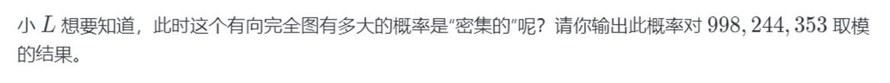
>
> 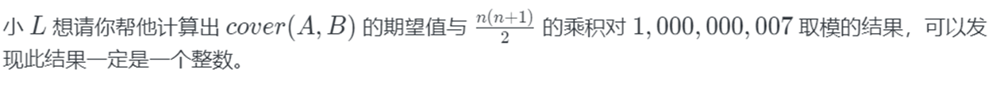
>
> 


已知 C/C++ 常用的数据范围：

- `int` 通常 $[-2^{31},2^{31}-1]$ ， $4$ 字节，其中 $2^{31}\approx2.1\times10^9$
- `long long` $[-2^{63},2^{63}-1]$ ， $8$ 字节，其中 $2^{63}\approx9.2\times10^{18}$
- `unsigned long long` ， $[0,2^{64}-1]$ ， $8$ 字节
- `__int128` $[-2^{127},2^{127}-1]$ ， $16$ 字节，其中 $2^{127}\approx8.5\times10^{37}$
- `double` 有效位数约 $15$ 位， $8$ 字节，范围约为 $[-1.79\times10^{308},1.79\times10^{308}]$
- `long double` 通常有效位数约 $20$ 位，$16$ 字节，范围约为 $[-1.2\times10^{4932},1.2\times10^{4932}]$

> 注意：
>
> 1. 对取值范围为 $[-X,X-1]$ 的整型加 `unsigned` ，取值范围会变为 $[0,2X-1]$ 
>
> 2. 不推荐使用 `short,long,float`
>
> 3. 对实数类型，范围不那么重要，更重要的是有效位数
>
> 4. 注意区分 有效位数 和 小数点后多少位
>
>    这意味着若有效位数平均约是 $7$ 的 $float$ ，非小数部分也会丢失精度，例如对下面代码：
>
>    ```c++
>    printf("%.10f\n", pow(10.0f, 19.0f) - 1.0f);
>    printf("%.10lf\n", pow(10, 19) - 1.0);
>    printf("%.10Lf\n", pow(10.0L, 19) - 1.0); //C++对pow实现了重载
>    ```
>
>    输出结果为：
>
>    ```c++
>    9999999980506447872.0000000000 
>    10000000000000000000.0000000000
>    9999999999999999999.0000000000
>    ```
>
>    [自主思考]请自行体会代码里的占位符、类型转换和函数重载
>
> 5. `__int128` 一般不支持标准输入输出，只用于中间运算，如确实需要输入输出，要么转 `long long`，要么用快读快写
>
>    部分编译器无法编译，但是大部分 OJ 确实能用 `__int128`。


对于很多题目，答案远超于上述数据范围所能表示的。即使不考虑 TLE ，假设使用上述数据类型，要输出答案对某个数的取模，如果仅仅在全部计算结束后才进行取模，在全部计算完毕前已经溢出了。

所以需要一种能够避免溢出的做法， So here comes 取模公式。

> **高精度**在比赛里考得非常少，所以不专门讲，有兴趣者自学。更推荐使用 Python 自带的 `int` 或 `Decimal` 库，也可以用 Java 。


### 加减乘的取模公式

**取模** 符号是 $\bmod$ ，如 $a\bmod b$ 代表 $a$ 除 $b$ 的余数。且有 $a\in Z,b\in Z^*$

对 $a,b\in Z^+$ ，显然有： $a\bmod b\in[0,b-1]$

> 考虑到阅读英文题面需要，介绍一些术语：
>
> 取模 modulo      ; 模数 modulus（名词指 $a\bmod b$ 的 $b$)     ; 余数 remainder

下文规定所有出现在取模两边的数都是整数，且模数不为零。


在算法题目里，有一个约定：若 $c=a\bmod b,c<0$ ，则结果为 $b-c$

> 例如：$(-6)\bmod 5=4$

> 注：负数取模在不同编程语言可能有不一样的结果，参见 [这里](https://www.jianshu.com/p/452c1a5acd31)


**基本公式：**
$$
\begin{align}
(a+b)\bmod p&=(a\bmod p+b\bmod p)\mod p\\\\
(a-b)\bmod p&=(a\bmod p-b\bmod p+p)\mod p\\\\
(a\times b)\bmod p&=(a\bmod p\times b\bmod p)\mod p\\\\
\end{align}
$$
应用：基本公式的运用避免了在计算过程中造成溢出，且减少了运算量(运算的一方总是不超过 $p$ )，避免了开高精度。


使用结合律，可以推导出：
$$
\begin{align}
&(x_1+x_2+\cdots+x_n)\bmod p\\
=&((\cdots((x_1+x_2)+x_3)+\cdots)+x_n)\bmod p \\
=&((\cdots((x_1\bmod p+x_2\bmod p)\bmod p+x_3\bmod p)\bmod p+\cdots)\bmod p+x_n\bmod p)\bmod p \\
\end{align}
$$
同理：
$$
\begin{align}
&(x_1-x_2-\cdots-x_n)\bmod p\\
=&((\cdots((x_1-x_2)-x_3)-\cdots)-x_n)\bmod p \\
=&((\cdots((x_1\bmod p-x_2\bmod p+p)\bmod p-x_3\bmod p+p)\bmod p-\cdots)\bmod p-x_n\bmod+p)\bmod p\\
\end{align}
$$

$$
\begin{align}
&(x_1\times x_2\times \cdots\times x_n)\bmod p\\
=&((\cdots((x_1\times x_2)\times x_3)\times\cdots)\times x_n)\bmod p \\
=&((\cdots((x_1\bmod p\times x_2\bmod p)\bmod p\times x_3\bmod p)\bmod p\times \cdots)\bmod p\times x_n\bmod p)\bmod p \\
\end{align}
$$


> 使用举例：
>
> 1. $$
>    \begin{align}
>    &(2\times 5-8)\bmod 9\\
>    =&((2\times5)\bmod 9-8)\bmod 9\\
>    =&(1-8)\bmod 9\\
>    =&(1-8+9)\bmod9\\
>    =&2
>    \end{align}
>    $$
>
>    这题里显然 $2,5,8$ 模 $9$ 都是自身，所以做了一定简化
>
> 2. $$
>    \begin{align}
>    &(3^{996}-1)\times 8\bmod 3\\
>    =&((3^{996}\bmod 3-1\bmod 3)\times8\bmod3)\bmod 3\\
>    =&((0-1)\times2)\bmod 3\\
>    =&1
>    \end{align}
>    $$
>    
> 3. 给定 $1\le n\le10^5$ ，求 $n!$ 的从个位开始的后 $8$ 位数字
>
>    ```c++
>    #include <bits/stdc++.h>
>    using namespace std;
>    typedef long long ll;
>    ll n, ans = 1, mod = 1e9;
>    signed main()
>    {
>        cin >> n;
>        for (ll i = 2; i <= n; ++i)
>        {
>            ans = ans * i % mod;
>        }
>        cout << ans;
>        return 0;
>    } //事实上到后面都是0了
>    ```


### 逆元

定义：对整数 $a,b$ ，若存在整数 $x$，使得 $ax\bmod b=1$ ，那么 $x$ 是 $a\bmod b$ 的逆元，记作 $x=a^{-1}$ 。读作 $a$ 在模 $b$ 意义下的逆元是 $x$ 。

> 例如： $3$ 在模 $10$ 意义下的逆元是 $7$ ； $1$ 在模 $b(b > 1)$ 意义下的逆元都是 $1$ 。


结论 $1$：存在逆元的充要条件是 $\gcd(a,b)=1$ 

> 例如： $4$ 在模 $6$ 意义下没有逆元。
>
> 显然判断逆元是否存在可以用欧几里得算法(`递归题单-C题`)来直接做。

推论：若 $b$ 是素数，那么 $\forall a\in Z,1\le a<b$ ，逆元都存在。


结论 $2$ ：$a\bmod b$ 的逆元 $x$ 若存在，则必然存在无穷多个，它们构成无穷等差数列，公差是 $b$ ，且一定存在小于 $b$ 的一个正解，通常我们取这样的解作为逆元来计算

> 例如： $3$ 在模 $10$ 意义下的逆元可以取 $\forall k\in Z,10k+7$ 


结论 $3$ ： 若 $a_i=a+bk,k\in Z$ ，则 $a_i\bmod b$ 的逆元相同。即 $a$ 相差整数个 $b$ 时，逆元不变。可取最小的整数，即 $a\bmod b$ 的逆元与 $(a\bmod b)\bmod b$ 的逆元相等。

> 例如：  $3$ 在模 $10$ 意义下的逆元与 $13,23,\cdots$ 在模 $10$ 意义下的逆元一样。


逆元的数学意义：可以不严谨地把 $a^{-1}$ 看成 $\dfrac 1a$ ，即把 $ax\equiv1(\bmod b)$ 等式两边除以 $a$ ，得到 $x\equiv\dfrac1a(\bmod b)$ 

> 类比分数，对 $5\times\dfrac14\times2\times6=20$ ，那么，当 $4$ 的逆元存在时，也应该有：
>
> $5\times 4^{-1}\times2\times6\equiv20(\bmod p)$ 
>
> 以 $p=101$ 为例，$p$ 是素数，存在逆元，计算得 $4^{-1}=76$ ，验证可知左边 $=20$ 
>
> 这条性质使得在对素数取模时计算任意分数(有理数)(分母与 $p$ 互质)存在可能


求逆元的方法：

#### 暴力枚举

> 事先声明：由于效率低下，不推荐使用这种算法来求逆元；给出该算法仅为了加深对逆元的理解

根据结论 $2$ ，可以枚举 $x\in[1,b)$ ，如果发现 $ax\bmod b=1$ ，那么就输出；枚举结束还没发现就是不存在逆元：

```c++
#include <bits/stdc++.h>
using namespace std;
typedef long long ll;
ll a, b;
signed main()
{
    cin >> a >> b;
    for (ll i = 1; i < b; ++i)
    {
        if (a * i % b == 1)
        {
            cout << i;
            return 0;
        }
    }
    cout << "not exist";
    return 0;
}
```


#### 拓展欧几里得算法

若逆元存在，则：

根据裴蜀定理：设 $a,b$ 是不全为零的整数，则 $\exist x,y\in Z$ ，使得：
$$
ax+by=\gcd(a,b)
$$
由于逆元存在，则有 $\gcd(a,b)=1$ ，

等式两边同时对 $b$ 取余，由于 $by$ 必然是 $b$ 的倍数，所以 $by\bmod b=0$ ，所以：
$$
\begin{align}
ax+by\equiv&\gcd(a,b)&(\bmod b)\\
ax+0\equiv&1&(\bmod b)\\
ax\equiv&1&(\bmod b)
\end{align}
$$
即得逆元的定义形式。所以用拓展欧几里得算法求出 $x$ ，即可得到一个逆元。

由于求出的 $x$ 不保证在 $[1,b)$ 内，所以可以作变换，取 $(x\bmod b+b)\bmod b$ 为逆元，使得逆元总是在 $[1,b)$ 内。

> 拓展欧几里得算法见 `递推题单-D题`

代码如下：

```c++
#include <bits/stdc++.h>
using namespace std;
typedef long long ll;
ll a, b, x, y;
ll exgcd(ll a, ll b, ll &x, ll &y)
{
    if (b == 0)
    {
        x = 1, y = 0;
        return a;
    }
    ll gcd = exgcd(b, a % b, y, x);
    y -= a / b * x;
    return gcd;
}
signed main()
{
    cin >> a >> b;
    if (exgcd(a, b, x, y) != 1) 
    {
        cout << "not exist";
        return 0;
    }
    cout << (x % b + b) % b;
    return 0;
}
```

> 注：一种 Python 写法见 [这里](https://cloud.socoding.cn/s/VzqHO)


#### 快速幂算法

> 篇幅和时间有限，不给出具体证明。

要求： $b$ 是素数才可以使用该算法。($b$ 是素数时根据结论 $1$ 必然存在逆元，不需要判不存在)

做法：根据费马小定理，已知 $b$ 为素数，则可知 $a^{b-2}$ 一定是逆元。计算 $a^{b-2}$ 即可。

> 再次强调，该做法不适用于 $b$ 是合数的情况，这时会输出错误解答。

代码：

```c++
#include <bits/stdc++.h>
using namespace std;
typedef long long ll;
ll qpow(ll a, ll b, ll mod)
{ //一种较快的求整数幂算法，在后续先修班课程会教
    ll res = 1;
    for (; b > 0; b >>= 1) //即;b>0;b/=2
    {
        if (b & 1) //即b%2==1
        {
            res = res * a % mod;
        }
        a = a * a % mod;
    }
    return res;
}
ll inv(ll a, ll b)
{
    return qpow(a, b - 2, b);
}
ll a, b;
signed main()
{
    cin >> a >> b;
    cout << inv(a, b);
    return 0;
}
```


### 除法取模公式

基本公式：
$$
(a\div b)\bmod p=(a\times b^{-1})\bmod p=(a\bmod p\times b^{-1}\bmod p)\bmod p
$$
数学意义：是分数 $\dfrac ab$ 在模 $p$ 下的表示，将这个结果乘上 $b$ 后将得到 $a$ 。在模 $p$ 下，可以理论上表示任何有理数。最终实现了有理数的精确取模表示。

> 模 $p$ 的表示一个整数，本身就是损失了精度的(这会导致无穷多个整数对应一个余数)，那么模 $p$ 表示一个有理数，就会导致一个余数不仅对应无穷多个整数，还对应无穷多个分数。
>
> 但是，以分数形式计算有理数。可以避免由计算机内部处理 `double,float` 等方法造成的这类精度损失。不同计算机计算同一个 `double` 表达式，可能会得到不一样的结果；但是如果计算同一个分数取模，一定得到同一个结果，因为分数取模的本质是整数运算。


结合律推导的公式同上理：
$$
\begin{align}
&(x_1\div x_2\div \cdots\div x_n)\bmod p\\
=&((\cdots((x_1\div x_2)\div x_3)\div\cdots)\div x_n)\bmod p \\
=&((\cdots((x_1\bmod p\times x_2^{-1}\bmod p)\bmod p\times x_3^{-1}\bmod p)\bmod p\times \cdots)\bmod p\times x_n^{-1}\bmod p)\bmod p \\
\end{align}
$$


> 例题：
>
> 1. $$
>    \begin{align}
>    &(\dfrac25-\dfrac13)\bmod11\\
>    =&(2\cdot5^{-1}\bmod11-3^{-1}+11)\bmod11\\
>    =&(2\times9\bmod11-4+11)\bmod11\\
>    =&(7-4+11)\bmod11\\
>    =&3
>    \end{align}
>    $$
>
>    解法二：
>    $$
>    \begin{align}
>    &(\dfrac25-\dfrac13)\bmod11\\
>    =&\dfrac{1}{15}\bmod11\\
>    =&15^{-1}\bmod11\\
>    =&3
>    \end{align}
>    $$
>
> 2. $$
>    \begin{align}
>    &(1-\dfrac2{x^y})\bmod p,x\in Z^+,y\in N,p=998244353\\
>    =&(1-2\cdot(x^y\bmod p)^{-1}\bmod p+p)\bmod p\\
>    \end{align}
>    $$
>
>    > 其中 $x^y\bmod p$ 等效于 $x\cdot x\bmod p\cdot x\bmod p\cdots\cdot x\bmod p$ ，有 $y$ 个 $x$
>    >
>    > 注： $998244353,10^9+7$ 是两个常见的大素数
>    
> 3. $$
>    C_n^m\bmod p,p 是素数,n,m\in Z,1\le m\le n
>    $$
>
>    用阶乘展开，得：
>    $$
>    \begin{align}
>    &\dfrac{n!}{m!(n-m)!}\bmod p\\
>    =&(n!\bmod p)\cdot(m!\bmod p)^{-1}\bmod p\cdot((n-m)!\bmod p)^{-1}\bmod p\\
>    \end{align}
>    $$
>    其中 $x!\bmod p$ 的计算方法见上文，等效于多个乘法取模计算。


特别注意，如果模数是 $2^{32}$ 或 $2^{64}$ ，那么余数取值范围恰好对应 `unsigned int` 和 `unsigned long long` ，那么此时 C/C++ 对溢出的处理机制是舍弃高位，即效果相当于取模，在这种情况下可以直接进行运算。

> 如：求 $n^m\bmod 2^{32}$
>
> ```c++
> typedef unsigned int uint;
> uint n, m, r = 1u;
> signed main()
> {
>     cin >> n >> m;
>     for (uint i = 0; i < m; ++i)
>     {
>         r *= n;
>     }
>     cout << r;
>     return 0;
> }
> ```


### 练习题

> 请在 OJ 小组上完成堂上练习 `逆元` 和 `取模` 


## 复杂度

### 时间复杂度

#### 引入

算法题总是限制了一个程序运行时每个测试点能用的最大时限和最大内存限制：


已知：在绝大多数判题平台，一秒钟可以做数量级约为 $10^8$ 到 $10^9$ 的**基本操作**，性能不同略有差异。

基本操作有：

- **基本数据类型**的四则运算、位运算、逻辑运算、类型转换

  > 字符串加法(链接)、高精度加法等不是基本操作

- 基本数据类型的取值(访问)和赋值

  > 取值操作可能不比上面的操作快

所有其他操作均可以由若干基本操作组成。

> 例如，下面语句都是基本操作：
>
> ```c++
> long long a = 666;
> a *= 233;
> double b = (double)a / 2;
> bool c = (a==b);
> c ^= 1;
> ```
>
> 例如，下面语句都不是基本操作：
>
> ```c++
> cin >> a; //a是long long
> cout << a; //printf,scanf等输入输出同理也不是基本操作
> string s = "abcde";
> s += "shannon";
> strlen(ss); //ss是char数组
> memset(d, 0, sizeof d); //d是数组
> memcpy(d, e, sizeof e); //e是数组
> pow(2, 10.1);
> ```


记由常数个基本操作组成的一个表达式是一个基本语句。

> 如：下面语句是基本语句
>
> ```c++
> a = a * b % p;
> scanf("%d", &a); //a是基本数据类型；若a是char[]，不是基本语句
> printf("Things hard at the beginning, the middle and last.\n");
> sin(acos(-1.0)/4); //sin(45°)
> abs(max(1LL, 2*k-1)); //k是long long
> pow(a, b); //b是实数
> char c = getchar();
> ```
>
> > 注：`pow` 确实是常数个基本操作的，参见[这里](https://cloud.tencent.com/developer/ask/47368)，验证代码在[这里](https://cloud.socoding.cn/s/2VnFb)
>
> 如：下面语句不是基本语句
>
> ```c++
> strlen(ss); //s是char[]，基本操作数量取决于ss长度，不是常数
> memset(d, 0, sizeof d); //d是数组
> memcpy(d, e, sizeof e); //e是数组
> ```


#### 执行次数

记 $T$ 是程序的基本语句执行次数。通常而言， $T$ 是以输入数据的数据量为自变量的函数。

因此，判断代码是否会超时，即判断这份代码在最差情况(使得执行次数最大的数据点)下基本语句执行次数会不会超过限制。

因为一般需要计算的是最坏情况，所以基本计数方法：

- 顺序语句，直接累加
- 分支语句，取最大值
- 循环语句，直接累积
- 递归语句，数列推导


> 下面用题目举例说明：
>
> 1.  `SCNUOJ 1000 A+B 问题`
>
>    ```c++
>    #include <bits/stdc++.h>
>    using namespace std;
>    int main() {
>        int a, b;
>        cin >> a >> b;
>        cout << a + b;
>        return 0;
>    }
>    ```
>
>    该代码的执行次数是 $T = 3$ 。
>
> 2. `SCNUOJ 1059 三角形`
>
>    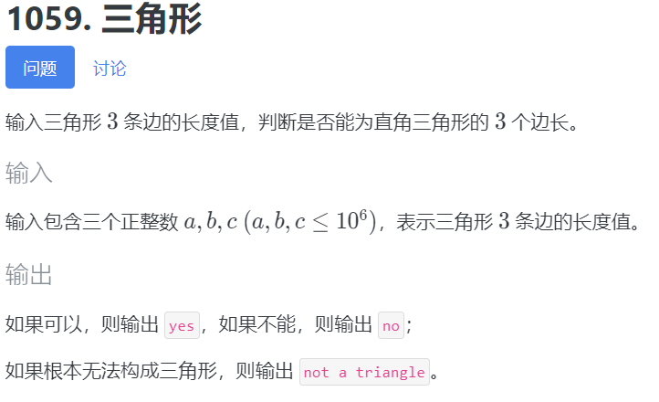
>
>    ```c++
>    #include <bits/stdc++.h>
>    using namespace std;
>    int main()
>    {
>        int a, b, c;
>        cin >> a >> b >> c;
>        if (a > b)
>            swap(a, b); //冒泡升序排序
>        if (b > c)
>            swap(b, c);
>        if (a > b)
>            swap(a, b);
>        if (a + b <= c)
>            cout << "not a triangle\n";
>        else
>        {
>            if (a * a + b * b == c * c)
>                cout << "yes\n";
>            else
>                cout << "no\n";
>        }
>        return 0;
>    }
>    ```
>
>    分支考虑取最大值，即总是能进入分支且进入执行次数最多的，所以有：
>
>    $T = 2+6+2=10$
>
> 3. 输入 $1\le n\le 10^5$ ，求 $n!\bmod 10^9$ 
>
>    ```c++
>    #include <bits/stdc++.h>
>    using namespace std;
>    typedef long long ll;
>    ll n, ans = 1, mod = 1e9;
>    signed main()
>    {
>        cin >> n;
>        for (ll i = 2; i <= n; ++i)
>        {
>            ans = ans * i % mod;
>        }
>        cout << ans;
>        return 0;
>    }
>    ```
>
>    循环次数是 $n$ ，循环体内有 $1$ 个基本语句，for 头可以看成是 $1$ 个基本语句。
>
>    所以： $T=1+1+n+n=2n+2$
>
> 4. `SCNUOJ 1518 白茶与三元方程`
>
>    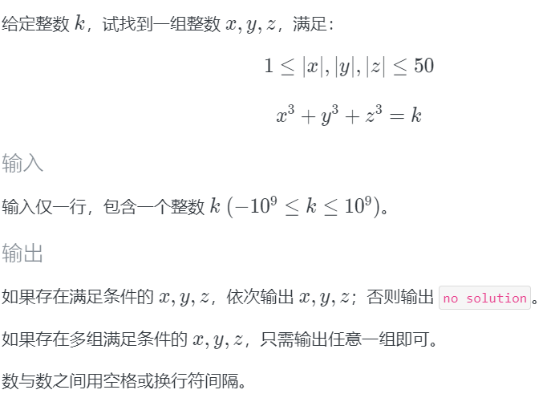
>
>    ```c++
>    #include <stdio.h>
>    int k;
>    int main()
>    {
>        scanf("%d", &k);
>        for (int x = -50; x <= 50; x++)
>        {
>            for (int y = x; y <= 50; y++)
>            {
>                for (int z = y; z <= 50; z++)
>                {
>                    if (x && y && z && x * x * x + y * y * y + z * z * z == k)
>                    {
>                        printf("%d %d %d\n", x, y, z);
>                        return 0;
>                    }
>                }
>            }
>        }
>        printf("no solution");
>        return 0;
>    }
>    ```
>
>    由于计次不出现负数，所以把 $\sum_{a=b}^{50},b<0$ 转化为 $\sum_{a=1}^{50+b+1}$
>    $$
>    \begin{align}
>    T &= 2+\sum_{x=1}^{t}(\sum_{y=x}^{t}(\sum_{z=y}^{t}1))\quad,t=100 \\
>    &= 2+\sum_{x=1}^{t}(\sum_{y=x}^{t}(t-y+1)) \\
>    &= 2+\sum_{x=1}^{t}((t+1)(t+1-x)-\dfrac{(t+1-x)(x+t)}2) \\
>    &= 2+\sum_{x=1}^t(-\dfrac{x^2}2-(t+\dfrac32)x+\dfrac{t^2}2+\frac{3t}2+1)\\
>    &= 2+\dfrac12\cdot\dfrac{t(t+1)(2t+1)}6-(t+\dfrac32)\dfrac{t(t+1)}2+t(\dfrac{t^2}2+\frac{3t}2+1)\\
>    &=\dfrac{t^3}6+\dfrac{t^2}2+\dfrac t3+2
>    \end{align}
>    $$
>
>    代入 $t=100$ ，得原式 $=171702$ (其实考虑 $0$ ， 应该是 $t=101$ ，但算着麻烦)
>
>    > 非比赛时可以用比 `Python` 更高级的计算器 `mupad` 偷懒，参考代码：
>    >
>    > ```matlab
>    > T:=Simplify(2+sum(sum(sum(1,z=y..t),y=x..t),x=1..t));
>    > subsex(%,t=100);
>    > ```
>
> 5. `SCNUOJ 1070 子序列` 代码“友情贡献”自 `Lv_da` 于修仙班微信群
>
>    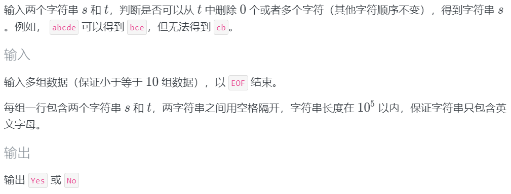
>
>    ```c++
>    #include <stdio.h>  //TLE
>    #include <string.h>
>    #include <stdbool.h>
>    char str1[100001] = {0}, str2[100001] = {0};
>    int main()
>    {
>        bool flag = false;
>        while (scanf("%s", &str1) != EOF)
>        {
>            scanf("%s", &str2);
>            flag = false;
>            int j = 0;
>            for (int i = 0; i < strlen(str2); i++)
>            {
>                if (str2[i] == str1[j])
>                    j++;
>                if (j == strlen(str1))
>                    flag = true;
>                if (j >= strlen(str1))
>                    break;
>            }
>            if (flag == true)
>            {
>                printf("Yes\n");
>            }
>            else
>            {
>                printf("No\n");
>            }
>        }
>        return 0;
>    }
>    ```
>
>    设 `str1`,`str2` 字符串长度分别为 $|s|, |t|$ ，根据题意 $|s|,|t|\le10^5$ 
>
>    所以输入语句贡献 $|s|,|t|$ 次基本语句。(等效于约 $|s|, |t|$ 次 `getchar`)，
>
>    设输入 $n$ 组数据，有 $n\le 10$，则：
>
>    $T = n(|s|+|t|+3+|t|\cdot(|t|+2+2|s|)+2+2)$ ，由于存在 $|t|^2,|t|\cdot|s|$ ，执行次数可能会达到 $10^{10}$ ，所以超时。
>
> 6. 上一份代码的 `LV_da` 代码 V2.0 ：
>
>    ```c++
>    #include <stdio.h>
>    #include <string.h>
>    #include <stdbool.h>
>    char str1[100001], str2[100001];
>    int main()
>    {
>        bool flag = false;
>        while (scanf("%s", &str1) != EOF)
>        {
>            scanf("%s", &str2);
>            flag = false;
>            int j = 0;
>            int n = strlen(str1);
>            int m = strlen(str2);
>            for (int i = 0; i < m; i++)
>            {
>                if (str2[i] == str1[j])
>                    j++;
>                if (j == n)
>                    flag = true;
>                if (j >= n)
>                    break;
>            }
>            if (flag == true)
>            {
>                printf("Yes\n");
>            }
>            else
>            {
>                printf("No\n");
>            }
>        }
>        return 0;
>    }
>    ```
>
>    $T=n(|s|+|t|+2+|s|+|t|+1+|t|\cdot(2+2)+2+2)$ 
>
> 由于递归语句的分析比较复杂，在下文再继续分析。


#### 时间复杂度

由于直接计算执行次数非常复杂，这样对代码量大的程序计算量太大了。所以考虑在不明显影响计算结论的情况下，对计算进行简化。

对一个表达式只考虑最高次的自变量乘积，忽略掉常数和所有系数，就得到了**复杂度**。

记表达式为 $T$ ，那么表达式的复杂度为 $\Omicron(T)$ 。(写作大写字母 $O$ ，读作欧)

> 严格定义如下：渐进上界记号 $\Omicron$
>
> 对函数 $f(n)$ ，存在正常数 $c_,n_0$ ，使 $\forall n\ge n_0$ ，有 $0\le f(n)\le c\cdot\Omicron(f(n))$
>
> $\Omicron(f(n))$ 其实也是一个函数，可以认为是小于 $f(n)$ 的一个 $f(n)$ 的简化的近似函数
>
> 之所以忽略掉低次项、常数和系数，是因为当自变量趋于无穷大时，它们的影响忽略不计。但是如果系数/常数特别大(视情况而定，比如大于 $10^3$ )，可以考虑不忽略


求执行次数的复杂度，就是求时间复杂度。

特别地，当执行次数只有常数时，结果为 $\Omicron(1)$ 。


根据分支语句执行次数的差异，时间复杂度分为三种：

- 最优复杂度 - 所有分支都走执行次数最小的情况
- 平均复杂度 - 随机数据下的分支执行次数的情况
- 最差复杂度 - 所有分支都走执行次数最大的情况

一般来说，只考虑平均和最差，并且通常题目测试点总会有能产生最差复杂度的数据，所以应保证最差复杂度也能过题。下面计算复杂度默认约定为最差复杂度。


##### 非递归

> 例如，对上面的例题求时间复杂度：
>
> -  $\Omicron(3)=1, \Omicron(10)=1,\Omicron(2+101(51\times101+0))\approx\Omicron(10^2\cdot50\cdot10^2)$
>
> - $$
>   T = n(|s|+|t|+3+|t|\cdot(|t|+2+2|s|)+2+2)\\
>   \Omicron(T)=\Omicron(n(|s|+|t|+|t|(|s|+|t|))=\Omicron(n|t|^2+n|t|\cdot|s|)\\
>   $$
>
>   $$
>   T=n(|s|+|t|+2+|s|+|t|+1+|t|\cdot(2+2)+2+2)\\
>   \Omicron(T)=\Omicron(n(|s|+|t|+|t|))=\Omicron(n|t|) 或 \Omicron(n|s|)
>   $$
>
> 来看更多例子：
>
> - ```c++
>   long long n, m, r = 0;
>   cin >> n >> m;
>   for (int i = 0; i < n; ++i)
>   {
>       for (int j = 0; j < m; ++j)
>       {
>           r += i * i * j;
>       }
>   }
>   cout << r;
>   ```
>
>   时间复杂度为 $\Omicron(nm)$ 
>
>   结论：对这样的循环，乘上每层会遍历多少次即可。即对 $k$ 层循环，有 $\Omicron(n^k)$
>
> - 三元方程，设 $-t\le x,y,z\le t$ ，有：
>   $$
>   T=\dfrac{t^3}6+\dfrac{t^2}2+\dfrac t3+2\\
>   \Omicron(T)=\Omicron(t^3)
>   $$
>   一种不计算数列的更简便的组合数学计算方法：由于枚举保证的是 $x\le y\le z$ ，而对上例循环，假设三层， $x,y,z$ 的排列有 $3!=6$ 种，只有一种满足 $x\le y\le z$ ，所以相比上例减少了 $3!$  倍。所以执行次数复杂度为： $\Omicron(\dfrac{t^3}{3!})=\Omicron(t^3)$ 
>   
>   不失一般地，若有 $k$ 层循环，则有：$\Omicron(\dfrac{t^k}{k!})$


##### 数量级

考虑到在执行次数转时间复杂度时，因为忽略了系数和低次项，且一个基本语句执行可以等于一到几个基本操作，所以一般认为：

- 时间复杂度的计算结果数量级在 $10^6$ 以内是绰绰有余的
- 时间复杂度的计算结果数量级在 $10^7$ 到 $10^8$ 时也能过题，但有时需要注意优化常数
- 时间复杂度的计算结果数量级在 $10^9$ 和以上时可认为会 TLE


根据最后计算的结果，可以分为几种常见的复杂度：(大致从小到大排列)

1. 常数复杂度 $\Omicron(1)$

2. 对数复杂度 $\Omicron(\log n)$

3. 根号复杂度 $\Omicron(\sqrt n)$

4. 线性复杂度  $\Omicron(n)$

5. 平方复杂度 $\Omicron(n^2)$

6. 立方复杂度 $\Omicron(n^3)$ 

7. 指数复杂度 $\Omicron(n^m)$

   阶乘复杂度 $\Omicron(n!)$

> 总的时间复杂度表达式也常是上面几种常见复杂度的求和与乘积，如：
>
> $\Omicron(n+m)$ ，$\Omicron(n\log n)$ (线性对数复杂度) 

下面列表给出 $10^8$ 次基本操作最大允许的数据量(解方程易得)：

| 运算量 | $n!$ | $2^n$ | $n^3$ | $n^2$   | $nlog_2n$       | $n$           |
| ------ | ---- | ----- | ----- | ------- | --------------- | ------------- |
| 最大   | $11$ | $26$  | $464$ | $10^4$  | $4.5\times10^6$ | $10^8$        |
| 二倍速 | $11$ | $27$  | $584$ | $14142$ | $8.6\times10^6$ | $2\times10^8$ |


> 例题：求下面代码的时间复杂度
>
> 1. ```c++
>    int a[n][m];
>    int i = 1;
>    while (i < n)
>    {
>        memcpy(a[i], a[i - 1], sizeof a[i]);
>        ++i;
>    }
>    ```
>
>    答：$\Omicron(nm)$
>
> 2. ```c++
>    for (int i = 0; i * i < n; ++i)
>    {
>        if (m % i == 0)
>        {
>            cout << "not a prime";
>            return 0;
>        }
>    }
>    cout << "prime";
>    ```
>
>    设 $i=x$ 时最后一次执行循环，最差时 $m\bmod i=0$ 恒不成立，由：
>
>    $x^2<n$ 得 $x=\lfloor\sqrt n\rfloor$ ，所以 $\Omicron(\sqrt n)$
>
> 3. ```c++
>    cin >> n;
>    int a[65] = {}, ai = 0;
>    for (; n > 0; n >>= 1)
>    {
>        a[ai++] = n & 1;
>    }
>    for (int i = ai - 1; i >= 0; --i)
>    {
>        cout << a[i];
>    }
>    ```
>
>    对第一个循环，每次 $n$ 除二下取整(可近似为除二)，最后一次循环时 $n=1$ ，设循环了 $x$ 次，则有近似等式： $\dfrac n{2^x}=1$ ，解得 $x=\log_2 n$ ，那么第一个循环复杂度为 $\Omicron(\log n)$
>
>    所以有 $ai\approx \log_2 n$ ，第二个循环复杂度也为 $\Omicron(\log n)$ 
>
>    故总时间复杂度为： $\Omicron(log n+\log n)=\Omicron(\log n)$
>
>    同理，所以求逆元的快速幂算法复杂度为 $\Omicron(\log n)$
>
> 4. ```c++
>    int a[n], b[n]; //省略输入，假设a,b都单调递增
>    for (int i = 0, j = 0; i < n; ++i)
>    {
>        while (j < n && b[j] < a[i])
>        {
>            cout << i << " " << j << endl;
>            ++j;
>        }
>    }
>    ```
>
>    整体法分析。由于内循环每次循环体都 `++j` ，结束条件有 `j<n` ，所以内循环体加起来最多被执行 $n$ 次。外循环体必然执行 $n$ 次。所以时间复杂度为 $\Omicron(n)$ 。


##### 递归

> 对递归函数时间复杂度的分析举例：
>
> 1. ```c++
>    ll fact(ll x)
>    {
>        if (x <= 1)
>        {
>            return 1;
>        }
>        return x * fact(x - 1);
>    }
>    ```
>
>    设对数据量 $x$ ，基本语句执行次数为 $a_x$ ， $x\le 1$ 时， 有 $a_x=1=\Omicron(1)$
>
>    $x>1$ 时，由第七行代码，有 $a_x= 1+a_{x-1}$ ，根据数列知识，有：
>
>    $a_x=x$ ，即 $a_x=\Omicron(x)$
>
> 2. ```c++
>    ll fib(ll n)
>    {
>        if (n <= 0)
>        {
>            return 0;
>        }
>        if (n <= 2)
>        {
>            return 1;
>        }
>        return fib(n - 1) + fib(n - 2);
>    }
>    ```
>
>    有 $n\le 2$ 时， $a_n=1$ ，
>
>    $n > 2$ 时， $a_n=1+a_{n-1}+a_{n-2}$ ，由于 $n$ 较大时， $a_{n-1},a_{n-2}$ 很大，可以近似认为： $a_n=a_{n-1}+a_{n-2}$ ，由数学知识，有：
>    $$
>    a_n=\dfrac1{\sqrt5}\left[\left(\dfrac{1+\sqrt5}2\right)^n-\left(\dfrac{1-\sqrt5}2\right)^n\right]
>    $$
>    是指数复杂度，约为 $\Omicron(1.6^n)$
>
>    易得，非递归做法的复杂度为 $\Omicron(n)$ 
>
> 3. `递归题单 E-汉诺塔`
>
>    ```c++
>    #include <stdio.h>
>    void hanio(char a, char b, char c, int n)
>    {
>        if (n > 1)
>            hanio(a, c, b, n - 1);
>        printf("%c->%c\n", a, c);
>        if (n > 1)
>            hanio(b, a, c, n - 1);
>    }
>    int main()
>    {
>        int n;
>        scanf("%d", &n);
>        hanio('A', 'B', 'C', n);
>        return 0;
>    }
>    ```
>
>    复杂度与参数 `char a, b, c` 无关，所以只看 $n$ 。
>
>    有： $a_1=1$ ； $n>1$ 时， $a_n=1+2a_{n-1}\approx 2a_{n-1}$ ，由数列知识：
>
>    $a_n=2^{n-1}=\Omicron(2^n)$
>
> 4. `递归题单 C-最大公因数`
>
>    ```c++
>    #include <bits/stdc++.h>
>    using namespace std;
>    typedef long long ll;
>    ll a, b;
>    ll gcd(ll a, ll b)
>    {
>        return b ? gcd(b, a % b) : a;
>    }
>    signed main()
>    {
>        cin >> a >> b;
>        cout << gcd(a, b);
>        return 0;
>    }
>    ```
>
>    是否继续递归取决于 $b$ ，有 $b=0$ 时，  $T_{a,b}=1$ ，否则， $T_{a,b}=1+T_{b,a\bmod b}$
>
>    对于难以计算的各种复杂递推式，可以采取估算的方法，统计在不同数量级下执行次数：
>
>    ```c++
>    #include <bits/stdc++.h>
>    using namespace std;
>    typedef long long ll;
>    ll a, b, cnt;
>    ll gcd(ll a, ll b)
>    {
>        ++cnt;
>        return b ? gcd(b, a % b) : a;
>    }
>    signed main()
>    {
>        srand(time(nullptr));
>        for (ll mod = 10, h = 1; mod <= 1e17; mod *= 10, ++h)
>        {
>            double avg = 0;
>            for (ll i = 0; i < 100; ++i)
>            {
>                cnt = 0;
>                a = 1LL * rand() * rand() * rand() % mod * rand() % mod;
>                b = 1LL * rand() * rand() * rand() % mod * rand() % mod;
>                gcd(a, b);
>                avg += cnt;
>            }
>            printf("%-2lld %6.2lf\n", h, avg / 100);
>        }
>        return 0;
>    }
>    ```
>    
>    得到结果为：
>    
>    ```c++
>    1    1.58
>    2    3.31
>    3    5.41
>    4    6.98
>    5    8.87
>    6   11.11
>    7   13.27
>    8   15.24
>    9   16.62
>    10  18.84
>    11  20.85
>    12  22.32
>    13  24.35
>    14  26.69
>    15  29.06
>    16  30.27
>    17  30.11
>    ```
>    
>    可以看到随着数量级递增，执行次数近似线性递增，这符合对数的特征，所以可以估算出时间复杂度为 $\Omicron(\log n)$
>    
>    对于很多实在是推导不出来复杂度的程序，也可以造数据模拟(一元函数不用随机，多元函数可以随机，得到的将是平均复杂度(一般不是最差复杂度))
>    
>    那么显然地，拓展欧几里得算法的时间复杂度也是 $\Omicron(\log n)$
>    
>    该算法的时间复杂度的确实是 $\Omicron(\log n)$ ，严格证明繁琐，具体参见 [拉梅定理](https://baike.baidu.com/item/%E6%8B%89%E6%A2%85%E5%AE%9A%E7%90%86/9715876?fr=aladdin)


##### 主定理

> 这里简化了主定理，只考虑常用的分治递推式，完整严谨表述参见各大搜索引擎

若递归算法存在分治递推式：
$$
T(n)=\begin{cases}c&n=1\\aT(\dfrac nb)+cn^k&n>1\end{cases}
$$
其中 $a,b,c,k$ 是常数，$T(n)$ 是非递减函数，则：
$$
T(n)=\begin{cases}\Omicron(n^{\log_ba})&a>b^k\\
\Omicron(n^k\log_bn)&a=b^k\\
\Omicron(n^k)&a<b^k\end{cases}
$$

注： $b=1$ 不适用，这是因为 $T(n)=aT(n)+cn^k$ 显然是死循环， $\log_ba\to\infty$

> 分别举例给出三种情况的一个例子：
>
> 1. ```c++
>    void f(ll x, ll y, ll n) //随便写的代码没有什么实际意义
>    {
>        printf("%lld %lld %lld\n", x, y, n);
>        if (n > 1)
>        {
>            f(x, y, n / 2);
>            f(x / 2, y, n / 2);
>            f(x, y / 2, n / 2);
>            f(x / 2, y / 2, n / 2);
>        }
>    }
>    ```
>
>    $a=4,b=2,k=0$ ， $a>b^k$ ，$\Omicron(n^{\log_ba})=\Omicron(n^2)$
>
> 2. ```c++
>    #define mn 100002 //同样地，不用理解这段代码是什么意义
>    ll a[mn], d[mn << 2], b[mn << 2];
>    void build(ll lf, ll rf, ll rot)
>    {
>        if (lf == rf)
>        {
>            d[rot] = a[lf];
>            return;
>        }
>        ll cf = lf + rf >> 1;
>        build(lf, cf, rot << 1);
>        build(cf + 1, rf, rot << 1 | 1);
>        d[rot] = d[rot << 1] + d[rot << 1 | 1];
>    }
>    ```
>
>    设 $n=rf-lf+1$，$a=b=2,k=0$ ， $a>b^k$ ，为 $\Omicron(n^{\log_ba})=\Omicron(n)$ 
>
>    注：具体而言执行次数为 $2n-1$
>    
> 3. ```c++
>    void tobin(ll x)
>    {
>        if (x > 1)
>            tobin(x >> 1);
>        printf("%d", x & 1);
>    }
>    ```
>
>    $a=1,b=2,k=0$ ， $a=b^k$ ，为 $\Omicron(n^k\log_bn)=\Omicron(\log n)$
>    
> 4. ```c++
>    #define mn 100002
>    ll n, a[mn], q, x, t[mn];
>    void merges(ll lf, ll cf, ll rf)
>    {
>        ll i = lf, m = cf, j = cf + 1, n = rf, k = 0;
>        while (i <= m && j <= n)
>        {
>            if (a[i] <= a[j])
>            {
>                t[k++] = a[i++];
>            }
>            else
>            {
>                t[k++] = a[j++];
>            }
>        }
>        while (i <= m)
>        {
>            t[k++] = a[i++];
>        }
>        while (j <= n)
>        {
>            t[k++] = a[j++];
>        }
>        for (ll i = 0; i < k; ++i)
>        {
>            a[lf + i] = t[i];
>        }
>    }
>    void mergesort(ll lf, ll rf)
>    {
>        if (lf < rf)
>        {
>            ll cf = (lf + rf) / 2;
>            mergesort(lf, cf);
>            mergesort(cf + 1, rf);
>            merges(lf, cf, rf);
>        }
>    }
>    ```
>
>    $k=1$ (因为 `merges` 的复杂度是 $\Omicron(n)$ ，所以 $k=1$ )， $a=b=2$ 
>
>    $a=b^k$ ，为 $\Omicron(n^k\log_bn)=\Omicron(n\log n)$
>
> 5. ```c++
>    #define mn 1010 //这段代码没什么明显意义
>    ll a[mn][mn];
>    void f(ll n)
>    {
>        for (ll i = 1; i <= n; ++i)
>        {
>            for (ll j = 1; j <= n; ++j)
>            {
>                a[i][j] += a[n - i - 1][n - j - 1];
>            }
>        }
>        if (n)
>        {
>            f(n >> 1);
>        }
>    }
>    ```
>
>    $a=,b=2,k=2,a<b^k$ ，所以时间复杂度 $\Omicron(n^k)=\Omicron(n^2)$
>
>    具体分析，这是因为第一次递归 $n=2$ 跑到了 $n^2$ ，之后 $n$ 不断减半，即 $\left(\dfrac n2\right)^2$ , $\left(\dfrac n4\right)^2$ , $\cdots$ ，所以第一次递归贡献的复杂度最大。而不是盲目认为递归了 $\log n$ 次每次都是 $\Omicron(n^2)$ 所以 $\Omicron(n^2\log n)$


### 空间复杂度

用于计算数组大小是否超过题目限制。

常用单位：
$$
\begin{align}
8\ bit&=1\ Byte\\
1024\ Byte&=1\ KB\\
1024\ KB&=1\ MB\\
1024\ MB&=1\ GB\\
1024\ GB&=1\ TB\\
\end{align}
$$
对基本数据类型：(单位： $Byte$)

- $1:$  `char, bool`
- $4$ ：`int, float, unsigned int`
- $8$ ：`long long, double, unsigned long long`
- $16$ ： `long double, __int128`

数组内存大小 $=$ 数组元素数 $\times$ 基本数据类型 $\div$ 单位


注意：全局变量内存大小限制一般不会小于题目限制；非全局变量内存大小加起来一般不能超过 $2\ MB$ ，否则可能会 RE 。大约是 $2.6\times10^5$ 大小的数组(以 `long long` 为例)。

计算空间复杂度，即把全部变量(主要是数组)的大小的表达式求出来，算其复杂度。一般计算单位是 $MB$ 。


> 例：求空间复杂度
>
> ```c++
> int maxn = 1e7 + 10;
> long long a[maxn], b[maxn];
> ```
>
> $2\times8\times10^7\div2^{20}\approx152.6\ MB$
>
> ```c++
> int a[10001][10001], b, c, d, e, f, g[10001];
> ```
>
> 忽略其他项，只看二维数组： $4\times10^4\times10^4\div2^{20}\approx 381.5\ MB$


### 做题步骤

一般做一道算法题的步骤为：

1. 读懂题目(题意、时空限制、输入输出格式)
2. 设计算法
3. 分析算法的时空复杂度
4. 写代码和调试

> 注意不是 $1\to2\to4\to3$ ，分析复杂度应该在动手写代码之前完成
>
> 第一步只与双语水平、算法术语积累量、做题量等有关；第二、第四步 a long way to go ；第三步是本节课的内容
>
> ~~除了第三步，每一步其实都很难~~


> 举例：
>
> 1. `1024节 - 0b01`
>
>    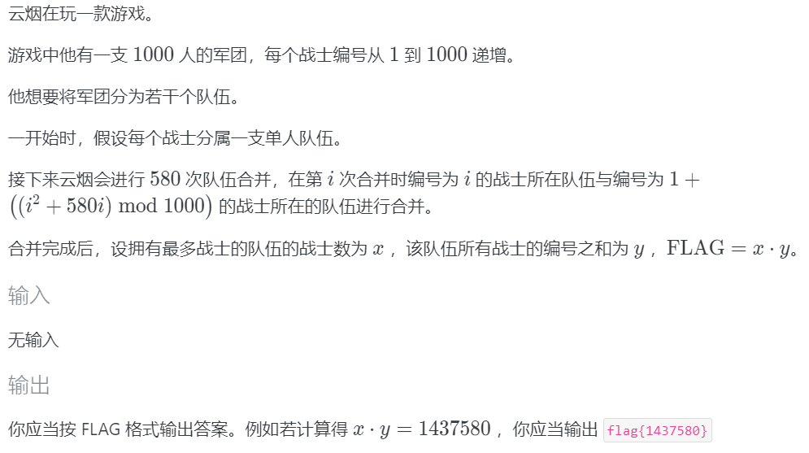
>
>    - 读懂题目：字如其意
>
>    - 设计算法：开 `vector` ，暴力模拟合并过程
>
>    - 算复杂度：合并次数 $n=580$ ，每次合并时，队伍人数最坏情况会递增，第 $i$ 次合并时待合并的两个数组长度之和最差为 $i$ ，那么时间复杂度为：
>
>      $\Omicron(\sum_{i=1}^ni)=\Omicron(\dfrac{n(n+1)}2)=\Omicron(n^2)\approx3\times10^5$
>
>      空间复杂度为战士数 $m=10^3$，为 $\Omicron(m)$，时空复杂度优，可以过题。
>
>    - 编写代码：
>
>      ```c++
>      #include <bits/stdc++.h>
>      using namespace std;
>      typedef long long ll;
>      #define n 1000
>      #define m 580
>      ll fa[n + 2], sum[n + 2], num[n + 2], ansi;
>      vector<ll> g[n + 2];
>      signed main()
>      {
>          for (ll i = 1; i <= n; ++i)
>          {
>              fa[i] = i;
>              g[i].emplace_back(i);
>          }
>           
>          for (ll i = 1; i <= m; ++i)
>          {
>              ll j = (i * i + i * m) % n + 1, fj = fa[j];
>              for (ll k : g[fj])
>              {
>                  fa[k] = fa[i];
>                  g[fa[i]].emplace_back(k);
>              }
>              g[fj].clear();
>          }
>           
>          ll w = 0;
>          for (ll i = 1; i <= n; ++i)
>          {
>              for (ll j : g[i])
>              {
>                  sum[i] += j;
>              }
>              num[i] = g[i].size();
>              w += g[i].size();
>          }
>           
>          for (ll i = 1; i <= n; ++i)
>          {
>              if (num[i] > num[ansi] || (num[i] == num[ansi] && sum[i] > sum[ansi]))
>              {
>                  ansi = i;
>              }
>          }
>          printf("flag{%lld}", num[ansi] * sum[ansi]);
>          return 0;
>      }
>      ```
>
>      > 这道题的另一正解是 `并查集` ，时间复杂度是 $\Omicron(n)$ 
>
>    
>
> 2. `1024节 - 0b10`
>
>    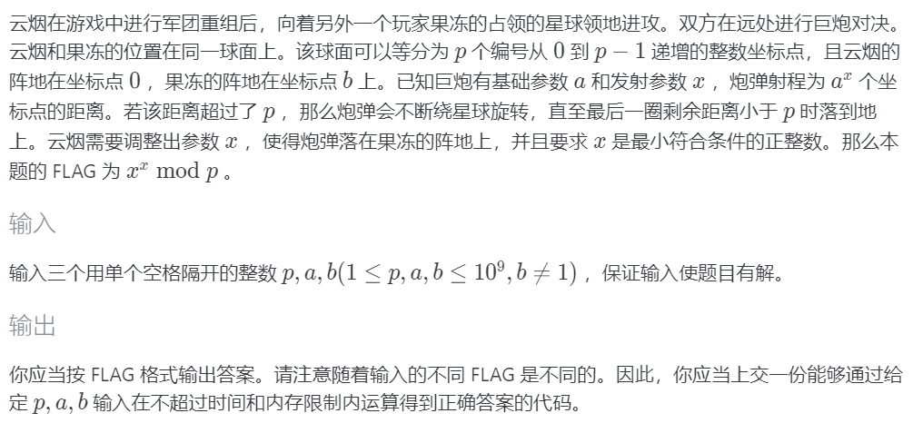
>
>    - 读懂题目：求 $a^x\bmod p=b$ 的最小正整数 $x$ ，并计算 $x^x\bmod p$，数据范围为 $p,a,b\le10^9$，输入保证有解
>
>    - 设计算法：从 $1$ 开始递增 $x$ ，同时直接递推当前的 $a^x\bmod p$ ，若值为 $b$ ，退出循环并暴力计算 $x^x\bmod p$
>
>    - 算复杂度：既然输入保证有解，那么 $a^x$ 就不会一直无限循环在某个数列，那么在得到 $b$ 之前，最多只能得到 $p$ 个不重复且各异的结果，所以枚举次数最大为 $p$ ，循环体内都是常数次执行基本语句，所以这部分复杂度是 $\Omicron(p)$ ，然后暴力计算 $x^x\bmod p$ ，复杂度也是 $\Omicron(p)$ ，加起来约为 $2\times10^9$ ，比较危险，但可以一试。
>
>      空间复杂度显然是 $\Omicron(1)$
>
>    - 编写代码：
>
>      ```c++
>      #include <bits/stdc++.h>
>      using namespace std;
>      typedef long long ll;
>      signed main()
>      {
>          ll p, a, b, x = 1, a0;
>          cin >> p >> a >> b;
>          a0 = a;
>          while (a != b)
>          {
>              a = a * a0 % p;
>              ++x;
>          }
>          for (ll i = 1, x0 = x; i < x0; ++i)
>          {
>              x = x * x0 % p;
>          }
>          cout << "flag{" << x << '}';
>          return 0;
>      }
>      ```
>
>      结果 AC 了。
>
>      这启示我们，即使复杂度达到 $10^9$ ，也未必一定 TLE，走投无路可以撞一下
>
>      这是因为测试点并不一定会产生最坏复杂度，可能产生的是平均复杂度
>
>      > 该题正解是 [`BSGS算法`](https://www.luogu.com.cn/problem/P3846)，该算法不会在先修班课程介绍，感兴趣可自学


### 练习题

> 完成 `登神长阶` ，`Cute Tree` ，并分析你所写的代码的时空复杂度


## 优化技巧

算法无非就是解决两类问题：如何实现一个方案与如何优化前者。

> 优化指的是降低时间或空间复杂度使之满足题目限制条件

本处只介绍一些显而易见的、较为简单的、不需要别的算法知识的优化技巧，更多具体的其他优化会在后续课程讲解。


### 预处理

将计算用时高的、已知必然会**反复**用到的一些结果提前算出来存储在变量里，需要反复用的时候直接取结果，而不是反复计算。

有些数值单个计算时需要 $\Omicron(n)$ 或更高，而计算多个连续值时对每个计算可能只需要 $\Omicron(1)$ 

常常进行预处理的值有：

- 某个数的一个区间的指数幂
- 一个区间的阶乘
- 一个区间的逆元
- 组合数 (杨辉三角递推式)

这种预处理思维也叫作**记忆化**。


> 下面通过一个例子举例预处理的应用：
>
> `SCNUOJ 1450 组合数`
>
> 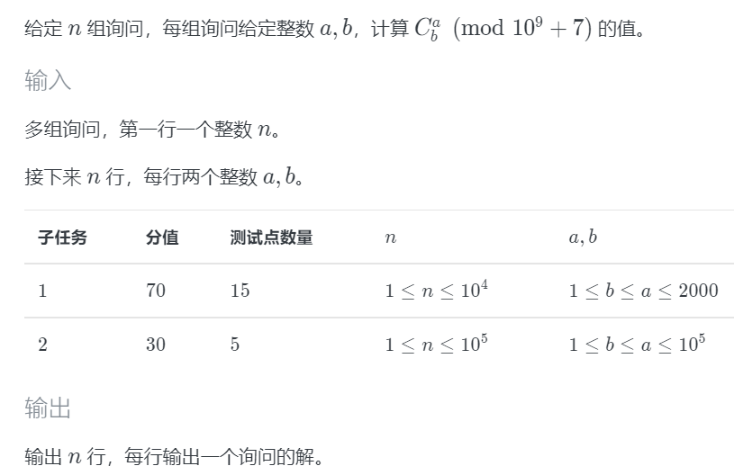
>
> 由上文，可知：
> $$
> C_b^a\bmod p=b!\cdot(a!)^{-1}\cdot((b-a)!)^{-1}\bmod p
> $$
> 设 $m=10^5$ ，显然，计算一次阶乘的复杂度是 $\Omicron(m)$ ，计算一次阶乘逆元的复杂度是 $\Omicron(m+\log m)=\Omicron(m)$ 。所以 $m$ 次计算复杂度是 $\Omicron(nm)$ 。
>
> 如果使用预处理，可以事先用递推，以 $\Omicron(m)$ 计算出连续 $m$ 个阶乘的值，同时每次计算其逆元，预处理总复杂度为 $\Omicron(m+m\log m)=\Omicron(m\log m)$ ，询问时直接以 $\Omicron(1)$ 输出结果即可，总复杂度为 $\Omicron(n+m\log m)=\Omicron(m\log m)$
>
> 空间复杂度为记录预处理的数组大小，为 $\Omicron(2m)=\Omicron(m)$ 
>
> 代码如下：
>
> ```c++
> #include <bits/stdc++.h>
> using namespace std;
> typedef long long ll;
> #define mod 1000000007
> #define mn 100010
> ll qpow(ll a, ll b)
> {
>     ll r = 1;
>     for (; b; b >>= 1, (a *= a) %= mod)
>         if (b & 1)
>             (r *= a) %= mod;
>     return r;
> }
> ll inv(ll a) { return qpow(a, mod - 2); }
> ll a, b, r = 1, n, f[mn], fi[mn];
> signed main()
> {
>     cin >> n;
>     f[0] = fi[0] = f[1] = fi[1] = 1;
>     for (int i = 2; i <= 100001; ++i)
>     {
>         (f[i] = i * f[i - 1]) %= mod;
>         fi[i] = inv(f[i]);
>     }
>     while (n--)
>     {
>         cin >> b >> a;
>         cout << f[b] * fi[a] % mod * fi[b - a] % mod << endl;
>     }
>     return 0;
> }
> ```
>
> 如果 $a,b$ 比较小，也可以用杨辉三角递推组合数，存二维数组 `C[a][b]`。但是这题不允许这么做。该做法时空复杂度均为 $\Omicron(m^2)$ ，既会 TLE 也会 MLE。


> 特别地，**打表法**指的是将输入的一些或所有情况事先计算好对应的结果储存在数组里，对于每次输入只需要取数组元素输出的方法。
>
> 例如，有一小部分输入略微超时(如十几秒)时，可以将这部分输入打表。
>
> 打表法只适用于所有可能的输入有限，且能在比赛时间内跑出全部答案，且答案数组不MLE的问题。特别注意大多 OJ 限制代码长度，如 $64\ KB$ ，所以表不能太长。
>
> 进行打表计算时可以借助 C/C++ 代码之外的途径，如 Python、EXCEL 。(EXCEL 的日期函数很方便)，而且大多数比赛也不禁止用
>
> 如 [`洛谷 P1009`](https://www.luogu.com.cn/problem/P1009) ，求 $\sum_{i=1}^ni!,(1\le n\le50)$ ，假设比赛只能交 C++ (如蓝桥 C++ 组)可以先用 Python 计算全部结果，然后在 C++ 放答案即可，参考 [这里](https://cloud.socoding.cn/s/klQiK)


### 数学推理

数学推理，即利用各种初等和高等数学知识，对所要求的内容进行化简，从而降低复杂度

这一步理论上知识点涵盖所有你所学的数学知识，但这里只列举出小部分常用的：

#### 数列

##### 等差数列

> A.P.   Arithmetic progression

$$
a_n=a_1+(n-1)d=a_m+(n-m)d
$$

$$
d=\dfrac{a_m-a_n}{m-n}
$$

$$
\begin{align}
S_n&=\dfrac{n(a_1+a_n)}2\\
&=\dfrac{n(a_m+a_{n-m+1})}2\\
&=na_1+\dfrac{n(n-1)}2d\\&=\dfrac d2n^2+(a_1-\dfrac d2)n\\&=na_{\frac{n+1}2}
\end{align}
$$


部分性质：

1. $$
   m+n=p+q\Rightarrow a_m+a_n=a_p+a_q
   $$

2. $$
   \dfrac{a_n}{b_n}=\dfrac{S_{2n-1}}{T_{2n-1}}
   $$

3. $$
   a_n=\dfrac{S_{2n-1}}{2n-1}
   $$

   

##### 等比数列

> G.P.    Geometric progression

$$
a_n=a_1q^{n-1}=a_mq^{n-m}
$$

$$
q=\large{\sqrt[n-m]{\dfrac{a_n}{a_m}}}
$$

$$
S_n=\dfrac{a_1(1-q^n)}{1-q},\quad(q\neq1)
$$


部分性质：

1. $$
   m+n=p+q\Rightarrow a_m\times a_n=a_p\times a_q
   $$

2. $$
   S_{n+m}=S_m+q^mS_n
   $$


##### 一般数列

$$
a_n=S_n-S_{n-1}
$$


###### 求和

$$
\begin{align}
\sum_{i=1}^ni&=\dfrac{n(n+1)}2\\
\sum_{i=1}^ni^2&=\dfrac{n(n+1)(2n+1)}2\\
\sum_{i=1}^ni^3&=\left(\dfrac{n(n+1)}2\right)^2
\end{align}
$$


$$
\sum_{i=1}^\infty\left(\dfrac1k\right)^i=\dfrac1{k-1}
$$


###### $a_n$ 求法

- $a_{n+1}=pa_n+q$ 构造新数列，使得 $b_{n+1}=pb_n$

- $a_{n+1}=a_n+f(n)$ 累加法

- $a_{n+1}=a_n\cdot f(n)$ 累乘法

- $a_{n+1}=\dfrac{pa_n}{ka_n+m}$ 倒数法，令 $b_n=a_n^{-1}$

- $\overline{k},\overline{kk},\overline{kkk}\cdots$ $a_n=\dfrac k9(10^n-1)$

- $a,b,a,b,\cdots$ $a_n=\dfrac{a+b+(-1)^n(b-a)}2$

- $\cdots$

  

###### $S_n$ 求法

- 裂项相消 $b_n=\dfrac1{a_n\cdot a_{n+k}},a_n\in A.P.$

- 错位相减 $c_n=a_n\cdot b_n,a_n\in A.P.,b_n\in G.P.$
  $$
  (1-q)S_n=a_1b_1-a_nb_{n+1}+\dfrac{db_2}{1-q}(1-q^{n-1})
  $$
  $c_n=(an+b)q^{n-1}$ ，则 $S_n=(An+B)q^n-B$ ，其中 $A=\dfrac a{q-1},B=\dfrac{b-A}{q-1}$

- 分组求和

- 倒序相加

- $\cdots$


> 例题：
>
> 1. `SCNUOJ 1001 求和` 求 $\sum_{i=1}^ni$
>
>    解： `cout << n * (n + 1) / 2;`
>
> 2. `SCNUOJ 1546 升级 (2021AK网络赛)`
>
>    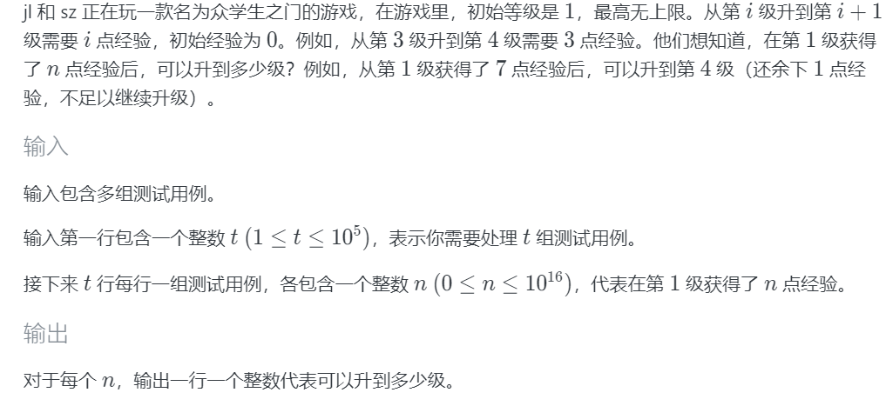
>
>    解：设可以升到 $m$ 级，有：
>    $$
>    n=\dfrac{m(m-1)}{2}\Rightarrow \Rightarrow m^2-m-2n=0
>    $$
>
>    $$
>    \Delta=1+8n>0, m_1=\dfrac{1+\sqrt{1+8n}}2, m_2=\dfrac{1-\sqrt{1+8n}}2
>    $$
>
>    由于 $1^2 < (\sqrt{1+8n})^2 = 1+8n$，所以 $m_2<0$， 舍去。
>
>    由于等级是整数，所以最终答案应当是：
>    $$
>    m=\lfloor m_1\rfloor =\left\lfloor\dfrac{1+\sqrt{1+8n}}2\right\rfloor
>    $$
>    开方复杂度是 $\Omicron(1)$ ，时间复杂度显然是 $\Omicron(t)$ 。
>
>    解： `cout << (long long)(1 + sqrt(1 + 8 * n)) / 2) << endl`
>
> 


#### 找规律

通过推理、猜想、小数据暴力打表(写程序或手算均可)等方法寻找规律。该方法通常不严谨，且有可能会漏特判或找出错误的规律。在数学、博弈论等题目常用。

> 如： `你们的作业题 - SCNUOJ 1082 - k 阶 Mex 数列`
>
> 打表得：
>
> | n\k  | 1    | 2    | 3    | 4    | ...  |
> | ---- | ---- | ---- | ---- | ---- | ---- |
> | 0    | 0    | 0    | 0    | 0    | ...  |
> | 1    | 1    | 1    | 1    | 1    | ...  |
> | 2    | 0    | 2    | 2    | 2    | ...  |
> | 3    | 1    | 0    | 3    | 3    | ...  |
> | 4    | 0    | 1    | 0    | 4    | ...  |
> | 5    | 1    | 2    | 1    | 0    | ...  |
> | 6    | 0    | 0    | 2    | 1    | ...  |
> | ...  | ...  | ...  | ...  | ...  | ...  |
>
> 于是推测有： $n\bmod(k+1)$ 为答案。
>
> 
>
> 又如：`2020 CS杯  D 取石子游戏`
>
> 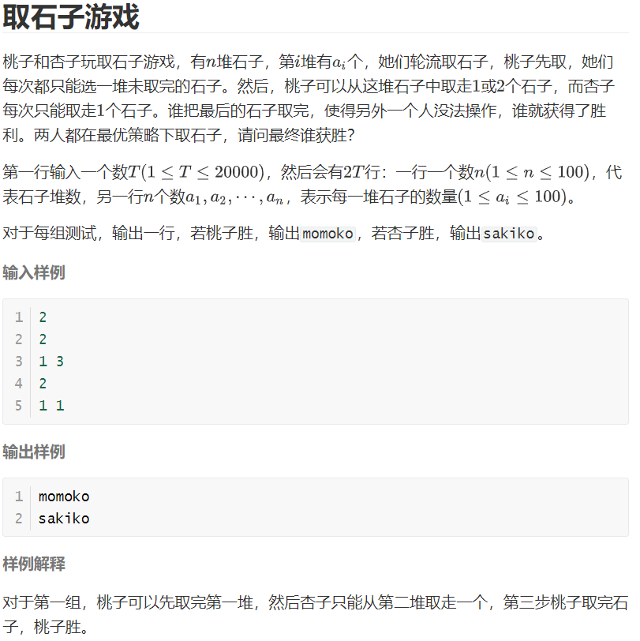
>
> 在 $n=1,2$ 下列出大量例子找规律，找出初步规律然后在 $n=3,4$ 下验证规律，最后发现只有石子堆个数为偶数且都是 $1$ 时 `sakiko` ，否则都是 `momoko` 
>
> 即 `sum == n && n % 2 == 0` 。
>
> > 具体证明如下：(感兴趣自行阅读)
> >
> > 1. [1]是`momoko`必胜，[1,1]是`sakiko`必胜
> > 2. 全为1时双方都只有一种取法，容易发现奇数个[1]最后一定是`momoko`取，`momoko`胜，同理偶数个是`sakiko`必胜
> > 3. `[x]`(x>1)时，
> >    -  若x=2,`momoko`取2必胜；
> >    -  若x=3,`momoko`取1，`sakiko`只能取1，回到[1]，[1]是`momoko`必胜
> >    - 若x=y(y是偶数,y>2)，`momoko`取1,`sakiko`只能取1，回到x=y-2，不断如此操作，一定会到达x=2，此时`momoko`取2必胜；
> >    - 若x=y(y是奇数,y>3)，`momoko`取1,`sakiko`只能取1，回到x=y-2，不断如此操作，一定会到达x=3，此时`momoko`取1,`sakiko`取1，`momoko`取1必胜。
> >    - 综上所述，[x]时，`momoko`必胜
> > 4.  [a1, a2, a3, ...]时
> >    - 第一回合`momoko`对任意一个数按照(3)的方法取一次；
> >    - 在这之后，`sakiko`无论取哪个数，`momoko`都可以按照(3)的方法取一次；
> >    - 如果每个数都大于1，那么一定可以按照(3)的方法让`momoko`对每个数都是它最后取完的
> >    - 如果大于1个数字的数目是1，`sakiko`一定可以取完至少一次1。但是对不是1的数，按照(3)的方法，`momoko`至少存在一种策略，使得`sakiko`没有办法取完，所以只要在这a1,a2,a3...里存在不是1的数，`momoko`一定可以最后取完它
> >
> > 综上所述，当且仅当有偶数个1时`sakiko`必胜，否则`momoko`必胜。


#### 组合数学

> 选读，不强制要求

设$S$是$n$元集，从$S$中有序选取$r$个元素称作$S$的一个$r$**排列**，$S$的不同$r$排列总数记作$P(n,r)$，$n=r$时的排列称作$S$的全排列

设$S$是$n$元集，从$S$中无序选取$r$个元素称作$S$的一个$r$**组合**，$S$的不同$r$组合总数记作$C(n,r)$
$$
P(n,r)=\begin{cases}\dfrac{n!}{(n-r)!},&n\ge r\\0,&n<r\end{cases}\\
C(n,r)=\begin{cases}\dfrac{P(n,r)}{r!}=\dfrac{n!}{r!(n-r)!},&n\ge r\\0,&n<r\end{cases}
$$
组合数$C(n,r)$是二项式$(x+y)^n$展开式中$x^ry^{n-r}$项的系数，称作二项式系数$\left(\matrix{n\\r}\right)$

元素依次排成一个圆圈的排列称作环排列，$S$的$r$环排列数等于$\dfrac{P(n,r)}r$

组合数性质：设正整数$n,r$，有

- $C(n,r)=\dfrac nrC(n-1,r-1)$
- $C(n,r)=C(n,n-r)$
- $C(n,r)=C(n-1,r-1)+C(n-1,r)$  (Pascal公式/杨辉三角)

二项式定理 $n$是正整数，对一切$x,y$，有：
$$
(x+y)^n=\sum_{k=0}^n\begin{pmatrix}n\\k\end{pmatrix}x^ky^{n-k}
$$


**重要推论**：

- $\sum_{k=0}^n\begin{pmatrix}n\\k\end{pmatrix}=2^n,n\in N$
- $\sum_{k=0}^n(-1)^k\begin{pmatrix}n\\k\end{pmatrix}=0,n\in N$
- $\sum_{l=0}^n\begin{pmatrix}l\\k\end{pmatrix}=\begin{pmatrix}n+1\\k+1\end{pmatrix},n,k\in N$
- $\begin{pmatrix}n\\r\end{pmatrix}\begin{pmatrix}r\\k\end{pmatrix}=\begin{pmatrix}n\\k\end{pmatrix}\begin{pmatrix}n-k\\r-k\end{pmatrix},n\ge r\ge k,n,r,k\in N$
- $\sum_{k=0}^r\begin{pmatrix}m\\k\end{pmatrix}\begin{pmatrix}n\\r-k\end{pmatrix}=\begin{pmatrix}n+m\\r\end{pmatrix},n,m,r\in N,r\le\min(m,n)$
- $\sum_{k=0}^n\begin{pmatrix}m\\k\end{pmatrix}\begin{pmatrix}n\\k\end{pmatrix}=\begin{pmatrix}m+n\\m\end{pmatrix},m,n\in N$

> 应用举例-求证：
>
> 1. $\sum_{k=0}^nk\begin{pmatrix}n\\k\end{pmatrix}=n2^{n-1},n\in Z^+$
>
>    对$(1+x)^n=\sum_{k=0}^n\begin{pmatrix}n\\k\end{pmatrix}x^k$以$x$为自变量两边求导，再令$x=1$得之。
>
> 2. $\sum_{k=0}^nk^2\begin{pmatrix}n\\k\end{pmatrix}=n(n+1)2^{n-2},n\in Z+$
>    $$
>    \begin{align}
>    原式&=\sum_{k=1}^nk^2\frac nk\begin{pmatrix}n-1\\k-1\end{pmatrix}\\
>    &=n\sum_{k=1}^n(k-1+1)\begin{pmatrix}n-1\\k-1\end{pmatrix}\\
>    &=n\sum_{k=1}^n(k-1)\begin{pmatrix}n-1\\k-1\end{pmatrix}+n\sum_{k=1}^n\begin{pmatrix}n-1\\k-1\end{pmatrix}\\
>    &=n\sum_{k=0}^{n-1}k\begin{pmatrix}n-1\\k\end{pmatrix}+n2^{n-1}\\
>    &=n(n-1)2^{n-2}+n2^{n-1}=n(n+1)2^{n-2}
>    \end{align}
>    $$
>
> 注：上面两个式子的意义是把 $\Omicron(n)$ 乃至 $\Omicron(n^2)$ (具体复杂度是多少看 $C_b^a$ 能否预处理) 的求和变成了只需要求一个幂，假设用快速幂算法，只需要 $\Omicron(\log n)$。降低了复杂度。
>
> 在比赛里计算概率、情况数时可能会出现各种求和式子，如果发现表达式求和计算复杂度太高，可以考虑用这些组合数学公式进行化简。
>
> 例题：
>
> 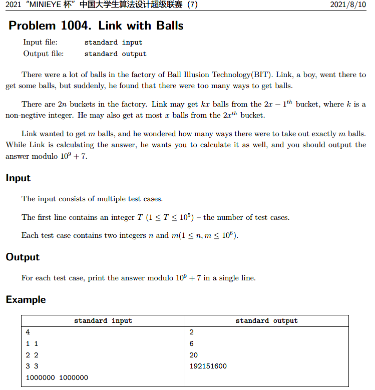
>
> 题意：~~这么短的英文题面就不用翻译了吧，相信你们经历过高考都看得懂的ovo~~
>
> 题解：(官方题解是生成函数，也可以用组合数学来解，这里给出组合数学题解)
>
> 编号为 $1$ 的桶可以取任意个球；
>
> 编号为 $2,3$ 的桶可以合并，那么 $2k+0/1$ ，即任意偶数+$0/1$刚好也可以取任意个球；
>
> 同理，两两合并： $4,5;6,7;\cdots$ ，那么一共有 $n$ 个可以取任意多个球的桶。
>
> 最后一个编号为 $2n$ 的桶无法合并，只能取 $[1,n]$ 个球
>
> 枚举在最后一个桶取了 $t$ 个球，那么剩下 $m'=m-t$ 个球在 $n$ 个无限桶里取，可以用隔板法，用 $n-1$ 个隔板隔开，由于可以有空区域，可以把空区域等效于放多 $n$ 个球，所以等效于 $C_{m'-1+n}^{n-1}$ ，若无法理解，可动手模拟易知。
>
> 有 $t$ 次询问，每次询问枚举复杂度为 $\Omicron(m)$ ，不能过题。考虑优化为 $\Omicron(1)$ 。
>
> 注意到组合数学公式： $C_a^b=C_{a-1}^b+C_{a-1}^{b-1}$ (数学意义是第 $b$ 个在前 $a-1$ 个取有 $C_{a-1}^b$ 方案，在最后一个取有 $C_{a-1}^{b-1}$ 方案)，可以转化为：$C_{a-1}^{b-1}=C_a^b-C_{a-1}^b$，那么对所求原式：
> $$
> \sum_{t=0}^nC_{m-t-1+n}^{n-1}=\sum_{t=0}^n\left(C_{m+n-i}^n-C_{m+n-i-1}^n\right)
> $$
> 两两相消，只留下了首尾两项，即：$C_{m+n}^n-C_{m+n-n-1}^n=C_{m+n}^n-C_{m-1}^n$
>
> 上式对 $n\le m$ 成立；若 $n > m$ ，那么后一项为 $0$ ，原式为 $C_{m+n}^n$
>
> 注意逆元不能预处理，每次计算再单独算(显然不是线性逆元，复杂度蛮高的)。
>
> 核心代码：
>
> ```c++
> ll qpow(ll a, ll b)
> {
>     ll res = 1;
>     for (; b > 0; b >>= 1)
>     {
>         if (b & 1)
>         {
>             res = res * a % mod;
>         }
>         a = a * a % mod;
>     }
>     return res;
> }
> ll inv(ll a)
> {
>     return qpow(a, mod - 2);
> }
> ll c(ll uf, ll df)
> {
>     return f[df] * inv(f[uf]) % mod * inv(f[df - uf]) % mod;
> }
> signed main()
> {
>     f[1] = 1;
>     for (ll i = 2; i < mn; ++i) //mn = 2000010
>         f[i] = f[i - 1] * i % mod;
>     sc(t);
>     while (t--)
>     {
>         sc(n), sc(m);
>         if (n > m)
>             printf("%lld\n", c(n, n + m));
>         else
>             printf("%lld\n", (c(n, n + m) - c(n, m - 1) + mod) % mod);
>     }
>     return 0;
> }
> ```
>
> 


### 常数优化

有时复杂度正确，但偏高 (如 $10^7$ 到乃至 $10^9$) ，如果系数常数比较大，仍有 TLE / MLE 的风险，这时候可以适当优化代码，在常数层面提高代码的运行速度，使其提速大约 $1.$ 几到几倍。常见的技巧有：


#### 输入/输出优化

`cin, cout` 是效率最低的输入输出，常数可能有 $10^3$ 

> 对 $10^5$ 的输入+输出，用普通 `scanf/printf` (下面)和普通 `cin/cout` (上面)的对比如下图：
>
> 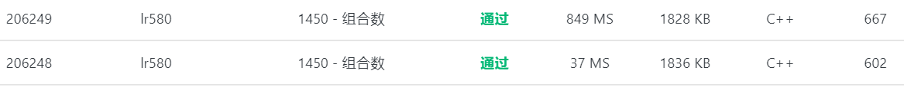


所以输入或输出任一方达到 $10^5$ 或以上，一般而言用 `scanf/printf` 会更好，就算不用也建议关闭同步流。

如果输入达到 较大的 $10^6$ 或 $10^7$ ，此时可能一般的 `scanf` 也可能会超时，可以考虑整数快读：

```c++
typedef long long ll;
ll read()
{
    ll x = 0, w = 1;
    char ch = 0;
    while (ch < '0' || ch > '9')
    { // ch 不是数字时
        if (ch == '-')
            w = -1;     // 判断是否为负
        ch = getchar(); // 继续读入
    }
    while (ch >= '0' && ch <= '9')
    {                            // ch 是数字时
        x = x * 10 + (ch - '0'); // 将新读入的数字’加’在 x 的后面
        // x 是 int 类型，char 类型的 ch 和 ’0’ 会被自动转为其对应的
        // ASCII 码，相当于将 ch 转化为对应数字
        // 此处也可以使用 (x<<3)+(x<<1) 的写法来代替 x*10
        ch = getchar(); // 继续读入
    }
    return x * w; // 数字 * 正负号 = 实际数值
}
```

> 同理有整数快写，但是一般而言不常用：
>
> ```c++
> void write(ll x)
> {
>     if (x < 0)
>     { // 判负 + 输出负号 + 变原数为正数
>         x = -x;
>         putchar('-');
>     }
>     if (x > 9)
>         write(x / 10);     // 递归，将除最后一位外的其他部分放到递归中输出
>     putchar(x % 10 + '0'); // 已经输出（递归）完 x 末位前的所有数字，输出末位
> }
> ```

> 更快的快读和快写参见[这里](https://oi-wiki.org/contest/io/)

注意的是，数据量少时(如小于 $10^5$) ，快读可能不见得比 `scanf` 快。


#### 其他优化细节

> 选读

对空间复杂度的优化：

- `long long` 可以改 `int` ， 一些 `int` 改 `bool`
- 位域，bitset，数位压缩
- vector 改静态数组
- 数组压缩(一个一维存多个不定长数组等，多维数组的压维等)


对时间复杂度的优化：(注意：这些优化技巧带来的优化影响可能微乎其微，你可以忽略。)

- 使用传引用传递函数参数

- 手写 `map`

- 加 `register` (非全局变量可加)

- 短函数加 `inline` 关键字

- 内存池；减少不连续的内存访问 (如 `a[b[c]]`)

- 一些运算改成位运算(影响很微小)

- 玄学预编译指令(比赛不建议使用)，如：

  ```c++
  #pragma GCC optimize(2)
  ```

  也许能使代码快 $0\sim1.$ 几倍。具体优化原理自行求助搜索引擎。

  一般而言各 OJ 都自带，所以上交的代码不需要(有些也禁止)带这行代码，一般用于本地调试


### 练习题

> 完成 `变换` ， `函数` ， `数组`   三道题


### 巩固提高题

> 完成 `Cook Pancakes!`  、 `Fall with Trees` 、  `Banzhuan`  三道题

