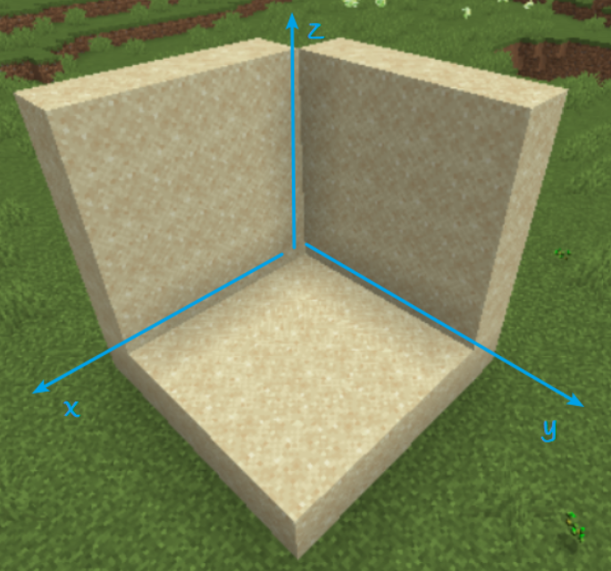
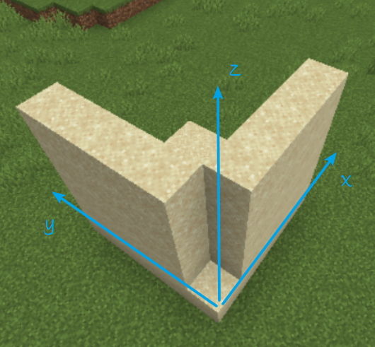

## 逆元

心算从整数 $[1,7]$ 里枚举，发现 $2\times4\bmod7=1$ ，所以是 $4$，直接输出即可，参考代码：

参考代码：

```c++
cout << 4;
```


## 取模

注意 $p$ 不是质数，所以不能用快速幂算法，只能用 exgcd 来算。

注意 $-10^{18}\le y\le10^{18}$ ，所以取模后的 $x$ 直接与之乘除会炸 `long long` ，同时考虑到 $y$ 是负数，应当考虑先进行变换，将其转换成 $[0,p)$ 的正整数， `y = (y % p + p) % p` ，注意不能直接来个 `abs` 再转，例如，显然 $1\bmod 7$ 和 $-1\bmod 7$ 是两个不一样的结果。

参考代码：

```c++
#include <bits/stdc++.h>
using namespace std;
typedef long long ll;
ll t, p, c, y, x, iy, z;
void exgcd(ll a, ll b, ll &x, ll &y)
{
    if (b == 0)
    {
        x = 1, y = 0;
        return;
    }
    exgcd(b, a % b, y, x);
    y -= a / b * x;
}
signed main()
{
    cin >> t >> p;
    while (t--)
    {
        cin >> c >> y;
        y = (y % p + p) % p;
        if (c == 1)
        {
            x = (x + y) % p;
        }
        else if (c == 2)
        {
            x = (x - y + p) % p;
        }
        else if (c == 3)
        {
            x = x * y % p;
        }
        else if (c == 4)
        {
            exgcd(y, p, iy, z);
            x = x * ((iy % p + p) % p) % p;
        }
        cout << x << endl;
    }
    return 0;
}
```


## 登神长阶

> 这题作为签到题，赛时喜提八千多份提交只有一千多份通过，原因基本是审题失误

首先注意题面的递推是分钟，而输入是秒。

考虑到这个事实之后，最大分钟为 $1.6\times10^6$ ，可以直接按题意进行递推，则：

时间复杂度为 $\Omicron(n)$ ，如果递推结果都存储，空间复杂度为 $\Omicron(n)$ ，`long long` 要 $13\ MB$

参考代码：

```c++
#include <bits/stdc++.h>
using namespace std;
typedef long long ll;
ll t, dp[1666670];
signed main()
{
    cin >> t;
    t /= 60;
    dp[1] = dp[2] = dp[3] = 1;
    for (ll i = 4; i <= t; ++i)
    {
        dp[i] = (dp[i - 1] + dp[i - 2] + dp[i - 3]) % 425;
    }
    cout << dp[t];
    return 0;
}
```

> 当然可以考虑状态压缩等做法将空间复杂度优化为 $\Omicron(1)$ ，感兴趣自行尝试


## Cute Tree

每次执行 `BuildTree` 构建编号为 $id$ 的节点。需要计算有多少个节点，即求 $tot$ ，即递归次数

> 根据注释里 node which number is id 可以推测出这句话，从而理解到这是一个递归创建节点的函数

观察函数，可知除了最后的一两次，其余情况都执行 `else` 分支，阅读伪代码可知该分支将 $[L,R]$ 分为平均三段继续递归，设 $n=len(L,R)$ ，递归次数为 $T(n)$ ，即 $T(n)\approx1+3T(\dfrac n3)$ 。(注意不是求时间复杂度，所以可以忽略下面的 `for` ，因为不影响递归次数)

由主定理，$a=b=3,k=0$ ，所以求得 $\Omicron(T(n))=\Omicron(n)$ ，虽然这不是递归次数的精确结果，但是说明了求递归次数可以在 $\Omicron(n)$ 内完成。所以可以直接写函数模拟求解过程，那么总时间复杂度为 $\Omicron(nk)$ ，只求递归次数可以忽略 $a$ 数组，故空间复杂度为 $\Omicron(1)$，可以过题。

参考代码：

```c++
#include <bits/stdc++.h>
using namespace std;
typedef long long ll;
ll t, n, a, ans;
void build(ll l, ll r)
{
    ++ans;
    if (l == r)
    {
        return;
    }
    if (r - l == 1)
    {
        build(l, l);
        build(r, r);
    }
    else
    {
        ll b = l + ceil(1.0 * (r - l) / 3) - 1; //注意1.0
        // ll b = l + (r - l + 3 - 1) / 3 - 1; //写法二
        ll c = (b + r) / 2;
        build(l, b);
        build(b + 1, c);
        build(c + 1, r);
    }
}
signed main()
{
    scanf("%lld", &t);
    while (t--)
    {
        scanf("%lld", &n);
        for (ll i = 0; i < n; ++i)
        {
            scanf("%lld", &a);
        }
        ans = 0;
        build(1, n);
        printf("%lld\n", ans);
    }
    return 0;
}
```


## 变换

由于 $y\le10^{18}$ ，显然不能直接递推。只有 $\Omicron(t)$ 或 $\Omicron(t\log y)$ 可以过题。

找规律，发现变换的周期性为 $3$ 。可以求出三项的具体表达式，或直接 `for` 不大于三次均可。那么时间复杂度 $\Omicron(t)$ ，空间复杂度 $\Omicron(1)$ 。

输出的精度的意思即为相对误差、绝对误差里较大的一项小于 $10^{-9}$ ，`double` 即可。

参考代码：

```c++
#include <bits/stdc++.h>
using namespace std;
typedef long long ll;
ll t, x, y;
signed main()
{
    cin >> t;
    while (t--)
    {
        cin >> x >> y;
        double r = x;
        for (ll i = 0; i < y % 3; ++i)
        {
            r = 1.0 / (1 - r);
        }
        printf("%.12lf\n", r);
    }
    return 0;
}
```


## 函数

求幂的复杂度为 $\Omicron(n)$ 或 $\Omicron(\log n)$ (快速幂)。暂不考虑快速幂，那么每次计算 $f$ 的复杂度为 $\Omicron(n^2)$ ，暴力计算计算一次就会超时， $t$ 次更为 $\Omicron(tn^2)$。即便考虑，从头开始计算一次 $\Omicron(n\log n)$ ，计算 $t$ 次是 $\Omicron(tn\log n)$ 仍然会超时。考虑优化 $f$ 。

注意到从头计算 $f(x)$ 的时候，必然已经计算出了所有 $1\le i\le x,f(i)$ ，所以计算一次 $f(n)$ ，原理上可以得到所有可能的 $1\le i\le n,f(i)$ ，预处理起来，则记忆化复杂度为 $\Omicron(n^2)$ 或 $\Omicron(n\log n)$(快速幂) 。询问复杂度会优化为 $\Omicron(1)$ 一次，共 $\Omicron(t)$ ，总复杂度为 $\Omicron(t+n^2)$ 或 $\Omicron(t+n\log n)$(快速幂)。

相似地，可以对幂进行预处理，使得每次计算 $f$ 里幂的复杂度是 $\Omicron(1)$ ，从而记忆化幂复杂度为 $\Omicron(n)$ ，此后用 $\Omicron(n)$ 预处理 $f$ ，此后用 $\Omicron(t)$ 输出预处理结果。总时间复杂度为 $\Omicron(n+n+t)=\Omicron(n)$ ，空间复杂度为 $\Omicron(2n)=\Omicron(n)$ ，可以过题。

参考代码：

```c++
#include <bits/stdc++.h>
using namespace std;
typedef long long ll;
#define mn 100010
ll p = (114514 * (54 - 1 + 114 * (1 + 14 * 5 + 1 + 4))) + (4 + 11451 * (4 - 1 - 15 + 14)) + (11 + 41 * 54 + (141 + 541)) + (4 - 1 - 15 + 14);
ll n, a[mn], rpow[mn], t, x, f[mn], r = 1437580;
signed main()
{
    cin >> n;
    for (ll i = 1; i <= n; ++i)
    {
        cin >> a[i];
    }
    rpow[0] = 1;
    for (ll i = 1; i <= n; ++i)
    {
        rpow[i] = rpow[i - 1] * r % p;
    }
    for (ll i = 1; i <= n; ++i)
    {
        f[i] = (f[i - 1] + rpow[i] * a[i]) % p;
    }
    cin >> t;
    while (t--)
    {
        cin >> x;
        cout << f[x] << endl;
    }
    return 0;
}
```


## 数组

于时间复杂度和空间复杂度而言，都不可以直接预处理整个数组，达到了 $\Omicron(nm+t)$ 。

不预处理的话， $t$ 次询问也需要 $\Omicron(t(n+m))$。所以需要用较优的复杂度处理每次询问。

为了方便，可以先预处理第一列，耗费时空复杂度 $\Omicron(n)$ ，得到所有 $a_{i,1}$。

接下来化简第三个数组性质：$a_{i,j}=q\cdot a_{i,j-1}+p$

设 $b_j=a_{i,j}-C$ ，构造 $b_j=qb_{j-1}$ ，代入得： $C=\dfrac p{1-q}$

显然 $b_1=a_{i,1}-\dfrac p{1-q}$ ，则由等比数列第 $n$ 项，有 $b_j=q^{j-1}b_1$ ，即：
$$
a_{i,j}=q^{j-1}(a_{i,1}-C)+C
$$
$C$ 用逆元处理，特别注意若 $q=1$ 时，分母为零，此时是常数列，显然 $a_{i,j}=a_{i,j-1}+p$ 有：
$$
a_{i,j}=a_{i,j-1}+p=a_{i,j-2}+p+p=\cdots=a_{i,1}+(j-1)p
$$
参考代码：

```c++
#include <bits/stdc++.h>
using namespace std;
typedef long long ll;
#define mn 100010
ll n, m, p, q, a[mn], mod = 1e9 + 7, t, x, y, c, qn[mn];
ll qpow(ll a, ll b)
{
    ll r = 1;
    for (; b > 0; b >>= 1)
    {
        if (b & 1)
        {
            r = r * a % mod;
        }
        a = a * a % mod;
    }
    return r;
}
signed main()
{
    cin >> n >> m >> p >> q >> t;
    a[1] = 1, qn[0] = 1;
    c = p * qpow(1 - q + mod, mod - 2) % mod;
    for (ll i = 2; i <= n; ++i)
    {
        a[i] = (p * a[i - 1] + q) % mod;
    }
    for (ll i = 1; i <= m; ++i)
    {
        qn[i] = qn[i - 1] * q % mod;
    }
    while (t--)
    {
        cin >> x >> y;
        if (q != 1)
        {
            cout << ((a[x] - c + mod) * qn[y - 1] % mod + c) % mod << endl;
        }
        else
        {
            cout << (a[x] + (y - 1) * p) % mod << endl;
        }
    }
    return 0;
}
```

> 其实第一维也可以用类似的方法来优化，那么在不开高精度下，理论上可以做 $1\le n,m\le10^{18},1\le t\le10^7$，感兴趣可自行尝试。
>
> 也可以用等比数列前 $n$ 项和来推，即 $a_n=S_n-S_{n-1}$ ，但显然不如上面的做法精简


下面是课后习题，建议在充分独立思考后再看题解 ovo

## Cook pancakes!

> XCPC 签到题就是这样的题目。(有可能简单一些，也有可能难一些)

暴力枚举所有情况的话，可能会达到指数复杂度，而且实现起来非常麻烦。考虑数学推理。

可以把双面饼拆分成两个单面饼，即有 $2n$ 个单面饼，每秒可以烤 $k$ 个。特别注意一张双面饼最少也要烤 $2$ 次，所以答案应该是：$\max(2,\lceil\dfrac{2n}k\rceil)$

参考代码：

```c++
printf("%lld", max(2ll, (n * 2 + k - 1) / k)); //max两参数类型必须一致
```


## Fall with Trees

> XCPC 第二、第三题难度。

答案是一个三角形加上 $k-2$ 个等腰梯形的面积。$t\le2\times10^5,k\le10^4$ ，如果暴力计算面积和，复杂度为 $\Omicron(tk)$ 会超时，考虑将计算面积和用数列优化为 $\Omicron(t)$ 。

设 $h=|y_{lson}-y_{root}|,d=|x_{rson}-x_{lson}|$ ，设第 $i$ 层的 $x$ 跨度为 $x_i$ ，即求：
$$
S=\dfrac12 hd+\sum_{i=2}^{k-1}\dfrac{(x_i+x_{i+1})\times h}2
$$
设每层的增幅为 $\Delta$ ，有 $\Delta_2=d$ ， $n\ge 3,\Delta_n=\dfrac12\Delta_{n-1}$ ，则有 $x_n=x_{n-1}+\Delta_n$

显然 $x_1=0,x_2=d,x\ge3$ 时，有：
$$
x_n=x_{n-1}+\Delta_n=x_{n-2}+\Delta_{n-1}+\Delta_n=\cdots=\sum_{i=1}^n\Delta_i
$$

$$
n\ge 2,x_n=\sum_{i=1}^n\Delta_i=\left(2-\left(\dfrac12\right)^{n-2}\right)\cdot d
$$

故：
$$
\begin{align}
S&=\dfrac12hd+\dfrac h2\left( x_2+x_3+x_3+x_4+\cdots+x_{k-1}+x_k \right)\\
&=\dfrac12hx_2+\dfrac h2(x_2+2x_3+2x_4+\cdots+2x_{k-1}+x_k)\\
&=\dfrac h2\cdot(2\sum_{i=2}^{k}x_i-x_{k})\\
&=h\sum_{i=2}^kx_i-\dfrac{x_kh}2
\end{align}
$$
进一步化简：
$$
\begin{align}
\sum_{i=2}^kx_i&=2d(k-1)-d\sum_{i=2}^k\left(\dfrac12\right)^{k-2}\\
\sum_{i=2}^kx_i&=2d(k-1)-4d\sum_{i=2}^k\left(\dfrac12\right)^{k}\\
&=2d(k-1)-4d\left(\sum_{i=1}^{k}\left(\dfrac12\right)^{k}-\sum_{i=1}^1\left(\dfrac12\right)^{k}\right)\\
&=2d(k-1)-4d(1-0.5^k-(1-0.5^1))
\end{align}
$$
到这里已经是 $\Omicron(t)$ 的复杂度了，为避免化简导致手算错误，可以不继续化简。代回原式即可：
$$
S=h\cdot(2d(k-1)-4d(1-0.5^k-(1-0.5^1)))-\dfrac h2\cdot\left(2-\left(0.5\right)^{k-2}\right)\cdot d
$$
参考代码：

```c++
ll t, k, xp, yp, xl, yl, xr, yr;
db h, d, s;
signed main()
{
    sc(t);
    while (t--)
    {
        sc(k), sc(xp), sc(yp), sc(xl), sc(yl), sc(xr), sc(yr);
        h = abs(yp - yl), d = abs(xr - xl);
        s = h * (2.0 * d * (k - 1.0) - 4.0 * d * (1.0 - pow(0.5, k) - (1.0 - 0.5))) - h / 2.0 * (2.0 - pow(0.5, k - 2)) * d;
        printf("%.3lf\n", s);
    }
    return 0;
}
```


## Banzhuan

> XCPC 第二、第三题难度。

题意：~~学霸题，数正方体，~~可花费 $xy^2z$ 在 $(x,y,z)$ 放一个方块，如果它底下没有方块，它将竖直下落。求使得三视图（正、左、俯）都铺满 $n\times n$ 的最大最小花费。

都开到 $n\le10^{18}$ 了，显然也是一道数学推导题目了。注意重力轴是 $z$ 不是 $y$ 。

最大花费很显然，从最高一层放正方体，让其往下掉到填满。答案为：
$$
\max=n\times\sum_{x=1}^n\sum_{y=1}^nxy^2n
$$
设 $s_1=\sum_{i=1}^ni=\dfrac{n(n+1)}{2},s_2=\sum_{i=1}^ni^2=\dfrac{n(n+1)(2n+1)}6$，

显然可以拆分，得：$\max=n^2s_1s_2$

最小花费比较复杂，这时候可以容易想到 $x,y,z$ 越小越划算，

所以可以在最底面放一层满足俯视图，即放置：
$$
\sum_{x=1}^n\sum_{y=1}^nxy^2\cdot1=s_1s_2
$$
然后在平面 $x=1$ 放一层满足左视图，即放置：
$$
\sum_{y=1}^n\sum_{z=1}^n1\cdot y^2\cdot z=s_1s_2
$$
减去重叠部分，即 $y=z=1,1\le x\le n$ ，即减去：
$$
\sum_{x=1}^nx\cdot1\cdot1=s_1
$$
然后在平面 $y=1$ 放一层满足正视图，即放置：
$$
\sum_{x=1}^n\sum_{z=1}^nx\cdot1\cdot z=s_1^2
$$
减去与两个面的重叠部分，即 $x=y=1,1\le z\le n,x=z=1,1\le y\le n$ ，即减去：
$$
\sum_{z=1}^n1\cdot1\cdot z+\sum_{y=1}^n1\cdot y^2\cdot1=s_1+s_2
$$
注意到 $(1,1,1)$ 放置了 $1$ 次，减去了 $3$ 次，所以再补放置 $3$ 次 $(1,1,1)$ ，即放置：$3$

发现 $x=y=1,2\le z\le n$ 的这个角落高度柱子删去之后也不会影响三视图，即删去：
$$
\sum_{i=2}^n1\cdot1\cdot z=s_1-1
$$
最后的立体几何体形状大致如图所示：(以 $n=5$ 为例，展示前后视角)





答案为：
$$
\min=2s_1s_2+s_1^2-s_2-3s_1+3-1
$$
注意除以 $2,6$ 需要逆元，可以用各种办法算出来。时间复杂度为 $\Omicron(T)$ 。

参考代码：

```c++
#include <bits/stdc++.h>
using namespace std;
typedef long long ll;
#define sc(x) scanf("%lld", &x)
#define il inline
ll t, n, mod = 1e9 + 7, mi, mx, s1, s2;
ll inv2 = 500000004, inv6 = 166666668;
signed main()
{
    sc(t);
    while (t--)
    {
        sc(n);
        n %= mod;
        s1 = n * (n + 1) % mod * inv2 % mod;
        s2 = n * (n + 1) % mod * (2 * n % mod + 1) % mod * inv6 % mod;
        mi = s1 * s2 % mod * 2 % mod + s1 * s1 % mod;
        mi = (mi + mod - s2 + mod - s1 + mod - s1 + 2 + mod - s1) % mod;
        mx = n * s1 % mod * s2 % mod * n % mod;
        printf("%lld\n%lld\n", mi % mod, mx % mod);
    }
    return 0;
}
```


 

