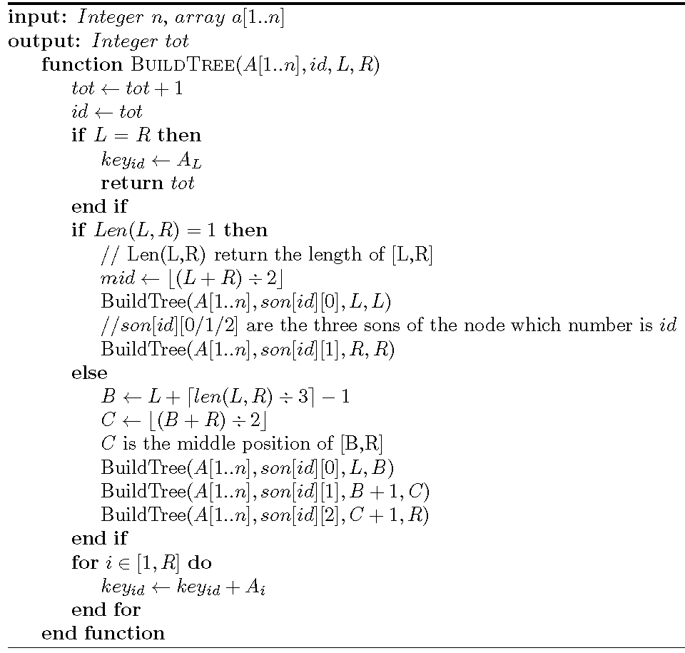
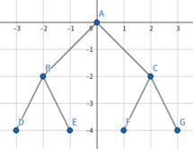

## 逆元

> Lv\_da 找到了一台时光机器，机器的启动密码是某个数的逆元，请你解出这个密码。

**本题为第二次课的考勤题目，**<s>不管做的对不对，</s>**请所有到场者都交一下代码**

求 $2$ 在模 $7$ 意义下的逆元。

无输入

输出一个整数，请输出最小符合题意的正整数。


## 取模

记起始整型变量 $x=0$ ，你需要实现 $x$ 与若干个整数的四则运算，每次结果重新保存为 $x$ ，并将最终结果对 $p$ 取模 (不保证 $p$ 是质数) 。

首先输入一行两个整数 $t,p(1\le t\le10^5,2\le p\le10^{9}+7)$ 。

接下来输入 $t$ 行，每行两个整数 $c, y (1\le c\le4,0\le|y|\le10^{18})$ 。

若 $c=1$ ，计算 $x+y$ 并将结果保存在 $x$ 内。

若 $c=2$ ，计算 $x-y$ 并将结果保存在 $x$ 内。

若 $c=3$ ，计算 $x\times y$ 并将结果保存在 $x$ 内。

若 $c=4$ ，计算 $x\div y$ 并将结果保存在 $x$ 内。

输入保证计算过程不会出现零除，且保证除数存在逆元。

每次运算结束后输出一行一个整数，为 $x\bmod p$ 。共输出 $t$ 行，你需要保证输出为非负数。

###### 输入样例

```c+
6 1000000007
1 1437
2 1438
1 580
3 2
4 4
3 8
```

###### 输出样例

```c+
1437
1000000006
579
1158
500000293
2316
```


## 登神长阶

小Y同学是ap剑圣时期就入坑lol的玩家，同时他也喜欢看lpl。

但是最近的他看比赛发生了一件奇怪的事情，某位著名解说总能把比分说对，但是胜负说反，在完成了上次五杀的预测之后，这次这位解说又在季后赛大放异彩，完成不少著作《死局》《止步于此》《打野小优》。据他在评论区的观察，这位解说开始了他的登神长阶。

假设该解说在第0分钟位于第0阶梯，第1,2,3分钟时位于第1阶梯，**之后每一分钟处在的阶梯都是前三分钟的阶梯数之和**，如第4分钟位于第3阶梯，第5分钟位于第5阶梯，第6分钟位于第9阶梯，注意他只会在整数分钟才会登上更高的阶梯，比如当他在3.5分钟时，他仍位于第1阶梯。小Y同学想知道该解说在第x秒时的神力如何，所以请你告诉他第x秒时该解说位于哪一级阶梯，为了防止他的神力过大，**输出的答案对于425取模**。

输入一个整数 $t$($0\le t\le10^8$) 表示多少秒

输出一个整数 $x$，表示当前取模后登上了哪一级阶梯。

样例：

```
0
```

```
0
```

来源：2021-2022年度第三届全国大学生算法设计与编程挑战赛（秋季赛）——正式赛 A题

注：不保证数据与原题完全一致


## Cute Tree

Given the pseudo-code of a function Build−Tree(A,id,L,R):




where A is given in input, id is the number of node, L ,R is the left position and the right position of A

Require the number of nodes created by Build−Tree(A,root,1,n).


The first line contains an integer $T$ ($1 \le T \le 5$) representing the number of test cases.

For each test case, the first contain one integer $n$($1\le n\le 2\times10^5$).

The second line contain n integers $A_i$($1\le A_i\le10^9$).


For each test output one line, the number of nodes created by Build−Tree(A,root,1,n).

```
1
7
4 3 5 2 6 7 1
```

```
11
```


```
2
4
2 2 5 3
10
21 10 5 89 12 3 42 13 55 76
```

```
6
15
```

来源：2021“MINIEYE杯”中国大学生算法设计超级联赛（5）1006


## 变换

对非零**实数** $x$ ，设变换 $g(x)=\dfrac1{1-x}$ 。例如对 $3$ 进行一次变换得到 $-\dfrac12$ ，对 $3$ 进行两次变换得到 $\dfrac23$ 。求对 $x$ 进行任意多次变换后的结果。

输入一行一个整数 $t(1\le t\le10^5)$ ，代表有 $t$ 次询问。

接下来输入一行两个整数 $x,y(2\le x\le10^6,1\le y\le10^{18})$ ，输入保证变换过程不会使得 $x=0$ 。

对于每个 $x,y$ ，输出对 $x$ 进行了 $y$ 次变换后的结果。假设你的答案是 $g$ ，标准答案是 $g'$ ，你的答案被认为是正确的当且仅当 $\dfrac{|g-g'|}{\max(1,|g'|)}\le10^{-9}$。你应当输出小数，不能输出指数或分数。

###### 输入样例

```c+
3
3 1
3 2
1437580 1437580
```

###### 输出样例

```c+
-0.500000000000
0.666666666667
-0.000000695614
```


## 函数

记下标从 $1$ 开始。有长为 $n$ 的整数数组 $a$ ，下标为 $i$ 的元素为 $a_i$ 。

设整数自变量 $1\le x\le n$ ，设常数 $r=1437580$，有函数 $f(x)$：
$$
f(x)=\sum_{i=1}^xr^i\cdot a_i
$$
设 `p = (114514 * (54 - 1 + 114 * (1 + 14 * 5 + 1 + 4))) + (4 + 11451 * (4 - 1 - 15 + 14)) + (11 + 41 * 54 + (141 + 541)) + (4 - 1 - 15 + 14)` 。

请你求函数值对 $p$ 取模后的结果。

输入第一行一个整数 $n(1\le n\le10^5)$ 

接下来输入一行 $n$ 个整数，第 $i$ 个整数为 $a_i(0\le a_i\le10^9)$ 

接下来输入一行一个整数 $t(1\le t\le10^5)$ ，代表有 $t$ 次询问

接下来输入一行 $t$ 个整数，第 $i$ 个整数为 $x_i(1\le x_i\le n)$ 

对于每个 $x_i$ ，输出一行一个整数代表 $f(x_i)\bmod p$。

###### 输入样例

```c+
3
1 0 2
3
1 3 2
```

###### 输出样例

```c+
1437580
178683454
1437580
```


## 数组

记下标从 $1$ 开始。有二维整数数组 $a$ ，第一、二维(行、列)长度分别是 $n,m$ 。对整数 $i,j(1\le i\le n,1\le j\le m)$ ，记第 $i$ 行第 $j$ 列元素为 $a_{i,j}$ 。设有整型常数 $p,q$，该数组满足：

1. $a_{1,1}=1$
2. $a_{i,1}=p\cdot a_{i-1,1}+q,\quad i > 1$
3. $a_{i,j}=q\cdot a_{i,j-1}+p,\quad j > 1$

请你求出该数组的任意一项。

输入一行四个整数 $n,m,p,q(1\le n,m\le10^5,1\le p,q\le10^9)$

接下来输入一行一个整数 $t(1\le t\le10^5)$ ，代表有 $t$ 个询问

接下来输入 $t$ 行，每行两个整数 $x,y(1\le x\le n, 1\le y\le m)$ 

对于每个询问，输出一行一个整数代表 $a_{x,y}$ ，输出答案对 $10^9+7$ 取模 

###### 输入样例

```c+
3 3 2 3
9
1 1
1 2
1 3
2 1
2 2
2 3
3 1
3 2
3 3
```

###### 输出样例

```c+
1
5
17
5
17
53
13
41
125
```


## Cook Pancakes!

In China, there is a very famous problem about pancakes: You have a pan and you can fry two pancakes at the same time each time. For a pancake, its front and back sides need to be cooked, and it takes one hour for each side to be cooked.

So how long does it take at least to cook 3 pancakes? The answer is three hours:

In the first hour, fry the front of No.1 pancake and the front of No.2 pancake.

In the second hour, fry the back of No.2 pancake and the front of No.3 pancake.

In the third hour, fry the back of No.1 pancake and the back of No.3 pancake.

Now you have a pan and you can fry K pancakes at the same time each time. How many hours does it takes at least to cook N pancakes?

It's noticed that you have to fry some side of the pancake until fully cooked every time, it means that you can't fry some side of the pancake half-cooked and taking it out. So the answers are always integers.


The first line has two integers $N,K$

$1\le N,K \le 100$

Output the answer.

```
3 2
```

```
3
```

来源：第 45 届国际大学生程序设计竞赛（ICPC）亚洲区域赛（济南）M

注：不保证数据与原题一致


## Fall with Trees

Fall wants to draw a perfect binary tree.

We first stipulate that all nodes in the tree with the same depth also have the same y-coordinate in the plane. Define nodes with the same depth to be nodes at the same level, then the perfect binary tree has four properties.

- It is a full binary tree.
- The difference between the y-coordinates of two nodes at each adjacent level is a constant.
- The difference between the x-coordinates of two adjacent nodes at the same level is constant.
- The x-coordinate of each node is the average of the x-coordinates of its sons.

Fall has drawn the root node and its left and right sons of this binary tree. Now Fall intends to draw a total of k levels and cut the binary tree down and paste it on the wall afterwards, so he wants to know what is the area of the convex hull of all nodes of this perfect binary tree.


The input consists of multiple test cases.

The first line contains an integer $T (T\le2\times10^5)$ -- the number of test cases.

For each test case:

In the first line, there is an integer $k (2\le k\le10^4)$ .

In the second line, there are six integers 
$x_{root},y_{root},x_{lson},y_{lson},x_{rson},y_{rson}\in[−10^4,10^4]$  ,which represent the coordinates of the root node and its sons.

It is guaranteed that all the coordinates meet the conditions of the question, which means:
- $x_{lson}+x_{rson}=2\times x_{root}$
- $y_{lson}=y_{rson}$
- $y_{root} > y_{lson},x_{lson} < x_{rson}$


For each test case, output a real number representing the answer, with three decimal places.

```
3
3
0 0 -2 -2 2 -2
4
0 0 -4 -2 4 -2
10000
0 0 -10000 -10000 10000 -10000
```

```
14.000
54.000
3999000000000.000
```

Here's the picture of the perfect binary tree for the first example, whose area is $S_{ABC}+S_{BCGD}=14$



出处：2021“MINIEYE杯”中国大学生算法设计超级联赛（7）1003

注：不保证数据与原题一致


## Banzhuan

Given a three-dimensional space of [1,n]×[1,n]×[1,n]. You're required to place some 1×1×1 cubes to make this 3D space look n×n square from above, from left and from front, while the plane xOy stand for the ground and z axis describes the height.

But placing these cubes must follow some restrictions. Obviously, it must obey the gravity laws. It means, when beneath a cube is empty, the height of this cube will drop one, until its height is exactly 1 (touch the ground) or there is another cube below it.

And besides that, placing cubes has some prices. If a cube is placed at an integer coordinate (x,y,z), the price will be $x\times y^2\times z$.

Now, satisfying all the requirements above, you're required to calculate the minimum costs and the maximum costs.


The first line contains an integer $T$($T\le 15$). Then $T$ test cases follow.

For each test case, input a single integer $n$ per line, while satisfying $1\le n\le10^{18}$.


For each test case, output two lines. For the first line output the minimum costs $\bmod 10^9+7$ . And for the second line, output the maximum costs $\bmod 10^9+7$

```
1
2
```

```
27
60
```

来源：2021“MINIEYE杯”中国大学生算法设计超级联赛（5）1007