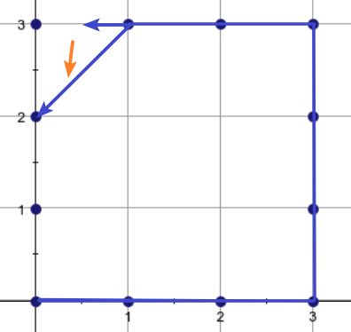

# 2022 香农先修班第十四次课

<div style="background-color:#cfd4eb;color:#8552a1;font-size:26px;font-weight:900" align="center">计算几何</div>


## 数学基础

> 我们只讲二维计算几何，三维感兴趣请自学(三维的题简单的可以直接用高数等已学知识推，难的很少考)

通常在二维计算几何应用中，使用平面直角坐标系(主要)或极坐标系。

> 要知道 XCPC 是允许带资料的，而蓝桥杯、天梯赛和CCF一般是很少考计算几何的(蓝桥杯喜欢考微分法，形式类似 [超椭圆 II](http://10.191.65.243:5000/p/1558) )，因此更重理解而不是重背诵。

下面分别从数学运算函数、点(坐标点和向量)、线(线段和直线)、面(封闭的多边形)来简单介绍计算几何基础知识。

> P.S. 数学基础是重点知识；极角排序、凸包是次重点知识；面积估算是选学自学知识。


### 常用函数

如无特殊说明，下面的函数复杂度都是 $O(1)$ 的，但是它们通常都有不小的常数。

对 C++ 而言， `abs` 是重载函数，根据输入类型不同返回类型也不同 (区分于 `fabs`)

`sqrt` 函数开方，不能传负数(小心可能存在精度误差把 $0$ 误差成小负数)；任意次幂(**返回 `double`** )用 `pow(a, b)` (任意次整数幂请手写，以防止浮点误差，小指数暴力，大指数快速幂，更大指数拓展欧拉定理)

三角函数： 使用**弧度制**，弧度制 `deg` 跟角度制 `arg` 的转换公式：( $\pi=180°$ )
$$
1=\dfrac{deg}{180°}=\dfrac{arg}{\pi}\Rightarrow 
\begin{cases}
arg=\dfrac{\pi\cdot deg}{180°}\\
deg=\dfrac{180°\cdot arg}{\pi}
\end{cases}
$$
三角函数是 `sin, cos, tan` ，反三角函数是 `asin, acos, atan, atan2(y, x)` ，其中 `atan2(y, x)=atan(y/x)` 。反三角函数求出的角度值域范围是：`asin, atan` 为 $[-\dfrac\pi2,\dfrac\pi2]$ ，`acos` 为 $[0,\pi]$ ，`atan2` 为 $[-\pi,\pi]$ 。

注意这里 `atan2` 的含义是：向量 $(x,y)$ 与 $x$ 正半轴夹角的大小，即从 $X$ 轴逆时针旋转的角度，如果为负数就表示顺时针旋转的角度。与 `atan` 是本质不同的函数。

根据三角函数可以求出常量 $\pi$ ，如 $\pi=\arccos(-1)$ ，不建议使用库常量 `M_PI` (不是所有编译器都支持 `M_PI` )

> 还有函数 `hypot(a,b)` 返回 $\sqrt{a^2+b^2}$ 

使用示例：

```c++
#include <bits/stdc++.h>
using namespace std;
typedef double db;
signed main()
{
    db pi = acos(-1);
    printf("%lf\n", pi);
    printf("%.lf\n", sin(45 * pi / 180)); // sin(45°)
    printf("%.lf\n", atan(1) * 180 / pi); // arctan(1)
    printf("%.lf\n", atan2(1, sqrt(3)) * 180 / pi);
    printf("%lf\n", hypot(2, sqrt(5)));
    return 0;
}
```


### 向量

#### 数学概念

既有大小又有方向的量称为向量。

对向量需要支持基础运算：加法、减法、数乘、除(除以一个数等于乘它的倒数)、点乘(内积/数量积)、叉乘(外积/向量积)、模长、范数。

对向量点乘，有结论： $\vec a\cdot \vec b$ 的符号大于 $0$ 夹角在 $[0,90°)$ ，等于 $0$ 为 $90°$ ；小于 $0$ 为 $(90°,180°]$ 。点乘的几何意义是 $\vec a$ 长度与 $\vec b$ 投影到 $\vec a$ 的长度的乘积或 $\vec b$ 长度与 $\vec a$ 投影到 $\vec b$ 的长度的乘积。即 $\vec a\cdot \vec b=|\vec a|\cdot|\vec b|\cos<\vec a,\vec b>$ 。如果是正的，说明投影后朝向一致，否则说明投影后朝向不一致。

向量 $\vec a,\vec b$ 叉乘得到一个向量 $\vec c$，其方向垂直这两向量形成的平面，如果 $\vec b$ 满足 $\vec a$ 经由 $180°$ 内的逆时针旋转可以与其平行，那么 $\vec c$ 的竖坐标是正的；如果是 $180°$ 内的顺时针，那么是负的。可以用右手定则表示：当右手的四指从 $\vec a$ 以不超过 $180°$ 的转角转向 $\vec b$ 时，竖起的大拇指指向是 $\vec a\times \vec b$ 的方向(向上正，向下负)。

即在三维上说：$\vec a=(x_1,y_1,0),\vec b=(x_2,y_2,0),\vec a\times \vec b=(0,0,x_1y_2-x_2y_1)$ 

根据这个坐标的表达式，易知 $\vec a\times \vec b=-\vec b\times \vec a$ ，即不满足交换律。

根据这个坐标的表达式，也易知 $(\lambda \vec a)\times \vec b=\vec a \times(\lambda\vec b)=\lambda (\vec a\times \vec b)$ ，满足对实数的结合律。

根据这个坐标的表达式，还易知 $(\vec a+\vec b)\times\vec c=\vec a\times\vec c+\vec b\times \vec c$ ，满足分配律。

> 下面选取其中一个加以证明，剩下的可以用类似的思路证明，不再赘述。
> $$
> \begin{align}
> \because\quad& 
> \vec a\times \vec c=(0,0,x_1y_3-x_3y_1),\vec b\times \vec c=(0,0,x_2y_3-x_3y_2)\\
> \therefore\quad&
> \vec a\times\vec c+\vec b\times \vec c=(0,0,(x_1+x_2)y_3-x_3(y_1+y_2))
> \\
> 又\because\quad& 
> \vec a+\vec b=(x_1+x_2,y_1+y_2)\\
> \therefore\quad&
> (\vec a+\vec b)\times\vec c=(0,0,(x_1+x_2)y_3-x_3(y_1+y_2))\\
> \therefore\quad&
> (\vec a+\vec b)\times\vec c=\vec a\times\vec c+\vec b\times \vec c\\
> &Q.E.D.
> \end{align}
> $$


对向量叉乘，我们还需要用到它的模数的几何意义，即 $|\vec a\times\vec b|$ 的几何意义是 $\vec a,\vec b$ 围成的平行四边形的面积。即 $\vec a\times \vec b=|\vec a|\cdot|\vec b|\sin<\vec a,\vec b>$ 。


对上图，有 $|\vec a\times \vec b|=S_{OABC}=2S_{\Delta OAB}=2S_{\Delta CAB}=2S_{\Delta OAC}=2S_{\Delta OBC}$

> 证明：根据三角形全等：$S_{\Delta OAB}=S_{\Delta CAB}=\dfrac12S_{OABC}$ ，且 $S_{\Delta OAC}=S_{\Delta OBC}=\dfrac12S_{OABC}$ ；而又根据底和高对应相等， $S_{OBA}=S_{OBC}$ ， Q.E.D.
>
> 

如果向量 $\vec a,\vec b$ 共线，那么它们叉乘得 $0$ 。根据叉乘几何意义易知。

根据叉乘的几何意义，可知：若 $\vec a\bot \vec b$ ，设 $\vec c$ 在 $\vec b$ 上投影得 $\vec{c'}$ 那么 $\vec a\times \vec c=\vec a\times \vec{c'}$

  


判断向量共线(平行)：两非零向量 $\vec a,\vec b$ 共线当且仅当存在唯一实数 $\lambda$ ，使得 $\vec b=\lambda \vec a$ ，或 $|\vec{a}\cdot \vec{b}|=|\vec a||\vec b|$ (也可以用 $\vec a\times \vec b=0$ )

判断向量垂直： $a\cdot b=0$

向量与原点的夹角： $\theta=\arctan\dfrac{y}{x}$ ，由角和长度 $l$ 逆求坐标 $(l\cos\theta,l\sin\theta)$

两向量的夹角：$\cos<\vec a,\vec b>=\dfrac{\vec a\cdot\vec b}{|\vec a||\vec b|}$ ，再来个反三角函数  $\arccos$ 即可。

> 若 $A,B,C$ 三点共线：那么对任意点 $O$ 有 $\vec{OB}=\lambda \vec{OA}+(1-\lambda)\vec{OC}$
>

向量旋转公式：设向量 $\vec a=(x,y)$ ，倾角为 $\alpha$ ，长度为 $l=\sqrt{x^2+y^2}$ ，即 $\vec a=(l\cos\alpha,l\sin\alpha)$ ，逆时针旋转 $\beta$ ，得到 $\vec{a'}=(l\cos(\alpha+\beta),l\sin(\alpha+\beta))$ 。展开化简得：
$$
\begin{align}
\vec{a'}&=(l(\cos\alpha\cos\beta-\sin\alpha\sin\beta),l(\sin\alpha\cos\beta+\cos\beta\sin\alpha))\\
&=(x\cos\beta-y\sin\beta,x\sin\beta+y\cos\beta)
\end{align}
$$

依次取 $\beta=90°,180°,270°$ ，对 $(x,y)$ 得到的分别为： $(-y,x),(-x,-y),(y,-x)$ 


#### 代码实现

在实现上，通常可以把向量起始点都移到坐标原点，只考虑其终点，即把向量看成单个坐标点。在代码实现上，<u>坐标点就是向量，向量就是坐标点</u>。我们用向量的终点横纵坐标形式表示向量，而不是使用(起点+)方向+长度。

在具体的题目中，只需要实现下面函数的其中一小部分即可，不必都写出来。根据题目不同，自行确定是用浮点数还是整型。下面给出比较常用的一些函数的参考实现。其他向量运算实现如有需要可自行设计。

```c++
#define EPS (1e-10)
#define equals(a, b) (fabs((a) - (b)) < EPS)
class Point
{
public:
    double x, y;
    Point(double x = 0, double y = 0) : x(x), y(y) {}
    Point operator+(const Point &p) const { return Point(x + p.x, y + p.y); }
    Point operator-(const Point &p) const { return Point(x - p.x, y - +p.y); }
    Point operator*(const double &a) const { return Point(x * a, y * a); }
    Point operator/(const double &a) const { return Point(x / a, y / a); }
    double norm() const { return x * x + y * y; }
    double abs() const { return sqrt(norm()); }
    bool operator<(const Point &p) const
    {
        return x != p.x ? x < p.x : y < p.y;
    }
    bool operator==(const Point &p) const
    {
        return fabs(x - p.x) < EPS && fabs(y - p.y) < EPS;
    }
};
typedef Point Vector;
double dot(const Point &a, const Point &b)
{
    return a.x * b.x + a.y * b.y;
}
double cross(const Point &a, const Point &b)
{
    return a.x * b.y - a.y * b.x;
}
bool isParallel(const Vector &a, const Vector &b)
{
    return equals(cross(a, b), 0.0);
}
bool isOrthogonal(const Vector &a, const Vector &b)
{
    return equals(dot(a, b), 0.0);
}
double getDistance(const Point &a, const Point &b)
{
    return (a - b).abs();
}
//极坐标互换
double arg(const Vector &p) { return atan2(p.y, p.x); }
Vector polar(const double &a, const double &r)
{
    return Point(cos(r) * a, sin(r) * a);
}
```

> 参数 `T x` 和 `const T& x` 的区别：二者都既可以传入常量、也可以传入变量，但前者不用再调用一次构造函数复制一次 `x` ，所以后者更快
>
> `T& x` 和 `const T& x` 的区别：二者都不用调用构造函数。但前者只能传变量，不能传常量
>
> 成员函数额外再加上 `const` 的用途：声明该函数不改变成员属性；不加 `const` 的话不能经过这样的函数运算后再作为参数传入 `const T& x` (但 `T& x` 和 `T x`) 可以
>
> 具体细节请翻阅你们的 C++ 语法书，这里不赘述了

> 测试程序：
>
> ```c++
> signed main()
> {
>     printf("%lf\n", (Point(1, 1) - Point(3, 2)).abs());
>     printf("%lld\n", isParallel(Point(2, 3), Point(-4, -6)));
>     printf("%.lf\n", cross(Point(0, 3), Point(4, 0)));
>     return 0;
> }
> ```


### 线段

#### 概念

线段可以用两个点来表示。直线、射线可以取直线上两点表示，当作线段计算。

不使用点斜式等任何涉及斜率的表达式的好处是：避免斜率零和无穷的判断。避免分类讨论。

需要支持的基础运算：点到直线的距离、线段间的距离、判断点在直线上/下方、判断两条线段是否相交 (直线是否相交的话，直接用向量判平行即可，很简单，这里不介绍了)

**圆**可以看成是一个点和一个半径。这时再套用中学知识即可解决。圆之间的关系直接使用 `向量` 运算判断其圆心和半径的关系即可。圆和直线、线段之间的关系就变成了圆心和线段、直线的关系，再判断跟半径的关系即可。故不细述。

本节会介绍的基本运算及其拓展应用：

- 点到直线的距离
  - 点到线段的距离
- 线段是否相交
  - 直线是否相交
  - 直线与线段是否相交
  - 点到线段的距离
  - 线段到线段的距离
- 直线交点
  - 线段交点
- 点在直线的投影
  - 点关于直线的对称点
  - 圆与直线的交点
  - (圆与圆的交点)


#### 点到直线的距离

求点 $P$ 到 $AB$ 的距离。(即求 $|PD|$ ，其中 $PD\bot AB$)

> 距离又称欧氏距离/欧几里得距离。我们通常不讨论曼哈顿距离 $|x_1-x_2|+|y_1-y_2|$ 以及切比雪夫距离等其他距离。
>
> 在代码实现上，如果都是整点且只需要用到距离的平方，那么通常不开根号，以避免浮点误差。


以向量 $\vec{AB},\vec{AP}$ 为四边形两条边，作平行四边形 $ABCP$ ，如下图所示：


那么四边形面积为 $S=|\vec{AB}\times \vec{AP}|$ ，而面积又等于底乘高，即 $S=|PD|\cdot |AB|$ 

联立得：$|\vec{AB}\times \vec{AP}|=|PD|\cdot |AB|$ 即 $|PD|=\dfrac{|\vec{AB}\times \vec{AP}|}{|AB|}$

代码实现：

```c++
// distance_line_point
double dis_lp(const Point &a, const Point &b, const Point &p)
{
    return abs(cross(b - a, p - a)) / (b - a).abs();
}
```

拓展：**点到线段的距离**

可以作一个矩形 $AA'B'B$ ，发现如果在 $A'B'$ 内，则 $P$ 的距离跟上文一样。如果不在，那么要么是 $|PA|$ ，要么是 $|PB|$ 


观察可以发现，如果 $P$ 在 $A'$ 的左边，那么 $\vec{AB}$ 与 $\vec{AP}$ 一定成钝角，内积小于 $0$ ；如果 $P$ 在 $B'$ 的右边，那么 $\vec{BA}$ 与 $\vec{BP}$ 一定成钝角，内积小于 $0$ ；如果在 $A'B'$ 内，那么这两个内积都一定是零或正数。那么分类讨论即可。参考代码：

```c++
// distance_segment_point
double dis_sp(const Point &a, const Point &b, const Point &p)
{
    if (dot(b - a, p - a) < 0.0)
    {
        return (p - a).abs();
    }
    if (dot(a - b, p - b) < 0.0)
    {
        return (p - b).abs();
    }
    return dis_lp(a, b, p);
}
```


#### 线段是否相交

线段相交，必然满足一条线段两个点分别在另一条线段的两侧(或者重合)。来看几个例子：

> 例子1：$A,B$ 在 $CD$ 两侧，$C,D$ 在 $AB$ 两侧
>
> 
>
> 
>
> 例子2：$A,B$ 不在 $CD$ 两侧， $C,D$ 不在 $AB$ 两侧
>
> 
>
> 
>
> 例子 3：$A,B$ 不在 $CD$ 两侧，$C,D$ 在 $AB$ 两侧
>
> 
>
> 例子4：(或考虑线段 $ACBD$) 存在点重合(也视作在两侧)
>
> 

可以发现，相交的条件是 $A,B$ 在 $CD$ 两侧(或至少一点在 $CD$ 上)且 $C,D$ 在 $AB$ ；两侧 (或至少一点在 $AB$ 上)。

判断两点是否在一条直线的两侧，(不是很直观但)可以想到叉乘的几何意义，要判断 $A,B$ 是否在 $CD$ 两侧，可以作两个叉乘：$\vec{AC}\times \vec{AD}$ 和 $\vec{BC}\times \vec{BD}$ ，如下图所示：(绿色代表从叉乘运算的左向量顺时针转到右向量，红色代表从叉乘运算的左向量逆时针转到右向量)


可以发现，如果在直线两侧的话，一定是一个为顺时针(或 $0°$ )，一个为逆时针(或 $0°$ )。我们知道，叉乘得到正是逆时针，叉乘得到负是顺时针，得到 $0$ 就是 $0°$ 。正负得负，所以我们只需要判断两个叉乘结果数值(不加绝对值时)相乘是否为负数或零即可。即最后判断这两个不等式是否同时成立：
$$
\begin{cases}
(\vec{AB}\times\vec{AC})\cdot (\vec{AB}\times\vec{AD})\le 0\\
(\vec{CD}\times\vec{CA})\cdot(\vec{CD}\times\vec{CB})\le 0
\end{cases}
$$

参考代码：

```c++
bool isIntersect(const Point &a, const Point &b, const Point &c, const Point &d)
{
    return cross(b - a, c - a) * cross(b - a, d - a) <= 0 && cross(d - c, a - c) * cross(d - c, b - c) <= 0;
}
```

特别注意，上述代码无法判断这样的特殊情况：(当题目明确不存在这种情况，上述代码仍可用)


这是因为平行不相交与平行相交得到的结果都是一样的(即都是 $0$ )。因为我们本来考虑的状态为：

- $\vec{AB}$ 逆时针转 $[0°,180°]$ 到 $\vec{AC}$ ，得 $\le 0$
- $\vec{AB}$ 顺时针转 $[0°,180°]$ 到 $\vec{AC}$ ，得 $\ge 0$

当存在两线段延长后共一条直线时，无论如何，上面都得 $0$ ，因此只要出现两线段延长后共一条直线，上述代码必然会判断为相交。

为了区分开来，我们必须把转动角为 $0°/180°$ 时单独讨论，不难发现有且仅有三种情况：

1. $C$ 在 $\vec{AB}$ 左方(即作射线 $AB$ ，$C$ 不在其中)
2. $C$ 在 $\vec{AB}$ 右方(即作射线 $BA$ ，$C$ 不在其中)
3. $C$ 在线段 $AB$ 内部(或与 $A,B$ 重合)

如何区分这三种情况？

先不考虑重合，对情况 $1$ ， 我们发现两向量夹角 $\vec{AB},\vec{AC}$ 必然是 $180°$ ，这意味着 $cos<\vec{AB},\vec{AC}>$ 的值是 $-1$ ，即点乘小于零。所以我们判断向量点乘是否小于零即可得之是否是情况 $1$ ，否则一定是情况 $2$ 或 $3$ 。(夹角都是 $0°$ )

不难发现，情况 $2,3$ 的区分可以直接判断向量模长，如果 $|\vec{AB}|$ 小于 $|\vec{AC}|$ ，那么一定是情况 $2$ ，否则就是情况 $3$ 。

现在考虑重合，重合时必然有一个零向量(与 $A$ 重合 $\vec{AC}$ 是零向量，与 $B$ 重合)，零向量的点积、差积恒为 $0$ ，所以也符合上述情况。

现在考虑多出这三种情况下，沿用原有表达式进行改进，如何判断是否线段相交：

不难发现如果存在情况 $3$ ，此时不管存在什么别的情况都必然是相交的。如下图所示：(下图 $A,B$ 可互换，$C,D$ 可互换，下同)


存在情况 $1$ 或 $2$ 时，如果是像下图这样的情况，也是相交的，如图所示：


这时对一方是两个情况 $3$ (如上图上方 $AB$ 为线段， $CD$ 为两点时)，对另一方是一个情况 $1$ 和一个情况 $2$ (如上图上方 $CD$ 为线段， $AB$ 为两点时)。

除了这种情况外，没有别的情况能够再相交了。

如果我们把情况 $1$ 看成逆时针转角 $[0°,180°)$ 并视为正数，情况 $2$ 看成逆时针转角 $[180°,360°)$ 并视为负数，情况 $3$ 看成 $0$ ，合并所有情况，设函数 $f(\vec x,\vec y)$ ：
$$
f(\vec x,\vec y)=\begin{cases}
+&,\vec a\times \vec b > 0\\
-&,\vec a\times \vec b < 0\\
+&,\vec a\cdot \vec b < 0\\
-&,|\vec a| < |\vec b|\\
0&,otherwise
\end{cases}
$$
其中 $+$ 表示任意正数， $-$ 表示任意负数， $0$ 表示实数 $0$ 。那么我们可以统一判断线段是否相交为下列表达式是否同时成立：
$$
\begin{cases}
f(\vec{AB},\vec{AC})\cdot f(\vec{AB},\vec{AD})\le 0\\
f(\vec{CD},\vec{CA})\cdot f(\vec{CD},\vec{CB})\le 0
\end{cases}
$$
参考代码：

```c++
ll f(const Point &a, const Point &b) //a是AB， b是AP
{
    if (cross(a, b) > eps)
    {
        return 1; //b在a逆时针(0°,180°)方向
    }
    if (cross(a, b) < -eps)
    {
        return -1; //b在a顺时针(0°,180°)方向
    }
    if (dot(a, b) < -eps)
    {
        return 2; // P在AB左方(即180°)
    }
    if (a.abs() < b.abs())
    {
        return -2; // P在AB右方(即0°)
    }
    return 0; // P在AB内部
}
bool isIntersect(const Point &a, const Point &b, const Point &c, const Point &d)
{
    return f(b - a, c - a) * f(b - a, d - a) <= 0 && f(d - c, a - c) * f(d - c, b - c) <= 0;
}
```

我们发现码量比不考虑线段延长后共直线复杂了很多，因此通常，只要明确不会出现线段延长后共直线，我们只需要写初版代码即可。

拓展：

**直线与直线是否相交**直接看  $|\vec{a}\cdot \vec{b}|=|\vec a||\vec b|$ 是否成立。

如果是**直线与线段是否相交**，如直线 $AB$ 与线段 $CD$ ，那么只需要判断 $C,D$ 是否在 $AB$ 两段即可，不必反过来再判断一次，即只需要判断：
$$
f(\vec{AB},\vec{AC})\cdot f(\vec{AB},\vec{AD})\le 0
$$
如果是**直线** $AB$ **到线段** $CD$ **的距离**，若 $CD$ 与 $AB$ 相交，距离为 $0$ 。否则取得最短距离的必然是 $C,D$ 其中一点，那么只需要求 $C,D$ 到直线 $AB$ 的距离，再取二者的最小值即可。

拓展开来，如果要求的是**线段与线段间的距离** ，例如 $AB,CD$ 的距离，如果两线段相交，距离为 $0$ ，否则我们发现取得最短距离点的必然位于端点，即 $A,B,C,D$ 其一，那么分别计算 $A,B$ 到线段 $CD$ 的 $C,D$ 到线段 $AB$ 的距离，取四者最小值即可。


#### 直线交点

设线段 $AB,CD$ 交于点 $P$ ，如下图所示：


所求是点 $P$ ，可以取一已知点 $C$ (当然拿 $A,B,D$ 也行，类似的)，转化为求 $\vec{CP}$ ，那么由于 $\vec{OC}+\vec{ CP}=\vec{OP}$ ，而 $P$ 实质就是 $\vec{OP}$ ，所以求出未知量 $\vec{CP}$ 即可解出。由于 $\vec{CD}$ 已知，且 $C,P,D$ 共线，不妨设 $\vec{CP}=x\vec{CD}$ 。

由于 $\vec{AP}//\vec{AB}$ ，所以 $\vec{AP}\times \vec{AB}=0$ ，即：
$$
\begin{align}
\vec{AP}\times \vec{AB}&=0\\
(\vec{AC}+\vec{CP})\times\vec{AB}&=0\\
(\vec{AC}+x\vec{CD})\times \vec{AB}&=0\\
\vec{AC}\times\vec{AB}+x\vec CD\times\vec{AB}&=0\\
x\vec{CD}\times\vec{AB}&=-(\vec{AC}\times\vec{AB})\\
x(\vec{CD}\times\vec{AB})&=-(\vec{AC}\times\vec{AB})\\
x&=-\dfrac{\vec{AC}\times\vec{AB}}{\vec{CD}\times\vec{AB}}\\
x&=\dfrac{\vec{CA}\times\vec{AB}}{\vec{CD}\times\vec{AB}}
\end{align}
$$
所以 $\vec{OP}=\vec{OC}+x\vec{CD}=\vec{OC}+\dfrac{\vec{CA}\times\vec{AB}}{\vec{CD}\times\vec{AB}}\cdot\vec OD$

> 证明方法不唯一，根据证明方法不同得出来的式子形式上也多种多样。这里采取了一种相对简便的方法证明。其他证明方法感兴趣自行参考搜索引擎。

参考代码：

```c++
Point intersect(const Point &a, const Point &b, const Point &c, const Point &d)
{
    return c + (d - c) * (cross(a - c, b - a) / cross(d - c, b - a));
}
```

拓展：

如果要求**线段** $AB,CD$ **交点**，那么可以先判断 $AB,CD$ 是否相交，如果是的话同直线交点的处理方法，如果不相交，输出不存在。


#### 点在直线的投影

求点 $P$ 在直线 $AB$ 上的投影点 $C$ 点的坐标。


设 $\vec{AC}=x\vec{AB}$  。根据与上文类似的思路，可以求得 $\vec{OC}=\vec{OA}+\vec{AC}$。根据边长关系，有 $x=\dfrac{|AC|}{|AB|}$。设 $\theta=\ang PAC$ ，那么在 $Rt\Delta ACP$ 有 $\cos\theta=\dfrac{|AC|}{|AP|}$ 即 $|AC|=|AP|\cos\theta $ ①。根据点乘的定义，有 $\vec{AB}\cdot\vec{AP}=|AB|\cdot|AP|\cos\theta$ 。代入 ① 得 $\vec{AB}\cdot\vec{AP}=|AB|\cdot|AC|$ ，即 $|AC|=\dfrac{\vec{AB}\cdot\vec{AP}}{|AB|}$ ，故 $x=\dfrac{\vec{AB}\cdot\vec{AP}}{|AB|^2}$ ，则：
$$
\vec{OC}=\vec{OA}+\dfrac{\vec{AB}\cdot\vec{AP}}{|AB|^2}\cdot\vec{AB}
$$
我们知道， 点乘小于零是钝角，大于零是锐角，等于零是直角 (那么投影点就是 $A$ )。所以像下图所示时，会得到右边是一个负系数，即往 $\vec{AB}$ 的反向走：


参考代码：

```c++
Point project(const Point &a, const Point &b, const Point &p)
{
    return a + (b - a) * (dot(b - a, p - a) / (b - a).norm());
}
```

拓展与应用：

那么，如果要求 $P$ 关于 $AB$ **对称**的点 $P'$ ，可以先求投影点 $P_0$ ，那么根据 $\vec{PP'}=2\vec{PP_0}$ ，可知 $\vec{OP'}=\vec{OP}+\vec{PP'}=\vec{OP}+2\vec{PP_0}$ 。

如果要求**圆与直线的交点**，如下图所示，设圆的半径为 $r$ ：


可以先求出 $P$ 在 $AB$ 的投影点及距离 $|PE|$ ，然后根据勾股定理求得 $|CE|=\sqrt{|PC|^2-|PE|^2}=\sqrt{r^2-|PE|^2}$ 。那么 $\dfrac{|AB|}{|CE|}=\dfrac{\vec{AB}}{\vec{CE}}$ 即 $\vec{CE}=\dfrac{|CE|}{|AB|}\vec{AB}$ ，得 $\vec{OC}=\vec{OE}+\vec{EC}=\vec{OE}-\dfrac{\sqrt{r^2-|PE|^2}}{|AB|}\vec{AB}$ ，同理： $\vec{OD}=\vec{OE}+\dfrac{\sqrt{r^2-|PE|^2}}{|AB|}\vec{AB}$

需要特判 $|PE| < r$ 时无交点。若 $|PE|=r$ 根据公式得表达式右边系数为 $0$ ，即 $C,E,D$ 三点重合。

> **圆与圆的交点**则需要借助三角函数(已知量太少，不使用角度很难解)。
>
> 
>
> 设两圆半径为 $r_1,r_2$ ，则有 $|PA|=|PB|=r_1,|AQ|=|BQ|=r_2$ ，那么由余弦定理，求出夹角 $\cos\theta=\cos\ang APQ=\cos\ang BPQ=\dfrac{|PQ|^2+r_1^2-r_2^2}{2r_1|PQ|}$ ，可得角度 $\theta$ 。根据反三角函数可知 $\vec{OP}$ 的夹角 $\alpha$ ，则 $\vec{PA}=(r_1\cos(\alpha+\theta),r_1\sin(\alpha+\theta))$ 且 $\vec{PB}=(r_1\cos(\alpha-\theta),r_1\sin(\alpha-\theta))$ ，那么 $\vec{OA}=\vec{OP}+\vec{PA},\vec{OB}=\vec{OP}+\vec{PB}$ 


### 多边形

#### 基本概念

由在同一平面且<u>不在同一直线上</u>的三条或三条以上的线段首尾顺次连结且<u>不相交</u>所组成的封闭图形叫做**多边形**。又称**简单多边形**。不满足“不相交”的就是复杂多边形。

**凸多边形**是没有任何一个内角为优角(范围在区间 $(180°,360°)$ 的角)的多边形。**凹多边形**则至少有一个优角。

> 凸多边形以任意一条边延长为直线，其他所有边都必然在直线的同一侧。凹多边形则存在不在同一侧的情况。凸多边形上的点或内部点间连线位于多边形都在多边形内部或边上。凹多边形存在两个点的连线不全在多边形内部。
>
> 

**正多边形**是各边相等且各角相等的多边形。(例如：矩形边不等、菱形角不等)

> 多边形的性质：
>
> - 无论凹凸， $n$ 边形的内角和是 $180°\cdot (n-2)$
>
> - 凸多边形外角和是 $360°$
>
> - $n$ 边形的对角线数量是 $\dfrac{n(n-3)}2$ 
>
>   因为以任意一个点为对角线一点，其另一点不能是自己和两个邻边，另一点有 $(n-3)$ 种情况。有 $n$ 个点，所以乘以 $n$ 。因为 $AB=BA$ ，所以除以二。

> 三角形是最简单的多边形。对于三角形，你可能需要知道：(也可能不需要)
>
> 设 $p=\dfrac12(a+b+c),R$ 是外接圆半径， $r$ 是内接圆半径，则面积公式：
>
> $S=\sqrt{p(p-a)(p-b)(p-c)}=\dfrac{abc}{4R}=rp$ 
>
> 三角形重心坐标是三点坐标的平均值。
>
> 三角形外角和是 $360°$ ，等于不相邻内角之和。
>
> 三角形中线将三角形划分为面积相等的两部分。
>
> 直角三角形斜边中线等于斜边一半。
>
> 三线合一：等腰三角形顶角平分线、底边中线、底边高是同一条直线。


#### 面积

对 $n$ 边形，如果按照逆时针顺序(即从当前点逆时针沿着边走到下一点)排列各点为 $A_1,A_2,\cdots, A_n$ ，为表述方便，记 $A_{n+1}=A_1$，已知任一点 $O$ ，利用三角剖分(将平面对象细分为三角形)的思路，那么多边形的面积为：
$$
S=\dfrac12\sum_{i=1}^n\vec{OA_i}\times \vec{OA_{i+1}}
$$
通常取原点作为 $O(0,0)$ 。如果 $O$ 在多边形内部或多边形上，那么比较显然可以得出这个公式，因为内部每个地方都刚好被向量逆时针扫过一次：


如果 $O$ 在多边形外部，根据向量叉乘的特点，会起到自动去重作用。多边形内的地方每个地方都被向量逆时针着扫了一边，而多边形外的一定会被顺着和逆着都扫过一遍：


如果是按照顺时针顺序排列，那么求出来的值刚好是面积的相反数。如果乱序排列，那么无法求出面积。因此如果并不知道题目是顺时针还是逆时针，但是知道一定是按其中一个顺序的，那么求个绝对值就行。

参考代码：(不同题目视情况可能需要使用 `double` )

```c++
#include <bits/stdc++.h>
using namespace std;
typedef long long ll;
#define sc(x) scanf("%lld", &x)
#define mn 105
ll n, x[mn], y[mn], s;
signed main()
{
    sc(n);
    for (ll i = 1; i <= n; ++i)
    {
        sc(x[i]), sc(y[i]);
    }
    for (ll i = 0; i < n; ++i)
    {
        s += x[i] * y[i + 1] - x[i + 1] * y[i];
    }
    printf("%lld", s / 2);
    return 0;
}
```


#### PIP

> 因为算法竞赛不常考，故自学。代码请自行设计。

point in polygon ，点是否在多边形内部(或边上)问题。

可以用**光线投射算法**，从该点出发作射线(注意不是直线)，如果与奇数个点相交在多边形内，偶数个点相交在多边形外。实现上，可以作平行 $x$ 轴的射线，枚举每条线段，如果线段两端点坐标值都小于该点，那么忽略该线段，否则套用上文直线与线段相交的模板进行判断即可。特别注意，如果相交在端点，那么应当算相交了两次(相交时特判横坐标是否与其中一个端点相同即可)。

也可以使用**回转数算法**求这个问题。计算该点与每相邻两个顶点的夹角弧度制(取范围 $[-\pi,\pi]$ )，然后将其求和，判断是否为 $0$ ，是就在多边形外，否则在多边形内。


实现上，$O(n)$ 枚举相邻边，利用 $<\vec a,\vec b>=\arccos\dfrac{\vec a\cdot\vec b}{|\vec a||\vec b|}$ 求角，累加，最后与 $0$ 判断即可(注意浮点误差)。


## 极角排序

### 实现

极角是极坐标系内的概念，代表平面上任何一点到极点的连线和极轴的夹角叫做极角。

选取一个点为原点 $O$ ，建立极坐标系，按照极角大小从小到大排序(一般规定极角取值为 $[0,2\pi]$ ，那么最小的点是极轴正方向的点，按一二三四象限顺序；某些题目可能需要按 $[-\pi ,\pi]$ 排序，那么最小的点是极轴反方向的点，按三四一二象限顺序)。如果极角大小值相同，可以规定按照离原点的远近排序(越近越小)。当题意不需要考虑极角大小值相同时的先后顺序时，可以不管它们的相对顺序。

关于时间复杂度：使用快排，复杂度为 $O(n\log n)$ 。

> 如图所示：以 $[-\pi,\pi]$ 排序，按极角排序下各点编号如下：
>
> 
>
> 若改成 $[0,2\pi]$ ，编号为：
>
> 

下面给出两种特点各不相同的实现方法。因为其适用范围不同，我们建议两种都要掌握，而不是只学其中一种。~~(如果确实只想学一个，推荐学叉乘)~~


#### atan2

最简便的方法是直接按照 `atan2` 求出来的角度值排序，这样求出来是按 $[-\pi,\pi]$ 排序的，如果想要按 $[0,\pi]$ 可以稍稍修改代码(见参考代码)。优点是写起来方便，缺点是常数大、精度差。

参考代码：(范围是 $[-\pi,\pi]$ )

```c++
#include <bits/stdc++.h>
using namespace std;
typedef long long ll;
typedef double db;
#define sc(x) scanf("%lld", &x)
#define cp const point &
struct point
{
    db x, y;
    point(db a = 0, db b = 0) : x(a), y(b) {}
    point operator-(cp r) const { return point(x - r.x, y - r.y); }
    db ang() const { return atan2(y, x); }
    db norm() const { return x * x + y * y; }
} p[1010], p0;
db cross(cp a, cp b) { return a.x * b.y - a.y * b.x; }
bool operator<(cp a, cp b)
{
    point p1 = (a - p[1]), p2 = (b - p[1]);
    return p1.ang() != p2.ang() ? p1.ang() < p2.ang() : p1.norm() < p2.norm();
}
ll n, b;
signed main()
{
    sc(n);
    for (ll i = 1; i <= n; ++i)
    {
        scanf("%lf%lf", &p[i].x, &p[i].y);
    }
    sort(p + 2, p + 1 + n); //假设以第一个点为坐标原点
    for (ll i = 1; i <= n; ++i)
    {
        printf("(%lf, %lf) %lf\n", p[i].x, p[i].y, (p[i] - p[1]).ang());
    }
    return 0;
}
```

如果范围要求 $[0,2\pi]$ 的排序，那么更改 `ang` 函数的定义：

```c++
db ang() const
{
    db v = atan2(y, x);
    return v < 0 ? v + 2 * acos(-1) : v;
}
```


#### 叉乘

先约定极角取值为 $[0,2\pi]$ 。

如果我们要求很高的精度(如对整数点零误差)(零误差要求同时需要把所有相关运算从 `double` 改成整型)，或很低的常数，可以使用叉乘。

我们知道，$\vec a\times \vec b > 0$ 代表 $\vec b$ 在 $\vec a$ 的逆时针旋转方向内。如图所示，如果极角大小有 $\ang\vec a < \ang\vec b < \ang\vec c$  且 $\vec a,\vec b$ 逆时针相差不超过 $180°$ ，那么有： 

- $\vec a\times\vec a=0,\vec a\times \vec b > 0,\vec a\times\vec c > 0$
- $\vec b\times\vec a < 0,\vec b\times \vec b = 0,\vec b\times\vec c > 0$
- $\vec c\times\vec a < 0,\vec c\times \vec b < 0,\vec c\times\vec c = 0$


那么拓展到任意多个向量，设已经按照极角大小排好序，极角最小和最大的向量分别是 $\vec{a_1},\vec{a_n}$ 且从 $\vec{a_1}$ 到 $\vec{a_n}$ 的逆时针极角差不超过 $\pi$ ，那么对任意向量 $\vec{a_i}(1\le i\le n)$ ，恒有：

-  $\forall 1\le j< i, \vec{a_i}\times{\vec a_j} < 0$
-  $\vec{a_i}\times{\vec a_i} = 0$
-  $\forall i < j\le n, \vec{a_i}\times{\vec a_j} > 0$

也就是说有序状态下，它们的叉乘的符号是单调不减的( $-1\to 0\to 1$ )，这表明可以将它们按叉乘符号的数值大小，即 $sgn(\vec x\times \vec y)$ 的大小来排序所有点。

可以证明，如果我们选取在所有点中位于最边界四个角落(即横坐标或纵坐标最小或最大)的点作为原点，一定会满足从 $\vec{a_1}$ 到 $\vec{a_n}$ 的逆时针极角差不超过 $\pi$ 。因为这相当于更换坐标轴后使得两个象限为空，剩余两个象限的角度跨度最大是 $\pi$ ，而选取到角落又避免了平角的存在。通常而言，我们会最左下角的点作原点，即选取 $y$ 值最小，如果有多个相同，选 $x$ 最小的点。

> 选取最左下角的点作原点极角排序，如下图所示：
>
> 

参考代码：

```c++
#include <bits/stdc++.h>
using namespace std;
typedef long long ll;
typedef double db;
#define sc(x) scanf("%lld", &x)
#define mn 100010
#define cp const point &
ll n, ss;
struct point
{
    db x, y;
    point(db a = 0, db b = 0) : x(a), y(b) {}
    point operator-(cp r) const { return point(x - r.x, y - r.y); }
    db norm() const { return x * x + y * y; }
} p[mn];
db cross(cp a, cp b) { return a.x * b.y - a.y * b.x; }
bool operator<(cp a, cp b)
{
    db v = cross(a - p[1], b - p[1]);
    return v > 0 || (v == 0 && (a - p[1]).norm() < (b - p[1]).norm());
}
signed main()
{
    sc(n);
    for (ll i = 1; i <= n; ++i)
    {
        scanf("%lf%lf", &p[i].x, &p[i].y);
        if (p[i].y < p[1].y || (p[i].y == p[1].y && p[i].x < p[1].x))
        {
            swap(p[i], p[1]);
        }
    }
    sort(p + 2, p + 1 + n);
    for (ll i = 1; i <= n; ++i)
    {
        printf("(%lf, %lf)\n", p[i].x, p[i].y);
    }
    return 0;
}
```


但是如果从 $\vec{a_1}$ 到 $\vec{a_n}$ 的逆时针极角差超过 $\pi$ ，例如对下图：


那么明显不符合单调性，也就是说与 $\vec x$ 叉乘 $\vec x\times\vec y$ 得负数的 $\vec y$ ，存在两种情况：

- $\ang\vec y < \ang\vec x,|\ang\vec y - \ang\vec x| < \pi$
- $\ang\vec y > \ang\vec x,|\ang\vec y - \ang\vec x| > \pi$


也就是说在直线 $a$ 以上的部分，叉乘都是正，以下的都是负。

由于同一象限内角度跨度不超过 $\dfrac\pi2$ ，而 $[0,2\pi]$ 按照象限顺序递增，所以可以用象限为第一关键字，叉乘符号为第二关键字进行排序。如果依据角度大小，把坐标轴割成四部分，让其分属不同象限，即第 $x$ 象限的角度范围为 $[(x-1)90°,x90°)$ 的话，那么如下图所示：(假设原点不属于任何象限，令其为第 $0$ 象限，那么排序时也刚好最先输出)


那么可以写出代码：

```c++
#include <bits/stdc++.h>
using namespace std;
typedef long long ll;
typedef double db;
#define sc(x) scanf("%lld", &x)
#define mn 100010
#define cp const point &
ll n, ss;
struct point
{
    db x, y;
    point(db a = 0, db b = 0) : x(a), y(b) {}
    point operator-(cp r) const { return point(x - r.x, y - r.y); }
    db norm() const { return x * x + y * y; }
    ll quadrant() const
    {
        return 1 * (x > 0 && y >= 0) + 2 * (x <= 0 && y > 0) + 3 * (x < 0 && y <= 0) + 4 * (x >= 0 && y < 0);
    }
} p[mn], s[mn], p0;
db cross(cp a, cp b) { return a.x * b.y - a.y * b.x; }
bool operator<(cp a, cp b)
{
    if ((a - p0).quadrant() != (b - p0).quadrant())
    {
        return (a - p0).quadrant() < (b - p0).quadrant();
    }
    db v = cross(a - p0, b - p0);
    return v > 0 || (v == 0 && (a - p0).norm() < (b - p0).norm());
}
signed main()
{
    sc(n);
    for (ll i = 1; i <= n; ++i)
    {
        scanf("%lf%lf", &p[i].x, &p[i].y);
    }
    sort(p + 1, p + 1 + n);
    for (ll i = 1; i <= n; ++i)
    {
        printf("(%lf, %lf)\n", p[i].x, p[i].y);
    }
    return 0;
}
```


### 应用

> 自学，不讲

#### 多边形点顺序

若多边形没有任两条相邻线段斜率相等，以凸多边形任意一点为原点作极角排序，能够得到逆时针方向顺序的点集。

若多边形有两条相邻线段斜率相等，那么不可解。

证明：已知凸多边形的基本性质——凸多边形以任意一条边延长为直线，其他所有边都必然在直线的同一侧。在直线的同一侧内，角度跨度不超过 $\pi$ 。当没有任两条相邻线段斜率相等时，原点直线上不可能两端都有点。

当有两条相邻线段斜率相等时，考虑与 $x,y$ 正半轴的多个点，如下图所示，发现不可行( $x,y$ 轴不可兼得，一方有序另一方必然乱序)：


可以用一种复杂度更高的方法来弥补上述情况：进行 $n-1$ 次排序，第 $i$ 次排序以第 $i$ 个点为原点，对 $[i+1,n]$ 的点进行极角排序。复杂度升为 $O(n^2\log n)$ 。

如果想要以 $O(n\log n)$ 完成这个事情，需要使用 Andrew 算法求凸包(请见下文)。

应用示例：上文提到求多边形面积一定要点集是时针方向顺序。如果已知一个凸多边形，但乱序给出点，那么可以先极角排序，再求面积。

> 可以逝世 [2007-Scrambled Polygon](http://poj.org/problem?id=2007) ，这题有多种解法，也可以用 Graham 算法求凸包来解。


#### 综合例题

##### 1696-Space Ant

[题目链接](http://poj.org/problem?id=1696)

> 从最左下点出发(朝向 $x$ 正方向)，从不往右(只直走或左走)，每次走逆时针距离当前点极角偏差最小的点，可以不走重复路(即走路形成的曲线不相交)地遍历完全部点。
>
> 可以用贪心证明。如果以 $A$ 为原点，$B,C$ 对 $A$ 的极角大小 $B < C$ ，那么 $A$ 一定可以走到 $B,C$ ，而 $B$ 可以走到 $C$ 。既然可以选择 $A\to B\to C$ 和 $A\to C$ ，就应该选择前者。将这个关系结论拓展到 $n$ 个点即可得之。
>
> 考点类型：极角排序+思维
>
> 代码比较简单，这里不放出来了，建议自行尝试。


##### P2992 Triangle Counting G

[题目链接](https://www.luogu.com.cn/problem/P2992)

题目大意：已知 $n(1\le n\le10^5)$ 个点，坐标绝对值范围为 $\le10^5$ ，没有任何点在原点，任两点连向不经过原点。问这些点组成的三角形中，有多少个包含原点。

> 这其实是一道组合数学题。答案数 $=$ 三角形总数(即 $C_n^3$ ) $-$ 不经过原点的三角形。对于每个点与原点形成的直线 $OP_i$ ，极角是 `atan2(y, x)` ，我们发现该 $OP_i$ 左边的所有点两两组合，再与该点形成第三边，都必然不经过原点。且右边同理。根据题意可知，$P_i$  斜率大小各不同，所以 $OP_i$ 上没有任何其他点。
>
> 按极角排序后，在极角范围 $(P_i,\pi+P_i)$ 内的所有点都在同一侧，其余点在另一侧。考虑到极角大于 $\pi$ 的点 $P_i$ ，其 $\pi+P_i$ 会超过 $2\pi$ 的范围(类似于对 $2\pi$ 取模)，所以为了处理方便，可以把每个点复制多一个角度为 $2\pi +P_i$ 的点 (有点类似于化环为直线是思想)。对每个点，我们每次总是计算在 $(P_i,\pi+P_i)$ 一侧的点的数量 $m_i$ ，在另一侧的点可以不予理会 (必然会被其他点 $P_j$ 作 $OP_j$ 直线时考虑到)。这里可以用滑动窗口算法在线性复杂度内求出每个点在同一侧的点。
>
> 考点总结：极角排序+组合数学+滑动窗口
>
> 参考代码：
>
> ```c++
> #include <bits/stdc++.h>
> using namespace std;
> typedef long long ll;
> typedef double db;
> #define sc(x) scanf("%lld", &x)
> #define mn 100010
> #define cp const point &
> struct point
> {
>     ll x, y;
>     db a;
>     point(ll a = 0, ll b = 0) : x(a), y(b) {}
>     bool operator<(cp r) const { return a < r.a; }
> } p[mn * 2];
> ll n, ans;
> db pi = acos(-1);
> signed main()
> {
>     sc(n);
>     for (ll i = 1; i <= n; ++i)
>     {
>         sc(p[i].x), sc(p[i].y);
>         p[i].a = atan2(p[i].y, p[i].x);
>     }
>     sort(p + 1, p + 1 + n);
>     for (ll i = 1; i <= n; ++i)
>     {
>         p[i + n] = p[i], p[i + n].a += 2 * pi;
>     }
>     ans = n * (n - 1) * (n - 2) / 6; // C(n,3)
>     for (ll i = 1, lf, rf = 0, m; i <= n; ++i)
>     {
>         lf = i + 1;
>         while (rf + 1 <= 2 * n && p[lf - 1].a + pi > p[rf + 1].a)
>         {
>             ++rf;
>         }
>         m = rf - lf + 1;
>         ans -= m * (m - 1) / 2; // C(m,2)
>     }
>     printf("%lld", ans);
>     return 0;
> }
> ```


##### P3476 TRO-Triangles

[题目链接](https://www.luogu.com.cn/problem/P3476)

题目翻译：给定 $n(3\le n\le3000)$ 个坐标值在 $[0,10^4]$ 的点，精确地求所有这些点形成的三角形的面积和

> 所求即：
> $$
> \dfrac12\sum_{i=1}^n\sum_{j=i+1}^n\sum_{k=j+1}^n|\vec{P_iP_j}\times\vec{P_iP_k}|
> $$
> 为了表达上的方便，以 $i$ 为坐标原点，变换后可得表达式为：
> $$
> \dfrac12\sum_{i=1}^n\sum_{j=i+1}^n\sum_{k=j+1}^n|\vec{OP_j}\times\vec{OP_k}|
> =
> \dfrac12\sum_{i=1}^n\sum_{j=i+1}^n\sum_{k=j+1}^n|x_jy_k-x_ky_j|
> $$
> 如果先按照 $x,y$ 为第一、第二关键字排序，然后枚举 $i$ ，那么必然满足 $P_j,P_k$ 都在直线 $x=x_i$ 的右方，也就是说剩下的点极角逆时针跨度不会超过 $\pi$ ，且不会在 $y\le y_i$ 这条射线上。因为要求没有精度误差，所以不能用 `atan2` ，只能用叉乘。 那么对剩下的点可以进行极角排序，使得排序后顺着 $j < k$ 枚举必然是逆时针方向的，那么差积大于 $0$ ，可以去掉绝对值。原式化简为：
> $$
> \dfrac12\sum_{i=1}^n\sum_{j=i+1}^n\sum_{k=j+1}^n(x_jy_k-x_ky_j)
> =
> \dfrac12\sum_{i=1}^n\sum_{j=i+1}^n(x_j\sum_{k=j+1}^ny_k-\sum_{k=j+1}^nx_ky_j)
> $$
> 这表明可以使用前缀和思想，去掉一层求和，当固定 $i,j$ 时，可以设后缀和 $s_x(k)=\sum_{i=k}^nx,s_y(k)=\sum_{i=k}^ny$ ，由此节省掉一层循环的时间。
>
> 因为都是整数运算，在除二之前不会出现小数。最后进行零精度的除二运算，可得整数 $\dfrac x2$ 的整数和小数点后数值依次为 $\lfloor\dfrac x2\rfloor,5(x\bmod 2)$  
>
> 那么只需要枚举 $i,j$ 两层循环，并且进行 $n$ 次极角排序即可，复杂度为 $O(n^2\log n)$ 。
>
> 考点：极角排序+组合数学+前缀和
>
> 参考代码：
>
> ```c++
> #include <bits/stdc++.h>
> using namespace std;
> typedef long long ll;
> #define sc(x) scanf("%lld", &x)
> #define mn 3010
> #define cp const point &
> struct point
> {
>     ll x, y;
>     point(ll a = 0, ll b = 0) : x(a), y(b) {}
>     point operator-(cp r) const { return point(x - r.x, y - r.y); }
> } p[mn], q[mn], p0;
> ll cross(cp a, cp b) { return a.x * b.y - a.y * b.x; }
> ll n, ans, sumx, sumy;
> signed main()
> {
>     sc(n);
>     for (ll i = 1; i <= n; ++i)
>     {
>         sc(p[i].x), sc(p[i].y);
>     }
>     sort(p + 1, p + 1 + n, [](cp a, cp b)
>          { return a.x != b.x ? a.x < b.x : a.y < b.y; });
>     for (ll i = 1; i <= n; ++i)
>     {
>         for (ll j = i + 1; j <= n; ++j)
>         {
>             q[j] = p[j] - p[i];
>         }
>         p0 = p[i], sumx = sumy = 0;
>         sort(q + 1 + i, q + 1 + n, [](cp a, cp b)
>              { return cross(a, b) > 0; });
>         for (ll j = n; j > i; --j)
>         {
>             ans += q[j].x * sumy - q[j].y * sumx;
>             sumx += q[j].x, sumy += q[j].y;
>         }
>     }
>     printf("%lld.%lld\n", ans / 2, ans % 2 * 5);
>     return 0;
> }
> ```


## 凸包

### 概念

平面上能包含所有给定点的周长最小的凸多边形是**凸包**。(注意不是面积最小) (右图是凸包)


对于凸包，满足：按时针顺序(如逆时针)从一条边转到相邻的边时，总是沿着同样的时针方向可以在 $180°$ 内转达。如下图所示(橙色箭头是旋转方向)：


而对凹多边形，一定存在不同时针方向的情况。


用数学式子表达就是，对逆时针顺序的凸包 $P_1P_2\cdots P_n$ (为表述方便，记 $P_{n+1}=P_1$) ，下面表达式恒成立：
$$
\forall 1\le i < n,\vec{P_{i}P_{i+1}}\times\vec{P_{i+1}P_{i+2}}\ge 0
$$
顺时针顺序则 $\le 0$ 。

取 $0$ 的情况：多条相邻线段斜率相同。如：


> 特别地，在某些题目中，如果点集在一条直线上，我们可以认为一条线段也可是一个凸包。或者更极端的，一个点也是。(当然这两种情况都不符合凸多边形的定义，但是在题目中我们有时需要处理这样的情况)

凸包的一个连续部分(即凸包上若干条相邻的边)叫做**凸壳**。

> 

多数时候，当我们从凸包最左下角点开始逆时针方向遍历每条边时，我们称边的向量朝向的范围在下图绿色范围的属于**下凸壳**，红色范围的属于**上凸壳**。(下凸壳是圆下方的左开右闭(包含右端点，不含左端点)，上凸壳是圆上方的左闭右开(包含左端点，不含右端点) ) 


例如，对下图所示凸包，可以这么划分为上凸壳和下凸壳：


下面给出两种特点各不相同的实现方法。同样地，因为其适用范围不同，我们建议两种都要掌握，而不是只学其中一种。~~(如果确实只想学一个，推荐学 Andrew 算法)~~


### 实现

#### Graham算法

##### 算法步骤

算法步骤：

1. 以最左下点为原点，进行极角排序
2. 初始化逆时针顺序的单调栈 $S$ ，将原点 $P_1$ 入栈 (也就是说从栈底可以一路"逆时针走"到栈顶)
3. 从第二个点开始遍历排序后的点 $P_i$，对每个点:
   - 若①栈内至少有两点且②栈顶 $S_a$ ，次栈顶 $S_b$ 满足 $\vec{S_bS_a}\times \vec{S_aP} < 0$ ，那么弹栈，直到不同时满足上面两个条件为止
   - 然后将 $P_i$ 入栈

最后得到的栈 $S$ 就是满足逆时针顺序的凸包。

> 注：实现上可以删掉第二步入栈，第三步从第一个点开始遍历，是等效的

其中②这个条件的几何意义是从 $\vec{S_bS_a}$ 顺时针转 $180°$ 内到 $\vec{S_aP}$ ，当计算表明是顺时针的时候，②成立，代表应该弹栈(也就是说满足凸包的点应该是逆时针而不是顺时针，是顺时针的话就违反性质了)。次栈顶指的是把栈顶弹栈之后新得到的栈顶~~(没有这个术语，只是因为我表述方便而这么表达而已)~~。

> 下面图解分析这个过程：~~(下面图可能比较绕，希望不要看晕了把顺的逆的看反了)~~
>
> 极角排序：
>
> 
>
> 对 $P_2$ ，一开始 $P_2$ 因为①不满足，所以不弹栈，直接入栈。
>
> 
>
> 对 $P_3$ ，栈顶和次栈顶分别是 $P_1,P_2$ ，我们发现 $\vec{P_1P_2}$ 沿着橙色箭头的方向可以逆时针在 $180°$ 内转到 $\vec{P_2P_3}$ 的方向，所以②不满足，所以不弹栈，直接入栈。
>
> 
>
> 对 $P_4$ ，发现①②均成立(顺时针)，所以弹栈一次，把 $P_3$ 移掉：
>
> 
>
> 然后继续判断，发现是逆时针，所以跳出循环，把 $P_4$ 入栈：
>
> 
>
> 对 $P_5$ ，逆时针，不弹栈，$P_5$ 入栈
>
> 
>
> 对 $P_6$ ，顺时针，弹栈一次：
>
> 
>
> 发现还是顺时针，再弹栈一次：
>
> 
>
> 然后逆时针了，不再弹栈， $P_6$ 入栈：
>
> 
>
> $P_7,P_8$ 都无需弹栈，直接入栈(请自行模仿上面的思路判断)
>
> 
>
> 到此为止，遍历结束，凸包上所有的点都已经找出来了。
>
> 如果有特殊需求(比如求面积、周长)，可以创建一个 $P_{n+1}=P_1$ 即 $P_9=P_1$ ，来绕开特判，避免分类讨论：
>
> 


遍历过程是单调栈，复杂度为单调栈算法的复杂度，为 $O(n)$ ，极角排序复杂度为 $O(n\log n)$ ，故总复杂度为 $O(n\log n)$ 。

##### 代码实现

参考程序：

```c++
#include <bits/stdc++.h>
using namespace std;
typedef long long ll;
typedef double db;
#define sc(x) scanf("%lld", &x)
#define mn 100010
#define cp const point &
ll n, ss;
struct point
{
    db x, y;
    point(db a = 0, db b = 0) : x(a), y(b) {}
    point operator+(cp r) const { return point(x + r.x, y + r.y); }
    point operator-(cp r) const { return point(x - r.x, y - r.y); }
    db norm() const { return x * x + y * y; }
} p[mn], s[mn];
db cross(cp a, cp b) { return a.x * b.y - a.y * b.x; }
bool operator<(cp a, cp b)
{
    db v = cross(a - p[1], b - p[1]);
    return v > 0 || (v == 0 && a.norm() < b.norm());
}
signed main()
{
    sc(n);
    for (ll i = 1; i <= n; ++i)
    {
        scanf("%lf%lf", &p[i].x, &p[i].y);
        if (p[i].y < p[1].y || (p[i].y == p[1].y && p[i].x < p[1].x))
        {
            swap(p[i], p[1]);
        }
    }
    sort(p + 2, p + 1 + n);
    s[++ss] = p[1];
    for (ll i = 2; i <= n; ++i)
    {
        while (ss > 1 && cross(s[ss] - s[ss - 1], p[i] - s[ss]) < 0)
        { //根据题目要求选择 < 或 <=
            --ss;
        }
        s[++ss] = p[i];
    }
    for (ll i = 1; i <= ss; ++i) //输出各点
    {
        printf("%lf %lf\n", s[i].x, s[i].y);
    }
    return 0;
}
```

##### 注意事项

> 可以解决的问题诸如：
>
> 求平面最远点对([旋转卡壳](https://oi-wiki.org/geometry/rotating-calipers/) 旋转卡壳的本质即 凸包+单调栈)
>
> [[USACO03FALL]Beauty Contest G](https://www.luogu.com.cn/problem/P1452) [参考代码](https://cloud.socoding.cn/s/zEvIB) 
>
> *//注：求[平面最近点对](https://oi-wiki.org/geometry/nearest-points/)也是一类经典的~~不常见~~题，感兴趣自学*

使用前请确保输入的点是互不重复的(没有相同的点)，如果有，请手动去重。

该算法的特点是简单(相比下文的 `Andrew` 算法)，但也有局限性：

注意：当第 38 行改为 $\le$ 时，将会把凸包同斜率相邻线段合并。但是即便是 $< $ 运算符，并且把所有浮点数运算改成整型运算，仍然**做不到**把不进行合并。这意味着，使用Graham算法存在着把凸包上的点遗漏的可能性(即便这个遗漏不影响周长和面积，但是影响点数)。但是也意味着，使用该算法，并使用 $\le$ 能够实现合并功能。

我们来看这样一个例子：


为了调试方便，我们输出一下过程：

```c++
for (ll i = 2; i <= n; ++i)
{
    while (ss > 1 && cross(s[ss] - s[ss - 1], p[i] - s[ss]) < 0)
    {
        printf("pop %lld %lld\n", s[ss].x, s[ss].y);
        --ss;
    }
    printf("push %lld %lld\n", p[i].x, p[i].y);
    s[++ss] = p[i];
}
```

执行过程如下：


极角排序后位于 $y$ 轴的点依次是 $(0,1),(0,2),(0,3)$ (而不是反过来)。

在 `push 0 1` 之前每个点都被覆盖了(这应该很好理解，不多做解释了)

那么对 `push 0 1` ，如图所示：


然后发现了顺时针，于是 `pop 0 1`


之后是顺时针，所以进行 `push 0 1` ：



对 $(0,3)$ 同理。

但是我们并不能将极角排序更改为 “极角相同按离原点由远到近排序” ，否则之后对 $(1,0),(2,0),(3,0)$ 会出现同样的情况。(同理可知)

拓展到其他更多共线的情况，我们发现该算法未能处理所有的共线情况(更一般地说通常是能处理一个极角值，不能处理一个极角值)。也就是从远离原点为逆时针序的都能处理，靠近原点为逆时针序的都不能处理：(如下图所示：绿色线上的共线都能处理，红色线上的共线都不能处理，蓝色线上的没有存在极角相同的情况，并且绿色线和红色线有且仅有一条，蓝色线可以有任意条)


为此，我们应当学习另外一个算法，来解决这个问题。


#### Andrew算法

##### 算法步骤

基本思路跟上面的算法是大同小异的，但在处理细节上有差异。

算法步骤：

1. 将所有点以 $x,y$ 为第一、第二关键字排序
2. 将排序后的第一个点 $P_1$ 入栈 $S$ 
3. 从第二个点开始遍历排序后的点 $P_i$ ，对每个点：
   - 若①栈内至少有两点且②栈顶 $S_a$ ，次栈顶 $S_b$ 满足 $\vec{S_bS_a}\times \vec{S_aP} < 0$ ，那么弹栈，直到不同时满足上面两个条件为止
   - 然后将 $P_i$ 入栈
4. 此时得到的栈 $S$ 是下凸壳；重置栈，将排序后的最后一个点 $P_n$ 入栈 $S$
5. 从倒数第二个点开始逆序遍历排序后的点 $P_i$ ，对每个点：
   - 若①栈内至少有两点且②栈顶 $S_a$ ，次栈顶 $S_b$ 满足 $\vec{S_bS_a}\times \vec{S_aP} < 0$ ，那么弹栈，直到不同时满足上面两个条件为止
   - 然后将 $P_i$ 入栈

第二次遍历得到的栈是上凸壳。注意其栈顶与第一次得到的栈底一样，都是 $P_1$ 。(即会多出一个点)

> 注：实现上可以删掉第二步，第三步从第一个点开始遍历，是等效的

> 图解：(如果你能理解 `Graham` 算法，那么应该不难理解这个算法)
>
>  $P_2$ 入栈：
>
> 
>
> $P_3$ 入栈：
>
> 
>
> $P_4$ 弹栈一次后入栈：
>
> 
>
> $P_5$ ：
>
> 
>
> $P_6$ ：
>
> 
>
> $P_7$ ：
>
> 
>
> $P_8$ ：
>
> 
>
> 至此，我们找到了下凸壳。
>
> 将上述过程反转一下(从右到左遍历)，就能类似地找到上凸壳：
>
> 逆序遍历时， $P_7$ 入栈(因为入栈前没有次栈顶)。
>
> 然后对 $P_6$ ：因为顺时针了，所以弹栈。弹栈后没有次栈顶，所以 $P_6$ 入栈：
>
> 
>
> $P_5$ ：
>
> 
>
> $P_4,P_3$ 类似，不赘述了：
>
> 
>
> 然后 $P_2$ 是入栈了的，但是在 $P_1$ 时又把 $P_2$ 弹栈掉了：
>
> (事实上，可以发现，凡是在下凸壳出现过的点(起点终点除外)，在处理上凸壳时最后一定会被弹栈)
>
> 
>
> 至此，上凸壳找完了，合并即可。

维护两次单调栈的过程复杂度为 $O(2n)$ ，排序复杂度为 $O(n\log n)$ ，故总复杂度为 $O(n\log n)$ 


##### 代码实现

实现上我们完全可以共用两个栈为一个栈(第二次使用时标注一下栈顶下标即可，以防弹栈过度)。注意既然共用了两个栈，那么长度应当是二倍$n$ 。参考程序：

```c++
#include <bits/stdc++.h>
using namespace std;
typedef long long ll;
typedef double db;
#define sc(x) scanf("%lld", &x)
#define mn 100010
#define cp const point &
ll n, ss, top;
struct point
{
    db x, y;
    point(db a = 0, db b = 0) : x(a), y(b) {}
    point operator+(cp r) const { return point(x + r.x, y + r.y); }
    point operator-(cp r) const { return point(x - r.x, y - r.y); }
    db norm() const { return x * x + y * y; }
} p[mn], s[mn * 2];
db cross(cp a, cp b) { return a.x * b.y - a.y * b.x; }
bool operator<(cp a, cp b)
{
    return a.x != b.x ? a.x < b.x : a.y < b.y;
}
void f(ll i)
{
    while (ss > top && cross(s[ss] - s[ss - 1], p[i] - s[ss]) < 0)
    { //根据题目要求选择 < 或 <=
        --ss;
    }
    s[++ss] = p[i];
}
signed main()
{
    sc(n);
    for (ll i = 1; i <= n; ++i)
    {
        scanf("%lf%lf", &p[i].x, &p[i].y);
    }
    sort(p + 1, p + 1 + n);
    top = 1, s[ss = 1] = p[1];
    for (ll i = 2; i <= n; ++i)
    {
        f(i);
    }
    top = ss;
    for (ll i = n - 1; i >= 1; --i)
    {
        f(i);
    }
    for (ll i = 1; i < ss; ++i) //输出各点
    {
        printf("%lf %lf\n", s[i].x, s[i].y);
    }
    return 0;
}
```

##### 注意事项

使用前请确保输入的点是互不重复的(没有相同的点)，如果有，请手动去重(会影响面积的计算)。

该算法能够找到所有位于凸包边界上的点。(但当把 `while` 的 $ < $ 改为 $\le$ 时将会实现合并)。但是，为什么能够找到呢？请看下面的分析。

我们还是来看这一个例子：(下面标出排好序后的数字)


为了调试方便，我们像上文一样输出一下过程(代码类似，不展示了)。

<div style="float:left"></div>
<div style="float:left"></div>
<div style="clear:both"></div>

第一次三连 `pop` 时，本来 $y$ 轴上的点都在栈内，`pop` 剩原点，如图所示：


接下来的 `pop` 都类似，所以最后形成下凸壳的过程如下所示：(红色数字是 `pop` 顺序，蓝色数字是最终栈内从底到顶的顺序)


当我们逆序遍历的时候，也就相当于是 "以 $x,y$ 为第一、第二关键字分别逆序排序"的顺序来遍历。我们知道 `Graham` 算法找会遗漏是因为同极角时总会有一种极角值是“反方向的”。而当我们找下凸壳时，我们总是找到顺方向的一条，而反方向的一条总是不包含在下凸壳内(包含在上凸壳内)。而找上凸壳时是逆序遍历的，实现了顺序遍历对应“顺方向”，逆序遍历对应"反方向"，刚好一一对应了。

因此：对于上图，即有：


对其他的图也是类似的。

那么就可以用该算法解决类似如下的问题：

- 随机打乱凸多边形顶点(可能共线)，请你将它们按逆时针序重新排好 

  [UVA11626 Convex Hull](https://www.luogu.com.cn/problem/UVA11626)   [参考代码](https://cloud.socoding.cn/s/qe8Ty


## 面积估算

> 自学

### 微分法

蓝桥杯考点；但是其他算法竞赛通常不考。因此这里只作简单的介绍

常见求解问题：对于难以计算面积的几何体，计算其面积

> 举一些这样的几何体的例子：任意三角形与椭圆的交，两个或多个任意椭圆(重心不在原点且经过旋转)的交/并……

要求：数据范围小，精度要求低

基本思路：我们把有效平面(包含所求几何体的一个与坐标轴平行的矩形)划分为大量的有面积的点，例如把 $1\times 1$ 方格划分为 $100\times 100$ 个面积为 $0.01^2$ 的点。然后遍历这些点，判断每个点是否在所求的几何体内部，如果是的话，加上这个点的面积。

设有效平面宽高为 $w,h$ ，每个点的直径为 $d$ ，那么平面会划分为 $\dfrac{wh}{d^2}$ 个点(注意 $d < 1$ ，所以分母是 $ < 1$ 的)，假设判断每个点是否在所求几何体内的复杂度为 $f$ (通常是 $O(1)$ ，但是不排除是 $O(n)$ ，例如该几何体是 $n$ 个三角形的交，需要判断是否同时在这 $n$ 个三角形内部所以可能是 $O(n)$ )，那么时间复杂度为 $O(\dfrac{whf}{d^2})$ ，且计算精度为 $\dfrac1d$ (也就是等效于把 $1\times 1$ 划分为 $d$ 等分)。

一些技巧：

- 一般来说会把精度搞得越高越好(毕竟误差是不确定的，且计算越复杂，误差越大)，所以可以自己本地调试(如果有在线调试更好，赛时也可以随便拿一道已经AC的题目来调试看看运行时间)，不断修改精度，当发现本机跑差不多刚好卡到时间限制时，就交上去
- 可以搭配别的算法使用，例如已知几何体截线上在不在几何体内单调或单峰，可以分别用二分或三分来优化
- 甚至可以试试 `long double`  

在练习题-超椭圆II的题解里，提供了多种微分法及其实现代码，请结合这道例题来学习微分法。


### 蒙特卡罗法

随机在宽为 $w$ 高为 $h$ 的有效矩形内找 $d$ 个点，然后分别计算，得有 $d’$ 个点在几何体内，那么该几何体的面积就是 $\dfrac{d'}{d}\times wh$ 。计算精度为 $\dfrac{wh}{d}$ (也就是等效于把 $wh$ 划分为 $d$ 等分)。

> 相信你们在初中数学书里都见过蒙特卡罗法，所以就不多赘述原理了。


### 积分法

除了微分法，某些题目也可以用**积分法**来解。例如某些几何体的解析式是可积的，那么直接对所求面积积分即可。

对复杂函数积分(很难求原函数的函数)，可以考虑使用 [自适应辛普森法](https://oi-wiki.org/math/integral/) ，公式为：
$$
\int_a^bf(x)dx\approx\dfrac{(b-a)(f(a)+f(b)+4f(\dfrac{a+b}2))}6
$$

> 具体实现 "自适应" 的过程请自学。

复杂度比较玄学，但是直观判断不会很高。基本上就是二分的复杂度。

参考模板：[模板对应的例题](https://www.luogu.com.cn/problem/P4525) [例题强化后的另一道例题](https://www.luogu.com.cn/problem/P4526)

```c++
#include <bits/stdc++.h>
using namespace std;
typedef double db;
#define sc(x) scanf("%lf", &x)
db a, b, c, d, l, r, eps = 1e-8; // eps可以比题目要求的细一两位
db f(db x)                       //这里根据题目不同输写不同的f
{
    return (c * x + d) / (a * x + b);
}
db simpson(db lf, db rf)
{
    return (rf - lf) * (f(lf) + f(rf) + 4 * f((lf + rf) / 2)) / 6;
}
db solve(db lf, db rf, db now) //当前区间估计值为now
{
    db cf = (lf + rf) / 2;
    db lfans = simpson(lf, cf), rfans = simpson(cf, rf);
    if (abs(lfans + rfans - now) <= eps) //二分后也是now
    {                                    //那就不需要细分了
        return lfans + rfans;
    }
    return solve(lf, cf, lfans) + solve(cf, rf, rfans);
}
signed main()
{
    sc(a), sc(b), sc(c), sc(d), sc(l), sc(r);
    printf("%lf", solve(l, r, 0)); //估计值随便填一个值
    return 0;
}
```

> 对另一道例题，只需要把 $a <0 $ 判发散即可；具体原因参见高数


## 练习题

题单：

- 契合度1
- 契合度2
- 契合度3
- 矩形相交
- 极角排序
- 部道乐跑 II
- 伪典·最小圆覆盖
- 最小多边形覆盖
- U型锁
- 超椭圆 II

> 如果你觉得上述题目不能满足你，你可以尝试去找更多的题单，例如 [这个题单](https://www.luogu.com.cn/training/16408#information)
