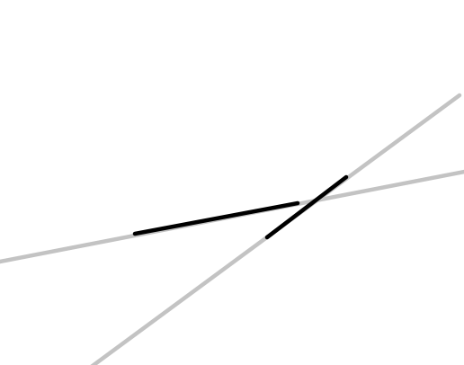

### 修改处：

对 `数学基础-线段-线段是否相交` 的结论：

①第一版判断函数参考代码的第 3 行，原文为：

```c++
    return cross(c - a, d - a) * cross(c - b, d - b) <= 0.0 && cross(a - c, b - c) * cross(a - d, b - d) <= 0.0;
```

应当改为：

```c++
	return cross(b - a, c - a) * cross(b - a, d - a) <= 0 && cross(d - c, a - c) * cross(d - c, b - c) <= 0;
```

且第一版判断函数成立的条件，原文为： $AB,CD$ 不共线

应当改为： $A,B,C,D$ 任意三点不共线


②第二版判断函数参考代码的第 23 行，原文为：

```c++
	return f(c - a, d - a) * f(c - b, d - b) <= 0 && f(a - c, b - c) * f(a - d, b - d) <= 0;
```

应当改为：

```c++
	return f(b - a, c - a) * f(b - a, d - a) <= 0 && f(d - c, a - c) * f(d - c, b - c) <= 0;
```


③对应修改判断直线 $AB$ 与线段 $CD$ 是否相交的条件，原文是：
$$
(\vec{CA}\times\vec{CB})\cdot(\vec{DA}\times \vec{DB})\le 0
$$
应当改为：
$$
f(\vec{AB},\vec{AC})\cdot f(\vec{AB},\vec{AD})\le 0
$$


### 修改理由：

根据课件内容，可知定义了一个函数 $f$ 指明向量 $a$ 与向量 $b$ 的关系：

```c++
ll f(const Point &a, const Point &b) //a是AB， b是AP
{
    if (cross(a, b) > eps)
    {
        return 1; //b在a逆时针(0°,180°)方向
    }
    if (cross(a, b) < -eps)
    {
        return -1; //b在a顺时针(0°,180°)方向
    }
    if (dot(a, b) < -eps)
    {
        return 2; // P在AB左方(即180°)
    }
    if (a.abs() < b.abs())
    {
        return -2; // P在AB右方(即0°)
    }
    return 0; // P在AB内部
}
```

首先， $f > 0$ 代表夹角为逆时针 $(0°,180°]$ ， $f < 0$ 代表夹角为顺时针 $[0°,180°)$，即如下图所示，绿色区域是 $ > 0$ 的(点 $P$ 落在这个区域就是 $> 0$ )；红色区域是 $< 0$ ，黑色区域是 $=0$ (含 $A,B$ 点)。


那么 $\ge 0$ 就是绿色区域加黑色区域； $\le 0$ 就是红色区域加黑色区域。

相交必有交点，定义点 $P$ 在 $AB$ 内表示上述的黑色区域，交点必然同时满足两个条件：

- $P$ 在线段 $AB$ 线段内
- $P$ 在线段 $CD$ 线段内

即线段 $AB,CD$ 相交于点 $P$ 可以看成：

- 把 $AB$ 拆成 $AP,PB$ 两部分，那么延长 $CD$ 线段分割平面为两部分后， $AP,PB$ 在平面的不同部分
- 把 $CD$ 拆成 $CP,PD$ 两部分，那么延长 $AB$ 线段分割平面为两部分后， $CP,PD$ 在平面的不同部分

特别地，我们看作在黑色区域表示同时在平面两个部分。具体而言，绿色+黑色是平面一部分；红色+黑色是另一部分；平面两部分的重合是黑色部分

当且仅当同时满足这两个条件，线段相交。

如图所示：


如果只满足其一或一个都不满足，那么必然不相交：




当我们修改函数后，其含义是：
$$
\begin{cases}
f(\vec{AB},\vec{AC})\cdot f(\vec{AB},\vec{AD})\le 0\\
f(\vec{CD},\vec{CA})\cdot f(\vec{CD},\vec{CB})\le 0
\end{cases}
$$
对 $f(\vec{AB},\vec{AC})\cdot f(\vec{AB},\vec{AD})\le 0$ ，当且仅当下面情况至少其一成立：

- $f(\vec{AB},\vec{AC}) \le 0, f(\vec{AB},\vec{AD}) \ge 0$

  也就是说① $C$ 点在绿色或黑色区域且② $D$ 在红色或黑色区域这两个条件同时满足

- $f(\vec{AB},\vec{AC}) \ge 0, f(\vec{AB},\vec{AD}) \le 0$

  也就是说① $C$ 点在红色或黑色区域且② $D$ 在绿色或黑色区域这两个条件同时满足

这就是上面的第二个条件：把 $CD$ 拆成 $CP,PD$ 两部分，那么延长 $AB$ 线段分割平面为两部分后， $CP,PD$ 在平面的不同部分

同理，$f(\vec{CD},\vec{CA})\cdot f(\vec{CD},\vec{CB})\le 0$ 是第一个条件：把 $AB$ 拆成 $AP,PB$ 两部分，那么延长 $CD$ 线段分割平面为两部分后， $AP,PB$ 在平面的不同部分


因此，当 $A,B,C,D$ 不存在任意三点共线时，一定不会存在任何一个 $f$ 函数等于 $0$ ，也就是说 $f$ 函数此时取值只可能是 $\pm 1$ ，即不会有任何一个叉乘等于 $0$ ，那么简化版仍可使用，并修改为：
$$
\begin{cases}
(\vec{AB}\times\vec{AC})\cdot (\vec{AB}\times\vec{AD})\le 0\\
(\vec{CD}\times\vec{CA})\cdot(\vec{CD}\times\vec{CB})\le 0
\end{cases}
$$
事实上不会取 $0$ ，所以把 $\le$ 写成 $ < $ 也行


> 对应的题目 `契合度1` 的题解也进行了修改

> 如果您还发现了先修班课件存在任何其他错误的话，欢迎随时联系 lr580 ，将马上进行修改 QwQ

