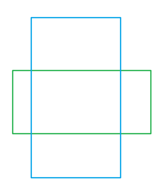
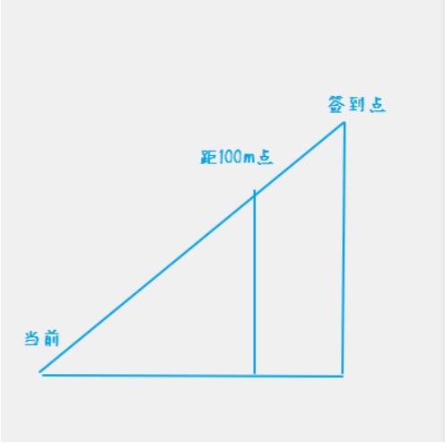
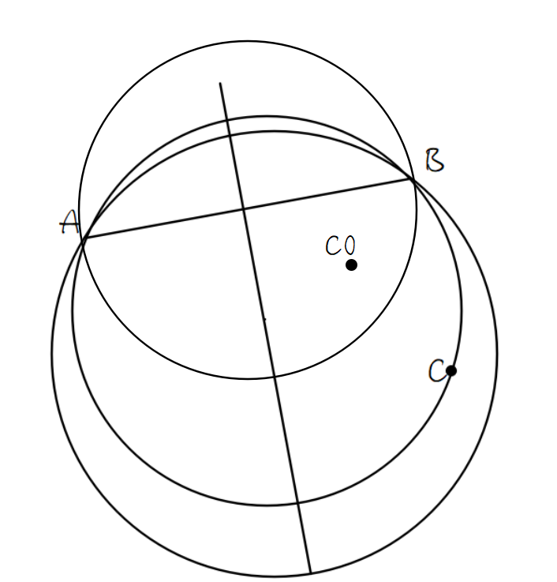

## 2022 香农先修班第 14 次课题解

### 契合度1

在课件有比较详细的解析，把课件的知识点直接拼接在一起形成代码即可。

```c++
#include <bits/stdc++.h>
using namespace std;
typedef double db;
#define cp const point &
#define eps 1e-10
struct point
{
    db x, y;
    point(db a = 0, db b = 0) : x(a), y(b) {}
    point operator+(cp r) const { return point(x + r.x, y + r.y); }
    point operator-(cp r) const { return point(x - r.x, y - r.y); }
    point operator*(db r) const { return point(x * r, y * r); }
    point operator/(db r) const { return point(x / r, y / r); }
    db abs() const { return hypot(x, y); }
    db norm() const { return x * x + y * y; }
    void get() { scanf("%lf%lf", &x, &y); }
} a, b, c, d;
db dot(cp a, cp b) { return a.x * b.x + a.y * b.y; }
db cross(cp a, cp b) { return a.x * b.y - a.y * b.x; }
int ccw(cp a, cp b)
{
    if (cross(a, b) > eps)
    {
        return 1; //逆时针
    }
    if (cross(a, b) < -eps)
    {
        return -1; //顺时针
    }
    if (dot(a, b) < -eps)
    {
        return 2; // P在AB左方
    }
    if (a.norm() < b.norm() + eps)
    {
        return -2; // P在AB右方
    }
    return 0; // P在AB内部
}
bool isIntersect(cp a, cp b, cp c, cp d)
{
    return ccw(c - a, d - a) * ccw(c - b, d - b) <= 0 && ccw(a - c, b - c) * ccw(a - d, b - d) <= 0;
}
point intersect(cp a, cp b, cp c, cp d)
{
    return c + (d - c) * (cross(a - c, b - a) / cross(d - c, b - a));
}
db dis_sp(cp a, cp b, cp p)
{
    if (dot(b - a, p - a) < 0)
    {
        return (p - a).abs();
    }
    if (dot(a - b, p - b) < 0)
    {
        return (p - b).abs();
    }
    return abs(cross(b - a, p - a)) / (b - a).abs();
}
signed main()
{
    a.get(), b.get(), c.get(), d.get();
    if (isIntersect(a, b, c, d))
    {
        if (abs(abs(dot(b - a, d - c)) - (b - a).abs() * (d - c).abs()) < eps)
        {
            printf("perfect");
        }
        else
        {
            point r = intersect(a, b, c, d);
            printf("yes\n%lf %lf", r.x, r.y);
        }
    }
    else
    {
        db r = min(min(dis_sp(a, b, c), dis_sp(a, b, d)), min(dis_sp(c, d, a), dis_sp(c, d, b)));
        printf("no\n%lf", r);
    }
    return 0;
}
```


### 契合度2

在课件有比较详细的解析，直接将其转化为代码即可(需要自行设计判断不交：内含或外离的判断，这个比较简单，根据初中数学即可得之)

```c++
#include <bits/stdc++.h>
using namespace std;
typedef double db;
#define cp const point &
#define eps 1e-10
struct point
{
    db x, y;
    point(db a = 0, db b = 0) : x(a), y(b) {}
    point operator+(cp r) const { return point(x + r.x, y + r.y); }
    point operator-(cp r) const { return point(x - r.x, y - r.y); }
    db abs() const { return hypot(x, y); }
} p1, p2, a, b;
db r1, r2;
void get(point &p, db &r) { scanf("%lf%lf%lf", &p.x, &p.y, &r); }
signed main()
{
    get(p1, r1), get(p2, r2);
    if (r1 > r2)
    {
        swap(p1, p2), swap(r1, r2);
    }
    db pq = (p1 - p2).abs();
    point d = p1 - p2;
    db s = atan2(d.y, d.x) - acos(-1); //-pi使得范围是[0,pi]
    if (pq < r2 - r1 || pq > r1 + r2)
    {
        printf("no");
        return 0;
    }
    db t = acos((pq * pq + r1 * r1 - r2 * r2) / (2 * r1 * pq));
    a = point(r1 * cos(s + t), r1 * sin(s + t)) + p1;
    b = point(r1 * cos(s - t), r1 * sin(s - t)) + p1;
    printf("yes\n%lf %lf\n%lf %lf", a.x, a.y, b.x, b.y);
    return 0;
}
```


### 契合度3

只需要把课件的直线与圆交点知识点和点是否在直线内知识点结合即可。

```c++
#include <bits/stdc++.h>
using namespace std;
typedef double db;
#define cp const point &
#define eps 1e-10
struct point
{
    db x, y;
    point(db a = 0, db b = 0) : x(a), y(b) {}
    point operator+(cp r) const { return point(x + r.x, y + r.y); }
    point operator-(cp r) const { return point(x - r.x, y - r.y); }
    point operator*(db r) const { return point(x * r, y * r); }
    point operator/(db r) const { return point(x / r, y / r); }
    db norm() const { return x * x + y * y; }
    db abs() const { return sqrt(norm()); }
    void get() { scanf("%lf%lf", &x, &y); }
} p, a, b, e, c, d;
db dot(cp a, cp b) { return a.x * b.x + a.y * b.y; }
db cross(cp a, cp b) { return a.x * b.y - a.y * b.x; }
db dis_sp(cp a, cp b, cp p)
{
    if (dot(b - a, p - a) < 0)
    {
        return (p - a).abs();
    }
    if (dot(a - b, p - b) < 0)
    {
        return (p - b).abs();
    }
    return abs(cross(b - a, p - a)) / (b - a).abs();
}
point project(cp a, cp b, cp p)
{
    return a + (b - a) * (dot(b - a, p - a) / (b - a).norm());
}
db in_seg(cp a, cp b, cp p)
{
    return !(dot(p - a, b - a) < -eps || (p - a).abs() > (b - a).abs());
}
db r;
signed main()
{
    p.get(), scanf("%lf", &r), a.get(), b.get();
    assert(!(a.x == b.x && a.y == b.y));
    if (dis_sp(a, b, p) > r)
    {
        printf("no");
        return 0;
    }
    e = project(a, b, p);
    db pe = (p - e).abs();
    db ce = sqrt(r * r - pe * pe);
    db ab = (b - a).abs();
    c = e - (b - a) * (ce / ab);
    d = e + (b - a) * (ce / ab);
    if (!in_seg(a, b, c) && !in_seg(a, b, d))
    {
        printf("no");
        return 0;
    }
    if (!in_seg(a, b, c))
    {
        c = d;
    }
    else if (!in_seg(a, b, d))
    {
        d = c;
    }
    printf("yes\n%lf %lf\n%lf %lf", c.x, c.y, d.x, d.y);
    return 0;
}
```


### 矩形相交

这题本来是AK杯正式赛的一道备用题，后来因为太板板了被砍掉了。

解法不唯一，如果您有更优解，欢迎讨论区分享。

一种实现思路：

- 先判断一个矩形是否在另一个矩形内，如果是就不相交

- 否则，对一个矩形四个点依次判断是否在另一个矩形内(或矩形上)，共判断 $8$ 次，如果有在的，那么一定相交

- 否则，判断有没有如下图这样相交的情况，判断两次，如果有就相交

  

- 否则，矩形不相交

```c++
#include <bits/stdc++.h>
using namespace std;
#define sc(x) scanf("%d", &x)
int isInside(int ax, int ay, int bx, int by, int cx, int cy, int dx, int dy)
{
    return ax < cx && dx < bx && ay < cy && dy < by;
}
int pointColi(int ax, int ay, int bx, int by, int tx, int ty)
{
    return ax <= tx && tx <= bx && ay <= ty && ty <= by;
}
int coverColi(int ax, int ay, int bx, int by, int cx, int cy, int dx, int dy)
{
    return ax <= cx && dx <= bx && cy <= ay && by <= dy;
}
int rectColi(int ax, int ay, int bx, int by, int cx, int cy, int dx, int dy)
{
    if (isInside(ax, ay, bx, by, cx, cy, dx, dy) || isInside(cx, cy, dx, dy, ax, ay, bx, by))
        return 0;
    if (pointColi(ax, ay, bx, by, cx, cy) || pointColi(ax, ay, bx, by, dx, dy) ||
        pointColi(ax, ay, bx, by, cx, dy) || pointColi(ax, ay, bx, by, dx, cy) ||
        pointColi(cx, cy, dx, dy, ax, ay) || pointColi(cx, cy, dx, dy, bx, by) ||
        pointColi(cx, cy, dx, dy, ax, by) || pointColi(cx, cy, dx, dy, bx, ay))
        return 1;
    if (coverColi(ax, ay, bx, by, cx, cy, dx, dy) || coverColi(cx, cy, dx, dy, ax, ay, bx, by))
        return 1;
    return 0;
}
int n, ax, ay, bx, by, cx, cy, dx, dy;
signed main()
{
    sc(n);
    while (n--)
    {
        sc(ax), sc(ay), sc(bx), sc(by), sc(cx), sc(cy), sc(dx), sc(dy);
        printf("%d\n", rectColi(ax, ay, bx, by, cx, cy, dx, dy));
    }
    return 0;
}
```


### 极角排序

模板题。请参见课件。

叉乘写法：

```c++
#include <bits/stdc++.h>
using namespace std;
typedef long long ll;
#define sc(x) scanf("%lld", &x)
#define mn 100010
#define cp const point &
ll n;
struct point
{
    ll x, y, i;
    point(ll a = 0, ll b = 0) : x(a), y(b) {}
    point operator-(cp r) const { return point(x - r.x, y - r.y); }
    ll norm() const { return x * x + y * y; }
    ll quadrant() const
    {
        return 1 * (x > 0 && y >= 0) + 2 * (x <= 0 && y > 0) + 3 * (x < 0 && y <= 0) + 4 * (x >= 0 && y < 0);
    }
} p[mn];
ll cross(cp a, cp b) { return a.x * b.y - a.y * b.x; }
bool operator<(cp a, cp b)
{
    if (a.quadrant() != b.quadrant())
    {
        return a.quadrant() < b.quadrant();
    }
    ll v = cross(a, b);
    return v > 0 || (v == 0 && a.norm() < b.norm());
}
signed main()
{
    sc(n);
    for (ll i = 1; i <= n; ++i)
    {
        scanf("%lld%lld", &p[i].x, &p[i].y), p[i].i = i;
    }
    sort(p + 1, p + 1 + n);
    for (ll i = 1; i <= n; ++i)
    {
        printf("%lld ", p[i].i);
    }
    return 0;
}
```

atan2写法：

```c++
#include <bits/stdc++.h>
using namespace std;
typedef long long ll;
#define sc(x) scanf("%lld", &x)
#define cp const point &
struct point
{
    ll x, y, i;
    point(ll a = 0, ll b = 0) : x(a), y(b) {}
    point operator-(cp r) const { return point(x - r.x, y - r.y); }
    double ang() const
    {
        double v = atan2(y, x);
        return v < 0 ? v + 2 * acos(-1) : v;
    }
    ll norm() const { return x * x + y * y; }
} p[100010];
ll cross(cp a, cp b) { return a.x * b.y - a.y * b.x; }
bool operator<(cp a, cp b)
{
    point p1 = a, p2 = b;
    return p1.ang() != p2.ang() ? p1.ang() < p2.ang() : p1.norm() < p2.norm();
}
ll n, b;
signed main()
{
    sc(n);
    for (ll i = 1; i <= n; ++i)
    {
        scanf("%lld%lld", &p[i].x, &p[i].y), p[i].i = i;
    }
    sort(p + 1, p + 1 + n);
    for (ll i = 1; i <= n; ++i)
    {
        printf("%lld ", p[i].i);
    }
    return 0;
}
```


### 部道乐跑 II

~~这篇题解是在我自己也没系统学习计算几何时写的，所以码风比较奇特，将就着看吧~~

这道题是原本 AK 杯网络赛的压轴题。本题的两个难点如下：

1. 求出跑到离该签到点恰为 $100m$ 的位置坐标
2. 判断从一个点前往另一个签到点外的路线上可能会顺便完成其他的签到任务分别是哪些

对第一个问题，为避免斜率不存在的特判，可以使用向量分解的思维，分别直接计算横纵坐标。当前点、恰为 $100m$ 的点、通过坐标轴平行作辅助点能组成一个三角形，当前点、签到点、通过坐标轴平行作辅助点能组成另一个三角形。然后分别跟坐标轴平行边与斜边作比例就可以求出横纵坐标了。



对第二个问题，可以转化为对于每个签到点，距一条由两端点(当前点、距 $100m$ 点)确定的线段的距离是否小于等于 $100m$ 。该问题可以用计算几何模板求出，用向量算法。抽象为求 $C$ 点距线段 $AB$ 的距离，可以参考 [这篇文章](https://www.cnblogs.com/flyinggod/p/9359534.html) ，篇幅较长，这里不赘述。

其他部分代码的难度不高，具体实现细节可参考下面代码：

###### C++

```c++
#include <bits/stdc++.h>
#pragma GCC optimize(2)
using namespace std;
typedef long long ll;
typedef double db;
#define sc(x) scanf("%lld", &x)
#define il inline
#define big 1e18
ll t, p[6], vis[6];
db ans, x[6], y[6], rad = 100, misat = 2500;
//两点距离
db d(db ax, db ay, db bx, db by)
{
    return sqrt((ax - bx) * (ax - bx) + (ay - by) * (ay - by));
}
//两向量外积
db cross(db ax, db ay, db bx, db by)
{
    return ax * by - ay * bx;
}
//两向量内积
db dot(db ax, db ay, db bx, db by)
{
    return ax * bx + ay * by;
}
//点到线段的距离 d_point_segment
db dps(db px, db py, db ax, db ay, db bx, db by)
{
    if (dot(bx - ax, by - ay, px - ax, py - ay) < 0.0)
        return d(px, py, ax, ay);
    if (dot(ax - bx, ay - by, px - bx, py - by) < 0.0)
        return d(px, py, bx, by);
    return abs(cross(ax - px, ay - py, bx - px, by - py) / d(ax, ay, bx, by));
}
signed main()
{
    sc(t);
    while (t--)
    {
        ans = big;
        for (ll i = 0; i <= 4; ++i)
        {
            scanf("%lf%lf", &x[i], &y[i]);
            p[i] = i;
        }
        do
        {
            db dis = 0, ax = x[0], ay = y[0], bx, by, di, cx, cy;
            memset(vis, 0, sizeof vis);
            for (ll i = 1; i <= 4; ++i)
            {
                if (d(ax, ay, x[i], y[i]) <= rad)
                {
                    vis[i] = true;
                }
            }
            for (ll i = 1; i <= 4; ++i)
            {
                if (vis[p[i]])
                {
                    continue;
                }
                bx = x[p[i]], by = y[p[i]];
                di = d(ax, ay, bx, by);
                dis += di - rad;
                cx = ax + (di - rad) / di * (bx - ax);
                cy = ay + (di - rad) / di * (by - ay);
                vis[p[i]] = true;
                for (ll j = 1; j <= 4; ++j)
                {
                    if (!vis[j] && dps(x[j], y[j], ax, ay, cx, cy) < rad)
                    {
                        vis[j] = true;
                    }
                }
                ax = cx, ay = cy;
            }

            if (dis >= misat)
            {
                ans = min(ans, dis);
            }
        } while (next_permutation(p + 1, p + 5));
        if (ans == big)
        {
            printf("no\n");
        }
        else
        {
            printf("%.0lf\n", ans);
        }
    }
    return 0;
}
```

###### Python

```python
from math import *
dfn = [0, 0, 0, 0]
vis = [0, 0, 0, 0]
p = []


def dfs(h):
    if h == 4:
        p.append(dfn[:])
    else:
        for i in range(4):
            if not vis[i]:
                vis[i] = 1
                dfn[h] = i
                dfs(h+1)
                vis[i] = 0


dfs(0)


def dis(x1, y1, x2, y2):
    return ((x1-x2)**2+(y1-y2)**2)**0.5


def walk(x1, y1, x2, y2):
    s = dis(x1, y1, x2, y2)
    k = (s-100)/s
    x3 = x1+k*(x2-x1)
    y3 = y1+k*(y2-y1)
    return [x3, y3, s-100]


def dot(x1, y1, x2, y2):
    return x1*x2+y1*y2


def cross(x1, y1, x2, y2):
    return x1*y2-x2*y1


def pdis(x1, y1, x2, y2, x3, y3):
    if(dot(x2-x1, y2-y1, x3-x1, y3-y1) < 0.0):
        return dis(x1, y1, x3, y3)
    if(dot(x1-x2, y1-y2, x3-x2, y3-y2) < 0.0):
        return dis(x2, y2, x3, y3)
    return abs(cross(x2-x1, y2-y1, x3-x1, y3-y1)/dis(x1, y1, x2, y2))


for t in range(int(input())):
    x0, y0 = [int(i) for i in input().strip().split()]
    x = []
    y = []
    for i in range(4):
        x1, y1 = [int(i) for i in input().strip().split()]
        x.append(x1)
        y.append(y1)
    ans = 1e18
    for h in range(24):
        d = 0
        xn = x0
        yn = y0
        vi = []
        for i in range(4):
            vi.append(dis(xn, yn, x[p[h][i]], y[p[h][i]]) <= 100)
        for i in range(4):
            if vi[i]:
                continue
            x1 = x[p[h][i]]
            y1 = y[p[h][i]]
            wr = walk(xn, yn, x1, y1)
            d += wr[2]
            vi[i] = True
            for j in range(4):
                if not vi[j] and pdis(wr[0], wr[1], xn, yn, x[p[h][j]], y[p[h][j]]) <= 100:
                    vi[j] = True
            xn = wr[0]
            yn = wr[1]
        if d >= 2500:
            ans = min(ans, d)

    if ans == 1e18:
        print('no')
    else:
        print(round(ans))
```


### 伪典·最小圆覆盖

特别注意：最小圆覆盖不是求 $\Delta ABC$ 的外接圆。外接圆是三点都在圆上的圆。但是最小圆覆盖可能只需要两点在圆上。

我们可以枚举下面四种情况，并且可以证明，最小圆覆盖必定是四种情况之一：

1. 以 $AB$ 为直径且包含点 $C$ 的圆
2. 以 $AC$ 为直径且包含点 $B$ 的圆
3. 以 $BC$ 为直径且包含点 $A$ 的圆
4. $\Delta ABC$ 的外接圆

如果不是这四种情况，那么所得到的圆至多有一点在圆上，剩下的点在园内。

- 如果没有任意一点在圆上，全部在圆内，那么我们可以不断缩小这个圆，直到它与其中一个点接触
- 如果有一个点在圆上，我们可以固定这个点，继续不断缩小这个圆，直到它与另外的点接触

当圆与两个点接触时，如下图所示：



如果我们固定 $AB$ ，那么圆形可以在中垂线上移动。①如果第三个点在最小的圆内(上图所示最小的圆，即以 $AB$ 为直径的圆)，那么此时就是最优解了(即上述的情况一)。如果这个情况下再固定 $AC$ 或 $BC$ ，那么因为 $AB$ 是 $Rt\Delta ABC$ 的斜边，所以 $AC,BC$ 小于 $AB$ ，此时若以 $AC$ 或 $BC$ 为直径，必然会有 $B$ 或 $C$ 不在圆内，需要拓展，最后使得其在圆内的最小情况满足 $OA=OB=OC$ ，而假设是以 $AC$ 为直径，拓展出时不一定满足 $O,A,B$ 在一条直线上，那么 $OA+OB \le AB$ ，也就是说拓展出来的直径最好也不会比最初固定 $AB$ 更优。

如果第三个点在最小的圆外，我们可以更换固定 $AC,BC$ 进行尝试，如果发现有在最小的圆内的，就以它为最优解。(即情况二、三)。如果都没有在最小的圆内的，那么可以考虑不断将圆心沿着 $AB$ 中垂线移动，直到 $C$ 刚好到圆上，即满足 $OA=OB=OC$ ，其实也就是找 $\Delta ABC$ 的外接圆了。

如果本来不能形成三角形，即 $A,B,C$ 共线，那么能够被情况一、二、三其中一种检测出，所以无需特判。

> 当然了，如果您本来就会随机增量法求真典·最小圆覆盖，那么您完全平A就是了。

参考程序：(伪典·最小圆覆盖)

```c++
#include <bits/stdc++.h>
using namespace std;
typedef long long ll;
typedef double db;
#define eps 1e-6
#define cp const point &
struct point
{
    db x, y;
    point(db a = 0, db b = 0) : x(a), y(b) {}
    point operator+(cp r) const { return point(x + r.x, y + r.y); }
    point operator-(cp r) const { return point(x - r.x, y - r.y); }
    point operator*(db r) const { return point(x * r, y * r); }
    point operator/(db r) const { return point(x / r, y / r); }
    db norm() const { return x * x + y * y; }
    point rotate90() const { return point(-y, x); }
    void sc() { scanf("%lf%lf", &x, &y); }
} a, b, c, o;
db cross(cp a, cp b) { return a.x * b.y - a.y * b.x; }
db r2 = 1e18;
void check(cp a, cp b, cp c) //以AB为直径建圆，判断C在不在其中
{                            //如果在且半径小于已知圆，更新已知圆
    point p = (a + b) / 2;
    db pr2 = (o - a).norm();
    if ((p - c).norm() > pr2) //点在圆外
    {
        return;
    }
    if (pr2 < r2)
    {
        o = p, r2 = pr2;
    }
}
point intersect(cp a, cp b, cp c, cp d)
{
    return c + (d - c) * (cross(a - c, b - a) / cross(d - c, b - a));
}
signed main()
{
    a.sc(), b.sc(), c.sc();
    check(a, b, c);
    check(a, c, b);
    check(b, c, a);
    point d = (a + b) / 2, e = (a + c) / 2;
    point vd = (a - b).rotate90(), ve = (a - c).rotate90(); //法向量
    point p = intersect(d, d + vd, e, e + ve);
    db pr2 = (p - a).norm();
    if (pr2 < r2)
    {
        o = p, r2 = pr2;
    }
    printf("%lf %lf %lf\n", o.x, o.y, acos(-1) * r2);
    return 0;
}
```

> 参考程序：(真典·最小圆覆盖 在本题的使用) (随机增量法)

> ```c++
> #include <bits/stdc++.h>
> using namespace std;
> typedef long long ll;
> typedef double db;
> #define mn 100010
> #define cp const point &
> ll n;
> struct point
> {
>     db x = 0, y = 0;
>     point(db a = 0, db b = 0) : x(a), y(b) {}
>     point operator+(cp r) const { return point(x + r.x, y + r.y); }
>     point operator-(cp r) const { return point(x - r.x, y - r.y); }
>     point operator*(const db r) const { return point(x * r, y * r); }
>     point operator/(const db r) const { return point(x / r, y / r); }
>     db norm() const { return x * x + y * y; }
>     point rotate() const { return point(y, -x); } //顺90
> } p[mn], o;
> db r2; // r*r
> db cross(cp a, cp b) { return a.x * b.y - a.y * b.x; }
> point intersect(cp p0, cp v0, cp p1, cp v1)
> {
>     return p0 + v0 * (cross(p1 - p0, v1) / cross(v0, v1));
> }
> void solve(cp a, cp b, cp c)
> {
>     o = intersect((a + b) / 2, (a - b).rotate(), (a + c) / 2, (a - c).rotate());
>     r2 = (a - o).norm();
> }
> signed main()
> {
>     n = 3;
>     for (ll i = 1; i <= n; ++i)
>     {
>         scanf("%lf%lf", &p[i].x, &p[i].y);
>     }
>     random_shuffle(p + 1, p + 1 + n);
>     for (ll i = 1; i <= n; ++i)
>     {
>         if ((p[i] - o).norm() > r2)
>         {
>             o = p[i], r2 = 0;
>             for (ll j = 1; j < i; ++j)
>             {
>                 if ((p[j] - o).norm() > r2)
>                 {
>                     o = (p[i] + p[j]) / 2, r2 = ((p[i] - p[j]) / 2).norm();
>                     for (ll k = 1; k < j; ++k)
>                     {
>                         if ((p[k] - o).norm() > r2)
>                         {
>                             solve(p[i], p[j], p[k]);
>                         }
>                     }
>                 }
>             }
>         }
>     }
>     printf("%.12lf %.12lf %.12lf", o.x, o.y, r2 * acos(-1));
>     return 0;
> }
> ```


### 最小多边形覆盖

这相当于是模板题。题意即求凸包面积。

注意只能用 `Andrew` 算法。因为 `Graham` 算法无法解决共线问题。

参考代码：

```c++
#include <bits/stdc++.h>
using namespace std;
typedef long long ll;
#define sc(x) scanf("%lld", &x)
#define mn 100010
#define cp const point &
struct point
{
    ll x, y;
    point(ll a = 0, ll b = 0) : x(a), y(b) {}
    point operator-(cp r) const { return point(x - r.x, y - r.y); }
    bool operator<(cp r) const { return x != r.x ? x < r.x : y < r.y; }
} p[mn], s[mn * 2], p0;
ll cross(cp a, cp b) { return a.x * b.y - a.y * b.x; }
ll n, ss, top = 1, ans, m;
void f(ll i)
{
    while (ss > top && cross(s[ss] - s[ss - 1], p[i] - s[ss]) < 0)
    {
        --ss;
    }
    s[++ss] = p[i];
}
set<point> h;
signed main()
{
    sc(m);
    for (ll i = 1; i <= m; ++i)
    {
        sc(p0.x), sc(p0.y);
        if (h.find(p0) == h.end()) //去重
        {
            p[++n] = p0;
            h.insert(p0);
        }
    }
    sort(p + 1, p + 1 + n);
    for (ll i = 1; i <= n; ++i)
    {
        f(i);
    }
    top = ss;
    for (ll i = n - 1; i >= 1; --i)
    {
        f(i);
    }
    for (ll i = 1; i < ss; ++i)
    {
        ans += cross(s[i], s[i + 1]);
    }
    printf("%lf", ans / 2.0);
    return 0;
}
```


### U 型锁

题意：你可以在平面直角坐标系上放置**一个** $U$ 型锁，解析式是 $y=x^2+bx+c$ ，放置必须要满足要求：

- 该锁经过至少两个钉子
- 该锁上方即 $y > x^2+bx+c$ 区域不能有任何钉子

求所有可行的方案数。方案数不同当且仅当锁在平面内的图形不一样( $c$ 改变产生位移或 $b$ 改变形状均能导致不一样)。

> 朴素做法是暴力枚举任意两个钉子，求出一把 $U$ 型锁，然后暴力遍历全部点，判断是否没有点在其上方。最后把求出的所有锁去个重即可，复杂度 $O(n^3)$ 。

可以作一个坐标变换，即 $y=x^2+bx+c\Rightarrow y-x^2=bx+c$ ，即令新的 $y'$ 轴表示为 $y-x^2$ ，即把每一个点 $(x,y)$ 变化为 $(x,y-x^2)$ 。在变换后的坐标轴里， 所求问题即找到一条直线 $y'=bx+c$ ，使得直线上方区域 $y' > bx+c$ 没有任何钉子。求这样的方案数。

我们发现，如果我们把钉子用一个凸包包起来，那么凸包的上凸壳部分的每一条边，一定都可以作为一条符合题意的直线(需要对共线作合并)。这由凸多边形的基本性质可知 (以边作一条延长线直线，所有其他边都在同一侧)，那么上凸壳的边作直线，所有其他边及其顶点一定都在其下方。

那么我们可以用 `Andrew` 算法单独求一次上凸壳。特别注意 $b$ 不能取无穷(无穷不是实数)，所以对所有 $x$ 值相同的点里，我们只取 $y$ 值最大的那个点。

参考代码：

```c++
#include <bits/stdc++.h>
using namespace std;
typedef long long ll;
#define sc(x) scanf("%lld", &x)
#define mn 1010
#define cp const point &
struct point
{
    ll x, y;
    point(ll a = 0, ll b = 0) : x(a), y(b) {}
    point operator-(cp r) const { return point(x - r.x, y - r.y); }
    bool operator<(cp r) const { return x != r.x ? x > r.x : y < r.y; }
} p[mn], s[mn];
ll cross(cp a, cp b) { return a.x * b.y - a.y * b.x; }
ll n, ss;
signed main()
{
    sc(n);
    for (ll i = 1, x, y; i <= n; ++i)
    {
        sc(x), sc(y);
        p[i] = point(x, y - x * x);
    }
    sort(p + 1, p + 1 + n);
    for (ll i = 1; i <= n; ++i)
    {
        if (i > 1 && p[i].x == p[i - 1].x)
        {
            continue;
        }
        while (ss > 1 && cross(s[ss] - s[ss - 1], p[i] - s[ss]) <= 0)
        {
            --ss;
        }
        s[++ss] = p[i];
    }
    printf("%lld", ss - 1);
    return 0;
}
```


### 超椭圆 II

本题有多种解法。仅展示其中几种。不代表题解解法是最佳解法，欢迎评论区补充  qwq

以下参考代码暂仅提供 C++ 代码。

#### 方法一：蒙特卡罗法

即随机生成足够多的范围内的随机点，判断这个点是否在方程的内部，如果在就是面积的一部分。

注意到本题的方程关于x,y轴对称，为了减少计算负数带来的误差，我们可以只生成第一象限的随机点。(方法二也用到了对称性)

参考代码如下：

```cpp
#include <bits/stdc++.h>
using namespace std;
const int rands = 10000000;
int cor, n, a, b;
double am, bm;
void mtkl()
{
    double rx = rand() / am / a, ry = rand() / bm / b;
    double ax = 1, ay = 1;
    for (int i = 0; i < n; ++i) //n比较小不开快速幂也可以
        ax *= rx, ay *= ry;
    if (ax + ay < 1)
        ++cor;
}
signed main()
{
    scanf("%d%d%d", &n, &a, &b);
    srand(time(nullptr));
    am = 1. * RAND_MAX / a;
    bm = 1. * RAND_MAX / b;
    for (int i = 0; i < rands; ++i)
        mtkl();
    printf("%lf", 4. * cor * a * b / rands);
    return 0;
}

```

&nbsp;

&nbsp;

#### 方法二：微分法

在范围内等距离划分为许多个密集的小点，判断这些小点是否在方程内。

在本题中，在同等的时间开销下，微分法的精度不如蒙特卡罗法。

为了加速计算，可以使用快速幂。

参考代码如下：

```cpp
#include <bits/stdc++.h>
int a, b, n, cor, tot;
double as, ae, bs, be, step = 1e-2;
signed main()
{
    scanf("%d%d%d", &n, &a, &b);
    as = -a, bs = -b, ae = a, be = b;
    for (double ai = 0; ai < ae; ai += step)
        for (double bi = 0; bi < be; bi += step)
        {
            double x = ai / a, y = bi / b, ax = 1, ay = 1;
            for (int i = n; i; i >>= 1, x *= x, y *= y) //快速幂
                if (i & 1)
                    ax *= x, ay *= y;
            if (ax + ay < 1)
                ++cor;
            ++tot;
        }
    printf("%lf", 4. * a * b * cor / tot);
    return 0;
}

```

&nbsp;

&nbsp;

#### 方法三：微分法(二分优化)

我们发现，这道题可以直接寻找图形的边界，寻找边界是符合单调性的，所以在微分的过程中，其中一个维度可以使用二分优化。那么每一个长条的小面积可以近似为一个矩形的面积。(在方法二的微分法中是用点来微分，在这里是用小长方形来微分)。

参考代码如下：

```cpp
#include <bits/stdc++.h>
using namespace std;
typedef double db;
int n, a, b;
db step = 1e-4, s;
inline bool cal(db x, db y)
{
    db vx = x / a, vy = y / b, rx = 1, ry = 1;
    for (int i = n; i; i >>= 1, vx *= vx, vy *= vy)
        if (i & 1)
            rx *= vx, ry *= vy;
    return rx + ry < 1;
}
signed main()
{
    scanf("%d%d%d", &n, &a, &b);
    for (db bs = 0.0; bs <= b; bs += step)
    {
        db left = 0.0, right = a, mid;
        while (right - left > 1e-4) //找边界
        {
            mid = (left + right) / 2;
            bool v = cal(mid, bs);
            if (v) //点在超椭圆内
                left = mid + 1e-5;
            else
                right = mid - 1e-5;
        }
        s += mid * step;
    }
    printf("%lf", 4 * s);
    return 0;
}

```

&nbsp;

&nbsp;

#### 方法四：积分法

依然是因为对称，所以只需要计算第一象限。对原方程作变换，得：
$$
y=b\times^n\sqrt{1-(\frac{x}{a})^n}
$$
积分得，第一象限的面积表达式为：
$$
S=b\int_0^a\ ^n\sqrt{1-(\frac{x}{a})^n}
$$
利用积分的定义法(计算黎曼和，大量小面积)，很容易得到答案 qwq。

参考代码：

```cpp
#include <bits/stdc++.h>
using namespace std;
typedef double db;
db n, a, b, step = 1e-4, s;
signed main()
{
    scanf("%lf%lf%lf", &n, &a, &b);
    for (db i = 0; i < a; i += step)
        s += step * pow(1 - pow(i / a, n), 1 / n);
    printf("%lf", s * 4 * b);
    return 0;
}
```

&nbsp;

&nbsp;

#### 方法五：公式法

如果你知道 C/C++/Python 自带 $\Gamma$ 函数，可以直接套公式qwq (当然这不是本题出题的本意)

```cpp
#include <bits/stdc++.h>
signed main()
{
    int n, a, b;
    scanf("%d%d%d", &n, &a, &b);
    double gamma1 = tgamma(1 + 1. / n);
    double gamma2 = tgamma(1 + 2. / n);
    printf("%lf", 4 * a * b * (gamma1 * gamma1) / gamma2);
    return 0;
}
```

&nbsp;
