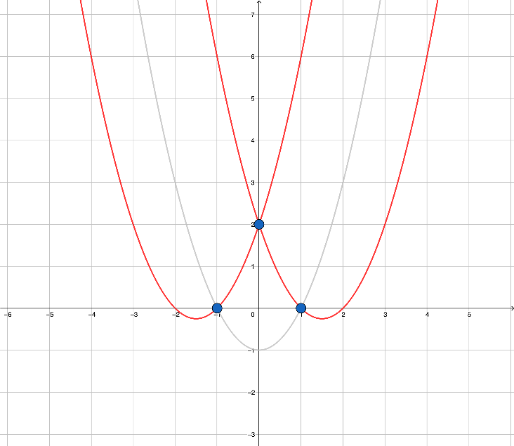
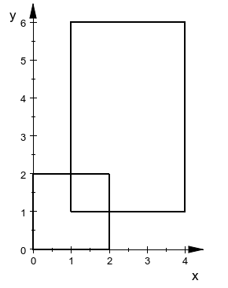
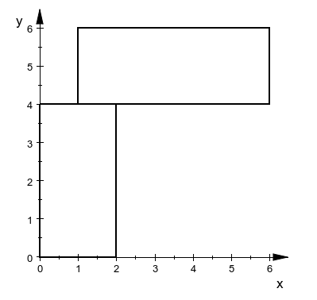

## 寄蒜几盒0


在很久很久以前，有一道寄算几何中等难的简单题，然而并没有人 AC 。

因此，请你输出 `gimme one more minute` 来通过这道题，或者把 `寄蒜几盒` 这题给补了 (￣～￣;)


## 超椭圆 II

sz 对数学着迷，他最近在研究超椭圆，并打算再用超椭圆绘制另一幅包含东方哲学、Alive、伟大的数学公式、生命的不停律动、少女的微笑、宇宙的律动、不同于人类生命体的萌生和退化的矢量图作品送给 jl。

已知超椭圆的方程为：
$$
|\frac xa|^n+|\frac yb|^n=1
$$
超椭圆的面积公式为：
$$
S=4ab\dfrac{\left(\Gamma(1+\frac1n)\right)^2}{\Gamma(1+\frac2n)}\quad,\Gamma(x)=\int_0^\infty t^{x-1}e^{-x}dt
$$
输入一行三个整数 $n,a,b(1\le n\le7,1 \le a,b \le 10^2)$。

输出由给定 $a,b$ 和 $n$ 确定的超椭圆的面积。你的答案被认为是正确的当且仅当你的答案与标准答案的相对误差不超过 $10^{-2}$。我们建议你保留至少六位小数。

```
3 1 1
```

```
3.533278
```


```
4 100 100
```

```
37081.493546
```


## 部道乐跑 II

jl 和 sz 总是一起在无故事王国完成部道乐跑的任务。在这学期他们每人都需要完成 $30$ 次部道乐跑任务，每个任务需要跑 $2500m$，并且完成两个签到任务。**完成一个签到任务当且仅当处于距离签到点小于等于 $\mathbf{100m}$ 的位置**。

由于每次领取任务时，jl 和 sz 领取到的签到任务不都是一样的，而他们又想一起同行。于是，他们决定，从一个起始点出发，按照特定顺序一起完成他们加起来的四个签到任务。

由于他们不想深入思考，所以他们**采用如下的简单方法**跑步：选择一个尚未完成的签到点，从起始点出发走直线一直跑，直到跑到离该签到点恰为 $100m$ 的位置。此时，他们会检查此刻尚未完成的其他签到点，并再次选择一个，从当前位置出发前往新的签到点，直到跑到离该签到点恰为 $100m$ 的位置。如此循环，直到完成所有的签到任务。

他们想要知道，对于给定的起始点和四个签到点，是否存在一个顺序，使得他们能跑够 $2500m$？如果能，他们还想知道最少需要跑多远？

假设起始点和签到点均分布在平面直角坐标系上，并且都是整点(即横纵坐标均为整数)。假设两点之间的距离均取直线距离。规定输入输出中所有数值的单位为 $m$。

特别注意：

- 距离起始点小于等于 $100m$ 的签到任务在开始跑步的瞬间就会完成签到任务。
- 使用上述方法跑步时，从一个点前往另一个签到点外的路线上可能会顺便完成其他的签到任务。

提示：对于*C/C++*选手，在引用了头文件`math.h/cmath`时，可以使用`sqrt()`函数计算一个浮点数的平方根；对于*Python*选手，表达式`a**0.5`即可计算浮点数`a`的平方根。

首先输入一行一个整数 $t(1\le t\le10^3)$，代表询问的次数。

对于每个询问，接下来输入 $5$ 行，每行两个整数 $x_i,y_i(-10^4\le x,y\le10^4)$，依次代表起始点和四个签到点的坐标。

对于每个询问，若不存在一个顺序使得他们能跑够 $2500m$，在一行内输出`no`；若存在一个顺序使得他们能跑够 $2500m$，在一行内输出最少需要跑的总路程(四舍五入取整数)。

```
2
0 0
0 500
0 -500
500 0
-500 0
100 100
2712 100
800 60
1400 110
2333 123
```

```
2564
2512
```


```
1
0 0
50 50
50 50
-50 50
0 2499
```

```
no
```


```
4
0 0
0 500
0 1000
0 2000
0 2600
0 0
0 5
0 1000
0 2000
0 2500
0 0
300 0
-200 0
700 0
-858 58
0 0
300 0
-200 0
700 0
-800 0
```

```
2500
no
2519
2500
```


## 伪典·最小圆覆盖

给定三个平面点 $A,B,C$ ，请你求出能覆盖这三点的最小的圆。

输入三行，每行两个整数，代表横纵坐标。三行依次为点 $A,B,C$ 。保证整数值绝对值不超过 $10^4$ ，保证没有任何两点重合。

输出一行三个整数，代表圆心横纵坐标和面积大小。你的答案被视为是正确的当且仅当你的答案与标准答案的相对或绝对误差不超过 $10^{-6}$ 

```c++
1 0
-1 0
0 -1
```

```c++
0 0 3.141593
```

真典·最小圆覆盖请前往 [P1742](https://www.luogu.com.cn/problem/P1742)


## 最小多边形覆盖

给定 $n$ 个平面点，你需要构造一个周长最小的多边形，使得所有点都在这个多边形内或多边形上，并求出这个多边形的面积。

输入一行一个整数 $n(1\le n\le10^5)$ 

接下来输入 $n$ 行，第 $i$ 行两个整数 $x_i,y_i$ 代表第 $i$ 个点的坐标。保证 $-10^4\le x_i,y_i\le10^4$ ，**不保证**没有任何两个点重合。

输出一行一个整数，代表多边形面积。你的答案被视为是正确的当且仅当你的答案与标准答案的相对或绝对误差不超过 $10^{-6}$ 

```c++
1
0 0
```

```c++
0
```


```c++
8
0 0
0 1
1 1
2 0
2 1
0 2
0 0
2 2
```

```c++
4
```


```c++
10
-10 -8
-8 3
-3 8
9 6
1 6
1 -7
-8 7
0 5
-5 -4
2 -3
```

```c++
207
```


## U 型锁

众所周知，U型锁是U型的，这种U型我们可以用函数 $y=x^{2}+bx+c$ 来表示， $b$ 和 $c$ 都是实数。

现在墙上有许多个钉子，我们想通过钉子把U型锁钉在墙上。一个U型锁至少要两个钉子才能固定，即U型锁对应的函数至少要穿过两个钉子对应的点坐标。

此外，我们为了让U型锁钉得更好看，U型锁的内部，即 $y \gt x^{2}+bx+c$ 这片区域中不允许有任何钉子。请问有多少种U型锁的固定方法呢？

两个U型锁固定方法不同当且仅当对应函数的 $b$ 和 $c$ 至少有一个不同。

第一行输入 $n$ ，代表钉子的个数， $1 \leq n \leq 1000$ 。

接下来有 $n$ 行，每行有两个整数，分别代表这个钉子的 $x$ 坐标和 $y$ 坐标，其绝对值不超过 $10^{6}$ ，钉子之间的坐标互不重合。

输出一个整数，表示有多少种不同的U型锁固定方法。

```
3
-1 0
0 2
1 0
```

```
2
```


```
5
1 0
1 -1
0 -1
-1 0
-1 -1
```

```
1
```



样例1中两个符合条件的U型锁的示意图。

对于 $10$ 分的数据，$n \leq 10$ 。

对于 $20$ 分的数据，$n \leq 100$ 。

对于 $30$ 分的数据，$n \leq 1000$ 。

来源：2021 天梯赛选拔 / 蓝桥杯热身赛


## 矩形相交

在平面上给定四个点 $A(x_a,y_a),B(x_b,y_b),C(x_c,y_c),D(x_d,y_d)$，假设矩形一的左下角点为 $A$，右上角点为 $B$；矩形一的左下角点为 $C$，右上角点为 $D$，判断两个矩形是否相交。

请注意在本题中，两矩形相交当且仅当两个矩形的**边框**存在公共点。

输入包含多组测试用例。

第一行包含一个整数 $t \ (1 \leq t \leq 10^3)$，表示你需要处理 $t$ 组测试用例。

接下来 $t$ 行每行一组测试用例，包含八个用空格间隔的整数 $x_a,y_a,x_b,y_b,x_c,y_c,x_d,y_d \ (-10^9 \leq x_a,y_a,x_b,y_b,x_c,y_c,x_d,y_d \leq 10^9, x_a < x_b, y_a < y_b , x_c < x_d , y_c < y_d)$，四个点的坐标。

对于每组测试用例，如果两矩形相交，在单独的一行内输出 $1$，否则输出 $0$。

```
3
0 0 2 2 1 1 4 6
0 -1 10 11 13 16 58 85
0 0 2 4 1 4 6 6
```

```
1
0
1
```


对于测试用例 $1$，两个矩形所在位置如下图。



对于测试用例 $2$，两个矩形所在位置如下图。


对于测试用例 $3$，两个矩形所在位置如下图。




## 契合度1

锦乐和桑泽在玩一个游戏，他们分别蒙眼在平面直角坐标系内画一条线段，两人的契合度可以用线段间的距离或交点衡量。

给定平面上两条线段 $AB,CD$ ，问它们是否相交，若是，判断交点是否只有一个，是则求出它们的交点，否则告知重合；若不相交则，求出线段间的距离。

输入四行，每行两个整数，依次代表点 $A,B,C,D$ 。坐标值绝对值在 $10^4$ 以内。保证没有任意两点重合。

若线段相交且平行，输出 `perfect` 。否则，若线段相交于一点，首先输出一行 `yes` ，接着输出一行两个实数代表交点坐标。否则，若线段不相交，输出一行 `no` ，接着输出一行一个实数代表线段间距离。

你的答案被视为是正确的当且仅当你的答案与标准答案的相对或绝对误差不超过 $10^{-6}$ 。

```c++
0 0
2 0
1 -1
1 1
```

```c++
yes
1 0
```


```c++
0 0
0 5
1 1
5 5
```

```c++
no
1
```


```c++
0 0
0 5
0 1
0 6
```

```c++
perfect
```


> 锦乐和桑泽在玩一个游戏，他们分别蒙眼在平面直角坐标系内画一条线段，两人的契合度可以用线段间的距离或交点衡量。
>
> 给定平面上两条线段 $AB,CD$ ，问它们是否相交，若是，求出它们的交点；否则，求出线段间的距离。
>
> 输入四行，每行两个整数，依次代表点 $A,B,C,D$ 。保证没有任何两点重合，保证 $AB,CD$ 至多有一个交点，坐标值绝对值在 $10^4$ 以内。
>
> 若线段相交，首先输出一行 `yes` ，接着输出一行两个实数代表交点坐标。若线段不相交，输出一行 `no` ，接着输出一行一个实数代表线段间距离。
>
> 你的答案被视为是正确的当且仅当你的答案与标准答案的相对或绝对误差不超过 $10^{-6}$ 。


## 契合度2

锦乐和桑泽在玩一个游戏，他们分别蒙眼在平面直角坐标系内画一个圆，两人的契合度可以用两圆间的交点衡量。

给定平面内两圆圆心 $P_1,P_2$ 和半径 $r_1,r_2$ ，问两圆有无交点，若有则求出交点。

输入两行，每行三个整数，分别代表圆心的横纵坐标和半径。第一、第二行代表圆 $P_1, P_2$ 。保证 $P_1,P_2$ 和 $r_1,r_2$ 至少有一对不相同。 保证输入的坐标绝对值不超过 $10^4$ ，半径大小为不超过 $10^5$ 的正整数。

若两圆有交点，输出一行 `yes` ，并输出两行，每行两个整数，分别代表两个交点。如果两圆只有一个交点，你应当输出两遍这个交点。如果两圆无交点，输出 `no` 。

你的答案被视为是正确的当且仅当你的答案与标准答案的相对或绝对误差不超过 $10^{-6}$ 。若存在交点，你可以以任意顺序输出这两个交点。

```c++
0 0 4
0 5 3
```

```c++
yes
-2.4 3.2
2.4 3.2
```


```c++
-1 0 1
1 0 1
```

```c++
yes
0 0
0 0
```


```c++
10 10 1
5 5 3
```

```c++
no
```


## 契合度3

锦乐和桑泽在玩一个游戏，他们分别蒙眼在平面直角坐标系内画一个圆和一条线段，两人的契合度可以用圆与线段的交点衡量。

给定平面内一个圆的圆心 $P$ 和半径 $r$ ，并给定线段端点 $A,B$ ，问线段与圆是否相交，若相交请求出交点。

输入第一行三个整数，代表圆心的横纵坐标和半径。接下来输入两行，每行两个整数，代表横纵坐标。这两行分别代表端点 $A,B$ 。保证输入的坐标绝对值不超过 $10^4$ ，半径大小为不超过 $10^5$ 的正整数。保证 $A,B$ 不重合。

若线段与圆有交点，输出一行 `yes` ，并输出两行，每行两个整数，分别代表两个交点。如果只有一个交点，你应当输出两遍这个交点。如果两圆无交点，输出 `no` 。

你的答案被视为是正确的当且仅当你的答案与标准答案的相对或绝对误差不超过 $10^{-6}$ 

```c++
0 0 1
-1 0
2 0
```

```c++
yes
-1 0
1 0
```


```c++
0 0 1
0 0
2 0
```

```c++
yes
1 0
1 0
```


```c++
0 0 1
3 0
2 0
```

```c++
no
```


## 极角排序

给定平面直角坐标系上 $n$ 个整点，现将它们放到极坐标内，从极轴开始逆时针扫描这些点，如果有多个点被同一条直线扫描，离极点近的先被扫描。请你按扫描顺序输出这些点。

输入一行一个整数 $1\le n\le10^5$ ，代表点数。

接下来输入 $n$ 行，第 $i$ 行两个整数，代表第 $i$ 个点的横纵坐标 $x_i,y_i(-10^9\le x_i,y_i\le10^9)$ ，保证输入不含原点，且任意两点不重合。

输出一行 $n$ 个整数，第 $i$ 个整数代表第 $i$ 个点被扫描到的点的编号。

```c++
6
1 -1
2 2
1 1
1 2
0 2
-1 -1
```

```c++
3 2 4 5 6 1
```

