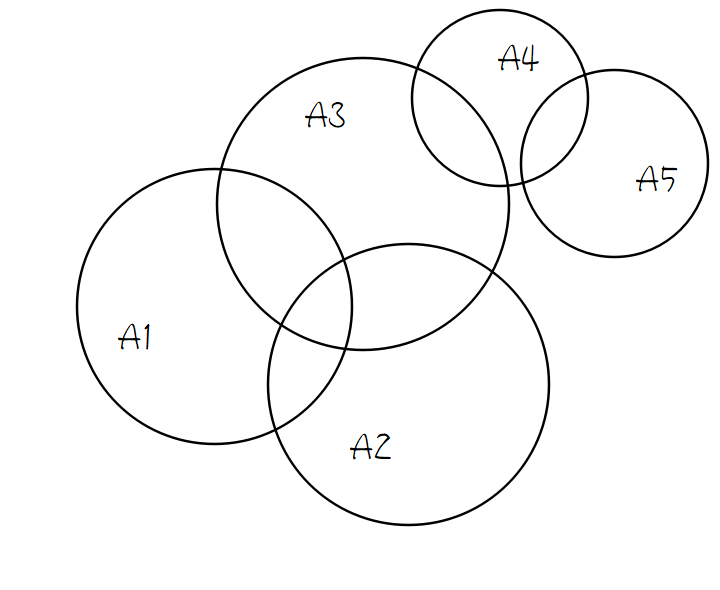
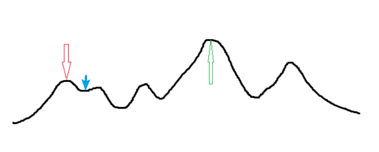
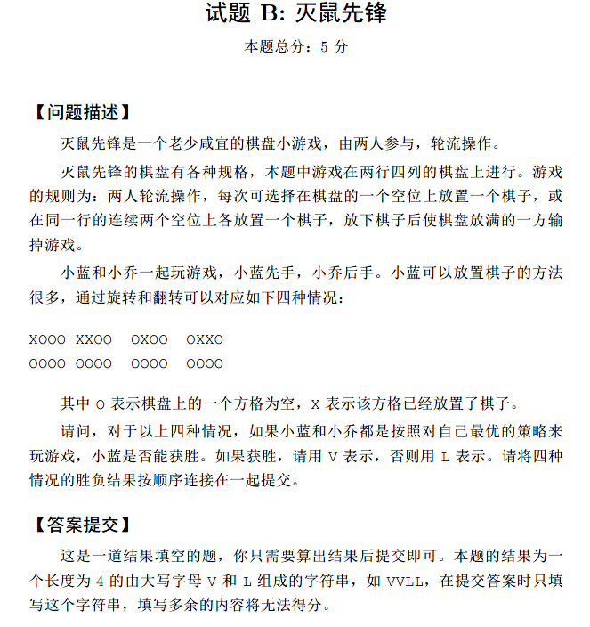
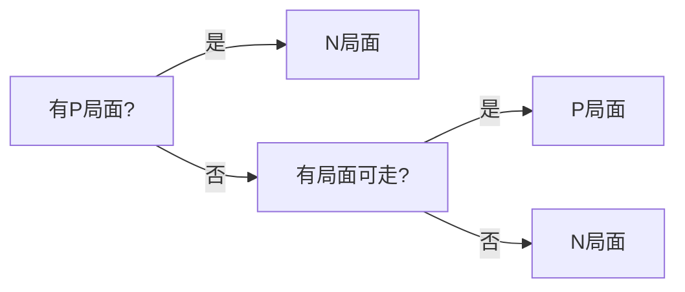
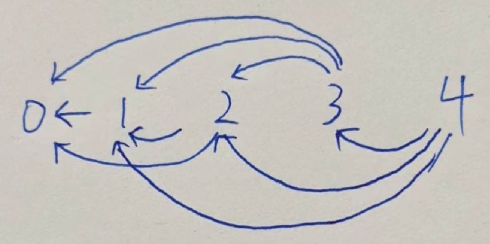

# 2022 香农先修班第十七次课

<div style="background-color:#f3e6c6;color:#66523c;font-size:26px;font-weight:900" align="center">随机算法和博弈论</div>


## 随机算法

### 数学理论

这里的理论适用于随机算法以及概率DP

#### 概率论摘要

> 随机化与概率论密切相关，下面给出部分概率论知识 (节选自我的[算法模板](https://github.com/lr580/algorithm_template))

> 自学，不讲 (这是泥萌下学期概率论要学的一部分知识点)

事件的运算规律：

- 若 $A\subset B$ 则 $A\cup B=B,AB=A$

- $A-B=A\overline B=A-AB,A\cup B=A\cup(B-A)$

- 结合律 $(A\cup B)\cup C=A\cup(B\cup C)$, $(A\cap B)\cap C=A\cap(B\cap C)$

- 分配律 $(A\cup B)\cap C=(A\cap C)\cup(B\cap C)$

  $$(A\cap B)\cup C=(A\cap C)\cup(B\cup C)$$

- 对偶律 $\overline{A\cup B}=\overline A\cap \overline B$ , $\overline{A\cap B}=\overline A\cup \overline B$

概率公式：

- $P(A-B)=P(A)-P(AB)$ 
- 若 $B\subset A$ ，有：$P(A-B)=P(A)-P(B)$ , $P(A)\ge P(B)$
- $P(A\cup B)=P(A)+P(B)-P(AB)$ ，可由容斥原理推广到任意多事件

在事件 $A$ 发生的条件下，事件 $B$ 的条件概率 $P(B|A)=\dfrac{P(AB)}{P(A)}$
$$
P(A_1\cup\cdots\cup A_n|A)=P(A_1|A)+\cdots+P(A_n|A)
$$

$$
P(A_1\cdots A_n)=P(A_1)P(A_2|A_1)\cdots P(A_n|A_1\cdots A_{n-1})
$$

如两个事件 $A,B$ 满足：$P(AB)=P(A)P(B)$ ，那么称 $A,B$ 独立

两点分布方差为 $p(1-p)$ ，二项分布方差为 $np(1-p)$ ，均匀分布期望 $\dfrac{a+b}2$ ，方差 $\dfrac{(b-a)^2}{12}$

数学期望的性质：

- 若 $C$ 是常数，则 $E(C)=C,E(CX)=CE(X)$

- $E(X_1+X_2)=E(X_1)+E(X_2)$ 

- 若 $X,Y$ 相互独立，则 $E(XY)=E(X)E(Y)$

方差计算公式 $D(X)=E(X^2)-[E(X)]^2$ 

- 设 $C$ 是常数，则 $D(C)=0$ ，$D(CX)=C^2D(X)$

- 若 $X,Y$ 相互独立，则 $D(X\pm Y)=D(X)+D(Y)$ (注意都是加)

(大数定律)切比雪夫不等式 ，设随机变量 $X$ 的期望 $E(X)=\mu$ ，方差 $D(X)=\sigma^2$ ，对任意正数 $\epsilon$ ，有：
$$
P\{|X-\mu|\ge \epsilon\}\le \dfrac{\sigma^2}{\epsilon^2}
$$
也可以写成：
$$
P\{|X-\mu|< \epsilon\}\ge1- \dfrac{\sigma^2}{\epsilon^2}
$$


#### 随机证明技巧

##### Union Bound

设坏事件(即出现不符合题目要求的解)有 $m$ 个，依次为 $A_1,\cdots ,A_m$ ，那么：坏事件中至少一者发生的概率，不超过每一个的发生概率之和。即：
$$
P({A_1\cup A_2\cup \cdots\cup A_m})\le P(A_1)+P(A_2)+\cdots+P(A_m)
$$

> 证明：根据上文可知，左边概率可以通过容斥原理计算，有：
> $$
> \begin{align}
> 左边=&P(A_1)+P(A_2)+\cdots+P(A_m)\\
> &-P(A_1A_2)-P(A_1A_3)\cdots -P(A_{m-1}A_m)\\
> &+P(A_1A_2A_3)+P(A_1A_2A_4)+\cdots+P(A_{m-2}A_{m-1}A_m)\\
> &-\cdots\\
> &+(-1)^{m+1}P(A_1A_2\cdots A_m)
> \end{align}
> $$
> 这条式子难以直接计算，但是可以通过 Venn 图举例直观判断：
>
> 
>
> 左式就是所有圆的面积并(重合部分仅计算一次)，右式子就是所有圆的面积和(重合部分重合多少次算多少次)，显然因为左式存在去重，所以左式小于或等于右式（取等当且仅当任意两圆相切/相离，即重合面积为 0，即所有事件相互独立），因此证毕。
>
> 我们看到，这条不等式右式其实质就是容斥展开后只要第一层。同样地，可以把右式变成只要容斥展开的前两层、前三层……上述不等式仍然成立，证明方法同理。


##### 自然常数

结论：
$$
(1-\dfrac1n)^n\le\dfrac 1e,\forall n\ge 1
$$

> 证明： ~~(可能有更快的证明步骤，泥萌的高数应该比我好，我一年没碰了)~~
>
> 显然，根据高中知识， $a=b^{\log_ba}$ ，所以：
> $$
> (1-\dfrac1n)^n=e^{\ln(1-\frac1n)^n}=e^{n\ln(1-\frac1n)}
> $$
> 那么：
> $$
> \lim_{n\to\infty}e^{n\ln(1-\frac1n)}=e^{\lim_{n\to\infty}n\ln(1-\frac1n)}
> $$
> 由于：
> $$
> \lim_{n\to\infty}n\ln(1-\dfrac1n)=\lim_{n\to\infty}\dfrac{\ln(1-\dfrac1n)}{\dfrac 1n}=\lim_{m\to 0}\dfrac{\ln(1-m)}{m}
> $$
> 由等价无穷小(洛必达法则也行)：
> $$
> \lim_{m\to 0}\dfrac{\ln(1-m)}{m}=\lim_{-m\to 0}\dfrac{\ln(1+(-m))}{-(-m)}=\lim_{-m\to 0}\dfrac{-m}{-(-m)}=-1
> $$
> 所以原式为 $e^{-1}=\dfrac1e$ ，证毕。

意义：有 $n$ 个**相互独立**的坏事件，且设它们的发生概率都是 $1-\dfrac 1n$ ，那么它们全部都发生的概率至多是 $\dfrac1e\approx0.3679$


##### 应用结论

有 $n$ 个球，其中有 $k$ 个是中奖球。进行若干次独立等概率抽取，抽完后放回，问抽多少次才能保证至少有 $1-\epsilon$ 的概率让每个中奖球都被抽到至少一次

若 $k=1$ ，显然抽不中概率 $P=1-\dfrac1n$，设抽 $m$ 次，这 $m$ 次都抽不中的概率是 $(1-\dfrac1n)^{m}$ ，令 $m=n(-\ln\epsilon)$ ，则 $(1-\dfrac1n)^{n(-\ln\epsilon)}\le e^{\ln\epsilon}=\epsilon$ ，则至少抽中一次的概率是 $1-\epsilon$ 。

拓展到 $k > 1$ ，根据 Union Bound， $P_1=P_2=\cdots=P_k=C$ ，分别代表第几个球一次都抽不到。那么左式代表至少有一个球一次都抽不到，使其不高于 $\epsilon$ ，那么 $1-$ 左式就不低于 $1-\epsilon$ 。

现在构造 $C$ ，令 $m=n(-\log\dfrac\epsilon k)$ ，同理计算得 $C=\dfrac\epsilon k$ ，则 $k$ 个 $C$ 求和得 $\epsilon$ ，所以需要至少抽 $n(-\log\dfrac\epsilon k)$ 次。


把这个问题拉回算法设计中，假设可以枚举到的全体解是 $U$ ，$|U|=n$ ，其中正解是 $S$ ，如果每次随机枚举一个解，期望正确率是 $1-\epsilon$ (即错误率是 $\epsilon$ )，那么单次枚举有 $\dfrac{|S|}n$ 概率得到正解，枚举 $n(-\log\dfrac\epsilon{|S|})$ 次可以把全体 $S$ 元素都枚举一遍，枚举不出来的概率是 $\epsilon$ ，枚举出来的概率是 $1-\epsilon$ 。


##### 例题

> 其实这道题本质是概率DP [题目链接](https://codeforces.com/contest/1267/problem/G) ([洛谷](https://www.luogu.com.cn/problem/CF1267G)评定本题难度为黑题)

有若干个物品，每个物品有一个价格 $c_i$ 。你想要获得所有物品，为此你可以任意地进行两种操作：

1. 选择一个未拥有的物品 $i$ ，花 $c_i$ 块钱买下来。
2. 花 $x$ 块钱从所有物品（包括已经拥有的）中等概率随机抽取一个。如果尚未拥有该物品，则直接获得它；否则一无所获，但是会返还 $\dfrac x2$ 块钱。$x$ 为输入的常数。

问最优策略下的期望花费。其中 $1\le n\le100,1\le x,c_i,\sum c_i \le10^4$


如果选择抽物品，就一定会一直抽直到获得新物品为止。

理由：如果抽一次没有获得新物品，则新的局面和抽物品之前的局面一模一样，所以如果旧局面的最优行动是“抽一发”，则新局面的最优行动一定也是“再抽一发”。

我们可以计算出 $f_k$ 表示：如果当前已经拥有 $k$ 个不同物品，则期望要花多少钱才能抽到新物品。根据刚才的观察，我们可以直接把 $f_k$ 当作一个固定的代价，即转化为“每次花 $f_k$ 块钱随机获得一个新物品”。

设需要 $R$ 次才能获得新物品，那么 $f_k=(x-\dfrac x2)(R-1)+x$ 

对一个01分布，若有 $p$ 概率得到 1，那么首次得到 1 期望需要抽 $\dfrac 1p$ 次。直观地看，因为期望为 $E=p$ ，所以 $\dfrac1pE=1$ 。严格证明需要用到大数定律或其他方法。

> 严格来说，这个问题是几何分布，分布律是 $P\{X=k\}=p(1-p)^{k-1}$ ，根据概率论结论，可知该分布的期望是 $\dfrac 1p$ 。计算方法是根据期望的定义式：
> $$
> E=\sum_{k=1}^{\infty}(p(1-p)^{k-1})\cdot k
> $$
> 可以看成是一个等差数列乘一个等比数列，用高中学的错位相减法：
>
>  $c_n=a_n\cdot b_n,a_n\in A.P.,b_n\in G.P.$
> $$
> (1-q)S_n=a_1b_1-a_nb_{n+1}+\dfrac{db_2}{1-q}(1-q^{n-1})
> $$
> $c_n=(an+b)q^{n-1}$ ，则 $S_n=(An+B)q^n-B$ ，其中 $A=\dfrac a{q-1},B=\dfrac{b-A}{q-1}$
>
> 显然在这里 $a=p,b=0,q=1-p,A=-1,B=-\dfrac1p$ ，
>
> $S=(-k-\dfrac1p)(1-p)^k+\dfrac1p$ ，令 $k\to\infty$ ，那么：
> $$
> \begin{align}
> &\lim_{k\to\infty}(-k-\dfrac1p)(1-p)^k+\dfrac1p\\
> =&\lim_{k\to\infty}-k(1-p)^k-\dfrac1p(1-p)^k+\dfrac1p\\
> =&\lim_{k\to\infty}-k(1-p)^k+\dfrac1p\\
> =&\lim_{k\to\infty}\dfrac{-k}{(1-p)^{-k}}+\dfrac1p\\
> =&\lim_{k\to\infty}\dfrac{-1}{(-k)(1-p)^{-k-1}}+\dfrac1p\\
> =&\dfrac1p\\
> \end{align}
> $$

当前有 $k$ 个物品，那么新物品有 $n-k$ 个，即 $p=\dfrac{n-k}n$ ，即 $R=\dfrac n{n-k}$ 

结论：最优策略一定是先抽若干次，再买掉所有没抽到的物品，因为 $f_k=\dfrac x2\dfrac n{n-k}+x$ 关于 $k$ 递增，有的物品越少抽一个新的期望花费越少

该结论的证明：

1. 令随机策略 $A$ ：先买物品 $x$ ，然后不断抽直到得到全部物品

   令随机策略 $B$ ：先不断抽直到除了 $x$ 都有，然后如果还没 $x$ 就买 $x$

   即证： $A$ 劣于 $B$

2. 假设用同一个随机序列赋值策略 $A,B$ ，即每次抽取 $A,B$ 对应得到同样的内容，那么抽取次数 $A=B$ ，若某次抽到的 $y\neq x$ ，那么 $A$ 得到 $y$ 时已有的物品数一定大于等于 $B$ 的，这表明 $f_k$ 更大，代价更高，所以 $B$ 的单次抽取代价不高于 $A$ ，总代价也是

3. 推广到一般情况，具体地说，每次我们找到当前策略中的最后一次购买，然后根据上述结论，把这一次购买移到最后一定不劣

因此，更改策略为：随机选一个未拥有的物品并支付对应价格购买。与之前的策略等价，因为购买是用来扫尾的，选谁都一样。换言之，此时随机买也跟随机抽是一样的，只是价格不同。选择购买还是抽取，对于获得物品的顺序毫无影响，而且每种获得物品的顺序都是等可能的。

在某一时刻，我们应当选择买，当且仅当下一次抽取的代价（由已经抽到的物品数确定）大于剩余物品的平均价格（等于的话则任意）

可以证明，随着时间的推移，抽取代价的增速一定不低于剩余物品均价的增速。这说明从抽到买的“临界点”只有一个，进一步验证了先前结论

最后，我们枚举所有可能的局面（即已经拥有的元素集合），算出这种局面出现的概率（已有元素的排列方案数除以总方案数），乘上当前局面最优决策的代价（由拥有元素个数和剩余物品总价确定），再加起来即可。这个过程可以用背包式的 DP 优化，即可通过本题

```c++
#include <bits/stdc++.h>
typedef double db;
typedef long long ll;
using namespace std;
ll n, sum;
double ans, x, f[105][10010]; //随机抽/买,还剩i个,价格和是j的概率是f[i][j]
signed main()
{
    scanf("%lld%lf", &n, &x);
    f[0][0] = 1; //一个不剩
    for (ll i = 1, a; i <= n; i++)
    { //本质是组合数递推(同价格j的合并成一项),这么算精度误差更小
        scanf("%lld", &a);
        sum += a; // sum是前i个物品价格和
        for (ll j = i; j >= 1; j--)
        {
            for (ll k = sum; k >= a; k--)
            {
                f[j][k] += f[j - 1][k - a] * j / (1.0 * (n - j + 1));
                //已经有j-1个物品,还剩n-j+1个物品,
                //比如f[1][a_1]=1*1/n (a_i都一样)
                // f[2][a_1+a_2]=f[1][a_1]*2/(n-1)=C(n,2)
            }
        }
    }
    for (ll i = 1; i <= n; i++) //还剩有i个，当前有n-i个物品
    {
        for (ll j = 0; j <= sum; j++) //价格和
        {
            // if (f[i][j] != 0.0)
            ans += f[i][j] * min(x / 2.0 * (1.0 * n / i - 1.0) + x, 1.0 * j / i);
            //抽取的价格是f_i
            //购买的平均价格是j/i
        }
    }
    printf("%.12lf\n", ans);
    return 0;
}
```


### 随机函数

#### 随机数

在满足均匀分布、互相独立等统计学特征随机数列里任取一个元素，该元素称为随机数。用计算机生成的满足上述统计学特征的数称为伪随机数(下文简称为随机数)。

> 如果一道题的数据随机生成，我们可能可以利用随机数据的性质解决它。而在有些情况下，即使数据并非随机生成，我们也可以通过随机化来给其赋予随机数据的某些特性，从而帮助解决问题

不建议使用 `rand()` 函数，理由如下：

- 在不同系统 `RAND_MAX` 常数不一样(对 `Windows` 是 $2^{15}-1$ )
- `rand()%n` 不能保证均匀性
- `rand()` 生成的随机数周期较短

推荐使用的随机函数： **`mt19937`** 

该随机函数的速度快于 `rand` (实验表明生成 $10^7$ 次随机数约 $400$ ms)，周期长于 `rand` ，可以保证均匀

`mt19937` 的默认范围是 `unsigned int` 即 $[0,2^{31}-1]$ ；如果想要 `unsigned long long` 可以使用 `mt19937_64` 

建立一个随机数生成器： `mt19937 变量名(随机种子值)` 

> 直接调用 `变量名()` 方法就返回上述默认范围的随机数，通常不这么用

要截取一个区间的随机值，通常使用均匀分布，对整数范围内随机值，是 `uniform_int_distribution<T>` ，`T` 是模板类名，创造一个该类型变量，如 `myrange` ，构造函数传入两个值 $l,r$ ，代表值域 $[l,r]$ 内的随机整数范围。当需要生成一个该范围的随机整数时，使用 `变量名(生成器)` 格式调用，返回随机数，如 `int x = myrange(mt)` 。

> `uniform_real_distribution` 生成实数范围。还有各种概率论分布范围的数，例如 `normal_distribution` 是标准正态分布，具体请查 [参考文档](https://oi-wiki.org/misc/random/#_6)

种子可以使用 `time(0)` 生成，也可以使用随机数(`Linux` 下是真随机数，`Windows` 下有可能多次运行恒定不变) `random_divice` ，使用方法是先定义一个类型是 `random_divice` 的变量对象 `obj`，再调用它 `obj()` 返回一个随机值。

> 该对象可以像 `mt19937` 一样用，即比如可以这么用： `myrange(obj)`，但是复杂度不稳定，所以一般只用来生成随机数种子

使用 `mt19937` 的例子：

- 例子 1 ：普通使用

```c++
#include <bits/stdc++.h>
using namespace std;
#define sc(x) scanf("%lld", &x)
typedef long long ll;
random_device divc;
mt19937 mt(divc());
uniform_int_distribution<ll> range1(1, 10000000);
ll a, b;
signed main() // SCNUOJ1001
{
    sc(a), sc(b);
    while (true)
    {
        ll c = range1(mt);
        if (a + b == c)
        {
            printf("%lld", c);
            return 0;
        }
    }
    return 0;
}
```

- 例子2：负数、实数和 long long

```c++
#include <bits/stdc++.h>
using namespace std;
#define sc(x) scanf("%lld", &x)
typedef long long ll;
random_device rd;
mt19937 mt(rd());
signed main()
{
    // for (ll i = 1; i <= 5; ++i){printf("%lld ", mt()); }
    uniform_int_distribution<ll> range1(-5, 5);
    map<ll, ll> bin;
    for (ll i = 1; i <= 10000000; ++i)
    {
        bin[range1(mt)]++;
    }
    for (auto &i : bin) //检验均匀分布
    {
        printf("%lld %lld\n", i.first, i.second);
    }

    uniform_real_distribution<double> range2(0, 1);
    double avg = 0;
    for (ll i = 1; i <= 1000000; ++i)
    {
        double v = range2(mt);
        avg += v;
        if (i < 10)
        {
            printf("%lf ", v);
        }
    }
    printf("\naverage: %lf\n", avg / 1000000);

    uniform_int_distribution<ll> range3(1e17, 1e18);
    for (ll i = 1; i <= 30; ++i)
    {
        printf("%lld\n", range3(mt));
    }
    printf("\n");
    return 0;
}
```


#### 随机打乱

> 一种朴素实现思路：要打乱长为 $n$ 的序列，可以随机选取 $n$ 次序列内的两个元素 $i,j(i\neq j)$ ，交换它们，复杂度 $O(n)$ 

不推荐使用 `random_shuffle` 函数，理由：

- C++14中弃用，C++17中被移除 (这意味着OJ用高版本编译器会CE掉你的代码)

  > 同样被高版本弃用的常见语法内容还有：`gets` , `register` 

- 因为使用了 `rand()%n` ，所以生成的是不均匀的

使用 `shuffle` ，语法： `shuffle(first, last, myrand)` ，参数分别是首迭代器、尾迭代器(类比 `sort` 的参数)和随机数生成器，生成器通常用 `mt19937` 

使用示例：

```c++
#include <bits/stdc++.h>
using namespace std;
#define sc(x) scanf("%lld", &x)
typedef long long ll;
ll v[5050], n = 10, a, b;
signed main()
{
    random_device rd;
    mt19937 mt(rd());
    for (ll i = 1; i <= n; ++i)
    {
        v[i] = i;
    }
    shuffle(v + 1, v + 1 + n, mt);
    for (ll i = 1; i <= n; ++i)
    {
        printf("%lld ", v[i]);
    }
    return 0;
}
```


### 随机化技巧

#### 理论依据

随机化有时是题目的正解、或者是正解的一部分，有时是不错的骗分技巧。

假设全体解构成的全集是 $U$ ，其中子集 $S$ 的每个解都是正解( $S$ 为空集代表无解；只有一个元素代表唯一解；否则代表一题多解)

假设构造出并判断一个解是否是正解的复杂度是 $X$ 。例如，当解是一个值是，可能 $X=O(1)$ ；是一个数列，可能是 $X=O(n)$ ；是一个矩阵可能 $X=O(nm)$ 。

显然如果枚举 $U$ 的复杂度可行，那么遍历 $U$ 的复杂度是 $O(|U|X)$ 。如果 $S$ 的分布是比较有序的(比如在根据某种依据排序后 $U$ 的头部、尾部等)，那么可能可以按顺序枚举，达到更低的复杂度。

但是，有时 $S$ 的分布是无规律(或未知)的，且 $U$ 是极其巨大乃至无穷的(比如一个范围内全体实数)，这时直接枚举是不可行的，考虑使用其他方法。

令 $P$ 是随机枚举 $U$ 的一个元素找到 $S$ 内元素的概率，那么显然 $P=\dfrac{|S|}{|U|}$ 。假设连续进行 $n$ 次随机枚举，至少有一次找到正解的概率 $P_0$ 为：
$$
P_0=1-(1-P)^n
$$
也就是 $1$ 减去 $n$ 次里每次都没找到的概率。假设必然有解，那么 $0 < P\le 1,0\le 1-P < 1$ ，是一个小于 $1$ 的小数，那么幂 $n$ 越高， $(1-P)^n$ 越小，则 $1-(1-P)^n$ 越大，且 $n\to\infty,$ $P_0\to 1$ ，也就是说随机化一定能找到解。并且 $P$ 越高或 $n$ 越高则 $P_0$ 越大。

如果已知 $P$ ，对于特定的 $P_0$ (比如 $1-10^{-6}$ ，这代表容忍跑 $10^6$ 次会 WA 一次)，可以直接解方程算出 $n$ ；同理，已知 $P$ ，那么设置一个 $n$ 可以算出 $P_0$ 。此时，含义为，已知 $P$ ，随机取 $n$ 次，有 $P_0$ 的概率 AC 。

复杂度为 $O(nX)$ 。

特别注意，在 ICPC 赛制下，要 AC 一道题，必须同时 AC 全部测试点，假设有 $t$ 个测试点，那么真实 AC 概率为 $P_0^t$ ，最坏情况下，你可能需要认为 $t\approx 100$ (通常起码有十组样例)。在有多组样例的测试点会更加苛刻(你可以认为多组样例通常就是防止随机化骗分的)。

实现时有两种策略：

1. 使用 `while` ，不断随机找，找到为止。找到 AC ，找不到 TLE

2. 使用 `for` ，最多找 $n$ 次。找到 AC ，找不到 WA 

   实践上可以根据经验/本地调试估算，把 $n$ 卡在一个 TLE 临界点，使得 $n$ 尽可能大(计时函数是个好东西，两次 `(double)clock() / CLOCKS_PER_SEC` 相减得到用时(单位是秒))

注意随机化的复杂度不一定比非随机化更优。具体需要分析。


#### 例题

> OI-WIKI用的例子都是比较难的(比如综合了2-SAT、网络流、LCT等)，这里换用一些简单的例子

##### 使用示例

先看一个简单的例子来理解什么是随机化：输入 $a,b$ ，求 $a+b(0\le a,b\le100)$

毋容置疑这题直接输出 `a+b` 即可，但是这里展示一下随机化的过程

全集是 $U=\{x|x\in Z,0\le x\le 200\}$ ，$S=\{a+b\}$ ，那么随机取一个值， $P=\dfrac1{200}$ ， 令 $n=200$ ，计算得 $P_0\approx 0.633$ ，也就是说随便找 $200$ 次只能有 $0.633$ 概率找到 (即使枚举 $201$ 次都能必然 AC)，设 $t=10$ ，那么 $P_0^t\approx 0.01$，可以继续放大 $n$ ，例如发现 $n=1000$ 时， $P_0\approx0.9933$ ，$P_0^t\approx 0.93$ ，此时有 $0.93$ 把握 AC 这道题，

显然数学法 $O(1)$ (`cout<<a+b`) ，枚举 $O(a+b)$ ，随机化 $O(n)$ ，这里设 $n=1000$ 

如：

```c++
#include <bits/stdc++.h>
using namespace std;
#define sc(x) scanf("%lld", &x)
typedef long long ll;
ll a, b;
signed main()
{
    random_device rd;
    mt19937 mt(rd());
    uniform_int_distribution<ll> rng(0, 200);
    sc(a), sc(b);
    for (ll i = 1; i <= 1000; ++i)
    {
        ll c = rng(mt);
        if (a + b == c)
        {
            printf("%lld", c);
            break;
        }
    }
    return 0;
}
```

(while 写法见上文随机函数例子 $1$ ，把 `range1` 值域改成 $0,200$ 即可)


##### 随机化正解

通过上面的例子理解了随机化流程后，来看一道真实的随机化例题：(CCPC决赛真题，可能是铜/银牌题)(SCNUOJ有这题，见 `SCNUOJ1480`)

题意简译：平面上由$n$个不重合的点。如果三点构成三角形，可以删掉这三点。求最后最少会剩下多少个点。$1\le n,\sum n\le2\times 10^5,0\le x,y\le10^9$ ，多组样例。

题解：

显然需要不断删三角形直到不能删为止。不能删的时候证明剩下的点都是共线的。（反证法：假设存在不共线的三点，那么它们一定能构成三角形。）

那么题意转化为：求最多有多少个点共线。设最多有 $cols$ 个点共线，记作集合 $A$ ，那么有 $n'=n-cols$ 个点不共线，记作 $B$ 。可以假设先让每个集合 $B$ 的点都与两个 $A$ 的点组成一个三角形然后删掉，直到 $|A| < 2$ 或 $|B|=0$ 。如果 $|B|=0$ 时 $A$ 集合仍然非空，这个策略是最优的。否则，调整一下策略，让某次删除时用两个或三个 $B$ 的点，分别少用一个或两个 $A$ 的点，不难发现这样一定是可行的。如果不可行(即剩下 $B$ 的点都是共线的)的话，那么一定是不需要调整的。(能证，篇幅有限这里不细展开，分类讨论即可，本课件重点不是这个)

综上，不需要调整策略时，删掉 $n-cols$ 个三角形，剩下 $n-3(n-cols)$ 个点。需要时，一定能删掉 $\lfloor\dfrac n3\rfloor$ 个三角形，剩下 $n-3\lfloor\dfrac n3\rfloor=n\bmod 3$ 个点。那么知道策略时，只需要求出 $cols$ 即可。

要枚举多少点共线，就代表要枚举所有点可能组成的直线，根据组合数学，可知需要枚举 $C_n^2$ 次，即 $|U|=C_n^2=O(n^2)$  。枚举后统计数目需要再枚举一次各个点，即 $X=O(n)$ 。显然枚举是不可能的。

随机化策略：每次随机枚举一个点对组成的直线，然后 $O(n)$ 计算出有多少个点共这条线，即可解出。

随机化正确性证明：(考场时可以大胆猜测而不证，最多 WA 几次)

假设最多可以删掉 $tri$ 个三角形，每个三角形 $3$ 个点，那么最少剩下 $n-3tri$ 。有 $cols$ 个点在集合 $A$ ， $n-cols$ 个点在集合 $B$ 。每个 $B$ 的点都可以跟 $A$ 的点组成三角形，最多能组成 $n-cols$ 个。三角形的个数不超过 $\lfloor\dfrac n3\rfloor$ 个，当取得“最多”时，即 $n-cols \le \lfloor\dfrac n3\rfloor$ ，移项得 $cols\ge\dfrac{2n}3$  ，也就是说 $A$ 集合一定数量是 $B$ 的两倍或以上，显然不需要调整策略。当需要调整策略时，我们是根本不需要求出 $cols$ 的，因为答案是 $n\bmod 3$ 。

而不需要调整时，因为 $cols\ge\dfrac{2n}3$ ，这表明任取一点落在 $A$ 的概率都约为 $\dfrac{\dfrac{2n}3}{n}=\dfrac23$ ，任取两点都落在 $A$ 的概率是：
$$
\dfrac{C_{\frac{2n}3}^2}{C_n^2}=\dfrac{2(2n-3)}{9(n-1)}\approx\dfrac{2(2n-2)}{9(n-1)}\approx\dfrac49
$$
 即 $P=\dfrac49$ ，那么 $P_0=1-(\dfrac59)^n$ ，设 $n=20$ ，求得 $P_0\approx0.9999922$ ，所以每次询问只有 $1-P_0=8\times10^{-6}$ 的概率求不出，即使 $P_0^{10^5}$ 也有 $0.456$ 

因此，可以设 $n=20$ ，那么 $X=O(2\times10^5)$ ，随机化的复杂度是  $O(20X)$ 

参考代码：(前置知识：计算几何之用叉乘求是否共线)

```c++
#include <bits/stdc++.h>
using namespace std;
#define sc(x) scanf("%lld", &x)
typedef long long ll;
#define mn 200010
ll n, x[mn], y[mn], tri, cols, a, b, cnt;
ll cross(ll ax, ll ay, ll bx, ll by)
{
    return ax * by - ay * bx;
}
random_device rd;
mt19937 mt(rd());
signed main()
{
    while (EOF != scanf("%lld", &n))
    {
        uniform_int_distribution<ll> dist(0, n - 1);
        for (ll i = 0; i < n; ++i)
        {
            sc(x[i]), sc(y[i]);
        }
        tri = cols = 0;
        for (ll h = 0; n > 1 && h < 20; ++h)
        {
            do
            {
                a = dist(mt), b = dist(mt);
            } while (a == b); //任选两个点
            cnt = 0;
            for (ll i = 0; i < n; ++i) //选第三个点，判断是否跟其共线
            {
                cnt += (cross(x[i] - x[a], y[i] - y[a], x[i] - x[b], y[i] - y[b]) == 0);
                // cols+=暴毙一次
            }
            cols = max(cols, cnt); //最大共线组
            // printf("<%lld\n", cnt);
        }
        //最大共线组外有n-cols个三角形，它们可以跟最大共线组组成三角形，最多组成n-cols个；而本身最多可能会有n/3个三角形
        tri = min(n / 3, n - cols);
        printf("%lld\n", n - 3 * tri);
    }
    return 0;
}
```


##### 随机化骗分

上面讲了如何用随机化做正解，再来看一道例题 (第46届ICPC广州站-H题(也就是华师主办的这场))([补题链接](https://codeforces.com/gym/103415/problem/H))，看一下如何用随机化骗分：

注：这是这场比赛的第二道**签到题**，所以除了随机化解法外，强烈推荐您还需要掌握数论正解

题意简述：给定 $t(1\le t\le10^5)$ ，给定三个整数 $a,b,c(0\le a,b,c\le10^9)$ ，请构造三个整数 $x,y,z(1\le x,y,z\le10^{18})$ 使得 $x\bmod y=a,y\bmod z=b,z\bmod x=c$ ，如果构造不成功就 `NO` ，成功 `YES` 并输出答案

即存在非负整数 $u,v,w$ 使得 $z=ux+c,y=vz+b,x=wy+a$

未知数存在循环依赖，很麻烦。注意到若 $y > a$ ，则 $a\bmod y=a$ ，可以这么消掉 $x$ ，那么就没有循环依赖了。那么知道 $x$ 时 $z$ 可求，需要构造一个 $u$ 即可。知道 $z$ 时， $y$ 同理可求。同理，如果一开始选择消 $y$ 或 $z$ 也是可以的。

那么我们可以随机构造 $u,v,w$ 。一开始消掉了一个(其中一个是 $0$ )，然后构造出剩下两个即可。因为要满足 $x,y,z\le10^{18}$ ，第一个预设出来的数是 $a,b,c$ 其一，最大可能是 $10^9$ ；第二个数通过第一个数乘随机数加已知数得出，数量级取决于乘号，第三个数通过第二个数乘法得出，即 $k_3=k_1p_1p_2$ ，为了尽可能不爆，且让值域尽可能广，可以设 $p_1p_2\le10^9\to p^2\le10^9\to p\le10^{4.5}\approx2^{15}$ 

这题 $P$ 很难计算，但是直观推测(或者造个打表程序打一下)可以猜测 $P$ 很高

注意到有 $10^5$ 次询问，需要猜三轮，可以控制枚举次数，每次询问枚举 $3\cdot 8\cdot8\approx192$ 次，常数较小。复杂度 $O(192t)$ 。

注意需要特判 $a=b=c$ 时，根据样例可知， $a=0$ 可以构造 $x=y=z=1$ ，这个通过随机是枚举不出来的(因为此时 $|S|=1$ )

参考代码：

```c++
#include <bits/stdc++.h>
using namespace std;
#define sc(x) scanf("%lld", &x)
typedef long long ll;
random_device rd;
mt19937 mt(rd());
uniform_int_distribution<ll> dist(0, 1 << 15);
ll t, a, b, c, rt = 8, u, v, w, x, y, z, suc, lim = 1e18;
bool check()
{
    if (x > lim || y > lim || z > lim || x <= 0 || y <= 0 || z <= 0)
        return false;
    return (x % y == a) && (y % z == b) && (z % x == c);
}
void solve()
{
    w = 0, x = a;
    for (ll i = 0; i < rt; ++i)
    {
        u = dist(mt);
        z = u * x + c;
        for (ll j = 0; j < rt; ++j)
        {
            v = dist(mt);
            y = v * z + b;
            if (check())
            {
                suc = 1;
                return;
            }
        }
    }

    v = 0, y = b;
    for (ll i = 0; i < rt; ++i)
    {
        w = dist(mt);
        x = w * y + a;
        for (ll j = 0; j < rt; ++j)
        {
            u = dist(mt);
            z = u * x + c;
            if (check())
            {
                suc = 1;
                return;
            }
        }
    }

    u = 0, z = c;
    for (ll i = 0; i < rt; ++i)
    {
        v = dist(mt);
        y = v * z + b;
        for (ll j = 0; j < rt; ++j)
        {
            w = dist(mt);
            x = w * y + a;
            if (check())
            {
                suc = 1;
                return;
            }
        }
    }
}
signed main()
{
    sc(t);
    while (t--)
    {
        sc(a), sc(b), sc(c);
        if (a == b && b == c && a == 0)
        {
            printf("YES\n1 1 1\n");
            continue;
        }
        suc = 0;
        solve();
        if (suc)
        {
            printf("YES\n%lld %lld %lld\n", x, y, z);
        }
        else
        {
            printf("NO\n");
        }
    }
    return 0;
}
```

> 如何用数论方法解这道题：
>
> 由于 $x\bmod y=a,y\bmod z=b,z\bmod x=c$
>
> 我们知道 $z=ux+c,y=vz+b,x=wy+a$ 
>
> 由于不可能模一个小于余数的数得到余数，即除数必须大于余数，例如 $x\bmod 7=8$ 是不可能发生的，
>
> 也就是说：
> $$
> \begin{cases}
> y=vz+b > a\quad①\\
> z=ux+c > b\quad②\\
> x=wy+a > c\quad③\\
> \end{cases}
> $$
> 设 $x=a$ ，即 $w=0$ ，则必须满足 $a > c$ ③ (即已知条件必须 $a > c$ 才能这么设)，此时回代 ② 得：
> $$
> u >\dfrac{b-c}{a}\Rightarrow u > \lceil\dfrac{b-c}a\rceil
> $$
> 所以可以设 $u=\lceil\dfrac{b-c}a\rceil+1$ ，并求出 $z$ ，回代 ① 得：
> $$
> v > \dfrac{a-b}{z}\Rightarrow v > \lceil\dfrac{a-b}z\rceil
> $$
> 可以设 $v=\lceil\dfrac{a-b}z\rceil+1$ ，并求出 $y$ ，自此全部值算出来了。
>
> 如果 $a > c$ 不满足，寻求 $c > b$ 构造 $z=c$ 或 $b > a$ 构造 $y=b$ 。枚举可知，$3!$ 种排列必然满足其一关系。都不满足的只有 $a=b=c$ 这种情况，显然若都是 $0$ ，直接输出 $1,1,1$ 。否则，构造不出，因为循环依赖且余数等于除数，是不可能的。这也表明除非 $a=b=c$ ，否则恒有解(可以显然推断出不会超过 $10^{18}$ )
>
> 复杂度 $O(t)$ ，参考程序：
>
> ```c++
> #include <bits/stdc++.h>
> using namespace std;
> #define sc(x) scanf("%lld", &x)
> typedef long long ll;
> ll t, a, b, c, u, v, w, x, y, z;
> ll ceil(ll a, ll b) { return (a + b - 1) / b; }
> signed main()
> {
>     sc(t);
>     while (t--)
>     {
>         sc(a), sc(b), sc(c);
>         if (a == b && b == c)
>         {
>             printf(a == 0 ? "YES\n1 1 1\n" : "NO\n");
>             continue;
>         }
>         if (a > c)
>         {
>             w = 0;
>             x = w * y + a;
>             u = ceil(b - c, x) + 1;
>             z = u * x + c;
>             v = ceil(a - b, z) + 1;
>             y = v * z + b;
>         }
>         else if (c > b)
>         {
>             u = 0;
>             z = u * x + c;
>             v = ceil(a - b, z) + 1;
>             y = v * z + b;
>             w = ceil(c - a, y) + 1;
>             x = w * y + a;
>         }
>         else if (b > a)
>         {
>             v = 0;
>             y = v * z + b;
>             w = ceil(c - a, y) + 1;
>             x = w * y + a;
>             u = ceil(b - c, x) + 1;
>             z = u * x + c;
>         }
>         else //不可能进else
>         {
>             assert(1 == 0);
>         }
>         printf("YES\n%lld %lld %lld\n", x, y, z);
>     }
>     return 0;
> }
> ```


### 随机搜索

在之前的课程里，提到过一种随机搜索的方法：蒙特卡罗法 (见 `计算几何` )。这里再介绍一种新的随机搜索方法——模拟退火，以及它的前身：爬山算法。

#### 爬山算法

作用：以较高概率求最优值 (不保证一定能找到)

> 爬山算法的优势在于当正解的写法你并不了解（常见于毒瘤计算几何和毒瘤数学题），或者本身状态维度很多，无法容易地写分治时，可以通过非常暴力的计算得到最优解

爬山算法通常不是随机化算法。将爬山算法引入熵值随机化后的算法称为模拟退火。

假设当前值域是 $U$ ，一开始位于值域的某个位置 $x$ ，定义变量初始“温度” $t$ ，降温系数 $C$ ，最低温度 $t_0$，设已知最优解是 $x_0$ ，定义算法过程：

```c++
设置一个初始值 x (比如设为中点或随机数), 令 x0 = x;
设置 t, C, t0;
while (t > t0)
{
    在 x 的一个范围(t越大,范围越大)内找一个新解 x1;
    x = x1;
    if (新解 x1 比 x0 更优)
    {
        x0 = x1;
    }
    t *= C; //降温
}
```

在范围内找新解的实现方法多样，比如偏移 $\pm t$  距离(正的更优走正的，负的更优走负的)，偏移随机距离(与 $t$ 相关)(进行随机偏移的话准确性很低)，或者某些题目可以直接求出究竟是往哪偏。可以看出每次循环时 $t$ 越来越少，下降幅度越来越低，所以在广范围遍历得少，窄范围遍历得多

另一种实现是：(注：这种实现存在风险，不是单峰函数谨慎使用)

```c++
在 x0 的一个范围.(t越大,范围越大)内找一个新解 x1;
```

如果想要进行随机偏移，推荐使用这一种实现。通常来说，如果明确知道 $U$ 是单峰函数(也有可能是单峰多元函数，比如图像是球的上/下半部分)，但三分困难(三分简单爬山不如三分)，可以考虑爬山算法，并用该实现方法。

区别在于，如果每次只从最优解出发，有可能更容易陷入局部最优解。



例如从蓝色出发，第二种实现更可能直接在局部最优解(红色)，而不是全局最优解(绿色)。

技巧：通常降温系数 $C\in [0.985,0.999],t_0=10^{-15}$ (即 double 最小精度)，$t$ 一般看定义域，例如 $t=10^4$ 。

如果担心一次爬山找不到最优解，可以多爬几次；可以每次爬山循环尽可能多次(可以用计时函数统计，发现差不多超时就结束，可以调参)。也可以在降温结束后再在最终温度附近再跑若干次。也可以用分块技巧(峰值过多)，此时可以把整个值域分成几段，每段跑一遍算法，然后再取最优解。

设枚举次数是 $m$ ，那么 $tC^m\approx t_0$ 即 $m\approx\log_C(\dfrac{t_0}t)$ ，即复杂度为 $O\left(\log_C(\dfrac{t_0}t)\right)$  


例题：(SCNUOJ1679) 给定 $p,a,b(0\le p,a,b\le10^9,a\le p,b\le p,ab>0)$ ，给定 $t(1\le t\le10^5)$ 次询问，每次给定 $k(0 < k\le10^9)$ ，构造一组 $x,y(x+y=k)$ 使得 $\sqrt{p-a+x^2}+\sqrt{p-b+y^2}$ 最小，求 $x,y$

> 本题正解是数学法或三分法，爬山算法也能做；本处解法与题解爬山有所不同

爬山思路：显然 $y=k-x$ ，所以只有一个未知数。

根据复杂度计算公式和 $t$ 可知，最多枚举大约几百次。直观来看，可以设中点是初始值，初温是定义域半长，那么计算得 $C\approx0.9$ ：

 ```c++
 #include <bits/stdc++.h>
 using namespace std;
 typedef long long ll;
 typedef double db;
 ll p, a, b, q;
 db k, t = 0.5, d, minx = 0.5, nowx = 0.5;
 db f(db x) // assume k=1
 {
     return sqrt(p - a + x * x) + sqrt(p - b + (k - x) * (k - x));
 }
 signed main()
 {
     scanf("%lld%lld%lld%lld", &p, &a, &b, &q);
     while (q--)
     {
         scanf("%lf", &k);
         minx = nowx = k / 2;
         t = k / 2;
         while (t > 1e-6) // t是温度参数
         {
             db x1 = nowx + t;
             db x2 = nowx - t;
             db newx = f(x1) < f(x2) ? x1 : x2;
             nowx = newx;
             if (f(newx) < f(minx))
             {
                 minx = newx;
             }
             t *= 0.9; // 降温系数
         }
         printf("%lf %lf\n", minx, (k - minx));
     }
     return 0;
 }
 ```

> 注意到每次询问对不同的 $k$ ， $x,y$ 成比例，所以可以只计算一次，这时候爬山循环次数可以大大提升，此时随机方法也可使用(不然枚举太少精度不够)：
>
> (注意：此处不推荐用这种方法)
>
> ```c++
> #include <bits/stdc++.h>
> using namespace std;
> typedef long long ll;
> typedef double db;
> ll p, a, b, q;
> db k, t = 0.5, d, minx = 0.5, nowx = 0.5;
> db f(db x) // assume k=1
> {
>     return sqrt(p - a + x * x) + sqrt(p - b + (1 - x) * (1 - x));
> }
> signed main()
> {
>     scanf("%lld%lld%lld%lld", &p, &a, &b, &q);
>     mt19937 mt(time(0));
>     while (t > 1e-15) // t是温度参数
>     {
>         uniform_real_distribution<db> dist(-t, t);
>         db newx = minx + dist(mt);
>         nowx = newx;
>         if (f(newx) < f(minx))
>         {
>             minx = newx;
>         }
>         t *= 0.996; // 0.996是降温系数
>     }
>     while (q--)
>     {
>         scanf("%lf", &k);
>         printf("%lf %lf\n", minx * k, (1 - minx) * k);
>     }
>     return 0;
> }
> ```

> 建议本题正解也需要学(三分法和数学法都建议要学)


#### 模拟退火

simulated-annealing, SA

考虑到爬山会陷入局部最优解。这时引入随机化来尽可能解决这个问题。当一个问题的方案数量极大（甚至是无穷的）而且不是一个单峰函数时，我们常使用模拟退火求解。

爬山算法对于一个当前最优解附近的非最优解，爬山算法直接舍去了这个解。而很多情况下，我们需要去接受这个非最优解从而跳出这个局部最优解

在爬山算法的基础上：

对每个解定义一个熵值 $E$ ，两个解作差会有能量(熵值)差 $\Delta E$ ，设转移概率为 $e^{\frac{-\Delta E}t}$ ，根据函数图像，显然 $\Delta E<0$ 时差值越小 $e$ 指数增长； $\Delta E\ge 0$ 时，差值越大 $e$ 指数减小。并且温度越高 $e$ 越小，温度越低 $e$ 越大。

求最优解(最大值)时，定义熵值越小越优，新解比当前解优时， $\Delta E < 0$ ， $-\Delta E\ge 0$ 。新解不比当前解优时 $\Delta E \ge 0,-\Delta E < 0$，让其有 $e^{\frac{-\Delta E}t}$ 的概率仍然把当前解设为新解(有这个概率往反方向走)，那么 $t > 1$ 时温度会缩小指数，否则会放大指数。(比较玄学)

结论是：要求最小值时，熵跟函数值正相关；否则负相关。为了防止熵太大有时候需要将值域做变换再放到熵里面去(比如等比伸缩，取对数等)

实现上，即写成：`exp(-delta/t)>rand(0,1)` ，即：它大于一个 $[0,1]$ 范围随机数随机出的值。

此外，在模拟退火中，通常会在一个长度与温度相关的区间内随机取下一个状态。伪代码：

```c++
设置一个初始值 x (比如设为中点或随机数), 令 x0 = x;
设置 t, C, t0;
while (t > t0)
{
    在 x 的一个范围(t越大,范围越大)内随机找一个新解 x1;
    x = x1;
    delta = f(x1)-f(x);
    r = 取[0,1]随机数;
    if (新解 x1 比 x0 更优 || exp(-delta/t) > r)
    {
        x0 = x1;
    }
    t *= C; //降温
}
```


例题：(SCNUOJ1730)

给定常数 $a,b,c,d,e,l,r$ ，求下列函数在定义域 $[l,r]$ 的最大值：
$$
f(x)=\sin(\dfrac xa)+\sin(\dfrac xb)+\sin(\dfrac xc)+\sin(\dfrac xd)+\sin(\dfrac xe)
$$
输入一行七个整数 $a,b,c,d,e,l,r(1\le a,b,c,d,e\le10^3,-10^3\le l< r\le10^3)$

输入一行一个实数，代表函数最大值。你的答案被视作是正确的当且仅当与标准答案绝对误差不超过 $10^{-2}$  

直接套模板即可。注意这里求最值，

参考代码：(综合使用了多种技巧)

```c++
#include <bits/stdc++.h>
using namespace std;
#define sc(x) scanf("%lld", &x)
typedef long long ll;
typedef double db;
ll a, b, c, d, e, l, r;
db x, t, now, mx, ans = -6;
db f(db x)
{
    return sin(x / a) + sin(x / b) + sin(x / c) + sin(x / d) + sin(x / e);
}
void solve()
{
    static ll rd = 1;//也可以用random_device生成种子
    mt19937 mt(rd + time(0));
    rd *= 2;
    uniform_real_distribution<db> dist0(0, 1);
    now = (l + r) / 2, t = r - l;
    while (t > 1e-6)
    {
        uniform_real_distribution<db> dist(-t, t);
        db newx = now + dist(mt);
        newx = max(1. * l, min(1. * r, newx));
        db fnow = f(now), fnew = f(newx);
        db dt = (-fnew) - (-fnow);
        if (fnow < fnew || exp(-dt / t) > dist0(mt))
        {
            now = newx;
        }
        if (ans < fnew)
        {
            ans = fnew;
        }
        t *= 0.999;
    }
    for (ll i = 0; i < 1000; ++i) //在终温随机多次
    {
        uniform_real_distribution<db> dist(-t, t);
        db newx = now + dist(mt);
        newx = max(1. * l, min(1. * r, newx));
        db fnow = f(now), fnew = f(newx);
        if (fnow < fnew)
        {
            now = newx;
        }
        if (ans < fnew)
        {
            ans = fnew;
        }
    }
}
signed main()
{
    sc(a), sc(b), sc(c), sc(d), sc(e), sc(l), sc(r);
    for (ll i = 0; i < 20; ++i) //重要：多次退火
    {
        solve();
    }
    printf("%lf", ans);
    return 0;
}
```

> 对比：爬山算法(需要随机范围，不然样例都过不了，而且次数相同时算出的精度比模拟退火差很多，可以自行跑一下就知道了)
>
> ```c++
> #include <bits/stdc++.h>
> using namespace std;
> #define sc(x) scanf("%lld", &x)
> typedef long long ll;
> typedef double db;
> ll a, b, c, d, e, l, r;
> db x, t, now, mx, ans = -6;
> db f(db x)
> {
>     return sin(x / a) + sin(x / b) + sin(x / c) + sin(x / d) + sin(x / e);
> }
> void solve()
> {
>     mt19937 mt(time(0));
>     uniform_real_distribution<db> beg(l, r);
>     now = beg(mt), t = (r - l) / 2;
>     while (t > 1e-15)
>     {
>         uniform_real_distribution<db> dist(-t, t);
>         db newx = max(1. * l, min(1. * r, now + dist(mt)));
>         db newf = f(newx), nowf = f(now);
>         if (newf > nowf)
>         {
>             now = newx;
>         }
>         if (newf > ans)
>         {
>             ans = newf;
>         }
>         now = newx;
>         t *= 0.999;
>     }
> }
> signed main()
> {
>     sc(a), sc(b), sc(c), sc(d), sc(e), sc(l), sc(r);
>     for (ll i = 1; i < 100; ++i)
>     {
>         solve();
>     }
>     printf("%lf", ans);
>     return 0;
> }
> ```


### 珂朵莉树


Chtholly Tree。又名老司机树，ODT(Old Driver Tree)，自学

用处：骗分。只要是有区间赋值操作的数据结构题都可以用来骗分。在数据随机的情况下一般效率较高，但在不保证数据随机的场合下，会被精心构造的特殊数据卡到超时。

在**数据随机**的情况下，使用 set 实现珂朵莉树的复杂度是 $O(n\log\log n)$ 

> 严格证明请阅读 [oi-wiki](https://oi-wiki.org/ds/odt/)

可以维护的操作：

- 将一段连续区间每个值赋值为定值
- 遍历区间(以相同值的子区间为每次遍历得到的内容)


具体用法请参考下面模板题：

你有一个长度为 $n$ 的序列，下标从 $1$ 开始，一开始每个数都是 $1236895$ ，你需要维护 $m$ 次下列操作：

1. `1 l r x` 将区间 $[l,r]$ 的每个值都设为 $x$ 
2. `2 l r x` 将区间 $[l,r]$ 的每个值都加上 $x$
3. `3 l r` 查询区间 $[l,r]$ 的值之和

输入一行两个整数 $n,m(1\le n,m\le10^5)$ 

接下来输入 $m$ 行，每行格式为上面所述三种之一。保证 $1\le l\le r\le10^5,1\le x\le10^7$ ，保证数据随机。

对于每个操作 $3$ ，输出一行一个整数代表区间和

```c++
#include <bits/stdc++.h>
using namespace std;
#define sc(x) scanf("%lld", &x)
typedef long long ll;
ll n;
struct node_t
{
    ll l, r;
    mutable ll v; // mutable使得const可变(set元素是const)
    node_t(const ll &il, const ll &ir, const ll &iv) : l(il), r(ir), v(iv) {}
    inline bool operator<(const node_t &o) const { return l < o.l; }
};
set<node_t> odt; //建立一棵珂朵莉树
auto split(ll x) //珂朵莉基操，原理不用管，抄就行了
{
    if (x > n)
        return odt.end();
    auto it = --odt.upper_bound(node_t{x, 0, 0});
    if (it->l == x)
        return it;
    ll l = it->l, r = it->r, v = it->v;
    odt.erase(it);
    odt.insert(node_t(l, x - 1, v));
    return odt.insert(node_t(x, r, v)).first;
}
void assign(ll l, ll r, ll v) //区间赋值为v, 均摊O(loglogn)
{
    auto itr = split(r + 1), itl = split(l);
    odt.erase(itl, itr);
    odt.insert(node_t(l, r, v));
}
void add(ll l, ll r, ll v) //区间增加v, 均摊O(loglogn)
{
    auto itr = split(r + 1), itl = split(l);
    for (; itl != itr; ++itl) //枚举每个子区间
    {
        itl->v = itl->v + v;
    }
}
ll query(ll l, ll r) //区间查询, 均摊O(loglogn)
{
    ll res = 0;
    auto itr = split(r + 1), itl = split(l);
    for (; itl != itr; ++itl)
    { // itl->l, itl->r, itl->v 是当前子区间的左右端点和值
        res += (itl->r - itl->l + 1) * (itl->v);
    }
    return res;
}
signed main()
{
    sc(n);
    odt.insert({1, n, 1236895}); //初始化区间
    ll m, cmd, l, r, x;
    for (sc(m); m--;)
    {
        sc(cmd), sc(l), sc(r);
        if (cmd == 1)
        {
            sc(x), assign(l, r, x);
        }
        else if (cmd == 2)
        {
            sc(x), add(l, r, x);
        }
        else
        {
            printf("%lld\n", query(l, r));
        }
    }
    return 0;
}
```


oi-wiki上的例题都把珂朵莉hack了，可以去做的例题有：[洛谷-校门外的树](https://www.luogu.com.cn/problem/P1276)

> 参考代码：(珂朵莉树)]
>
> ```c++
> #include <bits/stdc++.h>
> #define re
> #define repe(i, l, r) for (re int i = l; i <= r; ++i)
> #define IT set<node>::iterator
> using namespace std;
> #define int long long
> int n, m, x, y, c, res2;
> 
> struct node
> {
>     int l, r;
>     mutable int v;
>     node(int L, int R = -1, int V = 0) : l(L), r(R), v(V) {}
>     bool operator<(const node &o) const
>     {
>         return l < o.l;
>     }
> };
> 
> set<node> s;
> 
> inline IT split(re int pos)
> {
>     IT it = s.lower_bound(node(pos));
>     if (it != s.end() && it->l == pos)
>         return it;
>     --it;
>     int L = it->l;
>     int R = it->r;
>     int V = it->v;
>     s.erase(it);
>     s.insert(node(L, pos - 1, V));
>     return s.insert(node(pos, R, V)).first;
> }
> 
> inline void assign_val(re int l, re int r, re int val = 0)
> {
>     IT itr = split(r + 1), itl = split(l);
>     for (; itl != itr; ++itl)
>         res2 += (itl->r - itl->l + 1) * (itl->v == 2);
>     itr = split(r + 1), itl = split(l);
>     s.erase(itl, itr);
>     s.insert(node(l, r, val));
> }
> 
> inline void assign_val2(re int l, re int r, re int val = 0)
> {
>     IT itr = split(r + 1), itl = split(l);
>     for (; itl != itr; ++itl)
>         if (itl->v == 0)
>             itl->v = 2;
> }
> 
> inline int query(re int l, re int r)
> {
>     int res = 0;
>     IT itr = split(r + 1), itl = split(l);
>     for (; itl != itr; ++itl)
>         res += (itl->r - itl->l + 1) * (itl->v == 2);
>     return res;
> }
> 
> signed main()
> {
>     scanf("%lld%lld", &n, &m);
>     s.insert(node(0, n, 1));
>     // assign_val(0, 0, 0);
>     repe(i, 1, m)
>     {
>         scanf("%lld%lld%lld", &c, &x, &y);
>         if (c == 0)
>         {
>             assign_val(x, y);
>         }
>         else
>         {
>             assign_val2(x, y);
>         }
>     }
>     printf("%lld\n%lld", query(0, n), res2);
>     return 0;
> }
> 
> ```


## 博弈论

### 公平组合游戏

#### 基本概念

定义公平组合游戏 (Impartial Game, ICG) ：

- 两名选手，双方均知道游戏的完整信息(比如规则、以前自己和对手的操作)
- 两名选手轮流行动(称为先手和后手)，每一次行动可以在有限合法操作集合中选择一个
- 游戏的任何一种可能的**局面**(position)，合法操作集合只取决于这个局面本身，不取决于轮到哪名选手操作、以前的任何操作、骰子的点数或者其它因素；局面的改变称为“**移动**”(move)
- 如果轮到某名选手移动，且这个局面的合法的移动集合为空（也就是说此时无法进行移动），则这名选手负
- 游戏中的同一个状态不可能多次抵达(无论二者如何做出决策，游戏可以在有限步内结束)。且游戏不会有平局出现

> ICG 又名 SG组合游戏。
>
> 与此相对叫非公平组合游戏，如局面胜负与谁在这一方有关(比如对同一个局面，先手在就必胜，后手在就必败)，如国际象棋、中国象棋、围棋、五子棋等（因为双方都不能使用对方的棋子，造成了局面胜负与谁在这一方有关）
>
> 在组合博弈论里，**无偏博弈**是一类任意局势对于游戏双方都是平等的回合制双人游戏。这里平等的意思是所有可行的走法仅仅依赖于当前的局势，而与现在正要行动的是哪一方无关。换句话说，两个游戏者除了先后手之外毫无区别。**有偏博弈**是无偏博弈外的博弈。
>

> **反常游戏** (Misère Game)：与 ICG 的唯一区别在于如果轮到某名选手移动，且这个局面的合法的移动集合为空，则这名选手胜

在 ICG 中，我们认为双方均采取对自己的最优策略(存在必胜就一定选必胜的)。

对局面可以划分为：

1. **P-position** ：在当前的局面下，先手必败 (previous:上一个人必胜)
2. **N-position** ：在当前的局面下，先手必胜 (next:当前必胜)

> 显然先手必败=后手必胜；先手必胜=后手必败。
>
> 约定俗成的规定是，可以简称先手必胜为必胜；先手必败为必败。

局面的性质：

1. 合法操作集合为空的局面是P-position
2. 可以移动到P-position的局面是N-position
3. 所有移动都只能到N-position的局面是P-position

换言之，只要能移动到 $P$ 就是 $N$ ，否则都是 $P$ 。

> 对于反常游戏，合法操作集合为空是N局面，其他不变。

已知这三条性质，可以把ICG抽象为一张有向无环图(DAG)，每个节点是一个局面，每条有向边是移动，通过搜索就可以得出每个局面是胜还是负。如果一共有 $n$ 个局面，$m$ 种移动(即所有局面的所有移动加起来是 $m$ )，那么时间复杂度是 $O(n+m)$ ，空间复杂度是 $O(n)$ 或 $O(1)$ (后者只存储起始状态结果)


#### 例题

2022蓝桥杯省赛CA真题B题



题意：有四组询问，以每个询问作为**先手走了一步后的**局面，若先手必胜输出 `V` ，否则输出 `L` 。(即当前局面必败输出 `V` ，否则输出 `L` )

注意：这个博弈并不是ICG (可以看成是反常游戏，即胜者为第一个无法行动的玩家，即当前无局面可走 $\to$ 上一个人放下棋子放满 $\to$ 上一个人输 $\to$ 当前人胜)，因为**无局面可走是胜**，所以需要特判：



复杂度分析：

可以计数一下 $cnt$ 看看实际跑了多少次。(不过填空题不需要很在意)

假设剪枝(这里没有，可以达到 $O(2^8)$ )

```c++
#include <bits/stdc++.h>
using namespace std;
#define sc(x) scanf("%lld", &x)
typedef long long ll;
#define O 0
#define X 1
struct state
{
    bool a[3][5];
} now;
#define N 0
#define P 1
ll dfs()
{
    ll hasP = 0, numx = 0; //是否可以移动到P
    for (ll i = 1; i <= 2; ++i)
    {
        for (ll j = 1; j <= 4; ++j)
        {
            numx += now.a[i][j] == X;
            if (now.a[i][j] == O)
            {
                now.a[i][j] = X;
                hasP |= dfs();
                now.a[i][j] = O; //回溯
            }
            if (j < 4 && now.a[i][j] == O && now.a[i][j + 1] == O)
            {
                now.a[i][j] = now.a[i][j + 1] = X;
                hasP |= dfs();
                now.a[i][j] = now.a[i][j + 1] = O;
            }
        }
    }
    return hasP ? N : (numx == 8 ? N : P);
    //一般的ICG就hasP?N:P就行了
}
char ans[] = "LV"; //N(0)=V, P(1)=L ; 但是走了一步，所以先后转置，即 LV
signed main()
{
    now.a[1][1] = X, cout << ans[dfs()];
    now.a[1][2] = X, cout << ans[dfs()];
    now.a[1][1] = O, cout << ans[dfs()];
    now.a[1][3] = X, cout << ans[dfs()];
    return 0;
}
```


### SG函数

> 说实话实战用得不多，能用 SG 函数的基本上用上面的暴力也能做

定义 mex(minimal excludant) 函数是不属于集合 $S$ 的最小非负整数，即：
$$
mex(S)=\min\{x\},x\notin S,X\in N
$$
例如 $mex(\empty)=0,mex(0,2,4)=1,mex(1,2)=0$ 

定义 SG(Sprague-Grundy) 函数，对局面 $x$ ，若它所有一部能走到的局面集合为 $y=\{y_1,y_2,\cdots ,y_k\}$ ，则：
$$
SG(x)=mex\{SG(y_1),SG(y_2),\cdots ,SG(y_k)\}
$$
也就是对有向图节点 $x$ ，$x$ 的所有子节点为 $y$ ，对 $x$ 的 SG 函数是它所有子节点 SG 函数的 mex 。即：
$$
sg(x)=mex\{sg(y)|y为x的直接儿子\}
$$
注意到叶子节点(合法操作集合为空的局面，P 局面的一种) SG 值是 $0$ ，因为叶子节点没有子节点(子节点是空集)，即 mex 空集得 $0$ 。

转化到博弈论上的含义，可以得出一个结论：顶点 $x$ 所代表的局面是 P 局面当且仅当 $sg(x)=0$ 

> 1. 若 $x$ 是叶子节点，合法操作集合为空，显然为 P 局面(先手必败)
>
> 2. 否则，$x$ 能移动到的局面为 $y$ 。若 $y$ 存在 $0$ ，那么 $SG(x)\neq 0$ ；若 $y$ 不存在 $0$ ，那么 $SG(x)=0$ 
>
>    根据局面的性质：
>
>    - P 局面是只能移动到 N 局面的局面
>    - N 局面是可以移动到 P 局面的局面
>
>    转述为：
>
>    - $x$ 是 P 局面当且仅当 $y$ 不存在 P 局面
>    - $x$ 不是 P 局面当且仅当 $y$ 存在至少一个 P 局面
>
>    对比 SG 函数：
>
>    - $SG(x)=0$ 当且仅当 $y$ 不存在 $0$
>    - $SG(x)\neq 0$ 当且仅当 $y$ 存在至少一个 $0$
>
>    所以 $sg(x)$ 为 $0$ 的条件与 P 局面的条件完全等价。

应用意义：

- 根节点 $sg$ 函数值为 $0$ ，那么该 ICG 先手必败；否则先手必胜
- 先手必胜策略是：先手选择局面里 $sg(y)=0$ 的 $y$ 局面，走到这个局面；然后后手没有任何 $sg=0$ 的局面可走，后手无论走到哪个局面，再次轮到先手时先手必然能再次找到 $sg(y)=0$ 的 $y$ 局面


SG 定理：由 n 个有向图组成的ICG，设它们的起点分别为 $s_1,s_2,\dots,s_n$ ，当且仅当 $SG(s_1)\oplus SG(s_2)\oplus\dots\oplus SG(s_1)\ne0$ 时，这个游戏先手必胜

> 不证明，更多信息参见下文的 经典博弈 - Nim 游戏。


### 经典博弈

#### 巴什博奕

Bash Game

有 $n$ 个物品，两人轮流取物，每次至少取一个，最多取 $m$ 个，最后取完者胜，问先手是否必胜

解：

局面可以画成有向图。令节点编号代表当前剩余石子数，那么该有向图一定是第 $i$ 个节点连向所有满足 $\forall j\in N,1\le j\le i-m$ 的 $j$ 。

如 $n=4,m=3$ 时，有向图如下所示：



那么只需要求出 $SG(n)$ ，就知道先手必胜与否。

逐个计算，得：

| $sg(0)$        | $=mex(\empty)$               | $=0$     |
| -------------- | ---------------------------- | -------- |
| $sg(1)$        | $=mex(0)$                    | $=1$     |
| $sg(2)$        | $=mex(0,1)$                  | $=2$     |
| $\cdots$       | $\cdots$                     | $\cdots$ |
| $sg(m-1)$      | $=mex(0,1,\cdots,m-3,m-2)$   | $=m-1$   |
| $sg(m)$        | $=mex(0,1,\cdots,m-2,m-1)$   | $=m$     |
| $sg(m+1)$      | $=mex(1,2,\cdots,m-1,m)$     | $=0$     |
| $sg(m+2)$      | $=mex(2,3,\cdots,m,0)$       | $=1$     |
| $sg(m+3)$      | $=mex(3,4\cdots,0,1)$        | $=2$     |
| $\cdots$       | $\cdots$                     | $\cdots$ |
| $sg(2(m+1)-3)$ | $=mex(m-1,m,\cdots,m-4,m-3)$ | $=m-2$   |
| $sg(2(m+1)-2)$ | $=mex(m,0,\cdots,m-3,m-2)$   | $=m-1$   |
| $sg(2(m+1)-1)$ | $=mex(0,1,\cdots,m-2,m-1)$   | $=m$     |
| $sg(2(m+1))$   | $=mex(1,2,\cdots,m-2,m-1)$   | $=0$     |
| $sg(2(m+1)+1)$ | $=mex(2,3,\cdots,m-1,0)$     | $=1$     |
| $sg(2(m+1)+2)$ | $=mex(3,4,\cdots,0,1)$       | $=2$     |
| $\cdots$       | $\cdots$                     | $\cdots$ |

列表计算，我们发现 $sg$ 函数值周期性变化，为 $0,1,\cdots,m$ ，周期长度为 $m+1$ ，且每个 $m+1$ 的倍数 $sg$ 函数值都是 $0$ ，所以得出巴什博奕的结论：

当且仅当 $m+1|n$ 先手必败，否则先手必胜。先手必胜策略为：每次先手行动都取若干石子使得剩下石子是 $m+1$ 的倍数，此时轮到后手的话后手无论如何都无法取得一种方案使得剩下石子是 $m+1$ 的倍数，再次轮到先手时先手重复上述步骤即可(显然最后先手取完后，剩余石子数 $0$ ，可以认为 $0$ 也是 $m+1$ 的倍数)。


#### Nim游戏

Nim Game

有 $n$ 堆数，每堆有$s_i$个，每次可以从任意堆里取 $1$ 到任意多个数，最后取完者胜，求先手是否必胜

显然 $n=1$ 时可以全部取完， $sg(s_i)=mex(0,1,\cdots,s_i-1)\neq 0$ 

若 $n=2$ ，若两堆石子不相等，先手可以选择取到两堆相等，那么对方每次取任意个，先手就跟着在另一堆同样操作，必然会导致胜利，即先手必胜。如果两堆相等，后手使用该策略，先手必败。因此：当两堆相等时，先手必胜，否则先手必败。

特别注意到，当两堆相等时，异或和为 0 ，否则为 1 。

若 $n > 2$ ，如果当前局面异或和不为 0，先手能够通过一步操作，能够让异或和转化为 0，则先手必胜，否则先手必败。

可以证明若当前局面异或和不为 0 ，先手一定可以通过异步操作使得异或和为 0 (比较长，参见天梯选拔赛压轴题-云烟蓝星对决的题解，具体先手必胜策略也可以看题解)。

若当前局面异或和为 0 ，同理，不管怎么操作，下一个局面异或和一定不为 0 (这个比上面好证，而且很显然，根据异或基本性质即可知道)

终态(最后取完)一定异或和是 0 ，即 SG 函数值是 0 。且当前局面异或和不为 0 时一定能一步操作使其变为 0 ，根据 SG 函数的性质(SG函数导出的先手必胜策略)，可以知道这就是先手必胜策略。

综上所述，若 $s_1\oplus s_2\oplus\cdots \oplus s_n=0$ ，先手必败，否则先手必胜。

根据该结论，导出上文的 SG 定理。


Nim 游戏实质上可以看成是由 $n$ 个子游戏组成的一个大游戏(游戏的拆分与合并)。推广到一般情况，设一个完整 ICG 由若干个 ICG 组成，且每次当前玩家需要选择其中一个 ICG 进行行动，那么完整 ICG 必胜与否就是判断每个子 ICG 根节点 SG 值异或是否不为零。 (即 SG 定理)

**很多博弈论的题目都可以通过将题目提炼为若干ICG然后套用SG定理从而得出答案**


**总结：**

对于博弈论题目，通常可能需要做的是：

- 判断对某一局面(通常是初始局面)，先手是否必胜
- (很少出) 给出一个先手必胜的策略

根据数据规模的不同，可以：

- 发现所有局面可以搜索枚举：搜索/记忆化搜索
- 发现局面不可枚举(太多了)：找规律推结论


博弈论入门到此结束，想要博弈论进阶请自学下面专题：(作者：往届集训队/先修班负责人)

- [博弈论专题](https://cloud.socoding.cn/s/mkNsd)
- [博弈论专题练习题解](https://cloud.socoding.cn/s/0MYIV)


