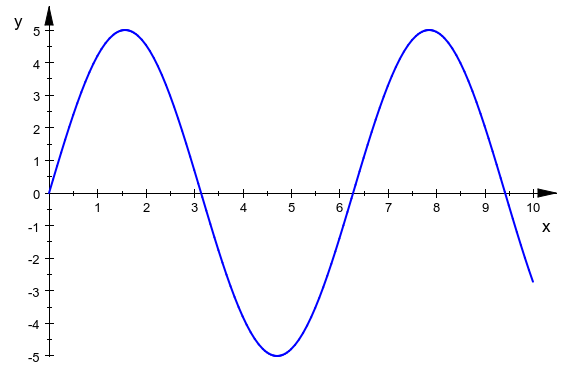
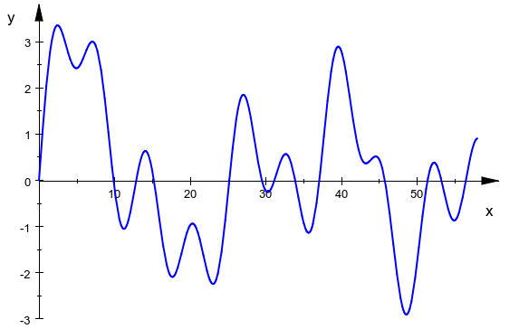
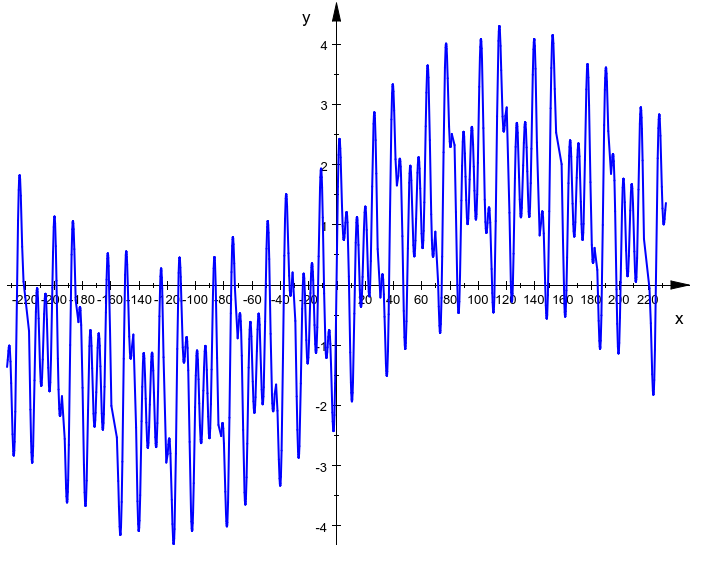
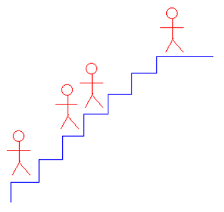

## 随机

你可以输出任意字符


## 锦乐寻宝

锦乐发现在地点 $A,B$ 里其中一个地点有初始价值为 $1437$ 的宝藏。因为受到自然侵蚀，所以宝藏每天减少 $10$ 的价值。锦乐可以瞬间到达 $A,B$ 其中一个地方，但是每个地方都需要挖掘 $5$ 天的时间才能知道究竟有没有宝藏，锦乐每天只能挖掘一个地方。此外，锦乐有一张未解地图，如果解出来就可以知道宝藏究竟在 $A$ 还是在 $B$ 。锦乐可以独自一人破译地图，那么花费 $4$ 天就知道宝藏正确位置。如果锦乐某天破译地图，那这天他不能选择挖掘。

请问如果锦乐选取最优方案，那么他挖掘到宝藏时期望宝藏的最大价值是多少？请输出整数(如果答案是小数，请四舍五入取整)。


## 猜一猜

一般题目不会用到随机化的思想，基本上用到的都是极其玄学的题目。

现有A和B两份代码，他们的代码都会随机出 $10^4$ 个数。

```c++
//A的代码
#include <bits/stdc++.h>
using namespace std;
mt19937 rnd(time(0));
// rnd()  随机出来的数范围都是unsigned int
unsigned int ans[10005];
int main()
{
    for (int i = 1; i <= (int)1e4; ++i)
    {
        ans[i] = rnd()|rnd();
    }
    for (int i = 1; i <= (int)1e4; ++i)
    {
        cout << ans[i] << " ";
    }    
    return 0;
}
```

```c++
//B的代码
#include <bits/stdc++.h>
using namespace std;
mt19937 rnd(time(0));
// rnd()  随机出来的数范围都是unsigned int
unsigned int ans[10005];
int main()
{
    for (int i = 1; i <= (int)1e4; ++i)
    {
        ans[i] = rnd()^rnd();
    }
    for (int i = 1; i <= (int)1e4; ++i)
    {
        cout << ans[i] << " ";
    }    
    return 0;
}
```

由于意外，他们的代码都删除了，只留下了随机出来的数。现让你判断这些数是A的代码随机出来的还是B的代码随机出来的。

输入包含 $10^4$ 个 unsigned int 范围的数，每个数用空格隔开。

输出 `A` 或 `B` ，表示这些数是A的代码随机出来的还是B的代码随机出来的。

样例过大，请查看 [这里](https://cloud.socoding.cn/s/6XzcV) ，该样例的结果为 `A`

题目源自 [计院OJ](http://csoj.scnu.edu.cn/problem/S0116)  


## 函数2

给定常数 $a,b,c,d,e,l,r$ ，求下列函数在定义域 $[l,r]$ 的最大值：
$$
f(x)=\sin(\dfrac xa)+\sin(\dfrac xb)+\sin(\dfrac xc)+\sin(\dfrac xd)+\sin(\dfrac xe)
$$
输入一行七个整数 $a,b,c,d,e,l,r(1\le a,b,c,d,e\le10^3,-10^3\le l< r\le10^3)$

输入一行一个实数，代表函数最大值。你的答案被视作是正确的当且仅当与标准答案绝对误差不超过 $10^{-2}$  

```c++
1 1 1 1 1 0 10
```

```c++
5
```

```c++
1 2 3 4 5 0 58
```

```c++
3.353015
```

```c++
1 2 3 68 95 -233 233
```

```c++
4.303793
```


样例 1 ：



样例 2 ：



样例 3 ：




## 珂朵莉树


珂朵莉树就是由若干珂朵莉作为节点构成的树！（逃

你有一个长度为 $n$ 的序列，下标从 $1$ 开始，一开始每个数都是 $1236895$ ，你需要维护 $m$ 次下列操作：

1. `1 l r x` 将区间 $[l,r]$ 的每个值都设为 $x$ 
2. `2 l r x` 将区间 $[l,r]$ 的每个值都加上 $x$
3. `3 l r` 查询区间 $[l,r]$ 的值之和

输入一行两个整数 $n,m(1\le n,m\le10^5)$ 

接下来输入 $m$ 行，每行格式为上面所述三种之一。保证 $1\le l\le r\le10^5,1\le x\le10^7$ ，保证数据随机。

对于每个操作 $3$ ，输出一行一个整数代表区间和

```c++
10 5
3 1 5
1 2 5 114514
2 4 6 1919180
3 5 7
3 1 10
```

```c++
6184475
6426664
13636966
```

修改后的序列为：1236895, 114514, 114514, 2033694, 2033694, 3156075, 1236895, 1236895, 1236895, 1236895


## 骗红包

zf 每年都会和 zn 玩一个游戏：在 $1$ 到 $1000$ 以内随机选 $n$ 个硬币，让 zf 先开始他的回合，然后互相轮转。zn 如果输了就会给 zf $n$ 个硬币。当然是 zf 先开始游戏啦。

在各自的回合中都能执行一次操作：让硬币数变为原来的一半（向下取整）或者减一。谁清除掉最后一枚硬币谁就赢了。

zn 和 zf 都很聪明，每一次都会选择最有利的方式进行操作。

如果进行了 $1000$ 轮游戏，请问 zf 骗到硬币数的期望是多少？

无输入。

输出 $1000$ 轮游戏后 zf 骗到硬币数的期望。

来源：广东工业大学 2020 年 ACM 第一次月赛


## 灭鼠先锋 II

灭鼠先锋是一个老少咸宜的棋盘小游戏，由两人参与，轮流操作。

灭鼠先锋的棋盘由 $n$ 行 $m$ 列组成。游戏规则为：两人轮流操作，每次可选择在棋盘的一个空位上放置一个棋子，或在同一行的连续两个空位上各放置一个棋子，放下棋子后使棋盘放满的一方输掉游戏。

锦乐和桑泽一起玩游戏，锦乐先手，桑泽后手。例如，对两行四列的棋盘， `O` 表示棋盘上的一个方格为空， `X` 表示该方格已经放置了棋子，锦乐可以放置棋子的方法很多，通过旋转和翻转可以对应如下四种情况：

```python
XOOO XXOO OXOO OXXO
OOOO OOOO OOOO OOOO
```

两人都是按照对自己最优的策略来玩游戏。给定任意行列的棋盘和棋盘初始状态，请你求出在该状态下**桑泽**是否能获胜。

输入一行三个整数 $n,m,t(1\le n,m,n\times m\le20,1\le t\le10^4)$ ，代表棋盘行数、列数和询问个数。

接下来有 $t$ 个询问，每个询问由 $n$ 行，每行 $m$ 个字符(字符为大写字母 `O` 或 `X` )，代表该询问的棋盘初始状态。

对每个询问，输出一行一个字符，若**桑泽**必胜，输出 `V`，否则输出 `L` 。

```c++
2 4 4
XOOO
OOOO
XXOO
OOOO
OXOO
OOOO
OXXO
OOOO
```

```c++
L
L
L
V
```

本题改编自第十三届蓝桥杯省赛CA真题B题。


## 巴什博奕

有 $n$ 个物品，两人轮流取物，每次至少取一个，最多取 $m$ 个，最后取完者胜，两人均采取最优策略，问先手是否必胜

输入 $m,n(1\le m,n\le10^9)$ 

若先手必胜，输出 $1$ ，否则输出 $0$ 

```c++
2 6
```

```c++
0
```


```c++
3 6
```

```c++
1
```


## 锦乐游戏

锦乐创造了一个游戏。一开始有 $n$ 个雪球，两人轮流取雪球。若当前还剩 $m$ 个雪球，只要满足 $x\in N,x\ge 1,2^x-1\le m$ ，则当前方可以任选一个 $x$ 然后取 $2^x-1$ 个雪球。最后取完雪球者胜。

锦乐先手，桑泽后手。两人均采取最优策略进行游戏。请问谁获胜？

输入一行一个整数 $n(1\le n\le10^9)$ ，代表雪球数

若锦乐必胜，输出 `jinle` ；否则输出 `sangze`

```c++
1
```

```c++
jinle
```


```c++
2
```

```c++
sangze
```


```c++
5
```

```c++
jinle
```


## 取石子游戏

桃子和杏子玩取石子游戏，有$n$堆石子，第$i$堆有$a_i$个，她们轮流取石子，桃子先取，她们每次都只能选一堆未取完的石子。然后，桃子可以从这堆石子中取走$1$或$2$个石子，而杏子每次只能取走$1$个石子。谁把最后的石子取完，使得另外一个人没法操作，谁就获得了胜利。两人都在最优策略下取石子，请问最终谁获胜？

第一行输入一个数$T(1\le T\le20000)$，然后会有$2T$行：一行一个数$n(1\le n\le100)$，代表石子堆数，另一行$n$个数$a_1,a_2,\cdots,a_n$，表示每一堆石子的数量$(1\le a_i\le100)$。

对于每组测试，输出一行，若桃子胜，输出`momoko`，若杏子胜，输出`sakiko`。


```python
2
2
1 3
2
1 1
```


```python
momoko
sakiko
```


对于第一组，桃子可以先取完第一堆，然后杏子只能从第二堆取走一个，第三步桃子取完石子，桃子胜。

计院 2020CS 杯真题D题


## 异世界的人偶训练

在果冻的指示下，贤者禾枫创造了大量魔法人偶辅助魔法师工作。为了训练魔法人偶的思考能力，她打算让人偶两两之间进行一种游戏，具体规则如下：

给定一个只包含 `0` 和 `1` 的字符串 $s$ ，其长度为 $n$ ，两个人偶轮流在以下两种操作中选择一种执行：  

  1. 将字符串反转，即从后往前重新书写字符串。如 `00001` 反转后变为 `10000` 。这个操作不耗费魔力。
  2. 将字符串中的 $1$ 个 `0` 改为 `1` 。耗费 $1$ 点魔力。

当字符串中的每个字符都变为 `1` 时游戏结束。此时，耗费魔力更少的那个人偶获得胜利。若两个人偶所耗费的魔力相同，则游戏平局。

为了让游戏更加有趣，禾枫添加了一个限制： 

操作 $1$ 只能在当前字符串不是回文串，且前一次操作不是操作 $1$ 时执行。 

其中，回文串是指从后往前读和从前往后读都相同的字符串，即：记下标从 $1$ 开始，长为 $n$ 的回文串 $s$ 满足对任意 $i$ ( $1\le i \le n$ )， $s[i]=s[n-i+1]$ 。 

在先手的第一次操作的情况下，不存在“前一次操作”，此时只需要满足字符串不是回文串的条件即可执行操作 $1$ 。

举个例子，当第一个人偶执行了操作 $1$ 后，即使此时的字符串不是回文串，按照限制，第二个人偶仍然无法执行操作 $1$ 。反之亦然。

现在已知一个字符串，并且两个人偶都会以最优策略进行游戏，禾枫想要知道游戏的结果。

输入一个整数 $T$ ( $1 \le T \le 10^3$ )，代表接下来有 $T$ 个测试用例。

对于每个测试用例： 

输入一行一个整数 $n$ 。 

接下来一行输入一个长度为 $n$ ，并且只包含 `0` 和 `1` 的字符串。  

对于 $20\%$ 分数的数据，$1\le n\le5$ ， $\sum n \le 10$ 且保证输入的字符串是回文串。

对于 $60\%$ 分数的数据，$1\le n\le10^3$ ，$\sum n \le 10^3$ 且保证输入的字符串是回文串。

对于 $100\%$ 分数的数据， $1\le n\le10^3$ ，$\sum n \le 10^5$ 且保证输入的字符串中至少有 $1$ 个 `0`

对于每个测试用例，第一行输出一个整数。若先手胜利，输出 $1$ ；若后手胜利，输出 $-1$ ；若游戏平局，输出 $0$ 

```
2
1
0
2
00
```

```
-1
-1
```

对于样例 $1$ 中的测试用例 $1$ :

字符串已经是回文串，先手只能执行操作 $2$ ，之后字符串变为 `1` ，游戏结束。 

此时先手耗费 $1$ 点魔力，后手耗费 $0$ 点魔力，后手获得胜利。  

对于样例 $1$ 中的测试用例 $2$ : 

字符串已经是回文串，先手只能执行操作 $2$ ，然后后手会执行操作 $1$ ，由于限制的存在，先手只能继续执行操作 $2$ ，游戏结束。 

此时先手耗费 $2$ 点魔力，后手耗费 $0$ 点魔力，后手获得胜利。  


## 云烟蓝星对决

云烟在前往异世界前，拿走了一个最终极之渊的特级遗物。然而，正当云烟全身心搞科研之时，遗物反噬了云烟，他走火入魔并发动了世界魔法，使蓝星上所有生灵陷入昏迷。星月由于是机械猫猫所以躲过一劫。星月用金币砸醒了弥明，因弥明的心灵与金币产生了激烈反应，但星月无法再唤醒其他人。于是，弥明和星月只身前往与云烟对决。与此同时，最终极之渊迎来了周期为两千年的异变……

世界魔法有 $n$ 个魔素源泉，第 $i$ 个源泉的能量为 $a_i$ ，占领第 $i$ 个源泉需要耗费的魔力 $b_i$ 为前 $i$ 个源泉组成的集合的所有非空子集的能量和对 $10^9+7$ 取模。

严谨地说，设 $s_i=(a_1,a_2,\cdots ,a_i),s\subseteq s_i,s\neq \not0,|s|=card(s)$ (即 $|s|$ 是集合元素数)，有：
$$
b_i=\sum_s\sum_{j=1}^{|s|}a_i\bmod 10^9+7
$$
云烟和弥明轮流行动，奇数回合行动的为先手，偶数回合行动的为后手。云烟为先手。每回合双方必须选择其中一个魔法源泉 $x$ 向其中投入魔力。设第 $i$ 个源泉累计被投入了 $c_i$ 的魔力。首回合前有 $\forall 1\le i\le n,c_i=0$ 。设当前回合向源泉 $x$ 投入的魔力为 $y$ ，则 $y$ 必须满足 $y\in N,1\le y\le b_x-c_x$。当 $c_i=b_i$ 时，该源泉被占领。谁占领了最后一个未被占领的源泉，谁就能掌控世界魔法，赢得对决。

在遗物和星月各自对双方的辅助下，云烟、弥明每回合都采取对自己最优的策略进行对决。请问谁最终取得对决的胜利。

由于世界魔法稳定期有限，所以对决必须在 $2n$ 回合内分出胜负，否则将带来灾难性的后果。因此，在胜利方不变，且双方仍然采取最优策略的前提下，请问是否存在回合数不超过 $2n$ 的回合情况？

输入一行一个整数 $n(1\le n\le10^5)$ 

接下来输入一行 $n$ 个整数，第 $i$ 个整数为 $a_i(1\le a_i < 10^9+7)$  ，代表第 $i$ 个源泉的能量

第一行输出一个字符串，若先手必胜输出 `first wins` ；若后手必胜，输出 `second wins` 

第二行输出一个字符串，在你所输出的必胜状态下，若存在一种回合情况，回合数不超过 $2n$ ，输出 `yes` ，否则输出 `no`

若存在一种回合情况，回合数不超过 $2n$ ，则第三行输出一个整数 $t$ ，代表回合数；接下来输出 $t$ 行，第 $3+i$ 行每行两个整数 $x,y$ ，代表在第 $i$ 回合行动的一方对第 $x$ 个源泉投入魔力值为 $y$

```
2
1 2
```

```
first wins
yes
3
2 5
2 1
1 1
```


```
2
3 500000002
```

```
second wins
yes
2
2 3
1 3
```


## 高僧斗法

古时丧葬活动中经常请高僧做法事。仪式结束后，有时会有“高僧斗法”的趣味节目，以舒缓压抑的气氛。

节目大略步骤为：先用粮食（一般是稻米）在地上“画”出若干级台阶（表示N级浮屠）。又有若干小和尚随机地“站”在某个台阶上。最高一级台阶必须站人，其它任意。(如图1所示)



两位参加游戏的法师分别指挥某个小和尚向上走任意多级的台阶，但会被站在高级台阶上的小和尚阻挡，不能越过。两个小和尚也不能站在同一台阶，也不能向低级台阶移动。

两法师轮流发出指令，最后所有小和尚必然会都挤在高段台阶，再也不能向上移动。轮到哪个法师指挥时无法继续移动，则游戏结束，该法师认输。

对于已知的台阶数和小和尚的分布位置，请你计算先发指令的法师该如何决策才能保证胜出。

输入数据为一行用空格分开的N个整数，表示小和尚的位置。台阶序号从1算起，所以最后一个小和尚的位置即是台阶的总数。（N<100, 台阶总数<1000）

输出为一行用空格分开的两个整数: A B, 表示把A位置的小和尚移动到B位置。若有多个解，输出A值较小的解，若无解则输出-1。

```c++
1 5 9
```

```c++
1 4
```


```c++
1 5 8 10
```

```c++
1 3
```


蓝桥杯第四届决赛B组真题

数据非官方数据，官方数据请前往 [这里](http://lx.lanqiao.cn/problem.page?gpid=T2936) 交题
